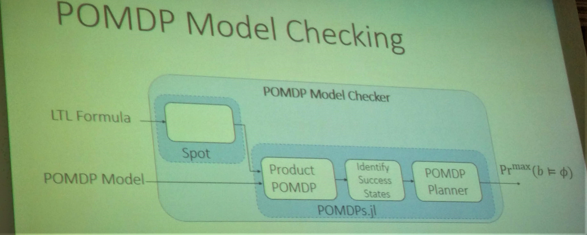

# My Bibliography for Research on Autonomous Driving

Note: Some articles may be missing at the bottom of this preview page (due to length). Open [README.md](https://github.com/chauvinSimon/My_Bibliography_for_Research_on_Autonomous_Driving/blob/master/README.md) to get all the articles!

## Motivation

In this document, I would like to **share some personal notes** about the latest exciting trends in **research** about decision making for autonomous driving. I keep on updating it :construction_worker: :construction: :smiley:

Template:

**`"title"`**
**[** `Year` **]**
**[[:memo:](https://arxiv.org/) (paper)]**
**[[:octocat:](https://github.com/) (code)]**
**[[🎞️](https://www.youtube.com/) (video)]**
**[** :mortar_board: `University X` **]**
**[** :car: `company Y` **]**
**[** _`related`, `concepts`_  **]**

Categories:

- [**Architecture and Map**](#architecture-and-map)
- [**Behavioural Cloning, End-To-End and Imitation Learning**](#behavioural-cloning-end-to-end-and-imitation-learning)
- [**Inverse Reinforcement Learning, Inverse Optimal Control and Game Theory**](#inverse-reinforcement-learning-inverse-optimal-control-and-game-theory)
- [**Prediction and Manoeuvre Recognition**](#prediction-and-manoeuvre-recognition)
- [**Rule-based Decision Making**](#rule-based-decision-making)
- [**Model-Free Reinforcement Learning**](#model-free-reinforcement-learning)
- [**Model-Based Reinforcement Learning**](#model-based-reinforcement-learning)
- [**Planning and Monte Carlo Tree Search**](#planning-and-monte-carlo-tree-search)

Besides, I reference additional publications in some parallel works:

- [**Hierarchical Decision-Making for Autonomous Driving**](https://github.com/chauvinSimon/Hierarchical-Decision-Making-for-Autonomous-Driving)
- [**Educational application of Hidden Markov Model to Autonomous Driving**](https://github.com/chauvinSimon/hmm_for_autonomous_driving)
- [**My 10 takeaways from the 2019 Intelligent Vehicle Symposium**](https://github.com/chauvinSimon/IV19)

Looking forward your reading suggestions!

---

---

## `Architecture` and `Map`

**`"LGSVL Simulator: A High Fidelity Simulator for Autonomous Driving"`**

- **[** `2020` **]**
**[[:memo:](https://zelenkovsky.com/assets/files/LGSVL_Simulator_ITSC_2020.pdf)]**
**[[:memo:](https://www.lgsvlsimulator.com/)]**
**[[:octocat:](https://github.com/lgsvl/simulator)]**
**[[🎞️](https://www.youtube.com/channel/UChrPZIYAnKEKiQjmPmBwPKA)]**
**[** :car: `LG` **]**

- **[** _`simulator`_ **]**

  
Click to expand

| .](media/2020_boise_1.PNG "[Source](https://zelenkovsky.com/assets/files/LGSVL_Simulator_ITSC_2020.pdf).")  |
|:--:|
| *A **bridge** is selected based on the user **AD stack’s runtime framework**: `Autoware.AI` and `Autoware.Auto`, which run on `ROS` and `ROS2`, can connect through **standard open source `ROS` and `ROS2` bridges**, while for `Baidu’s Apollo` platform, which uses a custom runtime framework called [`Cyber RT`](https://github.com/ApolloAuto/apollo/tree/master/cyber), a custom bridge is provided to the simulator. [Source](https://zelenkovsky.com/assets/files/LGSVL_Simulator_ITSC_2020.pdf).* |

Authors: Boise, E., Uhm, G., Gerow, M., Mehta, S., Agafonov, E., Kim, T. H., … Kim, S.

- Motivations (_Yet another simulator?_):
  - > "The LGSVL Simulator is a simulator that facilitates testing and development of autonomous driving software systems."
  - The main use case seems to be the **integration** to **AD stacks**: `Autoware.AI`, `Autoware.Auto`, `Apollo 5.0`, `Apollo 3.0`.
  - Compared to [`CARLA`](http://carla.org/) for instance, it seems more **focused** on _development_ rather than _research_.
- The simulation engine serves three functions:
  - **Environment** simulation
  - **Sensor** simulation
  - **Vehicle dynamics and control** simulation.
- Miscellaneous:
  - `LGSVL` = _LG Silicon Valley Lab_.
  - Based on `Unity` engine.
  - A `openAI-gym` environment is provided for **reinforcement learning**: [`gym-lgsvl`]().
    - Default `action` space: `steering` and `braking`/`throttle`.
    - Default `observation` space: single camera image from the front camera. _Can be enriched_.
  - For **perception** training, [`kitti_parser.py`](https://github.com/lgsvl/PythonAPI/blob/master/examples/kitti_parser.py) enables to **generate labelled data** in `KITTI` format.
  - A **custom [License](https://raw.githubusercontent.com/lgsvl/simulator/master/LICENSE)** is defined.
    - > "You may not **sell or otherwise transfer** or make available the Licensed Material, any copies of the Licensed Material, or any information derived from the Licensed Material in any form to any third parties for **commercial purposes**."
    - It makes it **hard to compare** to other simulators and AD software: for instance [`Carla`](http://carla.org/), [`AirSim`](https://github.com/microsoft/AirSim) and [`DeepDrive`](https://deepdrive.io/) are all under **`MIT License`** while code for `Autoware` and `Apollo` is protected by the **`Apache 2 License`**.

---

**`"Overview of Tools Supporting Planning for Automated Driving"`**

- **[** `2020` **]**
**[[:memo:](https://arxiv.org/abs/2003.04081)]**
**[** :car: [`virtual vehicle research`](https://www.v2c2.at/) **]**

- **[** _`development tools`_ **]**

  
Click to expand

| .](media/2020_tong_3.PNG "[Source](https://arxiv.org/abs/2003.04081).")  |
|:--:|
| *The authors group **tools** that support **`planning`** in sections: `maps`, `communication`, `traffic rules`, `middleware`, `simulators` and `benchmarks`. [Source](https://arxiv.org/abs/2003.04081).* |

| .](media/2020_tong_1.PNG "[Source](https://arxiv.org/abs/2003.04081).")  |
|:--:|
| *About `simulators` and `dataset`. And how to **couple between tools**, either with co-simulation software or open interfaces. [Source](https://arxiv.org/abs/2003.04081).* |

| .](media/2020_tong_2.PNG "[Source](https://arxiv.org/abs/2003.04081).")  |
|:--:|
| *About maps. ''The planning tasks with different targets entail map models with different level of details. `HD map` provides the most sufficient information and can be generally categorized into **three layers**: **`road` model, `lane` model and `localization` model**''. [Source](https://arxiv.org/abs/2003.04081).* |

Authors: Tong, K., Ajanovic, Z., & Stettinger, G.

- Motivations:
  - `1-` Help **researchers** to make full use of open-source resources and **reduce effort of setting up a software platform** that suites their needs.
    - > [example] "It is a good option to choose open-source [`Autoware`](https://www.autoware.org/) as **software stack** along with **[`ROS`](https://www.ros.org/) middleware**, as `Autoware` can be further transferred to a **real vehicle**. During the development, he or she can use [`Carla`](http://carla.org/) as a **simulator**, to get its benefits of **graphic rendering and sensor simulation**. To make the simulation **more realistic**, he or she might adopt commercial software [`CarMaker`](https://ipg-automotive.com/products-services/simulation-software/carmaker/) for sophisticated **vehicle dynamics** and open-source [`SUMO`](https://sumo.dlr.de/docs/index.html) for large-scale traffic flow simulation. **[`OpenDRIVE`](http://www.opendrive.org/) map** can be used as a source and converted into the map format of `Autoware`, `Carla` and `SUMO`. Finally, [`CommonRoad`](https://commonroad.in.tum.de/) can be used to **evaluate** the developed algorithm and **benchmark** it against other approaches."
  - `2-` **Avoid reinventing the wheel**.
    - _Algorithms_ are available/adapted from **robotics**.
    - _Simulators_ are available/adapted from **gaming**.
- Mentioned **software libraries** for `motion planning`:
  - `ROS` (from _robotics_):
    - [Open Motion Planning Library](https://ompl.kavrakilab.org/) (`OMPL`)
    - [`MoveIt`](https://moveit.ros.org/)
    - [navigation package](http://wiki.ros.org/navigation)
    - [`teb`](http://wiki.ros.org/teb_local_planner) local planner.
  - `Python`: [`PythonRobotics`](https://github.com/AtsushiSakai/PythonRobotics)
  - `CPP`: [`CppRobotics`](https://github.com/onlytailei/CppRobotics)
- _How to express_ **_traffic rules_** _in a form understandable by an algorithm?_
  - `1-` Traffic rules can be formalized in **higher order logic** (e.g. using the [Isabelle theorem prover](https://isabelle.in.tum.de/)) to **check the compliance of traffic rules** unambiguously and formally for **trajectory validation**.
  - `2-` Another approach is to **represent traffic rules geometrically as obstacles** in a configuration space of motion planning problem.
  - >"In some occasions, it is necessary to **violate some rules** during driving for **achieving higher goals** (i.e. _avoiding collision_) [... e.g. with] a **rule book** with **hierarchical arrangement** of different rules."

- _About data visualization?_
  - **[`RViz`](http://wiki.ros.org/rviz/)** is a popular tool in `ROS` for visualizing data flow, as I also [`realized`](https://github.com/chauvinSimon/IV19) at `IV19`.
  - Apart from that, it seems each team is having its **own specific visualization tool**, sometimes released, as **[`AVS`](https://avs.auto/#/)** from `UBER` and `GM Cruise`.
- _What is missing for the research community?_
  - Evaluation tools for **quantitative comparison**.
  - Evaluation tools incorporating **human judgment**, not only from the vehicle occupants but also from other road users.
  - A **standard format** for **motion datasets**.
- I am surprised [`INTERACTION`](http://interaction-dataset.com/) dataset was not mentioned.

---

**`"Decision-making for automated vehicles using a hierarchical behavior-based arbitration scheme"`**

- **[** `2020` **]**
**[[:memo:](https://arxiv.org/abs/2003.01149)]**
**[** :mortar_board: `FZI`, `KIT` **]**

- **[** _`hierarchical behavioural planning`, `cost-based arbitration`, `behaviour components`_ **]**

  
Click to expand

| .](media/2020_orzechowski_1.PNG "[Source](https://arxiv.org/abs/2003.01149).")  |
|:--:|
| *Both **`urban`** and **`highway` behaviour options** are combined using a **`cost-based arbitrator`**. Together with `Parking` and `AvoidCollisionInLastResort`, these four **arbitrators** and the `SafeStop` fallback are **composed together** to the **top-most priority-based `AutomatedDriving` arbitrator**. [Source](https://arxiv.org/abs/2003.01149).* |

| .](media/2020_orzechowski_2.PNG "[Source](https://arxiv.org/abs/2003.01149).")  |
|:--:|
| *Top-right: two possible options. The arbitrator generally prefers the `follow lane behaviour` as long as it **matches the route**. Here, a lane change is necessary and selected by the **cost-based arbitration**: `ChangeLaneRight` has lower cost than `FollowEgoLane`, mainly due to the **`routing` term** in the cost expression. Bottom: the resulting **`behaviour` selection** over time. [Source](https://arxiv.org/abs/2003.01149).* |

Authors: Orzechowski, P. F., Burger, C., & Lauer, M.

- Motivation:
  - Propose an **alternative to `FSM`s (finite state machines)** and `behaviour`-based systems (e.g. _voting systems_) in **hierarchical architectures**.
  - In particular, `FSM`s can suffer from:
    - **poor interpretability**: _why is one `behaviour` executed?_
    - **maintainability**: effort to refine existing behaviour.
    - **scalability**: effort to achieve a high number of `behaviour`s and to combine a **large variety of scenarios**.
    - **options selection**: _"multiple behaviour options are applicable but have no clear and consistent priority against each other."_
      - > _"_**_How_** _and_ **_when_** _should an automated vehicle_ **_switch_** _from a regular `ACC` controller to a lane change, cooperative zip merge or parking planner?"_
    - **multiple planners**: Each `behaviour` component can compute its **manoeuvre command** with any preferred state-of-the-art method.
      - > _"How can we support `POMDPs`, `hybrid A*` and any other_ **_planning method_** _in our behaviour generation?"._

- Main idea:
  - **`cost-based arbitration`** between so-called **"`behaviour` components"**.
  - The **modularity** of these components brings several advantages:
    - Various scenarios can be handled within a single framework: `four-way intersections`, `T-junctions`, `roundabout`, `multilane bypass roads`, `parking`, etc.
    - Hierarchically combining behaviours, **complex `behaviour`** emerges from **simple components**.
    - Good **efficiency**: the **atomic structure** allows to **evaluate** `behaviour` options **in parallel**.

- About `arbitration`:
  - > "An `arbitrator` contains a list of behavior options to choose from. A specific **selection logic** determines which **option** is chosen based on **abstract** information, e.g., **expected utility** or **priority**."
  - > [about `cost`] "The **`cost`-based** `arbitrator` selects the **behavior option** with the **lowest expected cost**."
  - Each **behaviour option** is **evaluated** based on its expected **average travel velocity**, incorporating **routing costs** and penalizing **lane changes**.
    - The resulting behaviour can thus be **well explained**:
    - > "The **selection logic** of arbitrators is **comprehensive**."
  - About hierarchy:
    - > "To generate even more complex `behaviour`s, an `arbitrator` can also be a `behaviour` option of a **hierarchically higher `arbitrator`**."

- About **`behaviour` components**.
  - There are the **smallest building blocks**, representing **basic _tactical_ driving manoeuvres**.
  - Example of **atomic behaviour components** for **simple tasks** in _urban_ scenarios:
    - `FollowLead`
    - `CrossIntersection`
    - `ChangeLane`
  - They can be **specialized**:
    - **Dense** scenarios behaviours: `ApproachGap`, `IndicateIntention` and `MergeIntoGap` to refine `ChangeLane` _(multi-phase behaviour)_.
      - _Note:_ an alternative could be to use **one single** integrated **interaction-aware behaviour** such as `POMDP`.
    - **Highway** behaviours (_structured_ but _high speed_): `MergeOntoHighway`, `FollowHighwayLane`, `ChangeHighwayLane`, `ExitFromHighway`.
    - **Parking** behaviours: `LeaveGarage`, `ParkNearGoal`.
    - Fail-safe **emergency** behaviours: `EmergenyStop`, `EvadeObject`, `SafeStop`.
  - For a `behaviour` to be selected, it should be **_applicable_**. Hence a `behaviour` is defined together with:
    - **`invocation` condition**: when does it become _applicable_.
      - > "[example:] The `invocation` condition of `CrossIntersection` is true as long as the current ego lane intersects other lanes within its planning horizon."
    - **`commitment` condition**: when does it stay _applicable_.
  - This reminds me the concept of **`macro actions`**, sometimes defined by a tuple <**`applicability condition`**, `termination condition`, `primitive policy`>.
  - It also makes me think of [`MODIA`](http://rbr.cs.umass.edu/shlomo/papers/WWZijcai17.pdf) framework and other **scene-decomposition** approaches.
- A `mid-to-mid` approach:
  - > "[input] The **input** is an **abstract environment model** that contains a _fused_, _tracked_ and _filtered_ representation of the world."
  - [output] The selected **high-level decision** is passed to a **trajectory planner** or **controller**.
  - _What does the "decision" look like?_
    - **_One-size-fits-all_ is not an option**.
    - It is distinguished between maneuvers in a _structured_ or _unstructured_ environment:
    - `1- unstructured`: a trajectory, directly passed to a **trajectory planner**.
    - `2- structured`: a corridor-based driving command, i.e. a tuple <`maneuver corridor`, `reference line`, `predicted objects`, `maneuver variant`>. It requires both a _trajectory planner_ and a _controller_.

- One distinction:
  - `1-` **top-down `knowledge`-based** systems.
    - > "The `action selection` in a **centralized**, in a **_top-down_ manner** using a knowledge database."
    - > "The engineer designing the **action selection** module (in `FSM`s the **state transitions**) has to be **aware** of the conditions, _effects_ and possible interactions of all behaviors at hand."
  - `2-` **bottom-up `behaviour`-based** systems.
    - > "**Decouple** actions into **atomic simple `behaviour` components** that should be aware of their conditions and _effects_."
    - E.g. `voting systems`.
  - Here the authors combine **atomic behaviour components** (`bottom`/`down`) with **more complex behaviours** using **generic arbitrators** (`top`/`up`).

---

**`"A Review of Motion Planning for Highway Autonomous Driving"`**

- **[** `2019` **]**
**[[:memo:](https://www.researchgate.net/publication/333124691_A_Review_of_Motion_Planning_for_Highway_Autonomous_Driving)]**
**[** :mortar_board: `French Institute of Science and Technology for Transport` **]**
**[** :car: `VEDECOM Institute` **]**

  
Click to expand

| .](media/2019_claussmann_1.PNG "The review divides **`motion planning`** into five  parts. The **`decision-making`** part contains `risk evaluation`, `criteria minimization`, and `constraint submission`. In the last part, a **low-level reactive** planner **deforms** the generated motion from the high-level planner. [Source](https://www.researchgate.net/publication/333124691_A_Review_of_Motion_Planning_for_Highway_Autonomous_Driving).")  |
|:--:|
| *The review divides **motion-planning** into five parts. The **`decision-making`** part contains `risk evaluation`, `criteria minimization`, and `constraint submission`. In the last part, a **low-level reactive** planner **deforms** the generated motion from the high-level planner. [Source](https://www.researchgate.net/publication/333124691_A_Review_of_Motion_Planning_for_Highway_Autonomous_Driving).* |

| .](media/2019_claussmann_6.PNG "The review offers two detailed tools for **comparing** methods for motion planning for highway scenarios. Criteria for the generated motion include: `feasible`, `safe`, `optimal`, `usable`, `adaptive`, `efficient`, `progressive` and `interactive`. The authors stressed the importance of **spatiotemporal consideration** and emphasize that **highway motion-planning** is highly structured. [Source](https://www.researchgate.net/publication/333124691_A_Review_of_Motion_Planning_for_Highway_Autonomous_Driving).")  |
|:--:|
| *The review offers two detailed tools for **comparing** methods for motion planning for highway scenarios. Criteria for the generated motion include: `feasible`, `safe`, `optimal`, `usable`, `adaptive`, `efficient`, `progressive` and `interactive`. The authors stressed the importance of **spatiotemporal consideration** and emphasize that **highway motion-planning** is highly structured. [Source](https://www.researchgate.net/publication/333124691_A_Review_of_Motion_Planning_for_Highway_Autonomous_Driving).* |

|  on AI-based algorithms, the authors define four subfamilies to compare to human: `logic`, `heuristic`, `approximate reasoning`, and `human-like`. [Source](https://www.researchgate.net/publication/333124691_A_Review_of_Motion_Planning_for_Highway_Autonomous_Driving).](media/2019_claussmann_3.PNG "Contrary to `solve-algorithms` methods, `set-algorithm` methods require a **complementary algorithm** should be added to find the feasible motion. Depending on the importance of the `generation` (`iv`) and `deformation` (`v`) part, approaches are more or less **`reactive`** or **`predictive`**. Finally, based on their [work](https://www.researchgate.net/publication/321406071_A_study_on_al-based_approaches_for_high-level_decision_making_in_highway_autonomous_driving) on AI-based algorithms, the authors define four subfamilies to compare to human: `logic`, `heuristic`, `approximate reasoning`, and `human-like`. [Source](https://www.researchgate.net/publication/333124691_A_Review_of_Motion_Planning_for_Highway_Autonomous_Driving).")  |
|:--:|
| *Contrary to `solve-algorithms` methods, `set-algorithm` methods require a **complementary algorithm** should be added to find the feasible motion. Depending on the importance of the `generation` (`iv`) and `deformation` (`v`) part, approaches are more or less **`reactive`** or **`predictive`**. Finally, based on their [work](https://www.researchgate.net/publication/321406071_A_study_on_al-based_approaches_for_high-level_decision_making_in_highway_autonomous_driving) on AI-based algorithms, the authors define four subfamilies to compare to human: `logic`, `heuristic`, `approximate reasoning`, and `human-like`. [Source](https://www.researchgate.net/publication/333124691_A_Review_of_Motion_Planning_for_Highway_Autonomous_Driving).* |

| .](media/2019_claussmann_4.PNG "The review also offers overviews for possible space configurations, i.e. the choices for decomposition of the evolution space (Sampling-Based Decomposition, Connected Cells Decomposition and Lattice Representation) as well as Path-finding algorithms (e.g. `Dijkstra`, `A*`, and `RRT`). _Attractive and Repulsive Forces_, _Parametric and Semi-Parametric Curves_, _Numerical Optimization_ and _Artificial Intelligence_ are also developed. [Source](https://www.researchgate.net/publication/333124691_A_Review_of_Motion_Planning_for_Highway_Autonomous_Driving).")  |
|:--:|
| *The review also offers overviews for possible **space configurations**, i.e. the choices for decomposition of the **evolution space** (`sampling-based decomposition`, `connected cells decomposition` and `lattice representation`) as well as **`path-finding algorithms`** (e.g. `Dijkstra`, `A*`, and `RRT`). `attractive and repulsive forces`, `parametric and semi-parametric curves`, `numerical optimization` and `artificial intelligence` are also developed. [Source](https://www.researchgate.net/publication/333124691_A_Review_of_Motion_Planning_for_Highway_Autonomous_Driving).* |

Authors: Claussmann, L., Revilloud, M., Gruyer, D., & Glaser, S.

---

**`"A Survey of Deep Learning Applications to Autonomous Vehicle Control"`**

- **[** `2019` **]**
**[[:memo:](http://arxiv.org/abs/1912.10773)]**
**[** :mortar_board: `University of Surrey` **]**
**[** :car: `Jaguar Land Rover` **]**

  
Click to expand

| .](media/2019_kuutti_1.PNG "__Challenges__ for **learning-based** control methods. [Source](http://arxiv.org/abs/1912.10773).")  |
|:--:|
| *__Challenges__ for **learning-based** control methods. [Source](http://arxiv.org/abs/1912.10773).* |

Authors: Kuutti, S., Bowden, R., Jin, Y., Barber, P., & Fallah, S.

- Three categories are examined:
  - **`lateral`** control alone.
  - **`longitudinal`** control alone.
  - **`longitudinal`** and **`lateral`** control combined.
- Two quotes:
  - > "While **lateral control** is typically achieved through **`vision`**, the **longitudinal control** relies on measurements of relative velocity and distance to the preceding/following vehicles. This means that ranging sensors such as **`RADAR` or `LIDAR`** are more commonly used in **longitudinal control** systems.".
  - > "While **lateral control** techniques favour **`supervised learning`** techniques trained on labelled datasets, **longitudinal control** techniques favour **`reinforcement learning`** methods which learn through **interaction** with the environment."

---

**`"Longitudinal Motion Planning for Autonomous Vehicles and Its Impact on Congestion: A Survey"`**

- **[** `2019` **]**
**[[:memo:](https://arxiv.org/abs/1910.06070)]**
**[** :mortar_board: `Georgia Institute of Technology` **]**

  
Click to expand

| .](media/2019_zhou_1.PNG "`mMP` refers to machine learning methods for longitudinal motion planning. [Source](https://arxiv.org/abs/1910.06070).")  |
|:--:|
| *`mMP` refers to machine learning methods for longitudinal motion planning. [Source](https://arxiv.org/abs/1910.06070).* |

Authors: Zhou, H., & Laval, J.

- This review has been completed at a school of _"_**_civil_** and **_environmental_** _engineering"_.
  - It **does not have any scientific contribution**, but offers a quick overview about some current trends in `decision-making`.
  - The authors try to look at **industrial applications** (e.g. `Waymo`, `Uber`, `Tesla`), i.e. not just focussing on theoretical research. Since companies do no communicate explicitly about their approaches, most of their publications should be considered as **_research side-projects_**, rather than "actual state" of the industry.
- One focus of the review: the **machine learning** approaches for decision-making for **longitudinal motion**.
  - About the **architecture** and **representation** models. They mention the works of [**`DeepDriving`**](http://deepdriving.cs.princeton.edu/) and [(H. Xu, Gao, Yu, & Darrell, 2016)](https://arxiv.org/abs/1612.01079).
    - **`Mediated perception`** approaches **parse an entire scene** to make a driving decision.
    - **`Direct perception`** approaches first extract **affordance indicators** (i.e. only the **information** that are important for driving in a particular situation) and then map them to actions.
      - > "Only a small portion of detected objects are indeed related to the real driving reactions so that it would be meaningful to reduce the number of key perception indicators known as learning **`affordances`**".
    - **`Behavioural reflex`** approaches **directly map** an input image to a driving action by a regressor.
      - This `end-to-end` paradigm can be extended with **auxiliary tasks** such as learning semantic segmentation (_this "side task" should **_further improves_** the model_), leading to **`Privileged training`**.
  - About the learning methods:
    - `BC`, `RL`, `IRL` and `GAIL` are considered.
    - The authors argue that their `memory` and `prediction` abilities should make them stand out from the rule-based approaches.
    - > "Both `BC` and `IRL` algorithms implicitly assume that the **demonstrations are complete**, meaning that the action for each demonstrated state is fully observable and available."
    - > "We argue that adopting `RL` transforms the problem of learnt longitudinal motion planning from **imitating human demonstrations** to searching for a policy complying a **hand-crafted reward rule** [...] No studies have shown that a genuine **reward function for human driving** really exists."
- About **congestion**:
  - > "The AV industry has been mostly **focusing on the long tail** problem caused by `corner errors` related to **safety**, while the impact of AVs on **traffic efficiency** is almost ignored."
  - It reminds me the finding of (Kellett, J., Barreto, R., Van Den Hengel, A. & Vogiatzis. N., 2019) in ["How Might Autonomous Vehicles Impact the City? The Case of Commuting to Central Adelaide"](https://www.tandfonline.com/doi/full/10.1080/08111146.2019.1674646): **driverless cars could lead to more traffic congestion**.

---

**`"Design Space of Behaviour Planning for Autonomous Driving"`**

- **[** `2019` **]**
**[[:memo:](https://arxiv.org/abs/1908.07931)]**
**[** :mortar_board: `University of Waterloo` **]**

  
Click to expand

Some figures:

| .](media/2019_ilievski_5.PNG "The focus is on the `BP` module, together with its predecessor (`environment`) and its successor (`LP`) in a modular architecture. [Source](https://arxiv.org/abs/1908.07931).")  |
|:--:|
| *The focus is on the `BP` module, together with its predecessor (`environment`) and its successor (`LP`) in a modular architecture. [Source](https://arxiv.org/abs/1908.07931).* |

| .](media/2019_ilievski_6.PNG "Classification for Question `1` - environment representation. A combination is possible. In black, my notes giving examples. [Source](https://arxiv.org/abs/1908.07931).")  |
|:--:|
| *Classification for Question `1` - environment representation. A combination is possible. In black, my notes giving examples. [Source](https://arxiv.org/abs/1908.07931).* |

| .](media/2019_ilievski_2.PNG "Classification for Question `2` - on the architecture. [Source](https://arxiv.org/abs/1908.07931).")  |
|:--:|
| *Classification for Question `2` - on the architecture. [Source](https://arxiv.org/abs/1908.07931).* |

| .](media/2019_ilievski_1.PNG "Classification for Question `3` - on the decision logic representation. [Source](https://arxiv.org/abs/1908.07931).")  |
|:--:|
| *Classification for Question `3` - on the decision logic representation. [Source](https://arxiv.org/abs/1908.07931).* |

Authors: Ilievski, M., Sedwards, S., Gaurav, A., Balakrishnan, A., Sarkar, A., Lee, J., Bouchard, F., De Iaco, R., & Czarnecki K.

The authors divide their review into three sections:

- Question `1`: **_How to represent the environment?_** (relation with _predecessor_ of `BP`)
  - Four representations are compared: `raw data`, `feature-based`, `grid-based` and `latent representation`.
- Question `2`: **_How to communicate with other modules, especially the local planner (`LP`)?_** (relation with _successor_ (`LP`) of `BP`)
  - A first sub-question is the relevance of **separation** `BP` / `LP`.
    - A complete separation (_top-down_) can lead to **computational redundancy** (both have a _collision checker_).
    - One idea, close to **sampling techniques**, could be to **invert the traditional architecture** for planning, i.e. **generate multiple possible local paths** (`~LP`) then selects the best manoeuvre according to a given cost function (`~BP`). But this exasperates the previous point.
  - A second sub-question concerns _prediction_: **_Should the `BP` module have its own dedicated prediction module?_**
    - First, three kind of prediction are listed, depending on what should be predicted (marked with `->`):
      - _Physics_-based (`->` trajectory).
      - _Manoeuvre_-based (`->` low-level motion primitives).
      - _Interaction_-aware (`->` intent).
    - Then, the authors distinguish between **_explicitly-defined_** and **_implicitly-defined_** prediction models:
      - **_Explicitly-defined_** can be:
        - _Integrated_ with the motion planning process (called **_Internal prediction models_**) such as **belief-based** decision making (e.g. `POMDP`). Ideal for **planning under uncertainty**.
        - _Decoupled_ from the planning process (called **_External prediction models_**). There is a **clear interface** between prediction and planning, which aids **modularity**.
      - **_Implicitly-defined_**, such as `RL` techniques.
- Question `3`: **_How to make `BP` decisions?_** (`BP` itself)
  - A first distinction in _representation of decision logic_ is made depending based on _non-learnt_ / _learnt_:
    - Using a set of **explicitly programmed** production rules can be divided into:
      - `Imperative` approaches, e.g. _state machines_.
      - `Declarative` approaches often based on some **probabilistic system**.
        - The **decision-tree** structure and the (`PO`)`MDP` formulation makes it **more robust to uncertainty**.
        - Examples include **MCTS** and **online POMDP solvers**.
    - Logic representation can also rely on mathematical models with **parameters learned** a priori.
      - A distinction is made depending on _"where does the training data come from and when is it created?"_.
      - In other words, one could think of **supervised learning** (_learning from example_) versus **reinforcement learning** (_learning from interaction_).
      - The combination of both seems beneficial:
        - An initial behaviour is obtained through **imitation learning** (_learning from example_). Also possible with `IRL`.
        - But **improvements are made through interaction** with a simulated environment (_learning from interaction_).
          - By the way, the _learning from interaction_ techniques raise the question of the **origin of the experience** (e.g. realism of the simulator) and its **sampling efficiency**.
      - Another promising direction is **hierarchical RL** where the MDP is divided into sub-problems (the **lower for `LP`** and the **higher for `BP`**)
        - The _lowest level_ implementation of the hierarchy approximates a solution to the **control and LP problem** ...
        - ... while the _higher level_ **selects a manoeuvre** to be executed by the lower level implementations.
  - As mentioned in my the section on [Scenarios and Datasets](https://github.com/chauvinSimon/IV19#scenarios-and-datasets), the authors mention the **lack of benchmark** to compare and **evaluate** the performance of BP technologies.

One quote about the _representation of decision logic_:

- As identified in [my notes about IV19](https://github.com/chauvinSimon/IV19), the **combination** of _learnt_ and _non-learnt_ approaches looks the most promising.
- > "Without learning, traditional robotic solutions cannot adequately handle **complex, dynamic human environments**, but **ensuring the safety** of learned systems remains a significant challenge."
- > "Hence, we speculate that future high performance and safe behaviour planning solutions will be **_hybrid_** and **_heterogeneous_**, incorporating modules consisting of learned systems supervised by programmed logic."

---

**`"A Behavioral Planning Framework for Autonomous Driving"`**

- **[** `2014` **]**
**[[:memo:](https://ri.cmu.edu/pub_files/2014/6/IV2014-Junqing-Final.pdf)]**
**[** :mortar_board: `Carnegie Mellon University` **]**
**[** :car: `General Motor` **]**

- **[** _`behavioural planning`, `sampling-based planner`, `decision under uncertainty`, [`TORCS`](http://torcs.sourceforge.net/)_ **]**

  
Click to expand

Some figures:

| .](media/2014_wei_1.PNG "Comparison and fusion of the **hierarchical** and **parallel** architectures. [Source](https://ri.cmu.edu/pub_files/2014/6/IV2014-Junqing-Final.pdf).")  |
|:--:|
| *Comparison and fusion of the **hierarchical** and **parallel** architectures. [Source](https://ri.cmu.edu/pub_files/2014/6/IV2014-Junqing-Final.pdf).* |

| .](media/2014_wei_2.PNG "The `PCB` algorithm implemented in the `BP` module. [Source](https://ri.cmu.edu/pub_files/2014/6/IV2014-Junqing-Final.pdf).")  |
|:--:|
| *The `PCB` algorithm implemented in the `BP` module. [Source](https://ri.cmu.edu/pub_files/2014/6/IV2014-Junqing-Final.pdf).* |

| .](media/2014_xu_1.PNG "Related work by (Xu, Pan, Wei, & Dolan, 2014) - Grey ellipses indicate the magnitude of the uncertainty of state. [Source](https://ri.cmu.edu/pub_files/2014/6/ICRA14_0863_Final.pdf).")  |
|:--:|
| *Related work by (Xu, Pan, Wei, & Dolan, 2014) - Grey ellipses indicate the magnitude of the uncertainty of state. [Source](https://ri.cmu.edu/pub_files/2014/6/ICRA14_0863_Final.pdf).* |

Authors:  Wei, J., Snider, J. M., & Dolan, J. M.

Note: I find very valuable to get insights from the **CMU** (Carnegie Mellon University) Team, based on their **experience of the DARPA Urban Challenges**.

- Related works:
  - [_A prediction- and cost function-based algorithm for robust autonomous freeway driving_. 2010](https://ri.cmu.edu/pub_files/2010/6/2010_IV.pdf) by (Wei, Dolan, & Litkouhi, 2010).
    - They introduced the **_"Prediction- and Cost-function Based (`PCB`) algorithm"_** used.
    - The idea is to `generate`-`forward_simulate`-`evaluate` a set of manoeuvres.
    - The planner can therefore take **surrounding vehicles’ reactions** into account **in the cost function** when it searches for the best strategy.
    - At the time, the authors rejected the option of a `POMDP` formulation (_computing the control policy over the space of the belief state, which is a probability distribution over all the possible states_) deemed as computationally expensive. Improvements in hardware and algorithmic have been made since 2014.
  - [_Motion planning under uncertainty for on-road autonomous driving_. 2014](https://ri.cmu.edu/pub_files/2014/6/ICRA14_0863_Final.pdf) by (Xu, Pan, Wei, & Dolan, 2014).
    - An extension of the framework to **consider uncertainty** (both for _environment_ and the _others participants_) in the decision-making.
    - The prediction module is using a **Kalman Filter** (assuming constant velocity).
    - For each candidate trajectory, the **uncertainty** can be estimated using a **_Linear-Quadratic Gaussian_** (`LQG`) framework (based on the noise characteristics of the localization and control).
    - Their Gaussian-based method gives some **probabilistic safety guaranty** (e.g. likelihood `2%` of collision to occur).
- Proposed architecture for _decision-making_:
  - First ingredient: **Hierarchical** architecture.
    - The hierarchy `mission` `->` `manoeuvre` `->` `motion` [`3M` concept](https://github.com/chauvinSimon/Hierarchical-Decision-Making-for-Autonomous-Driving) makes it very modular but can raise limitations:
    - > "the higher-level decision making module usually **does not have enough detailed information**, and the lower-level layer **does not have authority** to **re-evaluate the decision**."
  - Second ingredient: **Parallel** architecture.
    - This is inspired from **ADAS** engineering.
    - The control modules (`ACC`, `Merge Assist`, `Lane Centreing`) are relatively **independent** and **work in parallel**.
    - In some **complicated cases** needing cooperation, this framework may not perform well.
      - _This probably shows that just_ **_extending the common ADAS architectures_** _cannot be enough to reach the_ **_level-`5` of autonomy_**.
  - Idea of the proposed framework: **combine the strengths** of the **_hierarchical_** and **_parallel_** architectures.
    - This relieves the path planner and the control module (the search space is reduced).
    - Hence the **computational cost** shrinks (by over 90% compared to a **_sample-based planner_** in the **spatio-temporal space**).
- One module worth mentioning: **_Traffic-free Reference Planner_**.
  - Its input: lane-level **sub-missions** from the _Mission Planning_.
  - Its output: kinematically and dynamically feasible **paths** and a **speed profile** for the **_Behavioural Planner_** (`BP`).
    - It assumes there is **no traffic** on the road, i.e. **ignores dynamic obstacles**.
    - It also applies **traffic rules** such as _speed limits_.
  - This **guides** the `BP` layer which considers both static and dynamic obstacles to generate so-called **_"controller directives"_** such as:
    - The **lateral driving bias**.
    - The **desired leading vehicle** to follow.
    - The **aggressiveness** of distance keeping.
    - The **maximum speed**.

---

---

## `Behavioural Cloning` `End-To-End` and `Imitation Learning`

---

**`"Advisable Learning for Self-driving Vehicles by Internalizing Observation-to-Action Rules"`**

- **[** `2020` **]**
**[[:memo:](http://openaccess.thecvf.com/content_CVPR_2020/papers/Kim_Advisable_Learning_for_Self-Driving_Vehicles_by_Internalizing_Observation-to-Action_Rules_CVPR_2020_paper.pdf)]**
**[** :mortar_board: `Berkeley` **]**
**[[:octocat:](https://github.com/JinkyuKimUCB/Advisable-Learning)]**

- **[** _`attention`, `advisability`_ **]**

  
Click to expand

| .](media/2020_kim_1.PNG "[Source](http://openaccess.thecvf.com/content_CVPR_2020/papers/Kim_Advisable_Learning_for_Self-Driving_Vehicles_by_Internalizing_Observation-to-Action_Rules_CVPR_2020_paper.pdf).")  |
|:--:|
| *[Source](http://openaccess.thecvf.com/content_CVPR_2020/papers/Kim_Advisable_Learning_for_Self-Driving_Vehicles_by_Internalizing_Observation-to-Action_Rules_CVPR_2020_paper.pdf).* |

| .](media/2020_kim_2.PNG "[Source](http://openaccess.thecvf.com/content_CVPR_2020/papers/Kim_Advisable_Learning_for_Self-Driving_Vehicles_by_Internalizing_Observation-to-Action_Rules_CVPR_2020_paper.pdf).")  |
|:--:|
| *[Source](http://openaccess.thecvf.com/content_CVPR_2020/papers/Kim_Advisable_Learning_for_Self-Driving_Vehicles_by_Internalizing_Observation-to-Action_Rules_CVPR_2020_paper.pdf).* |

Authors: Kim, J., Moon, S., Rohrbach, A., Darrell, T., & Canny, J.

- Related **PhD thesis**: [Explainable and Advisable Learning for Self-driving Vehicles](https://www2.eecs.berkeley.edu/Pubs/TechRpts/2020/EECS-2020-16.pdf), (Kim. J, 2020)

- Motivation:
  - An **`end-to-end` model** should be **explainable**, i.e. provide **easy-to-interpret rationales** for its behaviour:
  - `1-` Summarize / the **visual observations** (input) in **natural language**, e.g. _"light is red"_.
    - `Visual attention` is not enough, **verbalizing** is needed.
  - `2-` Predict an **appropriate action response**, e.g. _"I see a pedestrian crossing, so I stop"_.
    - I.e. Justify the decisions that are made and explain why they are reasonable in a **human understandable manner**, i.e., again, in **natural language**.
  - `3-` Predict a **control signal**, accordingly.
    - The command is **conditioned** on the predicted **high-level action command**, e.g. _"maintain a slow speed"_.
    - The output is a **sequence of waypoints**, hence **`end-to-mid`**.

- About the dataset:
  - **Berkeley [`DeepDrive-eXplanation`](https://github.com/JinkyuKimUCB/BDD-X-dataset)** (`BDD-X`) dataset _(by the first author)_.
  - Together with _camera front-views_ and _IMU signal_, the dataset provides:
    - `1-` **Textual descriptions** of the vehicle's actions: **_what_** _the driver is doing_.
    - `2-` **Textual explanations** for the driver's actions: **_why_** _the driver took that action from the point of view of a driving instructor_.
      - For instance the pair: (_`"the car slows down"`_, _`"because it is approaching an intersection"`_).

---

**`"Feudal Steering: Hierarchical Learning for Steering Angle Prediction"`**

- **[** `2020` **]**
**[[:memo:](http://openaccess.thecvf.com/content_CVPRW_2020/papers/w60/Johnson_Feudal_Steering_Hierarchical_Learning_for_Steering_Angle_Prediction_CVPRW_2020_paper.pdf)]**
**[** :mortar_board: `Rutgers University` **]**
**[** :car: `Lockheed Martin` **]**

- **[** _`hierarchical learning`, `temporal abstraction`, `t-SNE embedding`_ **]**

  
Click to expand

| .](media/2020_johnson_1.PNG "[Source](http://openaccess.thecvf.com/content_CVPRW_2020/papers/w60/Johnson_Feudal_Steering_Hierarchical_Learning_for_Steering_Angle_Prediction_CVPRW_2020_paper.pdf).")  |
|:--:|
| *__Feudal learning__ for `steering` prediction. The **worker** decides the next `steering` angle **conditioned on a `goal`** (`subroutine id`) determined by the **manager**. The **manager** learns to predict these `subroutine ids` from a sequence of **past `states`** (`break`, `steer`, `throttle`). The ground truth `subroutine ids` are the **centres of centroids** obtained by **unsupervised clustering**. They should contain observable **semantic meaning** in terms of driving tasks. [Source](http://openaccess.thecvf.com/content_CVPRW_2020/papers/w60/Johnson_Feudal_Steering_Hierarchical_Learning_for_Steering_Angle_Prediction_CVPRW_2020_paper.pdf).* |

Authors: Johnson, F., & Dana, K.

- Note: Although terms and ideas from hierarchical reinforcement learning (`HRL`) are used, **no `RL` is applied here!**

- Motivation: **Temporal abstraction**.
  - Problems in `RL`: **delayed rewards** and **sparse credit assignment**.
  - Some solutions: **intrinsic rewards** and **temporal abstraction**.
  - The idea of **temporal abstraction** is to **break down** the problem into more tractable pieces:
    - > "At all times, human drivers are **paying attention** to **two levels** of their environment. The first level goal is on a **finer grain**: _don’t hit obstacles in the immediate vicinity of the vehicle_. The second level goal is on a **coarser grain**: _plan actions a few steps ahead to maintain the proper course efficiently_."

- The idea of **feudal learning** is to **divide the task** into:
  - `1-` A **manager** network.
    - It **operates at a lower temporal resolution** and produces **`goal` vectors** that it passes to the **worker network**.
    - This `goal` vector should encapsulate a **_temporally extended action_** called a `subroutine`, `skill`, `option`, or `macro-action`.
    - Input: Sequence of previous `steering`.
    - Output: `goal`.
  - `2-` A **worker** network: **_conditioned_** on the `goal` decided by the manager.
    - Input: `goal` decided by the manager, `previous own prediction`, sequence of `frames`.
    - Output: `steering`.
  - The **`subroutine ids`** (manager net) and the `steering angle` prediction (worker net) are jointly learnt.

- _What are the ground truth `goal` used to train the manager?_
  - They are **ids** of the **centres of centroids formed by clustering** (unsupervised learning) all the training data:
    - `1-` Data: `Steering`, `braking`, and `throttle` data are concatenated every `m=10` time steps to make a vector of length `3m=30`.
    - `2-` Encoding: projected in a **`t-SNE` `2d`-space**.
    - `3-` Clustering: `K-means`.
    - The `2d`-coordinates of **centroids of the clusters** are the **`subroutine ids`**, i.e. the possible `goals`.
      - _How do they convert the `2d`-coordinates into a single scalar?_
  - > "We aim to **classify the `steering` angles into their temporally abstracted subroutines**, also called `options` or `macro-actions`, associated with highway driving such as `follow the sharp right bend`, `bumper-to-bumper traffic`, `bear left slightly`."

- _What are the decision frequencies?_
  - The worker considers the last `10` actions to decide the `goal`.
  - It seems like a **smoothing process**, where a **window is applied**?
    - _It should be possible to achieve that with a recurrent net, shouldn't it?_

- About **`t-SNE`**:
  - > "**`t`-Distributed Stochastic Neighbor Embedding (`t-SNE`)** is an **unsupervised**, non-linear technique primarily used for **data exploration and visualizing** high-dimensional data. In simpler terms, `t-SNE` gives you a feel or intuition of how the data is arranged in a **high-dimensional space** [[from `towardsdatascience`](https://towardsdatascience.com/an-introduction-to-t-sne-with-python-example-5a3a293108d1)]."
  - Here it is used as an **embedding space** for the driving data and as the **subroutine ids** themselves.

---

**`"A Survey of End-to-End Driving: Architectures and Training Methods"`**

- **[** `2020` **]**
**[[:memo:](https://arxiv.org/abs/2003.06404)]**
**[** :mortar_board: `University of Tartu` **]**

- **[** _`review`, `distribution shift problem`, `domain adaptation`, `mid-to-mid`_ **]**

  
Click to expand

| .](media/2020_tampuu_3.PNG "[Source](https://arxiv.org/abs/2003.06404).")  |
|:--:|
| *Left: example of `end-to-end` architecture with key terms. Right: difference `open-loop` / `close-loop` evaluation. [Source](https://arxiv.org/abs/2003.06404).* |

| .](media/2020_tampuu_2.PNG "[Source](https://arxiv.org/abs/2003.06404).")  |
|:--:|
| *[Source](https://arxiv.org/abs/2003.06404).* |

| .](media/2020_tampuu_1.PNG "[Source](https://arxiv.org/abs/2003.06404).")  |
|:--:|
| *[Source](https://arxiv.org/abs/2003.06404).* |

Authors: Tampuu, A., Semikin, M., Muhammad, N., Fishman, D., & Matiisen, T.

- _A rich literature overview and some useful reminders about general `IL` and `RL` concepts with focus to `AD` applications._
  - It constitutes a good complement to the **_"Related trends in research"_** part of **my video ["From RL to Inverse Reinforcement Learning: Intuitions, Concepts + Applications to Autonomous Driving"](https://youtu.be/wBfd2Kn-IgU?t=8688)**.
- I especially like the structure of the document: It shows **what one should consider when starting an `end-to-end` / `IL` project for `AD`**:
  - _I have just noted here some ideas I find interesting. In no way an exhaustive summary!_

- `1-` **Learning methods**: working with `rewards` (`RL`) or with `losses` (`behavioural cloning`).
  - About **`distribution shift problem`** in `behavioural cloning`:
    - > "If the driving decisions lead to **unseen situations** (not present in the training set), the model might no longer know how to behave".
    - Most solutions try to **diversify the training data** in some way - either by **_collecting_** or **_generating_** additional data:
      - `data augmentation`: e.g. one can place **two additional cameras pointing forward-left and forward-right** and associate the images with commands to `turn right` and `turn left` respectively.
      - `data diversification`: addition of **temporally correlated noise** and synthetic **trajectory perturbations**. Easier on "semantic" inputs than on camera inputs.
      - `on-policy learning`: **recovery annotation** and **`DAgger`**. The **expert provides examples** how to solve situations the model-driving leads to. Also ["Learning by cheating"](http://vladlen.info/papers/learning-by-cheating.pdf) by (Chen et al. 2019).
      - `balancing the dataset`: by **upsampling the rarely** occurring angles, **downsampling the common ones** or by **weighting** the samples.
        - > "Commonly, the collected datasets contain large amounts of **repeated traffic situations** and only few of those **rare events**."
        - The authors claim that only the **_joint_ distribution** of `inputs` and `outputs` defines the **rarity of a data point**.
        - > "Using more training data from `CARLA` `Town1` decreases generalization ability in `Town2`. This illustrates that **more data without more _diversity_ is not useful**."
        - Ideas for augmentation can be taken from the field of `supervised Learning` where it is already an largely-addressed topic.
  - About `RL`:
    - Policies can be first trained with IL and then fine-tuned with RL methods.
    - > "This approach reduces the long training time of RL approaches and, as the RL-based fine-tuning happens online, also helps overcome the problem of IL models learning off-policy".
  - About **`domain adaptation`** and **`transfer`** from simulation to real world (`sim2real`).
    - Techniques from `supervised` learning, such as `fine tuning`, i.e. **adapting the driving model** to the new distribution, are rarely used.
    - Instead, one can instead **adapt the incoming data** and **keep the driving model fixed**.
      - A first idea is to **transform _real_ images** into _simulation-like_ images (the opposite - generating **real-looking images** - is challenging).
      - One can also extract the **semantic segmentation** of the scene from both the **real** and the **simulated images** and use it as the input for the driving policy.

- `2-` **Inputs**.
  - In short:
    - `Vision` is key.
    - `Lidar` and `HD-map` are nice to have but expensive / tedious to maintain.
    - Additional inputs from independent modules (`semantic segmentation`, `depth map`, `surface normals`, `optical flow` and `albedo`) can improve the robustness.
  - About the **`inertia problem`** / **`causal confusion`** when for instance **predicting the next `ego-speed`**.
    - > "As in the vast majority of samples the **current** _[observed]_ and next **speeds** _[to be predicted]_ are **highly correlated**, the model learns to base its **speed prediction** exclusively on **current speed**. This leads to the model being **reluctant to change its speed**, for example to **start moving again** after stopping behind another car or a at traffic light."
  - About **`affordances`**:
    - > "Instead of parsing all the objects in the driving scene and performing robust localization (as **modular approach**), the system focuses on a **small set of crucial indicators**, called `affordances`."

- `3-` **Outputs**.
  - > "The outputs of the model define the **level of understanding** the model is expected to achieve."
  - Also related to the **`time horizon`**:
    - > "When predicting **instantaneous low-level commands**, we are not explicitly forcing the model to **plan a long-term trajectory**."
  - Three types of **predictions**:
    - `3-1` **_Low-level_** commands.
      - > "The majority of end-to-end models yield as output the **`steering angle` and `speed`** (or `acceleration` and `brake` commands) for the next timestep".
      - Low-level commands may be **car-specific**. For instance vehicles answer differently to the same `throttle` / `steering` commands.
        - > "The function between **steering wheel angle** and the **resulting turning radius** depends on the car's geometry, making this measure specific to the car type used for recording."
      - > [About the regression loss] "Many authors have recently optimized `speed` and `steering` commands using **`L1` loss** (mean absolute error, `MAE`) instead of `L2` loss (mean squared error, `MSE`)".
    - `3-2` Future **waypoints** or desired **trajectories**.
      - This **higher-level** output modality is **independent of car geometry**.
    - `3-3` **Cost map**, i.e. information about where it is safe to drive, leaving the **trajectory generation** to another module.
  - About **multitask learning** and **auxiliary tasks**:
    - The idea is to **simultaneously train** a separate set of networks to predict for instance `semantic segmentation`, `optical flow`, `depth` and other **human-understandable representations** from the camera feed.
    - > "Based on the **same extracted visual features** that are fed to the decision-making branch (_main_ task), one can also predict `ego-speed`, `drivable area` on the scene, and `positions` and `speeds` of other objects".
    - It offers **more learning signals** - at least for the shared layers.
    - And can also help **understand the mistakes** a model makes:
      - > "A failure in an **auxiliary task** (e.g. object detection) might suggest that necessary information was **not present already in the intermediate representations** (layers) that it shared with the main task. Hence, also the main task did not have access to this information and might have **failed for the same reason**."

- `4-` **Evaluation**: the difference between **`open-loop`** and **`close-loop`**.
  - `4-1` `open-loop`: like in `supervised` learning:
    - _one question = one answer_.
    - Typically, a dataset is split into **training** and **testing data**.
    - Decisions are compared with the **recorded actions** of the demonstrator, assumed to be the **ground-truth**.
  - `4-2` `close-loop`: like in **decision _processes_**:
    - The problem consists in a **multi-step** **interaction** with some environment.
    - It directly measures the model's ability to **drive on its own**.
  - Interesting facts: Good **`open-loop` performance** does not necessarily lead to good driving ability in **`closed-loop` settings**.
    - > "Mean squared error (`MSE`) **correlates with `closed-loop` success rate only weakly** (correlation coefficient `r = 0.39`), so `MAE`, `quantized classification error` or `thresholded relative error` should be used instead (`r > 0.6` for all three)."
    - About the **`balanced-MAE` metric** for `open-loop` evaluation, which **correlates better** with `closed-loop` performance than simple `MAE`.
      - > "`Balanced-MAE` is computed by **averaging the mean values** of **unequal-length bins** according to `steering angle`. Because most data lies in the region around steering angle `0`, equally weighting the bins grows the importance of **rarely occurring** (higher) `steering angle`s."

- `5-` **Interpretability**:
  - `5-1` Either on the `trained` model ...
    - > "**Sensitivity analysis** aims to determine the **parts of an input** that a model is most sensitive to. The most common approach involves computing the **gradients** with respect to the input and using the magnitude as the **measure of sensitivity**."
    - `VisualBackProp`: which **input pixels** influence the cars driving decision the most.
  - `5-2` ... or already during `training`.
    - > "`visual attention` is a built-in mechanism present **already when learning**. Where to attend in the next timestep (the **attention mask**), is predicted as additional output in the current step and can be made to depend on additional sources of information (e.g. textual commands)."

- About `end-to-end` neural nets and humans:
  - > "[`StarCraft`, `Dota 2`, `Go` and `Chess` solved with `NN`]. Many of these solved tasks are in many aspects **more complex than driving a car**, a task that a large proportion of **people successfully perform even when tired or distracted**. A person can later recollect nothing or very little about the route, suggesting the task needs **very little conscious attention** and might be a **simple behavior reflex task**. It is therefore reasonable to believe that in the near future an `end-to-end` approach is also capable to autonomously control a vehicle."

---

**`"Efficient Latent Representations using Multiple Tasks for Autonomous Driving"`**

- **[** `2020` **]**
**[[:memo:](https://arxiv.org/abs/2003.00695)]**
**[** :mortar_board: `Aalto University` **]**

- **[** _`latent space representation`, `multi-head decoder`, `auxiliary tasks`_ **]**

  
Click to expand

| .](media/2020_kargar_1.PNG "[Source](https://arxiv.org/abs/2003.00695).")  |
|:--:|
| *The `latent representation` is enforced to predict the **trajectories of both the ego vehicle and other vehicles** in addition to the input image, using a **multi-head** network structure. [Source](https://arxiv.org/abs/2003.00695).* |

Authors: Kargar, E., & Kyrki, V.

- Motivations:
  - `1-` Reduce the **dimensionality** of the `feature representation` of the scene - used as input to some `IL` / `RL` policy.
    - This is to improve most **`mid-to-x` approaches** that encode and process a vehicle’s environment as **multi-channel** and quite **high-dimensional bird view images**.
    - `->` The idea here is to learn an `encoder-decoder`.
    - The **latent space has size `64`** _(way smaller than common `64 x 64 x N` bird-views)_.
  - `2-` Learn a `latent representation` faster / with fewer data.
    - A single head decoder would just consider `reconstruction`.
    - `->` The idea here is to use have **multiple heads** in the decoder, i.e. make prediction of **multiple auxiliary** application relevant factors.
    - > "The **multi-head model** can reach the single-head model’s performance in `20` epochs, **one-fifth of training time** of the **single-head** model, with full dataset."
    - > "In general, the **multi-heal** model, using **only `6.25%`** of the dataset, **converges faster** and perform better than single head model trained on the full dataset."
  - `3-` Learn a `policy` faster / with fewer data.
- Two components to train:
  - `1-` An **`encoder-decoder`** learns to produce a latent representation (`encoder`) coupled with a **multiple-prediction-objective (`decoder`)**.
  - `2-` A `policy` use the **latent representation** to predict **low-level controls**.
- About the **`encoder-decoder`**:
  - `inputs`: **bird-view** image containing:
    - **Environment info**, built from `HD Maps` and `perception`.
    - **Ego trajectory**: `10` past poses.
    - **Other trajectory**: `10` past poses.
    - It forms a `256 x 256` image, which is resized to `64 x 64` to feed them into the models
  - `outputs`: multiple **auxiliary tasks**:
    - `1-` **Reconstruction head**: reconstructing the **input bird-view image**.
    - `2-` **Prediction head**: `1s`-**motion-prediction** for **other** agents.
    - `3-` **Planning head**: `1s`-**motion-prediction** for the **ego** car.
- About the `policy`:
  - In their example, the authors implement **`behaviour cloning`**, i.e. _supervised learning_ to reproduce the decision of `CARLA autopilot`.
  - `1-` `steering` prediction.
  - `2-` `acceleration` classification - `3` classes.
- _How to deal with the_ **_unbalanced dataset_**_?_
  - First, the authors note that **no manual labelling is required** to collect training data.
  - But the recorded `steering` angle is **zero most of the time** - leading to a **highly imbalanced** dataset.
  - Solution (_no further detail_):
    - > "Create a new dataset and balance it using **_sub-sampling_**".

---

**`"Robust Imitative Planning : Planning from Demonstrations Under Uncertainty"`**

- **[** `2019` **]**
**[[:memo:](https://ml4ad.github.io/files/papers/Robust%20Imitative%20Planning:%20Planning%20from%20Demonstrations%20Under%20Uncertainty.pdf)]**
**[** :mortar_board: `University of Oxford, UC Berkeley, Carnegie Mellon University` **]**

- **[** _`epistemic uncertainty`, `risk-aware decision-making`, [`CARLA`](http://carla.org/)_ **]**

  
Click to expand

| .](media/2019_tigas_1.PNG "Illustration of the **`state distribution shift`** in behavioural cloning (`BC`) approaches. The models (e.g. neural networks) usually fail to generalize and instead **extrapolate confidently yet incorrectly**, resulting in arbitrary outputs and **dangerous** outcomes. Not to mention the **compounding (or cascading) errors**, inherent to the **sequential** decision making. [Source](https://ml4ad.github.io/files/papers/Robust%20Imitative%20Planning:%20Planning%20from%20Demonstrations%20Under%20Uncertainty.pdf).")  |
|:--:|
| *Illustration of the **`state distribution shift`** in behavioural cloning (`BC`) approaches. The models (e.g. neural networks) usually fail to generalize and instead **extrapolate confidently yet incorrectly**, resulting in arbitrary outputs and **dangerous** outcomes. Not to mention the **compounding (or cascading) errors**, inherent to the **sequential** decision making. [Source](https://ml4ad.github.io/files/papers/Robust%20Imitative%20Planning:%20Planning%20from%20Demonstrations%20Under%20Uncertainty.pdf).* |

| .](media/2019_tigas_2.PNG "Testing behaviours on scenarios such as **roundabouts** that are **not present in the training set**. [Source](https://ml4ad.github.io/files/papers/Robust%20Imitative%20Planning:%20Planning%20from%20Demonstrations%20Under%20Uncertainty.pdf).")  |
|:--:|
| *Testing behaviours on scenarios such as **roundabouts** that are **not present in the training set**. [Source](https://ml4ad.github.io/files/papers/Robust%20Imitative%20Planning:%20Planning%20from%20Demonstrations%20Under%20Uncertainty.pdf).* |

| ![Above - in their previous work, the authors introduced **`Deep imitative models`** (`IM`). The _imitative planning_ objective is the **log posterior probability** of a state trajectory, **conditioned** on satisfying some goal `G`. The state trajectory that has the **highest likelihood** w.r.t. the **expert model** `q`(`S` given `φ`; `θ`) is selected, i.e.  maximum a posteriori probability (**`MAP`**) estimate of how an expert would drive to the goal. This captures any inherent **`aleatoric` stochasticity** of the human behaviour (e.g., multi-modalities), but only uses a **point-estimate** of `θ`, thus `q`(`s` given `φ`;`θ`) **does not quantify model** (i.e. `epistemic`) uncertainty. `φ` denotes the **contextual information** (`3` previous states and current LIDAR observation) and `s` denotes the agent’s future states (i.e. the **trajectory**). Bottom - in this works, an ensemble of models is used: `q`(`s` given `φ`; `θk`) where `θk` denotes the **parameters** of the `k`-th model (neural network). The **`Aggregation Operator`** operator is applied on the posterior p(`θ` given `D`). The previous work is one example of that, where a single `θi` is selected. [Source](https://ml4ad.github.io/files/papers/Robust%20Imitative%20Planning:%20Planning%20from%20Demonstrations%20Under%20Uncertainty.pdf).](media/2019_tigas_4.PNG "Above - in their previous work, the authors introduced **`Deep imitative models`** (`IM`). The _imitative planning_ objective is the **log posterior probability** of a state trajectory, **conditioned** on satisfying some goal `G`. The state trajectory that has the **highest likelihood** w.r.t. the **expert model** `q`(`S` given `φ`; `θ`) is selected, i.e.  maximum a posteriori probability (**`MAP`**) estimate of how an expert would drive to the goal. This captures any inherent **`aleatoric` stochasticity** of the human behaviour (e.g., multi-modalities), but only uses a **point-estimate** of `θ`, thus `q`(`s` given `φ`;`θ`) **does not quantify model** (i.e. `epistemic`) uncertainty. `φ` denotes the **contextual information** (`3` previous states and current LIDAR observation) and `s` denotes the agent’s future states (i.e. the **trajectory**). Bottom - in this works, an ensemble of models is used: `q`(`s` given `φ`; `θk`) where `θk` denotes the **parameters** of the `k`-th model (neural network). The **`Aggregation Operator`** operator is applied on the posterior p(`θ` given `D`). The previous work is one example of that, where a single `θi` is selected. [Source](https://ml4ad.github.io/files/papers/Robust%20Imitative%20Planning:%20Planning%20from%20Demonstrations%20Under%20Uncertainty.pdf).")  |
|:--:|
| *Above - in their previous work, the authors introduced **`Deep imitative models`** (`IM`). The _imitative planning_ objective is the **log posterior probability** of a state trajectory, **conditioned** on satisfying some goal `G`. The state trajectory that has the **highest likelihood** w.r.t. the **expert model** `q`(`S` given `φ`; `θ`) is selected, i.e.  maximum a posteriori probability (**`MAP`**) estimate of how an expert would drive to the goal. This captures any inherent **`aleatoric` stochasticity** of the human behaviour (e.g., multi-modalities), but only uses a **point-estimate** of `θ`, thus `q`(`s` given `φ`;`θ`) **does not quantify model** (i.e. `epistemic`) uncertainty. `φ` denotes the **contextual information** (`3` previous states and current LIDAR observation) and `s` denotes the agent’s future states (i.e. the **trajectory**). Bottom - in this works, an ensemble of models is used: `q`(`s` given `φ`; `θk`) where `θk` denotes the **parameters** of the `k`-th model (neural network). The **`Aggregation Operator`** operator is applied on the posterior p(`θ` given `D`). The previous work is one example of that, where a single `θi` is selected. [Source](https://ml4ad.github.io/files/papers/Robust%20Imitative%20Planning:%20Planning%20from%20Demonstrations%20Under%20Uncertainty.pdf).* |

| .](media/2019_tigas_3.PNG "To **save computation** and improve runtime to real-time, the authors use a trajectory library: they perform `K-means` clustering of the expert plan’s from the training distribution and keep `128` of the centroids. I see that as a way **restrict the search in the trajectory space**, similar to injecting _expert_ knowledge about the feasibility of cars trajectories. [Source](https://ml4ad.github.io/files/papers/Robust%20Imitative%20Planning:%20Planning%20from%20Demonstrations%20Under%20Uncertainty.pdf).")  |
|:--:|
| *To **save computation** and improve runtime to real-time, the authors use a trajectory library: they perform `K-means` clustering of the expert plan’s from the training distribution and keep `128` of the centroids, allegedly reducing the planning time by a factor of `400`. During optimization, the `trajectory space` is limited to **only that trajectory library**. It makes me think of `templates` sometimes used for **path-planning**. I also see that as a way **restrict the search in the trajectory space**, similar to injecting _expert_ knowledge about the feasibility of cars trajectories. [Source](https://ml4ad.github.io/files/papers/Robust%20Imitative%20Planning:%20Planning%20from%20Demonstrations%20Under%20Uncertainty.pdf).* |

|  about the key benefit of **propagating uncertainty** throughout the AV framework. [Source](https://www.ijcai.org/proceedings/2017/0661.pdf).](media/2017_mc_allister_1.PNG "__Estimating__ the uncertainty is **not enough**. One should then **forward** that estimate to the `planning` module. This reminds me an idea of [(McAllister et al., 2017)](https://www.ijcai.org/proceedings/2017/0661.pdf) about the key benefit of **propagating uncertainty** throughout the AV framework. [Source](https://www.ijcai.org/proceedings/2017/0661.pdf).")  |
|:--:|
| *__Estimating__ the uncertainty is **not enough**. One should then **forward** that estimate to the `planning` module. This reminds me an idea of [(McAllister et al., 2017)](https://www.ijcai.org/proceedings/2017/0661.pdf) about the key benefit of **propagating uncertainty** throughout the AV framework. [Source](https://www.ijcai.org/proceedings/2017/0661.pdf).* |

Authors: Tigas, P., Filos, A., Mcallister, R., Rhinehart, N., Levine, S., & Gal, Y.

- Previous work: [`"Deep Imitative Models for Flexible Inference, Planning, and Control"`](https://arxiv.org/abs/1810.06544v4) (see below).
  - The idea was to combine the benefits of **`imitation learning`** (**`IL`**) and **`goal-directed planning`** such as `model-based RL` (**`MBRL`**).
    - In other words, to complete **planning** based on some **imitation prior**, by combining **generative modelling** from demonstration data with **planning**.
    - One key idea of this **generative model of expert behaviour**: perform context-conditioned **density estimation** of the distribution over future expert trajectories, i.e. score the **"expertness"** of any plan of future positions.
  - Limitations:
    - It **only** uses a **point-estimate** of `θ`. Hence it fails to capture **epistemic uncertainty** in the model’s density estimate.
    - > "Plans can be **risky** in scenes that are **out-of-training-distribution** since it **confidently extrapolates** in novel situations and lead to catastrophes".
- Motivations here:
  - `1-` Develop a model that captures **epistemic uncertainty**.
  - `2-` Estimating uncertainty is not a goal at itself: one also need to provide a mechanism for **taking low-risk actions** that are likely to recover in uncertain situations.
    - I.e. both `aleatoric` and `epistemic` uncertainty should be taken into account in the **planning objective**.
    - This reminds me the figure of [(McAllister et al., 2017)](https://www.ijcai.org/proceedings/2017/0661.pdf) about the key benefit of **propagating uncertainty** throughout the AV framework.
- One quote about behavioural cloning (`BC`) that suffers from **state distribution shift** (`co-variate shift`):
  - > "Where high capacity parametric models (e.g. neural networks) usually **fail to generalize**, and instead **extrapolate confidently yet incorrectly**, resulting in arbitrary outputs and dangerous outcomes".
- One quote about **_model-free_ `RL`**:
  - > "The specification of a **reward function** is as hard as solving the original control problem in the first place."
- About `epistemic` and `aleatoric` uncertainties:
  - > "**Generative models** can provide a **measure** of their uncertainty in different situations, but **robustness** in novel environments requires estimating **`epistemic uncertainty`** (e.g., _have I been in this state before?_), where conventional density estimation models only capture **`aleatoric uncertainty`** (e.g., _what’s the frequency of times I ended up in this state?_)."

- _How to_ **_capture uncertainty_** _about previously unseen scenarios?_
  - Using an **ensemble** of **density estimators** and **aggregate operators** over the models’ outputs.
    - > "By using demonstration data to learn **density models** over human-like driving, and then estimating its uncertainty about these densities using an **ensemble** of imitative models".
  - The idea it to **take the disagreement** between the models into consideration and **inform planning**.
    - > "When a trajectory that **was never seen before** is selected, the model’s **high `epistemic` uncertainty** pushes us away from it. During planning, the **disagreement between the most probable trajectories** under the ensemble of imitative models is used to inform planning."

---

**`"End-to-end Interpretable Neural Motion Planner"`**

- **[** `2019` **]**
**[[:memo:](http://www.cs.toronto.edu/~wenjie/papers/cvpr19/nmp.pdf)]**
**[** :mortar_board: `University of Toronto` **]**
**[** :car: `Uber` **]**

- **[** _`interpretability`, `trajectory sampling`_ **]**

  
Click to expand

| .](media/2019_zeng_1.PNG "The visualization of `3D` detection, **motion forecasting** as well as learned **cost-map volume** offers interpretability. A set of **candidate trajectories** is **sampled**, first considering the geometrical **path** and then then **speed** profile. The trajectory with the **minimum learned cost** is selected. [Source](http://www.cs.toronto.edu/~wenjie/papers/cvpr19/nmp.pdf).")  |
|:--:|
| *The visualization of `3D` detection, **motion forecasting** as well as learned **cost-map volume** offers interpretability. A set of **candidate trajectories** is **sampled**, first considering the geometrical **path** and then then **speed** profile. The trajectory with the **minimum learned cost** is selected. [Source](http://www.cs.toronto.edu/~wenjie/papers/cvpr19/nmp.pdf).* |

| .](media/2019_zeng_2.PNG "[Source](http://www.cs.toronto.edu/~wenjie/papers/cvpr19/nmp.pdf).")  |
|:--:|
| *[Source](http://www.cs.toronto.edu/~wenjie/papers/cvpr19/nmp.pdf).* |

Authors: Zeng W., Luo W., Suo S., Sadat A., Yang B., Casas S. & Urtasun R.

- Motivation is to **bridge the gap** between the `traditional engineering stack` and the `end-to-end driving` frameworks.
  - `1-` Develop a **learnable** motion planner, avoiding the costly parameter tuning.
  - `2-` Ensure **interpretability** in the motion decision. This is done by offering an **intermediate representation**.
  - `3-` Handle **uncertainty**. This is allegedly achieved by using a learnt, non-parametric **cost function**.
  - `4-` Handle **multi-modality** in possible trajectories (e.g `changing lane` vs `keeping lane`).

- One quote about `RL` and `IRL`:
  - > "It is unclear if `RL` and `IRL` can **scale** to more realistic settings. Furthermore, these methods do not produce **interpretable representations**, which are desirable in safety critical applications".

- Architecture:
  - `Input`: raw LIDAR data and a HD map.
  - `1st intermediate result`: An **_"interpretable"_** bird’s eye view representation that includes:
    - `3D` detections.
    - Predictions of **future trajectories** (planning horizon of `3` seconds).
    - Some **spatio-temporal** **cost volume** defining the **goodness of each position** that the self-driving car can take within the planning horizon.
  - `2nd intermediate result`: A set of diverse physically possible trajectories (candidates).
    - They are `Clothoid` curves being **sampled**. First building the `geometrical path`. Then the `speed profile` on it.
    - > "Note that **`Clothoid` curves** can not handle circle and **straight line trajectories** well, thus we sample them separately."
  - `Final output`: The trajectory with the **minimum learned cost**.

- Multi-objective:
  - `1-` **`Perception`** Loss - to **predict** the position of vehicles at every time frame.
    - _Classification_: Distinguish a vehicle from the **background**.
    - _Regression_: Generate precise object **bounding boxes**.
  - `2-` **`Planning`** Loss.
    - > "Learning a reasonable **cost volume** is challenging as we do not have **ground-truth**. To overcome this difficulty, we minimize the **`max-margin` loss** where we use the **ground-truth trajectory as a _positive_ example**, and **randomly sampled trajectories** as **_negative_ examples**."
    - As stated, the intuition behind is to **encourage** the demonstrated trajectory to have the **minimal cost**, and others to have higher costs.
    - The model hence **learns a cost volume** that **discriminates good trajectories from bad ones**.

---

**`"Learning from Interventions using Hierarchical Policies for Safe Learning"`**

- **[** `2019` **]**
**[[:memo:](https://arxiv.org/abs/1912.02241)]**
**[** :mortar_board: `University of Rochester, University of California San Diego` **]**
- **[** _`hierarchical`, `sampling efficiency`, `safe imitation learning`_ **]**

  
Click to expand

| .](media/2019_bi_1.PNG "The main idea is to use **Learning from Interventions** (**`LfI`**) in order to ensure **safety** and improve **data efficiency**, by **intervening on sub-goals** rather than trajectories. Both `top-level` policy (that generates **sub-goals**) and `bottom-level` policy are **jointly learnt**. [Source](https://arxiv.org/abs/1912.02241).")  |
|:--:|
| *The main idea is to use **Learning from Interventions** (**`LfI`**) in order to ensure **safety** and improve **data efficiency**, by **intervening on sub-goals** rather than trajectories. Both `top-level` policy (that generates **sub-goals**) and `bottom-level` policy are **jointly learnt**. [Source](https://arxiv.org/abs/1912.02241).* |

Authors: Bi, J., Dhiman, V., Xiao, T., & Xu, C.

- Motivations:
  - `1-` Improve **data-efficiency**.
  - `2-` Ensure **safety**.
- One term: **_"Learning from Interventions"_** (**`LfI`**).
  - One way to classify the _"learning from expert"_ techniques is to use the frequency of **expert’s engagement**.
    - `High frequency`    -> Learning from **Demonstrations**.
    - `Medium frequency`  -> learning from **Interventions**.
    - `Low frequency`     -> Learning from **Evaluations**.
  - Ideas of `LfI`:
    - > "When an **undesired state** is detected, another policy is activated to **take over actions** from the agent when necessary."
    - Hence the expert overseer only intervenes when it suspects that an unsafe action is about to be taken.
  - Two issues:
    - `1-` `LfI` (as for `LfD`) learn **reactive behaviours**.
      - > "Learning a supervised policy is known to have **'myopic' strategies**, since it **ignores the temporal dependence** between consecutive states".
      - Maybe one option could be to **stack frames** or to include the **current speed** in the `state`. But that makes the state space larger.
    - `2-` The expert only signals after a **non-negligible amount of delay**.
- One idea to solve both issues: **Hierarchy**.
  - The idea is to split the policy into **two hierarchical levels**, one that generates **`sub-goals`** for the future and another that generates **`actions`** to reach those desired sub-goals.
  - The motivation is to **intervene on sub-goals rather than trajectories**.
  - One important parameter: `k`
    - The **top-level policy** predicts a sub-goal to be achieved **`k` steps ahead** in the future.
    - It represents a trade-off between:
      - The ability for the `top-level` policy to **predict sub-goals far** into the future.
      - The ability for the `bottom-level` policy to **follow** it correctly.
  - One question: _How to deal with the_ **_absence of ground- truth sub-goals_** _?_
    - One solution is **_"Hindsight Experience Replay"_**, i.e. **consider an achieved goal** as a **desired goal for past observations**.
    - The authors present additional **interpolation** techniques.
    - They also present a `Triplet Network` to train goal-embeddings (_I did not understand everything_).

---

**`"Urban Driving with Conditional Imitation Learning"`**

- **[** `2019` **]**
**[[:memo:](https://arxiv.org/abs/1912.00177)]**
**[[🎞️](https://wayve.ai/blog/learned-urban-driving)]**
**[** :car: `Wayve` **]**

- **[** _`end-to-end`, `conditional IL`, `robust BC`_ **]**

  
Click to expand

| .](media/2019_hawke_1.PNG "The encoder is trained to reconstruct **`RGB`**, **`depth`** and **`segmentation`**, i.e. to **learn scene understanding**. It is augmented with **optical flow** for temporal information. As noted, such representations could be learned simultaneously with the driving policy, for example, through **distillation**. But for efficiency, this was pre-trained (Humans typically also have `~30` hours of driver training before taking the driving exam. But they start with huge prior knowledge). [Source](https://arxiv.org/abs/1912.00177).")  |
|:--:|
| *The encoder is trained to reconstruct **`RGB`**, **`depth`** and **`segmentation`**, i.e. to **learn scene understanding**. It is augmented with **`optical flow`** for temporal information. As noted, such representations could be learned simultaneously with the driving policy, for example, through **distillation**. But for efficiency, this was pre-trained (Humans typically also have `~30` hours of driver training before taking the driving exam. But they start with huge prior knowledge). Interesting idea: the **navigation `command`** is injected as **multiple locations** of the `control` part. [Source](https://arxiv.org/abs/1912.00177).* |

| .](media/2019_hawke_2.PNG "Driving data is **inherently heavily imbalanced**, where most of the captured data will be driving **near-straight** in the middle of a lane. Any **naive training** will **collapse** to the dominant mode present in the data. **No data augmentation** is performed. Instead, during training, the authors **sample data uniformly** across **`lateral` and `longitudinal` control** dimensions. [Source](https://arxiv.org/abs/1912.00177).")  |
|:--:|
| *Driving data is **inherently heavily imbalanced**, where most of the captured data will be driving **near-straight** in the middle of a lane. Any **naive training** will **collapse** to the dominant mode present in the data. **No data augmentation** is performed. Instead, during training, the authors **sample data uniformly** across **`lateral` and `longitudinal` control** dimensions. [Source](https://arxiv.org/abs/1912.00177).* |

Authors: Hawke, J., Shen, R., Gurau, C., Sharma, S., Reda, D., Nikolov, N., Mazur, P., Micklethwaite, S., Griffiths, N., Shah, A. & Kendall, A.

- Motivations:
  - `1-` Learn **both** `steering` and `speed` via **Behavioural Cloning**.
  - `2-` Use **raw sensor** (camera) inputs, rather than intermediate representations.
  - `3-` Train and test on dense **urban environments**.
- _Why "conditional"?_
  - A **route command** (e.g. `turn left`, `go straight`) resolves the **ambiguity** of multi-modal behaviours (e.g. when coming at **an intersection**).
  - > "We found that inputting the command **multiple times at different stages** of the network improves robustness of the model".
- Some ideas:
  - Provide **wider state observability** through **multiple camera views** (single camera disobeys navigation interventions).
  - Add **temporal information** via **optical flow**.
    - Another option would be to **stack frames**. But it did not work well.
  - Train the **primary shared encoders** and **auxiliary independent decoders** for a number of **computer vision** tasks.
    - > "In robotics, the **`test` data is the real-world**, not a **static dataset** as is typical in most `ML` problems. Every time our cars go out, the **world is new and unique**."
- One concept: **_"Causal confusion"_**.
  - A good [video](https://www.youtube.com/watch?v=_dh2-2b1jmU) about [Causal Confusion in Imitation Learning](https://arxiv.org/abs/1905.11979) showing that **"access to more information leads to worse generalisation under distribution shift"**.
  - > "**Spurious correlations** cannot be distinguished from **true causes in the demonstrations**. [...] For example, **inputting the current speed** to the policy causes it to learn a **trivial identity mapping**, making the car **unable to start from a static position**."
  - Two ideas during training:
    - Using **flow features** to make the model use explicit motion information **without learning the trivial solution** of an **identity mapping for speed and steering**.
    - Add **random noise** and use dropout on it.
  - One alternative is to explicitly **maintain a causal model**.
  - Another alternative is to learn to **predict the speed**, as detailed in ["Exploring the Limitations of Behavior Cloning for Autonomous Driving"](https://arxiv.org/abs/1904.08980).
- Output:
  - The model decides of a **"motion plan"**, _i.e. not directly the low-level control?_
  - Concretely, the network gives one prediction and one slope, for both `speed` and `steering`, leading to two **parameterised lines**.
- Two types of tests:
  - `1-` **Closed-loop** (i.e. go outside and drive).
    - The number and type of safety-driver **interventions**.
  - `2-` **Open-loop** (i.e., evaluating on an _offline_ dataset).
    - The weighted mean absolute error for **`speed` and `steering`**.
      - As noted, this can serve as a proxy for real world performance.
  - > "As discussed by [34] and [35], the **correlation** between **`offline` `open-loop`** metrics and **`online` `closed-loop`** performance is **weak**."
- About the training data:
  - As stated, they are **two levers** to increase the performance:
    - `1-` **Algorithmic innovation**.
    - `2-` **Data**.
  - For this `IL` approach, `30` hours of demonstrations.
  - > "Re-moving a **quarter** of the data notably degrades performance, and models trained with less data are almost undriveable."
- Next steps:
  - I find the results already impressive. But as noted:
    - > "The learned driving policies presented here need significant further work to be comparable to human driving".
  - Ideas for improvements include:
    - Add some **predictive long-term planning model**. At the moment, it does not have access to **long-term** dependencies and cannot _reason_ about the road scene.
    - Learn not only from demonstration, but also **from mistakes**.
      - This reminds me the concept of `ChauffeurNet` about **_"simulate the bad rather than just imitate the good"_**.
    - **Continuous learning**: Learning from **corrective interventions** would also be beneficial.
  - The last point goes in the direction of adding **learning signals**, which was already done here.
    - **Imitation** of human expert drivers (`supervised` learning).
    - Safety driver **intervention** data (`negative reinforcement` learning) and **corrective action** (`supervised` learning).
    - Geometry, dynamics, motion and **future prediction** (`self-supervised` learning).
    - Labelled **semantic** computer vision data (`supervised` learning).
    - **Simulation** (`supervised` learning).

---

**`"Application of Imitation Learning to Modeling Driver Behavior in Generalized Environments"`**

- **[** `2019` **]**
**[[:memo:](https://www.bernardlange.com/s/Application-of-Imitation-Learning-to-Modeling-Driver-Behavior-in-Generalized-Environments.pdf)]**
**[** :mortar_board: `Stanford` **]**

- **[** _`GAIL`, `RAIL`, `domain adaption`, [`NGSIM`](https://github.com/sisl/ngsim_env)_ **]**

  
Click to expand

| .](media/2019_lange_1.PNG "The `IL` models were trained on a **straight road** and tested on roads with **high curvature**. **`PS-GAIL`** is effective only while **surrounded by other vehicles**, while the **`RAIL`** policy remained stably within the bounds of the road thanks to the **additional rewards terms** included into the learning process.. [Source](https://www.bernardlange.com/s/Application-of-Imitation-Learning-to-Modeling-Driver-Behavior-in-Generalized-Environments.pdf).")  |
|:--:|
| *The `IL` models were trained on a **straight road** and tested on roads with **high curvature**. **`PS-GAIL`** is effective only while **surrounded by other vehicles**, while the **`RAIL`** policy remained stably within the bounds of the road thanks to the **additional rewards terms** included into the learning process.. [Source](https://www.bernardlange.com/s/Application-of-Imitation-Learning-to-Modeling-Driver-Behavior-in-Generalized-Environments.pdf).* |

Authors: Lange, B. A., & Brannon, W. D.

- One motivation: Compare the **robustness** (domain adaptation) of three **`IL`** techniques:
  - `1-` Generative Adversarial Imitation Learning ([**`GAIL`**](https://arxiv.org/abs/1606.03476)).
  - `2-` Parameter Sharing GAIL ([**`PS-GAIL`**](https://arxiv.org/abs/1803.01044)).
  - `3-` Reward Augmented Imitation Learning ([**`RAIL`**](https://arxiv.org/abs/1903.05766)).
- One take-away: This **student project** builds a **good overview** of the different `IL` algorithms and why these algorithms came out.
  - **Imitation Learning** (**`IL`**) aims at building an (efficient) **policy** using some **expert demonstrations**.
  - **Behavioural Cloning** (**`BC`**) is a sub-class of `IL`. It treats `IL` as a **supervised learning** problem: a **regression model** is fit to the `state`/`action` space given by the expert.
    - > Issue of **distribution shift**: "Because data is not infinite nor likely to **contain information** about all possible `state`/`action` pairs in a continuous `state`/`action` space, `BC` can display **undesirable effects** when **placed in these unknown or not well-known states**."
    - > "A **cascading effect** is observed as the time horizon grows and **errors expand** upon each other."
  - Several solutions (not exhaustive):
    - `1-` **`DAgger`**: **Ask the expert** to say what should be done in some encountered situations. Thus **iteratively enriching** the demonstration dataset.
    - `2-` **`IRL`**: Human driving behaviour is not modelled inside a **policy**, but rather capture into a **reward/cost function**.
      - Based on this reward function, an (optimal) **policy** can be derived with classic `RL` techniques.
      - One issue: It can be **computationally expensive**.
    - `3-` **`GAIL`** _(I still need to read more about it)_:
      - > "It fits distributions of states and actions given by an expert dataset, and a **cost function** is learned via **Maximum Causal Entropy `IRL`**."
      - > "When the `GAIL`-policy driven vehicle was placed in a **multi-agent** setting, in which multiple agents take over the learned policy, this algorithm produced undesirable results among the agents."
  - `PS-GAIL` is therefore introduced for **multi-agent** driving models (agents share a single policy learnt with `PS-TRPO`).
    - > "Though `PS-GAIL` yielded better results in **multi-agent** simulations than `GAIL`, its results still led to **undesirable driving characteristics**, including unwanted **trajectory deviation** and **off-road duration**."
  - `RAIL` offers a fix for that: the policy-learning process is **augmented with two types of reward terms**:
    - **Binary** penalties: e.g. _collision_ and _hard braking_.
    - **Smoothed** penalties: "applied in advance of undesirable actions with the theory that this would prevent these actions from occurring".
    - I see that technique as a way to **incorporate knowledge**.
- About the experiment:
  - The three policies were originally trained on the **straight roadway**: cars only consider the **lateral distance** to the edge.
  - In the "new" environment, a **road curvature** is introduced.
  - Findings:
    - > "None of them were able to fully accommodate the turn in the road."
    - `PS-GAIL` is effective **only while surrounded by other vehicles**.
    - The **smoothed** reward augmentation helped `RAIL`, but it was too late to avoid off-road (the car is already driving too fast and does not dare a `hard brake` which is strongly penalized).
    - The **reward function should therefore be updated** (back to **reward engineering** :sweat_smile:), for instance adding a **harder reward** term to prevent the car from leaving the road.

---

**`"Learning by Cheating"`**

- **[** `2019` **]**
**[[:memo:](http://vladlen.info/papers/learning-by-cheating.pdf)]**
**[[:octocat:](https://github.com/dianchen96/LearningByCheating)]**
**[** :mortar_board: `UT Austin` **]**
**[** :car: `Intel Labs` **]**

- **[** _`on-policy supervision`, `DAgger`, `conditional IL`, `mid-to-mid`, [`CARLA`](http://carla.org/)_ **]**

  
Click to expand

| .](media/2019_chen_3.PNG "The main idea is to **decompose** the **imitation learning** (`IL`) process into **two stages**: `1-` Learn to **act**. `2-` Learn to **see**. [Source](http://vladlen.info/papers/learning-by-cheating.pdf).")  |
|:--:|
| *The main idea is to **decompose** the **imitation learning** (`IL`) process into **two stages**: `1-` Learn to **act**. `2-` Learn to **see**. [Source](http://vladlen.info/papers/learning-by-cheating.pdf).* |

| .](media/2019_chen_4.PNG "**`mid-to-mid`** learning: Based on a processed **`bird’s-eye view map`**, the **privileged agent** predicts a sequence of **waypoints** to follow. This _desired trajectory_ is eventually **converted into low-level commands** by two `PID` controllers. It is also worth noting how this `privileged` agent serves as an **oracle** that provides **adaptive on-demand supervision** to train the `sensorimotor` agent **across all possible commands**. [Source](http://vladlen.info/papers/learning-by-cheating.pdf).")  |
|:--:|
| ***`mid-to-mid`** learning: Based on a processed **`bird’s-eye view map`**, the **privileged agent** predicts a sequence of **waypoints** to follow. This _desired trajectory_ is eventually **converted into low-level commands** by two `PID` controllers. It is also worth noting how this `privileged` agent serves as an **oracle** that provides **adaptive on-demand supervision** to train the `sensorimotor` agent **across all possible commands**. [Source](http://vladlen.info/papers/learning-by-cheating.pdf).* |

| .](media/2019_chen_5.PNG "Example of **_privileged map_** supplied to the first agent. And details about the **lateral `PID`** controller that **produces `steering` commands** based on a list of target waypoints. [Source](http://vladlen.info/papers/learning-by-cheating.pdf).")  |
|:--:|
| *Example of **_privileged map_** supplied to the first agent. And details about the **lateral `PID`** controller that **produces `steering` commands** based on a list of target waypoints. [Source](http://vladlen.info/papers/learning-by-cheating.pdf).* |

Authors: Chen, D., Zhou, B., Koltun, V. & Krähenbühl, P

- One motivation: **decomposing** the **imitation learning** (`IL`) process into **two stages**:
  - **`Direct IL`** (from expert trajectories to vision-based driving) conflates **two difficult tasks**:
    - `1-` Learning to **see**.
    - `2-` Learning to **act**.
- One term: **"_Cheating_"**.
  - `1-` First, train an agent that has access to **privileged information**:
    - > "This **privileged agent** _cheats_ by observing the **ground-truth** layout of the environment and the positions of all traffic participants."
    - Goal: The agent can **focus on learning to act** (it does not need to _learn to see_ because it gets direct access to the environment’s state).
  - `2-` Then, this **privileged agent** serves as a **teacher** to train a purely **vision-based** system (`abundant supervision`).
    - Goal: **Learning to see**.
- `1-` First agent (`privileged` agent):
  - Input: A processed **`bird’s-eye view map`** (with ground-truth information about _lanes_, _traffic lights_, _vehicles_ and _pedestrians_) together with high-level `navigation command` and `current speed`.
  - Output: A list of **waypoints** the vehicle should travel to.
  - Hence **`mid-to-mid`** learning approach.
  - Goal: imitate the **expert trajectories**.
  - Training: Behaviour cloning (`BC`) from a set of recorded **expert driving trajectories**.
    - **Augmentation** can be done _offline_, to facilitate **generalization**.
    - The agent is thus placed in a variety of **perturbed configurations** to learn how to **recover**
    - E.g. _facing the sidewalk or placed on the opposite lane_, it should find its way back onto the road.
- `2-` Second agent (`sensorimotor` agent):
  - Input: Monocular `RGB` image, current `speed`, and a high-level `navigation command`.
  - Output: A list of **waypoints**.
  - Goal: Imitate the **privileged agent**.
- One idea: **"White-box"** agent:
  - The **internal state** of the `privileged` agent can be examined at will.
    - Based on that, one could **test different high-level commands**: _"What would you do now if the command was [`follow-lane`] [`go left`] [`go right`] [`go straight`]"_.
  - This relates to `conditional IL`: all **conditional** branches are **supervised** during training.
- Another idea: **_"online learning"_** and **"_on-policy supervision"_**:
  - > "**“On-policy”** refers to the sensorimotor agent **rolling out its _own_ policy** during training."
    - Here, the decision of the second agents are directly implemented (`close-loop`).
    - And an **oracle** is still available for the **newly encountered situation** (hence `on-policy`), which also accelerates the training.
    - This is an advantage of using a **simulator**: it would be difficult/impossible in the physical world.
  - Here, the second agent is first trained `off-policy` (on expert demonstration) to speed up the learning (`offline BC`), and only then go `on-policy`:
    - > "Finally, we train the sensorimotor agent `on-policy`, **using the privileged agent as an oracle** that provides **adaptive on-demand supervision** in **any state reached** by the sensorimotor student."
    - The `sensorimotor` agent can thus be supervised on **all its waypoints** and **across all commands** at once.
  - It resembles the **Dataset aggregation** technique of [**`DAgger`**](https://www.cs.cmu.edu/~sross1/publications/Ross-AIStats11-NoRegret.pdf):
    - > "This enables **automatic `DAgger`-like training** in which supervision from the privileged agent is **gathered adaptively** via **online rollouts** of the sensorimotor agent."
- About the two benchmarks:
  - `1-` Original `CARLA` [benchmark](https://arxiv.org/abs/1711.03938) (`2017`).
  - `2-` **`NoCrash`** [benchmark](https://arxiv.org/abs/1904.08980) (`2019`).
  - Interesting idea for **timeout**:
    - > "The **time limit corresponds** to the amount of time needed to drive the route at a cruising speed of `10 km/h`".
- Another idea: Do not directly output **low-level** commands.
  - Instead, predict **waypoints** and **speed targets**.
  - And rely on two `PID` controllers to implement them.
    - > `1-` "We fit a **parametrized circular arc to all waypoints** using least-squares fitting and then steer towards a point on the arc."
    - > `2-` "A **longitudinal** `PID` controller tries to match a **target velocity** as closely as possible [...] We ignore negative throttle commands, and **only brake** if the predicted velocity is **below some threshold** (`2 km/h`)."

---

**`"Deep Imitative Models for Flexible Inference, Planning, and Control"`**

- **[** `2019` **]**
**[[:memo:](https://arxiv.org/abs/1810.06544v4)]**
**[[🎞️](https://sites.google.com/view/imitative-models)]**
**[[🎞️](https://www.youtube.com/watch?v=p-ltQdNFlVg)]**
**[[:octocat:](https://github.com/nrhine1/deep_imitative_models)]**
**[** :mortar_board: `Carnegie Mellon University, UC Berkeley` **]**

- **[** _`conditional IL`, `model-based RL`, [`CARLA`](http://carla.org/)_ **]**

  
Click to expand

| .](media/2019_rhinehart_1.PNG "The main motivation is to combine the benefits of **`IL`** (imitate expert demonstration) and **`goal-directed planning`** (e.g. `model-based RL`). [Source](https://arxiv.org/abs/1810.06544v4).")  |
|:--:|
| *The main motivation is to **combine the benefits** of **`IL`** (to imitate some expert demonstrations) and **`goal-directed planning`** (e.g. `model-based RL`). [Source](https://arxiv.org/abs/1810.06544v4).* |

| .](media/2019_rhinehart_2.PNG "`φ` represents the scene consisted of the current `lidar scan`, `previous states` in the trajectory as well as the current `traffic light state`. [Source](https://arxiv.org/abs/1810.06544v4).")  |
|:--:|
| *__`φ`__ represents the **scene**. It consists of the current `lidar scan`, `previous states` in the trajectory as well as the current `traffic light state`. [Source](https://arxiv.org/abs/1810.06544v4).* |

| .](media/2019_rhinehart_4.PNG "From left to right: `Point`, `Line-Segment` and `Region` (small and wide) **Final State Indicators** used for **planning**. [Source](https://arxiv.org/abs/1810.06544v4).")  |
|:--:|
| *From left to right: `Point`, `Line-Segment` and `Region` (small and wide) **Final State Indicators** used for **planning**. [Source](https://arxiv.org/abs/1810.06544v4).* |

| .](media/2019_rhinehart_3.PNG "Comparison of features and implementations. [Source](https://arxiv.org/abs/1810.06544v4).")  |
|:--:|
| *Comparison of features and implementations. [Source](https://arxiv.org/abs/1810.06544v4).* |

Authors: Rhinehart, N., McAllister, R., & Levine, S.

- Main motivation: combine the benefits of **`imitation learning`** (**`IL`**) and **`goal-directed planning`** such as `model-based RL` (**`MBRL`**).
  - Especially to generate **interpretable**, **expert-like plans** with **offline learning** and **no reward engineering**.
  - Neither `IL` nor `MBRL` can do so.
  - In other words, it completes **planning** based on some **imitation prior**.
- One concept: **"_Imitative Models"_**
  - They are "probabilistic predictive models able to **_plan interpretable expert-like trajectories to achieve new goals_**".
  - As for `IL` -> use **expert demonstration**:
    - It generates **expert-like** behaviors **without reward function crafting**.
    - The model is learnt _"offline"_ also means it avoids costly online data collection (contrary to `MBRL`).
    - It learns **dynamics desirable behaviour models** (as opposed to learning the _dynamics of **_possible_** behaviour_ done by `MBRL`).
  - As for `MBRL` -> use **planning**:
    - It achieves **new goals** (goals that were not seen during training). Therefore, it avoids the theoretical **drift shortcomings** (_distribution shift_) of vanilla behavioural cloning (`BC`).
    - It outputs (_interpretable_) **`plan`** to them  at **test-time**, which `IL` cannot.
    - It does not need goal labels for training.
  - Binding `IL` and `planning`:
    - The learnt `imitative model` `q(S|φ)` can **generate trajectories** that resemble those that the expert might generate.
      - These manoeuvres do not have a **specific goal**. _How to direct our agent to goals?_
    - _General tasks_ are defined by a set of **goal variables `G`**.
      - At test time, a route planner provides **waypoints** to the **imitative planner**, which computes **expert-like paths for each candidate waypoint**.
    - The best plan is chosen according to the **planning objective** (e.g. _prefer routes avoiding potholes_) and provided to a low-level `PID`-controller in order to produce `steering` and `throttle` actions.
    - In other words, the derived **plan** (list of set-points) should be:
      - Maximizing the **similarity to the expert demonstrations** (term with `q`)
      - Maximizing the **probability of reaching some general goals** (term with `P(G)`).
    - _How to represent goals?_
      - `dim=0` - with points: `Final-State Indicator`.
      - `dim=1` - with lines: `Line-Segment Final-State Indicator`.
      - `dim=2` - with areas (regions): `Final-State Region Indicator`.

- _How to deal with traffic lights?_
  - The concept of **`smart waypointer`** is introduced.
  - > "It **removes far waypoints** beyond `5` meters from the vehicle when a **red light is observed** in the measurements provided by CARLA".
  - > "The planner prefers **closer goals when obstructed**, when the vehicle was already stopped, and when a **red light was detected** [...] The planner prefers **farther goals** when unobstructed and when **green lights** or no lights were observed."

- About **interpretability** and safety:
  - > "In contrast to **black-box one-step `IL`** that predicts _controls_, our method produces **interpretable multi-step plans** accompanied by two scores. One estimates the plan’s **`expertness`**, the second estimates its **probability to achieve the goal**."
    - The `imitative model` can produce some **expert probability distribution function (`PDF`)**, hence offering superior interpretability to one-step `IL` models.
    - It is able to score **how likely** a trajectory is to **come from the expert**.
    - The probability to achieve a goal is based on some "Goal Indicator methods" (using "Goal Likelihoods"). _I must say I did not fully understand that part_
  - The safety aspect relies on the fact that **experts were driving safely** and is formalized as a **_"plan reliability estimation"_**:
    - > "Besides using our model to make a best-effort attempt to reach a **user-specified goal**, the fact that our model **produces explicit likelihoods** can also be leveraged to test the **reliability** of a plan by evaluating **whether reaching particular waypoints will result in human-like behavior or not**."
    - Based on this idea, a **classification** is performed to **recognize _safe_ and _unsafe_ plans**, based on the planning criterion.

- About the baselines:
  - Obviously, the proposed approach is compared to the two methods it aims at **combining**.
  - About `MBRL`:
    - `1-` First, a **`forward dynamics model`** is learnt using given observed **expert data**.
      - It does **not imitate** the expert preferred actions, but **only models what is physically possible**.
    - `2-` The model then is used to **plan a reachability tree** through the free-space up to the waypoint while **avoiding obstacles**:
      - Playing with the `throttle` action, the search **expands each state node** and retains the `50` closest nodes to the **target waypoint**.
      - The planner finally opts for the **lowest-cost path** that **ends near the goal**.
    - > "The task of **evoking expert-like behavior** is offloaded to the **reward function**, which can be difficult and time-consuming to **craft properly**."
  - About `IL`: It used **Conditional** terms on **States**, leading to **`CILS`**.
    - `S` for `state`: Instead of emitting **low-level control** commands (`throttle`, `steering`), it outputs **set-points for some `PID`-controller**.
    - `C` for `conditional`: To **navigate at intersections**, waypoints are classified into one of several **directives**: {`Turn left`, `Turn right`, `Follow Lane`, `Go Straight`}.
      - This is inspired by ["End-to-end driving via conditional imitation learning"](https://arxiv.org/abs/1710.02410v2) - (Codevilla et al. 2018) - detailed below.

---

**`"Conditional Vehicle Trajectories Prediction in CARLA Urban Environment"`**

- **[** `2019` **]**
**[[:memo:](https://arxiv.org/abs/1909.00792)]**
**[[🎞️](https://www.youtube.com/watch?v=J_2HtNMV6qA)]**
**[** :car: `Valeo` **]**

- **[** _`conditional IL`, [`CARLA`](http://carla.org/), `distributional shift problem`_ **]**

  
Click to expand

Some figures:

| .](media/2019_buhet_1.PNG "`End-to-`**`Mid`** approach: `3` inputs with **different levels of abstraction** are used to predict the future positions on a fixed `2s`-horizon of the ego vehicle and the neighbours. The ego trajectory is be **implemented by an external** `PID` controller - Therefore, **not** `end-to-`**`end`**. [Source](https://arxiv.org/abs/1909.00792).")  |
|:--:|
| *`End-to-`**`Mid`** approach: `3` inputs with **different levels of abstraction** are used to predict the future positions on a fixed `2s`-horizon of the ego vehicle and the neighbours. The ego trajectory is be **implemented by an external** `PID` controller - Therefore, **not** `end-to-`**`end`**. [Source](https://arxiv.org/abs/1909.00792).* |

| ![The past **3D-bounding boxes** of the road users in the current reference are **projected back in the current camera space**. The **past positions** of ego and other vehicles are projected into some grid-map called **`proximity map`**. The image and the **proximity map** are concatenated to form context feature vector `C`. This **context encoding** is concatenated with the **ego encoding**, then fed into **branches** corresponding to the different high-level goals - `conditional navigation goal`. [Source](https://arxiv.org/abs/1909.00792).](media/2019_buhet_2.PNG "The past **3D-bounding boxes** of the road users in the current reference are **projected back in the current camera space**. The **past positions** of ego and other vehicles are projected into some grid-map called **`proximity map`**. The image and the **proximity map** are concatenated to form context feature vector `C`. This **context encoding** is concatenated with the **ego encoding**, then fed into **branches** corresponding to the different high-level goals - `conditional navigation goal`. [Source](https://arxiv.org/abs/1909.00792).")  |
|:--:|
| *The past **3D-bounding boxes** of the road users in the current reference are **projected back in the current camera space**. The **past positions** of ego and other vehicles are projected into some grid-map called **`proximity map`**. The image and the **proximity map** are concatenated to form context feature vector `C`. This **context encoding** is concatenated with the **ego encoding**, then fed into **branches** corresponding to the different high-level goals - `conditional navigation goal`. [Source](https://arxiv.org/abs/1909.00792).* |

| .](media/2019_buhet_3.PNG "Illustration of the **distribution shift** in **imitation learning**. [Source](https://arxiv.org/abs/1909.00792).")  |
|:--:|
| *Illustration of the **distribution shift** in **imitation learning**. [Source](https://arxiv.org/abs/1909.00792).* |

|  highlights the **image pixels which contributed the most** to the final results - **Traffic lights** and their colours are important, together with highlights lane markings and curbs when there is a significant lateral deviation. [Source](https://arxiv.org/abs/1909.00792).](media/2019_buhet_4.PNG "[`VisualBackProp`](https://arxiv.org/abs/1611.05418) highlights the **image pixels which contributed the most** to the final results - **Traffic lights** and their colours are important, together with highlights lane markings and curbs when there is a significant lateral deviation. [Source](https://arxiv.org/abs/1909.00792).")  |
|:--:|
| *[`VisualBackProp`](https://arxiv.org/abs/1611.05418) highlights the **image pixels which contributed the most** to the final results - **Traffic lights** and their colours are important, together with highlights lane markings and curbs when there is a significant lateral deviation. [Source](https://arxiv.org/abs/1909.00792).* |

Authors: Buhet, T., Wirbel, E., & Perrotton, X.

- Previous works:
  - ["Imitation Learning for End to End Vehicle Longitudinal Control with Forward Camera"](https://arxiv.org/abs/1812.05841) - (George, Buhet, Wirbel, Le-Gall, & Perrotton, 2018).
  - ["End to End Vehicle Lateral Control Using a Single Fisheye Camera"](https://arxiv.org/abs/1808.06940) (Toromanoff, M., Wirbel, E., Wilhelm, F., Vejarano, C., Perrotton, X., & Moutarde, F. 2018).
- One term: **_"End-To-Middle"_**.
  - It is opposed to **_"End-To-End"_**, i.e. it **does not output "end" control signals** such as `throttle` or `steering` but rather some **desired trajectory**, i.e. a mid-level representation.
    - Each trajectory is described by **two polynomial functions** (one for `x`, the other for `y`), therefore the network has to **predict a vector** (`x0`, ..., `x4`, `y0`, ..., `y4`) for each vehicle.
    - The desired ego-trajectory is then implemented by an **external controller** (`PID`). Therefore, **not `end-to-end`**.
  - Advantages of `end-to-mid`: **interpretability** for the control part + less to be learnt by the net.
  - This approach is also an instance of **"Direct perception"**:
    - > "Instead of commands, the network predicts hand-picked parameters relevant to the driving (distance to the lines, to other vehicles), which are then fed to an independent controller".
  - Small digression: if the raw perception measurements were first processed to form a **mid-level** input representation, the approach would be said `mid-to-mid`. An example is [ChauffeurNet](https://arxiv.org/abs/1812.03079), detailed on this page as well.
- About Ground truth:
  - The expert demonstrations do not come from human recordings but rather from **`CARLA` autopilot**.
  - `15` hours of driving in `Town01` were collected.
  - As for human demonstrations, **no annotation is needed**.
- One term: **_"Conditional navigation goal"_**.
  - Together with the RGB images and the **past positions**, the network takes as input a **navigation command** to describe the **desired behaviour** of the ego vehicle at intersections.
  - Hence, the future trajectory of the ego vehicle is **conditioned** by a **navigation command**.
    - If the ego-car is approaching an intersection, the **goal** can be `left`, `right` or `cross`, else the goal is to `keep lane`.
    - That means `lane-change` is not an option.
  - > "The last layers of the network are **split into branches** which are **masked with the current navigation command**, thus allowing the network to learn specific behaviours for each goal".
- Three ingredients to improve vanilla end-to-end imitation learning (`IL`):
  - `1`- **Mix of `high` and `low`-level input** (i.e. _hybrid_ input):
    - Both **raw signal** (_images_) and **partial environment abstraction** (_navigation commands_) are used.
  - `2`- **Auxiliary tasks**:
    - One head of the network predicts the future trajectories of the **surrounding vehicles**.
      - **It differs from the primary task** which should decide the `2s`-ahead trajectory for the ego car.
      - Nevertheless, this **secondary task helps**: _"Adding the neighbours prediction makes the ego prediction more compliant to traffic rules."_
    - This refers to the concept of **_"Privileged learning"_**:
      - > "The network is **partly trained with an auxiliary task** on a ground truth which is **useful to driving**, and on the rest is only trained for IL".
  - `3`- **Label augmentation**:
    - The main challenge of `IL` is the difference between **train** and **online test** distributions. This is due to the difference between
      - **`Open-loop`** control: decisions are not implemented.
      - **`Close-loop`** control: decisions are implemented, and the vehicle can end in a state absent from the _train distribution_, potentially causing _"error accumulation"_.
    - **Data augmentation** is used to reduce the gap between _train_ and _test_ distributions.
      - Classical randomization is combined with **`label augmentation`**: data similar to **failure cases** is generated a posteriori.
    - Three findings:
    - > "There is a **significant gap** in performance when introducing the **augmentation**."
    - > "The effect is much more noticeable on **complex navigation tasks**." _(Errors accumulate quicker)_.
    - > "**Online test** is the real significant indicator for `IL` when it is used for active control." _(The common offline evaluation metrics may not be correlated to the online performance)_.
- Baselines:
  - **Conditional Imitation** learning (`CIL`): ["End-to-end driving via conditional imitation learning"](http://arxiv.org/abs/1710.02410) [video](https://www.youtube.com/watch?v=cFtnflNe5fM) - (Codevilla, F., Müller, M., López, A., Koltun, V., & Dosovitskiy, A. 2017).
    - `CIL` produces **instantaneous commands**.
  - **Conditional Affordance** Learning (`CAL`): ["Conditional affordance learning for driving in urban environments"](https://arxiv.org/abs/1806.06498) [video](https://www.youtube.com/watch?v=UtUbpigMgr0) - (Sauer, A., Savinov, N. & Geiger, A. 2018).
    - `CAL` produces **_"affordances"_** which are then given to a controller.
- One word about the choice of the simulator.
  - A possible alternative to [CARLA](http://carla.org/) could be [DeepDrive](https://deepdrive.io/) or the [**`LGSVL`** simulator](https://www.lgsvlsimulator.com) developed by the Advanced Platform Lab at the **LG Electronics** America R&D Centre. _This looks promising_.

---

**`"Uncertainty Quantification with Statistical Guarantees in End-to-End Autonomous Driving Control"`**

- **[** `2019` **]**
**[[:memo:](https://arxiv.org/abs/1909.09884)]**
**[** :mortar_board: `Oxford University` **]**

- **[** _`uncertainty-aware decision`, `Bayesian inference`, [`CARLA`](http://carla.org/)_ **]**

  
Click to expand

One figure:

| .](media/2019_michelmore_1.PNG "The __trust__ or __uncertainty__ in one decision can be measured based on the `probability mass function` around its mode. [Source](https://arxiv.org/abs/1909.09884).")  |
|:--:|
| *The __trust__ or __uncertainty__ in one decision can be measured based on the `probability mass function` around its mode. [Source](https://arxiv.org/abs/1904.08980).* |

| .](media/2019_michelmore_2.PNG "The measures of uncertainty based on __mutual information__ can be used to issue warnings to the driver and perform safety / emergency manoeuvres. [Source](https://arxiv.org/abs/1909.09884).")  |
|:--:|
| *The measures of uncertainty based on __mutual information__ can be used to issue warnings to the driver and perform safety / emergency manoeuvres. [Source](https://arxiv.org/abs/1904.08980).* |

| .](media/2019_michelmore_3.PNG "As noted by the authors: while the `variance` can be useful in __collision avoidance__, the wide variance of `HMC` causes a larger proportion of trajectories to fall __outside of the safety boundary__ when a _new weather_ is applied. [Source](https://arxiv.org/abs/1909.09884).")  |
|:--:|
| *As noted by the authors: while the `variance` can be useful in __collision avoidance__, the wide variance of `HMC` causes a larger proportion of trajectories to fall __outside of the safety boundary__ when a _new weather_ is applied. [Source](https://arxiv.org/abs/1904.08980).* |

Authors: Michelmore, R., Wicker, M., Laurenti, L., Cardelli, L., Gal, Y., & Kwiatkowska, M

- One related work:
  - NVIDIA’s [**`PilotNet`**](https://arxiv.org/abs/1704.07911) [`DAVE-2`] where **expert demonstrations** are used together with **supervised learning** to map from **images** (front camera) to **steering command**.
  - Here, human demonstrations are collected in the **CARLA** simulator.
- One idea: use **distribution** in weights.
  - The difference with `PilotNet` is that the neural network applies the **_"Bayesian"_** paradigm, i.e. each **weight is described by a distribution** (not just a single value).
  - The authors illustrate the benefits of that paradigm, imagining an **obstacle in the middle** of the road.
    - The Bayesian controller may be **uncertain on the steering angle** to apply (e.g. a `2`-tail or `M`-shape distribution).
    - A first option is to **sample** angles, which turns the car either _right_ or _left_, with **equal probability**.
    - Another option would be to simply select the **mean value** of the distribution, which **aims straight** at the obstacle.
    - The motivation of this work is based on that example: *"derive some __precise quantitative measures__ of the BNN uncertainty to facilitate the __detection of such ambiguous situation__"*.
- One definition: **"real-time decision confidence"**.
  - This is the **probability** that the BNN controller is **certain of its decision** at the current time.
  - The notion of **trust** can therefore be introduced: the idea it to compute the probability mass in a `ε`−ball around the decision `π`(`observation`) and classify it as _certain_ if the resulting probability is greater than a **threshold**.
    - _It reminds me the concept of `trust-region` optimisation in RL_.
    - In extreme cases, all actions are _equally distributed_, `π`(`observation`) has a very **high variance**, the agent does not know what to do (_no trust_) and will **randomly sample** an action.
- _How to get these estimates?_ Three Bayesian inference methods are compared:
  - **Monte Carlo dropout** (`MCD`).
  - **Mean-field variational inference** (`VI`).
  - **Hamiltonian Monte Carlo** (`HMC`).
- _What to do with this information?_
  - > "This measure of uncertainty can be employed together with commonly employed _measures of uncertainty_, such as __mutual information__, to __quantify__ in __real time__ the degree that the model is __confident in its predictions__ and can offer a notion of __trust__ in its predictions."
    - I did not know about **"mutual information"** and liked the explanation of [Wikipedia](https://en.wikipedia.org/wiki/Mutual_information) about the link of `MI` to `entropy` and `KL-div`.
      - *I am a little bit confused: in what I read, the `MI` is function of **two random variables**. What are they here? The authors rather speak about the __predictive distribution__ exhibited by the predictive distribution*.
  - Depending on the **uncertainty level**, several actions are taken:
    - `mutual information warnings` **slow down** the vehicle.
    - `standard warnings` **slow down** the vehicle and **alert** the operator of potential hazard.
    - `severe warnings` cause the car to **safely brake** and ask the operator to **take control back**.
- Another definition: **_"probabilistic safety"_**, i.e. the probability that a BNN controller will keep the car _"safe"_.
  - _Nice, but what is "safe"?_
  - It all relies on the assumption that **expert demonstrations** were all _"safe"_, and measures the how much of the trajectory belongs to this **_"safe set"_**.
  - I must admit I did not fully understand the measure on _"safety"_ for some _continuous_ trajectory and _discrete_ demonstration set:
    - A car can drive with a large lateral offset from the demonstration on a wide road while being _"safe"_, while a thin lateral shift in a narrow street can lead to an _"unsafe"_ situation.
    - Not to mention that the scenario (e.g. _configuration of obstacles_) has probably changed in-between.
    - This leads to the following point with an interesting application for _scenario coverage_.
- One idea: apply **changes in scenery and weather conditions** to evaluate **model robustness**.
  - To check the **generalization** ability of a model, the _safety analysis_ is re-run (_offline_) with **other weather conditions**.
  - As noted in conclusion, this _offline safety probability_ can be used as a **guide for active learning** in order to increase **data coverage** and **scenario representation** in training data.

---

**`"Exploring the Limitations of Behavior Cloning for Autonomous Driving"`**

- **[** `2019` **]**
**[[:memo:](https://arxiv.org/abs/1904.08980)]**
**[[🎞️](https://www.youtube.com/watch?v=sXIuU_wECQc)]**
**[[:octocat:](https://github.com/felipecode/coiltraine)]**
**[** :mortar_board: `CVC, UAB, Barcelona` **]**
**[** :car: `Toyota` **]**

- **[** _`distributional shift problem`, `off-policy data collection`, [`CARLA`](http://carla.org/), `conditional imitation learning`, `residual architecture`, `reproducibility issue`, `variance caused by initialization and sampling`_ **]**

  
Click to expand

One figure:

| .](media/2019_codevilla.PNG "Conditional Imitation Learning is extended with a ResNet architecture and Speed prediction (`CILRS`). [Source](https://arxiv.org/abs/1904.08980).")  |
|:--:|
| *Conditional Imitation Learning is extended with a ResNet architecture and Speed prediction (`CILRS`). [Source](https://arxiv.org/abs/1904.08980).* |

Authors: Codevilla, F., Santana, E., Antonio, M. L., & Gaidon, A.

- One term: **“CILRS”** = **Conditional Imitation Learning** extended with a **ResNet** architecture and **Speed prediction**.
- One Q&A: _How to include in E2E learning information about the destination, i.e. to disambiguate imitation around multiple types of intersections?_
  - Add a high-level `navigational command` (e.g. _take the next right_, _left_, or _stay in lane_) to the tuple <`observation`, `expert action`> when building the dataset.
- One idea: learn to predict the ego speed ([`mediated perception`](http://deepdriving.cs.princeton.edu/paper.pdf)) to address the _inertia problem_ stemming from [**causal confusion**](https://arxiv.org/pdf/1905.11979.pdf) (**biased correlation** between _low speed_ and _no acceleration_ - when the ego vehicle is stopped, e.g. at a red traffic light, the probability it stays static is indeed overwhelming in the training data).
  - A good [video](https://www.youtube.com/watch?v=_dh2-2b1jmU) about [Causal Confusion in Imitation Learning](https://arxiv.org/abs/1905.11979) showing that **"access to more information leads to worse generalisation under distribution shift"**.
- Another idea: The off-policy (expert) driving demonstration is not produced by a human, but rather generated from an **omniscient "AI" agent**.
- One quote:

> "The more common the vehicle model and color, the better the trained agent reacts to it. This raises ethical challenges in automated driving".

---

**`"Conditional Affordance Learning for Driving in Urban Environments"`**

- **[** `2018` **]**
**[[:memo:](http://www.cvlibs.net/publications/Sauer2018CORL.pdf)]**
**[[🎞️](https://www.youtube.com/watch?v=UtUbpigMgr0)]**
**[[🎞️](https://www.youtube.com/watch?v=SceH3Al9w_M)]**
**[[:octocat:](https://github.com/xl-sr/CAL)]**
**[** :mortar_board: `CVC, UAB, Barcelona` **]**
**[** :car: `Toyota` **]**

- **[** _[`CARLA`](http://carla.org/), `end-to-mid`, `direct perception`_ **]**

  
Click to expand

Some figures:

| .](media/2018_sauer_4.PNG "Examples of **affordances**, i.e. **attributes of the environment** which limit the space of **allowed actions**. `A1`, `A2` and `A3` are predefined **observation areas**. [Source](http://www.cvlibs.net/publications/Sauer2018CORL.pdf).")  |
|:--:|
| *Examples of **affordances**, i.e. **attributes of the environment** which limit the space of **allowed actions**. `A1`, `A2` and `A3` are predefined **observation areas**. [Source](http://www.cvlibs.net/publications/Sauer2018CORL.pdf).* |

| .](media/2018_sauer_1.PNG "The presented __direct perception__ `DP` method predicts a __low-dimensional intermediate__ representation of the environment - __affordance__ - which is then used in a conventional control algorithm. The _affordance_ is conditioned for goal-directed navigation, i.e. before each intersection, it receives an instruction such as `go straight`, `turn left` or `turn right`. [Source](http://www.cvlibs.net/publications/Sauer2018CORL.pdf).")  |
|:--:|
| *The presented `direct perception` method predicts a __low-dimensional intermediate__ representation of the environment - __affordance__ - which is then used in a conventional control algorithm. The _affordance_ is __conditioned__ for goal-directed navigation, i.e. before each intersection, it receives an instruction such as `go straight`, `turn left` or `turn right`. [Source](http://www.cvlibs.net/publications/Sauer2018CORL.pdf).* |

| .](media/2018_sauer_2.PNG "The **feature maps** produced by a `CNN` **feature extractor** are stored in a **memory** and consumed by task-specific layers (one _affordance_ has one _task block_). Every task block has its **own specific temporal receptive field** - decides how much of the memory it needs. This figure also illustrates how the _navigation command_ is used as **switch between trained submodules**. [Source](http://www.cvlibs.net/publications/Sauer2018CORL.pdf).")  |
|:--:|
| *The **feature maps** produced by a `CNN` **feature extractor** are stored in a **memory** and consumed by task-specific layers (one _affordance_ has one _task block_). Every task block has its **own specific temporal receptive field** - it decides how much of the memory it needs. This figure also illustrates how the _navigation command_ is used as **switch between trained submodules**. [Source](http://www.cvlibs.net/publications/Sauer2018CORL.pdf).* |

Authors: Sauer, A., Savinov, N., & Geiger, A.

- One term: **_"Direct perception"_** (`DP`):
  - The goal of `DP` methods is to predict a **low-dimensional intermediate representation** of the environment which is then used in a conventional **control algorithm** to manoeuvre the vehicle.
  - With this regard, `DP` could also be said `end-to-`**`mid`**. The mapping to learn is less complex than `end-to-`**`end`** (from **raw input** to **controls**).
  - `DP` is meant to combine the advantages of two other commonly-used approaches: **modular pipelines** `MP` and `end-to-end` methods such as **imitation learning** `IL` or **model-free `RL`**.
  - **Ground truth affordances** are collected using `CARLA`. Several augmentations are performed.
- Related work on _affordance learning_ and _direct perception_.
  - [**`Deepdriving`**: Learning affordance for direct perception in autonomous driving](https://arxiv.org/abs/1505.00256) by (Chen, Seff, Kornhauser, & Xiao, 2015).
  - `Deepdriving` works on _highway_.
  - Here, the idea is extended to **_urban scenarios_** (with _traffic signs_, _traffic lights_, _junctions_) considering a **sequence of images** (not just one camera frame) for **temporal information**.
- One term: **_"Conditional Affordance Learning"_** (`CAL`):
  - **_"Conditional"_**: The actions of the agent are **conditioned** on a **high-level command** given by the navigation system (the planner) prior to intersections. It describes the **manoeuvre** to be performed, e.g., `go straight`, `turn left`, `turn right`.
  - **_"Affordance"_**: **Affordances** are one example of `DP` **representation**. They are **attributes of the environment** which limit the space of **allowed actions**. Only `6` affordances are used for `CARLA` urban driving:
    - `Distance to vehicle` (continuous).
    - `Relative angle` (continuous and conditional).
    - `Distance to centre-line` (continuous and conditional).
    - `Speed Sign` (discrete).
    - `Red Traffic Light` (discrete - binary).
    - `Hazard` (discrete - binary).
      - The `Class Weighted Cross Entropy` is the **loss** used for _discrete affordances_ to put **more weights on rare but important occurrences** (`hazard` occurs rarely compared to `traffic light red`).
  - **_"Learning"_**: A single **neural network** trained with multi-task learning (`MTL`) **predicts all affordances** in a single forward pass (`~50ms`). It only takes a **single front-facing camera view** as input.
- About the controllers: The **_path-velocity decomposition_** is applied. Hence two controllers are used in parallel:
  - 1- `throttle` and `brake`
    - Based on the predicted **affordances**, a state is _"rule-based"_ assigned among: `cruising`, `following`, `over limit`, `red light`, and `hazard stop` (all are mutually exclusive).
    - Based on this state, the **longitudinal control** signals are derived, using `PID` or _threshold-predefined_ values.
    - It can handle _traffic lights_, _speed signs_ and _smooth car-following_.
    - Note: The _Supplementary Material_ provides details insights on controller tuning (especially `PID`) for `CARLA`.
  - 2- `steering` is controlled by a Stanley Controller, based on two conditional affordances: `distance to centreline` and `relative angle`.
- One idea: I am often wondering what **timeout** I should set when **testing a scenario** with `CARLA`. The author computes this time based on the **length of the pre-defined path** (which is actually easily **accessible**):
  - > "The time limit equals the time needed to reach the goal when driving along the **optimal path** at `10 km/h`"
- Another idea: **Attention Analysis**.
  - For better **understanding** on how affordances are constructed, the **attention** of the `CNN` using _gradient-weighted class activation maps_ ([`Grad-CAMs`](https://arxiv.org/abs/1610.02391)).
  - This _"visual explanation"_ reminds me another technique used in `end-to-end` approaches, [`VisualBackProp`](https://arxiv.org/abs/1611.05418), that highlights the **image pixels which contributed the most** to the final results.
- Baselines and results:
  - Compared to `CARLA`-based [_Modular Pipeline_](https://arxiv.org/abs/1711.03938) (`MP`), [_Conditional Imitation Learning_](https://arxiv.org/abs/1710.02410) (`CIL`) and [_Reinforcement Learning_](https://arxiv.org/abs/1711.03938) (`RL`), `CAL` particularly excels in **generalizing to the new town**.
- _Where to provide the high-level navigation conditions?_
  - The authors find that "**conditioning in the network** has several advantages over **conditioning in the controller**".
  - In addition, in the net, it is preferable to **use the navigation command as switch** between submodules rather than an input:
    - > "We observed that **training specialized submodules** for each directional command leads to better performance compared to using the directional command as an **additional input to the task networks**".

---

**`"Variational Autoencoder for End-to-End Control of Autonomous Driving with Novelty Detection and Training De-biasing"`**

- **[** `2018` **]**
**[[:memo:](https://dspace.mit.edu/handle/1721.1/118139)]**
**[[🎞️](https://www.youtube.com/watch?v=ZwSdzcV-jr4)]**
**[[🎞️](https://www.youtube.com/watch?v=aXI4a_Nvcew)]**
**[** :mortar_board: `MIT` **]**
**[** :car: `Toyota` **]**

- **[** _`VAE`, `uncertainty estimation`, `sampling efficiency`, `augmentation`_ **]**

  
Click to expand

Some figures:

| .](media/2018_amini_1.PNG "One particular latent variable `^y` is **explicitly supervised** to **predict steering control**. Another interesting idea: augmentation is based on domain knowledge - if a method __used to the middle-view__ is given some __left-view__ image, it should predict some __correction to the right__. [Source](https://dspace.mit.edu/handle/1721.1/118139).")  |
|:--:|
| *One particular latent variable `^y` is **explicitly supervised** to **predict steering control**. Another interesting idea: __augmentation__ is based on __domain knowledge__ - if a method __used to the middle-view__ is given some __left-view__ image, it should predict some __correction to the right__. [Source](https://dspace.mit.edu/handle/1721.1/118139).* |

| .](media/2018_amini_2.PNG "For each new image, empirical uncertainty estimates are computed by sampling from the variables of the latent space. These estimates lead to the `D` statistic that indicates __whether an observed image is well captured by our trained model__, i.e. `novelty detection`. [Source](https://dspace.mit.edu/handle/1721.1/118139).")  |
|:--:|
| *For each new image, __empirical uncertainty estimates__ are computed by sampling from the variables of the __latent space__. These estimates lead to the __`D`__ statistic that indicates __whether an observed image is well captured by our trained model__, i.e. __`novelty detection`__. [Source](https://dspace.mit.edu/handle/1721.1/118139).* |

| .](media/2019_amini_1.PNG "In a subsequent work, the `VAE` is __conditioned onto the road topology__. It serves multiple purposes such as localization and __`end-to-end` navigation__. The _routed_ or _unrouted map_ given as additional input goes toward the __`mid-to-end`__ approach where processing is performed and/or __external knowledge__ is embedded. [Source](https://arxiv.org/abs/1811.10119).")  |
|:--:|
| *In a subsequent work, the `VAE` is __conditioned__ onto the __road topology__. It serves multiple purposes such as localization and __`end-to-end` navigation__. The _routed_ or _unrouted map_ given as additional input goes toward the __`mid-to-end`__ approach where processing is performed and/or __external knowledge__ is embedded. [Source](https://arxiv.org/abs/1811.10119). See this [video](https://www.youtube.com/watch?v=aXI4a_Nvcew) temporal for evolution of the predictions.* |

Authors: Amini, A., Schwarting, W., Rosman, G., Araki, B., Karaman, S., & Rus, D.

- One issue raised about _vanilla_ `E2E`:
  - The lack a **measure** of associated **confidence** in the prediction.
  - The lack of **interpretation** of the learned features.
  - Having said that, the authors present an approach to both **understand** and **estimate** the confidence of the output.
  - The idea is to use a **Variational Autoencoder** (`VAE`), taking benefit of its **intermediate latent representation** which is learnt in an **unsupervised** way and provides **uncertainty estimates** for every variable in the latent space via their parameters.
- One idea for the `VAE`: one particular latent variable is **explicitly supervised** to **predict steering control**.
  - The loss function of the `VAE` has therefore `3` parts:
    - A **`reconstruction`** loss: `L1`-norm between the input image and the output image.
    - A **`latent`** loss: `KL`-divergence between the _latent variables_ and a _unit Gaussian_, providing **regularization for the latent space**.
    - A **`supervised latent`** loss: `MSE` between the _predicted_ and _actual_ **curvature** of the vehicle’s path.
- One contribution: "**Detection of novel events**" (which have not been sufficiently trained for).
  - To check if an observed image is well captured by the trained model, the idea is to propagate the **`VAE`’s latent uncertainty** through the **decoder** and compare the result with the original input. This is done by **sampling** (empirical uncertainty estimates).
  - The resulting **pixel-wise expectation** and **variance** are used to compute a sort of **_loss_ metric** `D`(`x`, `ˆx`) whose **distribution** for the training-set is known (approximated with a _histogram_).
  - The image `x` is classified as **`novel`** if this **statistic is outside of the `95th` percentile** of the _training_ distribution and the prediction can finally be _"untrusted to produce reliable outputs"_.
  - > "Our work presents an indicator to __detect novel images__ that were not contained in the training distribution by __weighting the reconstructed image__ by the __latent uncertainty__ propagated through the network. High loss indicates that the model has __not been trained on that type of image__ and thus reflects __lower confidence__ in the network’s __ability to generalize__ to that scenario."
- A second contribution: **"Automated debiasing against learned biases"**.
  - As for the novelty detection, it takes advantage of the **latent space distribution** and the possibility of **sampling from the most representative regions** of this space.
  - Briefly said, the idea it to **increase the proportion of rarer datapoints** by **dropping over-represented regions** of the latent space to accelerate the training (**_sampling efficiency_**).
  - This debiasing is **not manually specified** beforehand but based on learned latent variables.
- One reason to use **single frame** prediction (as opposed to `RNN`):
  - > ""Note that only a **single image** is used as input at every time instant. This follows from original observations where models that were trained end-to-end with a **temporal information** (`CNN`+`LSTM`) are **unable to decouple the underlying spatial information from the temporal control aspect**. While these models perform well on **test** datasets, they face **control feedback issues** when placed on a physical vehicle and consistently drift off the road.""
- One idea about **augmentation** (also met in the _Behavioral Cloning Project_ of the [Udacity Self-Driving Car Engineer Nanodegree](https://www.udacity.com/course/self-driving-car-engineer-nanodegree--nd013)):
  - > "To **inject domain knowledge** into our network we augmented the dataset with images collected from cameras placed approximately `2` feet to the **left and right** of the main centre camera. We correspondingly **changed the supervised control** value to teach the model how to **recover from off-centre positions**."
- One note about the output:
  - > "We refer to **steering command** interchangeably as the **road curvature**: the actual _steering angle_ requires reasoning about _road slip_ and _control plant parameters_ that **change between vehicles**."
- Previous and further works:
  - ["Spatial Uncertainty Sampling for End-to-End control"](https://arxiv.org/pdf/1805.04829.pdf) - (Amini, Soleimany, Karaman, & Rus, 2018)
  - ["Variational End-to-End Navigation and Localization"](https://arxiv.org/pdf/1811.10119.pdf) - (Amini, Rosman, Karaman, & Rus, 2019)
    - One idea: incorporate some **coarse-grained roadmaps** with raw perceptual data.
      - Either **unrouted** (just containing the drivable roads). `Output` = continuous **probability distribution** over steering control.
      - Or **routed** (target road highlighted). `Output` = **deterministic** steering control to navigate.
    - _How to evaluate the continuous probability distribution over steering control given the human "scalar" demonstration?_
      - > "For a range of __`z`-scores__ over the steering control distribution we __compute the number of samples__ within the test set where the __true (human) control output__ was within the predicted range."
    - About the training dataset: **`25 km`** of urban driving data.

---

**`"ChauffeurNet: Learning to Drive by Imitating the Best and Synthesizing the Worst"`**

- **[** `2018` **]**
**[[:memo:](https://arxiv.org/abs/1812.03079)]**
**[[🎞️](https://sites.google.com/view/waymo-learn-to-drive)]**
**[[🎞️](https://www.youtube.com/watch?v=mxqdVO462HU)]**
**[** :car: `Waymo` **]**

- **[** _`imitation learning`, `distributional shift problem`_ **]**

  
Click to expand

Two figures:

| .](media/2018_bansal_1.PNG "Different layers composing the `mid-level representation`. [Source](https://arxiv.org/abs/1812.03079).")  |
|:--:|
| *Different layers composing the `mid-level representation`. [Source](https://arxiv.org/abs/1812.03079).* |

| .](media/2018_bansal_2.PNG "Training architecture around `ChauffeurNet` with the different loss terms, that can be grouped into `environment` and `imitation` losses. [Source](https://arxiv.org/abs/1812.03079).")  |
|:--:|
| *Training architecture around `ChauffeurNet` with the different loss terms, that can be grouped into `environment` and `imitation` losses. [Source](https://arxiv.org/abs/1812.03079).* |

Authors: Bansal, M., Krizhevsky, A., & Ogale, A.

- One term: **_"mid-level representation"_**
  - The decision-making task (between `perception` and `control`) is packed into one single "learnable" module.
    - Input: the representation divided into **several image-like layers**:
      - `Map features` such as _lanes_, _stop signs_, _cross-walks_...; `Traffic lights`; `Speed Limit`; `Intended route`; `Current agent box`; `Dynamic objects`; `Past agent poses`.
      - Such a representation is **generic**, i.e. independent of the **number of dynamic objects** and independent of the **road geometry/topology**.
      - I discuss some [equivalent representations](https://github.com/chauvinSimon/IV19#generic-scene-representation) seen at IV19.
    - Output: **intended route**, i.e. the future poses recurrently predicted by the introduced **`ChauffeurNet`** model.
  - This architecture lays between **E2E** (from `pixels` directly to `control`) and **fully decomposed modular pipelines** (decomposing `planning` in multiple modules).
  - Two notable advantages over **E2E**:
    - It alleviates the **burdens of learning perception** and **control**:
      - The desired trajectory is passed to a **controls optimizer** that takes care of creating the low-level control signals.
      - Not to mention that **different types of vehicles** may possibly utilize different control outputs to achieve the **same driving trajectory**.
    - **Perturbations** and input data from simulation are easier to generate.
- One key finding: **_"pure imitation learning is not sufficient"_**, despite the `60` days of continual driving (`30 million` examples).
  - One quote about the "famous" **_distribution shift_** (deviation from the training distribution) in **imitation learning**:
  > "The key challenge is that we need to run the system closed-loop, where errors accumulate and induce a shift from the training distribution."
  - The **training data** does not have any **real collisions**. _How can the agent efficiently learn to avoid them if it has never been exposed during training?_
  - One solution consists in **exposing the model to non-expert behaviours**, such as collisions and off-road driving, and in **adding extra loss functions**.
    - Going **beyond vanilla cloning**.
      - **_Trajectory perturbation_**: Expose the learner to synthesized data in the form of **perturbations to the expert’s driving** (e.g. jitter the midpoint pose and heading)
        - One idea for future works is to use **more complex augmentations**, e.g. with RL, especially for highly interactive scenarios.
      - **_Past dropout_**: to prevent **using the history to cheat** by **just extrapolating** from the past rather than finding the **underlying causes** of the behaviour.
      - Hence the concept of tweaking the training data in order to **_“simulate the bad rather than just imitate the good”._**
    - Going **beyond the vanilla imitation loss**.
      - Extend imitation losses.
      - Add **_environment losses_** to discourage undesirable behaviour, e.g. measuring the overlap of predicted agent positions with the _non-road_ regions.
      - Use **_imitation dropout_**, i.e. sometimes favour the _environment loss_ over the _imitation loss_.

---

**`"Imitating Driver Behavior with Generative Adversarial Networks"`**

- **[** `2017` **]**
**[[:memo:](https://arxiv.org/abs/1701.06699)]**
**[[:octocat:](https://github.com/sisl/gail-driver)]**
**[** :mortar_board: `Stanford` **]**

- **[** _`adversarial learning`, `distributional shift problem`, `cascading errors`, `IDM`, [`NGSIM`](https://ops.fhwa.dot.gov/trafficanalysistools/ngsim.htm), [`rllab`](https://github.com/rll/rllab)_ **]**

  
Click to expand

Some figures:

| .](media/2017_kuefler_1.PNG "The state consists in **`51` features** divided into `3` groups: The __core features__ include hand-picked features such as `Speed`, `Curvature` and `Lane Offset`. The __LIDAR-like beams__ capture the surrounding objects in a fixed-size representation **independent of the number of vehicles**. Finally, `3` **binary indicator features** identify when the ego vehicle **encounters undesirable states** - `collision`, `drives off road`, and `travels in reverse`. [Source](https://arxiv.org/abs/1812.03079).")  |
|:--:|
| *The `state` consists in **`51` features** divided into `3` groups: The __core features__ include hand-picked features such as `Speed`, `Curvature` and `Lane Offset`. The __LIDAR-like beams__ capture the surrounding objects in a fixed-size representation **independent of the number of vehicles**. Finally, `3` **binary indicator features** identify when the ego vehicle **encounters undesirable states** - `collision`, `drives off road`, and `travels in reverse`. [Source](https://arxiv.org/abs/1701.06699).* |

| ![As for common **adversarial approaches**, the objective function in `GAIL` includes some **sigmoid cross entropy** terms. The objective is to **fit `ψ`** for the **discriminator**. But this objective function is **non-differentiable with respect to `θ`**. One solution is to **optimize `πθ` separately using `RL`**. But what for `reward function`? In order to drive `πθ` into regions of the state-action space similar to those explored by the **expert `πE`**, a **surrogate reward `˜r`** is generated from `D`_`ψ` based on samples and `TRPO` is used to perform a policy update of `πθ`. [Source](https://arxiv.org/abs/1701.06699).](media/2017_kuefler_2.PNG "As for common **adversarial approaches**, the objective function in `GAIL` includes some **sigmoid cross entropy** terms. The objective is to **fit `ψ`** for the **discriminator**. But this objective function is **non-differentiable with respect to `θ`**. One solution is to **optimize `πθ` separately using `RL`**. But what for `reward function`? In order to drive `πθ` into regions of the state-action space similar to those explored by the **expert `πE`**, a **surrogate reward `˜r`** is generated from `D`_`ψ` based on samples and `TRPO` is used to perform a policy update of `πθ`. [Source](https://arxiv.org/abs/1812.03079).")  |
|:--:|
| *As for common **adversarial approaches**, the objective function in `GAIL` includes some **sigmoid cross entropy** terms. The objective is to **fit `ψ`** for the **discriminator**. But this objective function is **non-differentiable with respect to `θ`**. One solution is to **optimize `πθ` separately using `RL`**. But what for `reward function`? In order to drive `πθ` into regions of the state-action space similar to those explored by the **expert `πE`**, a **surrogate reward `˜r`** is generated from `D`_`ψ` based on samples and `TRPO` is used to perform a policy update of `πθ`. [Source](https://arxiv.org/abs/1701.06699).* |

Authors: Kuefler, A., Morton, J., Wheeler, T., & Kochenderfer, M.

- One term: the problem of **_"cascading errors"_** in **behavioural cloning** (**`BC`**).
  - `BC`, which treats `IL` as a **supervised learning** problem, tries to fit a model to a **fixed dataset** of expert state-action pairs. In other words, `BC` solves a **regression problem** in which the policy parameterization is obtained by **maximizing the likelihood** of the **actions taken in the training data**.
  - But inaccuracies can lead the **stochastic policy** to states that are **underrepresented in the training data** (e.g., _an ego-vehicle edging towards the side of the road_). And datasets rarely contain information about **how human drivers behave** in such situations.
  - The policy network is then **forced to generalize**, and this can lead to yet **poorer predictions**, and ultimately to **invalid or unseen situations** (e.g., _off-road driving_).
  - **_"Cascading Errors"_** refers to this problem where **small inaccuracies compound** during simulation and the agent **cannot recover** from them.
    - This issue is inherent to **sequential** decision making.
  - As found by the results:
    - > "The root-weighted square error results show that the feedforward `BC` model has the **best short-horizon performance**, but then begins to **accumulate error for longer time horizons**."
    - > "Only `GAIL` (and of course `IDM`+`MOBIL`) are able to **stay on the road for extended stretches**."
- One idea: **`RL`** provides **robustness** against **_"cascading errors"_**.
  - `RL` maximizes the _global_, **expected return on a trajectory**, rather than _local_ instructions for each observation. Hence more appropriate for _sequential_ decision making.
  - Also, the reward function `r`(`s_t`, `a_t`) is defined **for all state-action pairs**, allowing an agent to receive a learning signal **even from unusual states**. And these signals can establish preferences between **mildly undesirable** behaviour (e.g., _hard braking_) and **extremely undesirable behaviour** (e.g., _collisions_).
    - In contrast, `BC` **only receives a learning signal** for those states **represented in a labelled, finite dataset**.
    - Because **handcrafting an accurate `RL` reward function is often difficult**, `IRL` seems promising. In addition, the **imitation** (via the _recovered_ reward function) **extends to unseen states**: e.g. a vehicle that is _perturbed_ toward the lane boundaries _should know to return toward the lane centre_.
- Another idea: use **`GAIL`** instead of **`IRL`**:
  - > "**IRL** approaches are typically **computationally expensive** in their **recovery of an expert cost function**. Instead, recent work has attempted to **imitate expert behaviour** through **direct policy optimization**, without **first learning a cost function**."
  - **_"Generative Adversarial Imitation Learning"_** (**`GAIL`**) implements this idea:
    - > "Expert behaviour can be **imitated by training a policy** to produce actions that a **binary classifier mistakes** for those of an expert."
    - > "`GAIL` trains a policy to **perform expert-like behaviour** by rewarding it for **“deceiving” a classifier** trained to discriminate between **policy** and **expert state-action pairs**."
  - One contribution is to extend `GAIL` to the **optimization of recurrent neural** networks (`GRU` in this case).
- One concept: **_"Trust Region Policy Optimization"_**.
  - Policy-gradient `RL` optimization with **_"Trust Region"_** is used to optimize the agent's policy `πθ`, addressing the issue of **training instability** of vanilla policy-gradient methods.
    - > "**`TRPO`** updates policy parameters through a **constrained optimization** procedure that enforces that a **policy cannot change too much in a single update**, and hence limits the damage that can be caused by noisy gradient estimates."
  - _But what reward function to apply?_ Again, we do not want to do `IRL`.
  - Some **_"surrogate"_ reward function** is empirically derived from the discriminator. Although it may be quite different from the **true reward function** optimized by **expert**, it can be used to drive `πθ` into regions of the state-action space similar to those explored by `πE`.
- One finding: _Should previous actions be included in the state `s`?_
  - > "The **previous action** taken by the ego vehicle is not included in the **set of features** provided to the policies. We found that policies can develop an over-reliance on **previous actions** at the expense of relying on the other features contained in their input."
  - But on the other hand, the authors find:
  - > "The `GAIL` `GRU` policy takes similar actions to humans, but **oscillates between actions more than humans**. For instance, rather than outputting a turn-rate of zero on straight road stretches, it **will alternate** between outputting small **positive and negative turn-rates**".
  - > "An **engineered reward function** could also be used to **penalize the oscillations** in acceleration and turn-rate produced by the `GAIL` `GRU`".
- Some interesting interpretations about the **`IDM`** and **`MOBIL`** driver models (resp. _longitudinal_ and _lateral_ control).
  - These commonly-used **rule-based parametric models** serve here as **baselines**:
  - > "The __Intelligent Driver Model__ (`IDM`) extended this work by __capturing asymmetries between acceleration and deceleration__, __preferred free road__ and bumper-to-bumper headways, and __realistic braking behaviour__."
  - > "`MOBIL` __maintains a utility function__ and __'politeness parameter'__ to capture intelligent driver behaviour in both _acceleration_ and _turning_."

---

---

## `Inverse Reinforcement Learning` `Inverse Optimal Control` and `Game Theory`

---

**`"Modeling Human Driving Behavior through Generative Adversarial Imitation Learning"`**

- **[** `2020` **]**
**[[:memo:](https://arxiv.org/abs/2006.06412)]**
**[** :mortar_board: `Stanford` **]**

- **[** _`GAIL`, `PS-GAIL`, `RAIL`, `Burn-InfoGAIL`, [`NGSIM`](https://github.com/sisl/ngsim_env)_ **]**

  
Click to expand

| .](media/2020_bhattacharyya_3.PNG "[Source](https://arxiv.org/abs/2006.06412).")  |
|:--:|
| *Different variations of **Generative Adversarial Imitation Learning** (`GAIL`) are used to **model human drivers**. These **augmented `GAIL`-based models** capture many desirable properties of both **rule-based** (`IDM`+`MOBIL`) and **machine learning** (`BC` predicting single / multiple Gaussians) methods, while avoiding common pitfalls. [Source](https://arxiv.org/abs/2006.06412).* |

| .](media/2020_bhattacharyya_2.PNG "[Source](https://arxiv.org/abs/2006.06412).")  |
|:--:|
| *In **Reward Augmented Imitation Learning (`RAIL`)**, the imitation learning agent receives a **second source of `reward` signals** which is **hard-coded** to discourage undesirable driving behaviours. The reward can be either **`binary`**, receiving penalty when the collision actually occurs, or **`smoothed`**, via **increasing penalties** as it approaches an **undesirable event**. This should address the **credit assignment problem** in `RL`. [Source](https://arxiv.org/abs/2006.06412).* |

Authors: Bhattacharyya, R., Wulfe, B., Phillips, D., Kuefler, A., Morton, J., Senanayake, R., & Kochenderfer, M.

- Related work:
  - ["Application of Imitation Learning to Modeling Driver Behavior in Generalized Environments"](https://www.bernardlange.com/s/Application-of-Imitation-Learning-to-Modeling-Driver-Behavior-in-Generalized-Environments.pdf), (Lange & Brannon, 2019), detailed in this page too.
- Motivation: Derive realistic **models** of **human** drivers.
  - Example of applications: populate surrounding vehicles with **human-like behaviours** in the **simulation**, to learn a driving policy.

- Ingredients:
  - `1-` **Imitation learning** instead of `RL` since the **`cost` function is unknown**.
  - `2-` **`GAIL`** instead of `apprenticeship learning` to not **restrict the class of `cost` functions** and avoid computationally **expensive `RL` iterations**.
  - `3-` Some **variations of `GAIL`** to deal with the **specificities of driver modelling**.

- **Challenges** and solutions when **modelling the _driving_ task** as a **sequential decision-making** problem (`MDP` formulation):
  - `1-` **Continuous** `state` and `action` spaces. And **high dimensionality** of the `state` representation.
  - `2-` **Non-linearity** in the desired mapping from `states` to `actions`.
    - For instance, **large corrections** in `steering` are applied to avoid collisions caused by **small changes** in the current `state`.
    - Solution to `1-`+`2-`: Neural nets.
      - > "The **feedforward `MLP`** is limited in its ability to adequately address **partially observable environments**. [...] By **maintaining sufficient statistics of _past_ `observations`** in memory, **recurrent policies disambiguate** perceptually similar states by acting with respect to **histories** of, rather than **individual `observations`**."
      - **`GRU`** layers are used: **fewer parameters** and still good performances.
  - `3-` **Stochasticity**: humans may take **different `actions`** each time they encounter a given traffic scene.
    - Solution: Predicting a [Gaussian] **distribution** and **sampling** from it: `at` **`∼`** `πθ`(`at` | `st`).
  - `4-` The **underlying `cost` function** is **unknown**. Direct `RL` is not applicable.
    - Solution: **Learning from demonstrations** (**imitation learning**). E.g. `IRL`+`RL` or `BC`.
    - > "The goal is to **infer this human policy** from a dataset consisting of a sequence of (`state`, `action`) tuples."
  - `5-` **Interaction** between agents needs to be modelled, i.e. it is a **multi-agent problem**.
    - Solution: `GAIL` extension. A **parameter-sharing `GAIL`** (`PS-GAIL`) to tackle **multi-agent driver modelling**.
  - `6-` `GAIL` and `PS-GAIL` are **domain agnostic**, making it difficult to **encode specific knowledge** relevant to **driving** in the learning process.
    - Solution: `GAIL` extension. **Reward Augmented Imitation Learning** (`RAIL`).
  - `7-` The human demonstrations dataset is a **mixture** of **different driving styles**. I.e. human demonstrations are dependent upon **latent factors** that may not be captured by `GAIL`.
    - Solution: `GAIL` extension. **[`Burn-`]Information Maximizing `GAIL`** (`Burn-InfoGAIL`) to **disentangle the latent variability in demonstrations**.

- Issues with **behavioural cloning (`BC`)** (supervised version of `imitation learning`).
  - > "`BC` trains the policy on the **distribution of `states`** encountered by the expert. During testing, however, the policy acts within the environment for **long time horizons**, and **small errors** in the learned policy or **stochasticity** in the environment can cause the agent to **encounter a different distribution of `states`** from what it observed during **training**. This problem, referred to as **_covariate shift_**, generally results in the policy making **increasingly large errors** from which it **cannot recover**."
  - > "`BC` can be effective when a **large number of demonstrations are available**, but in many environments, it is not possible to obtain sufficient quantities of data."
  - Solutions to the **covariate shift** problem:
    - `1-` Dataset **Aggregation** (`DAgger`), assuming **access to an expert**.
    - `2-` Learn a **replacement for the `cost` function** that generalizes to unobserved `states`.
      - Inverse reinforcement learning (`IRL`) and `apprenticeship learning`.
      - > "The goal in **apprenticeship learning** is to find a policy that **performs no worse than the expert** under the true [unknown] `cost` function."

- Issues with `apprenticeship learning`:
  - A **class of cost functions** is used.
    - `1-` It is often defined as the span of a **set of basis functions** that must be **defined manually** (as opposed to **learned from the observations**).
    - `2-` This class may be **restricting**. I.e. **no guarantee** that the learning agent will perform no worse than the expert, and the agent can **fail at imitating** the expert.
    - > "There is no reason to assume that the **`cost` function of the human drivers** lies within a **small function class**. Instead, the `cost` function could be **quite complex**, which makes `GAIL` a suitable choice for **driver modeling**."
  - `3-` It generally involves running **`RL` repeatedly**, hence **large computational cost**.

- About **Generative Adversarial Imitation Learning** (`GAIL`):
  - Recommended video: [This CS285 lecture](https://www.youtube.com/watch?v=DP0SJrNgV60&list=PLkFD6_40KJIwhWJpGazJ9VSj9CFMkb79A&index=14) of **Sergey Levine**.
  - It is derived from an alternative approach to imitation learning called **Maximum Causal Entropy `IRL` (`MaxEntIRL`)**.
  - > "While `apprenticeship learning` attempts to find a policy that **performs at least as well as the expert** across `cost` functions, `MaxEntIRL` seeks a **`cost` function** for which the expert is **uniquely optimal**."
  - > "While existing `apprenticeship learning` formalisms used the `cost` function as the **descriptor of desirable behavior**, `GAIL` relies instead on the **divergence** between the **demonstration occupancy distribution** and the **learning agent’s occupancy distribution**."
  - Connections to `GAN`:
    - It performs **binary classification** of (`state`, `action`) pairs drawn from the **occupancy distributions** `ρπ` and `ρπE`.
    - > "Unlike `GANs`, `GAIL` considers the environment as a **black box**, and thus the **objective is not differentiable** with respect to the parameters of the policy. Therefore, **simultaneous gradient descent** [for `D` and `G`] is not suitable for solving the `GAIL` optimization objective."
    - > "Instead, **optimization** over the `GAIL` objective is performed by alternating between a **gradient step** to increase the **objective function** with respect to the **discriminator parameters** `D`, and a **Trust Region Policy Optimization** (`TRPO`) step (Schulman et al., 2015) to decrease the **objective function** with respect to the parameters `θ` of the **policy** `πθ`."

- Advantages of `GAIL`:
  - `1-` It removes the **restriction** that the `cost` belongs to a **highly limited class of functions**.
    - > "Instead allowing it to be learned using **expressive function approximators** such as neural networks".
  - `2-` It scales to **large `state` / `action` spaces** to work for practical problems.
    - `TRPO` for `GAIL` works with **direct policy search** as opposed to **finding intermediate value functions**.
  - > "`GAIL` proposes a **new cost function regularizer**. This regularizer allows scaling to **large state action spaces** and removes the requirement to **specify basis cost functions**."

- Three extensions of `GAIL` to account for the **specificities** of **driver modelling**.
  - `1-` **Parameter-Sharing `GAIL` (`PS-GAIL`)**.
    - Idea: account for the **multi-agent nature** of the problem resulting from the **interaction** between traffic participants.
    - "We formulate multi-agent driving as a **Markov game** (Littman, 1994) consisting of `M` agents and an **unknown `reward` function**."
    - It combines `GAIL` with **`PS-TRPO`**.
    - > "`PS-GAIL` training procedure **encourages stabler interactions** between agents, thereby making them **less likely to encounter extreme** or unlikely driving situations."
  - `2-` **Reward Augmented Imitation Learning (`RAIL`).**
    - Idea: **reward augmentation** during **training** to provide **domain knowledge**.
    - It helps to improve the **`state` space exploration** of the learning agent by **discouraging bad `states`** such as those that could potentially lead to **collisions**.
    - > "These include **penalties** for **`going off the road`**, **`braking hard`**, and **`colliding`** with other vehicles. All of these are **undesirable driving behaviors** and therefore should be **discouraged** in the learning agent."
    - Two kinds of penalties:
      - `2.1-` **Binary** penalty.
      - `2.2-` **Smoothed** penalty.
        - > "We hypothesize that **providing advanced warning** to the imitation learning agent in the form of **smaller, increasing penalties** as the agent approaches an event threshold will address the **credit assignment problem** in `RL`."
        - > "For off-road driving, we **linearly increase the penalty** from `0` to `R` when the vehicle is within `0.5m` of the edge of the road. For **hard braking**, we **linearly increase** the penalty from `0` to `R/2` when the acceleration is between `−2m/s2` and `−3m/s2`."
    - > "`PS-GAIL` and `RAIL` policies are **less likely to lead vehicles into collisions**, extreme decelerations, and off-road driving."
    - It looks like now a **combination of `cloning` and `RL`** now: the agent receives `rewards` for **imitating** the `actions` and gets **hard-coded** `rewards`/`penalties` defined by the human developer.
  - `3-` **Information Maximizing `GAIL` (`InfoGAIL`).**
    - Idea: assume that the expert policy is a **mixture of experts**.
    - > [**Different driving style** are present in the dataset] "**Aggressive drivers** will demonstrate significantly **different driving trajectories** as compared to **passive drivers**, even for the same road geometry and traffic scenario. To **uncover these latent factors of variation**, and learn policies that produce trajectories corresponding to these **latent factors**, `InfoGAIL` was proposed."
    - To ensure that the learned policy utilizes the **latent variable `z`** as much as possible, `InfoGAIL` tries to **enforce high `mutual information`** between `z` and the **`state-action` pairs** in the generated trajectory.
    - Extension: `Burn-InfoGAIL`.
      - Playback is used to **initialize** the ego vehicle: the **"`burn-in` demonstration"**.
      - > "If the policy is initialized from a `state` sampled at the end of a **demonstrator’s trajectory** (as is the case when initializing the ego vehicle from a human playback), the driving policy’s actions should be **consistent with the driver’s past behavior**."
      - > "To address this issue of **inconsistency** with real driving behavior, `Burn-InfoGAIL` was introduced, where a **policy must take over** where an expert demonstration trajectory ends."
    - When trained in a **simulator**, different parameterizations are possible, defining the **style `z`** of each car:
      - `Aggressive`: **High `speed` and large `acceleration`** + small `headway distances`.
      - `Speeder`: same but **large `headway distances`**.
      - `Passive`: **Low `speed` and `acceleration`** + large `headway distances`.
      - `Tailgating`: same but **small `headway distances`**.

- Experiments.
  - `NGSIM` dataset:
    - > "The trajectories were **smoothed** using an **extended Kalman filter** on a **bicycle model** and **projected to lanes** using centerlines extracted from the `NGSIM` roadway geometry file."
  - Metrics:
    - `1-` **Root Mean Square Error** (`RMSE`) metrics.
    - `2-` Metrics that **quantify** _undesirable_ traffic phenomena: `collisions`, `hard-braking`, and `offroad driving`.
  - Baselines:
    - `BC` with **single** or **mixture** Gaussian regression.
    - Rule-based controller: `IDM`+`MOBIL`.
      - > "A small amount of **noise** is added to both the lateral and longitudinal accelerations to make the **controller nondeterministic**."
  - Simulation:
    - > "The effectiveness of the resulting driving **policy trained using `GAIL`** in imitating human driving behavior is **assessed by validation in rollouts** conducted on the simulator."
  - Some results:
    - > [`GRU` helps `GAIL`, but not `BC`] "Thus, we find that **recurrence** by itself is insufficient for addressing the detrimental effects that **cascading errors** can have on `BC` policies."
    - > "Only `GAIL`-based policies (and of course `IDM`+`MOBIL`) **stay on the road** for extended stretches."

- Future work: _How to refine the integration modelling?_
  - > "Explicitly modeling the interaction between agents in a **centralized manner** through the use of **Graph Neural Networks**."

---

**`"Deep Reinforcement Learning for Human-Like Driving Policies in Collision Avoidance Tasks of Self-Driving Cars"`**

- **[** `2020` **]**
**[[:memo:](https://arxiv.org/abs/2006.04218)]**
**[** :mortar_board: `University of the Negev` **]**

- **[** _`data-driven reward`_ **]**

  
Click to expand

| .](media/2020_emuna_2.PNG "[Source](https://arxiv.org/abs/2006.04218).")  |
|:--:|
| *Note that the `state` variables are **normalized** in [`0`, `1`] or [`-1`, `1`] and that the **previous `actions`** are part of the **`state`**. Finally, both the **previous** and the **current** `observations` (only the current one for the `scans`) are included in the `state`, in order to **appreciate the temporal evolution**. [Source](https://arxiv.org/abs/2006.04218).* |

| .](media/2020_emuna_3.PNG "[Source](https://arxiv.org/abs/2006.04218).")  |
|:--:|
| *Left: `throttle` and `steering` actions are not predicted as **single scalars** but rather as **distributions**. In this case a **mixture of `3` Gaussian**, each of them parametrized by a `mean` and a `standard deviation`. **Weights** are also learnt. This enable modelling **multimodal distribution** and offers better **generalization** capabilities. Right: the `reward` function is designed to make the agent **imitate the expert driver's behaviour**. Therefore the differences in term of **mean `speed`** and **mean `track position`** between the **agent** and **expert** driver are penalized. The mean `speed` and `position` of the **expert** driver is obtained from the **learnt `GP` model**. It also contains a **non-learnable** part: penalties for `collision` and `action changes` are **independent of human driver observations**. [Source](https://arxiv.org/abs/2006.04218).* |

| .](media/2020_emuna_1.PNG "[Source](https://arxiv.org/abs/2006.04218).")  |
|:--:|
| *Human **`speeds` and `lateral` positions** on the track are recorded and **modelled using a `GP` regression**. It is used to define the `human-like` behaviours in the **`reward`** function (instead of `IRL`) as well as for **comparison** during test. [Source](https://arxiv.org/abs/2006.04218).* |

Authors: Emuna, R., Borowsky, A., & Biess, A.

- Motivations:
  - Learn **human-like** behaviours via `RL` without **traditional `IRL`**.
  - `Imitation` should be considered in term of **`mean`** but also **in term of `variability`**.
- Main idea: **hybrid (`rule-based` and `data-driven`) reward shaping.**
  - The idea is to **build a model** based on **observation of human behaviours**.
    - In this case a **Gaussian Process** (`GP`) describes the **distribution of `speed` and `lateral position`** along a track.
  - **Deviations** from these learnt parameters are then **penalized** in the **`reward` function**.
  - Two variants are defined:
    - `1-` The `reward` function is **fixed**, using the **`means`** of the **two `GPs`** are reference `speeds` and `positions`.
    - `2-` The `reward` function **varies** by **sampling each time a trajectory** from the learnt `GP` models and using its values are **reference `speeds` and `positions`**.
      - The goal here is not only to **imitate `mean` human behaviour** but to recover also the **variability in human driving**.
  - > "Track `position` was **recovered better than `speed`** and we concluded that the latter is related to an agent acting in a **partially observable** environment."
  - Note that the **weights** of feature in the `reward` function stay **arbitrary** (they are not learnt, contrary to `IRL`).
- About the **dynamic batch update**.
  - > "To improve **exploration** and avoid **early termination**, we used [`reference state initialization`](https://arxiv.org/abs/1804.02717). We initialized the `speed` by **sampling from a uniform distribution** between `30` to `90km/h`. **High variability** in the policy at the **beginning** of training caused the agent to **terminate after a few number of steps** (`30-40`). A **full round** of the track required about `2000` steps. To improve learning we implemented a **dynamic batch size** that **grows with the agent’s performance**."

---

**`"Reinforcement Learning with Iterative Reasoning for Merging in Dense Traffic"`**

- **[** `2020` **]**
**[[:memo:](https://arxiv.org/abs/2005.11895)]**
**[** :mortar_board: `Stanford` **]**
**[** :car: `Honda`, `Toyota` **]**

- **[** _`curriculum learning`, `level-k reasoning`_  **]**

  
Click to expand

| .](media/2020_bouton_3.PNG "[Source](https://arxiv.org/abs/2005.11895).")  |
|:--:|
| *`Curriculum learning`: the `RL` agent solves `MDP`s with **iteratively increasing complexity**. At each step of the **curriculum**, the behaviour of the cars in the environment is **sampled from the previously learnt `k-levels`**. Bottom left: **`3` or `4` iterations** seem to be enough and larger **reasoning levels** might not be needed for this merging task. [Source](https://arxiv.org/abs/2005.11895).* |

Authors: Bouton, M., Nakhaei, A., Isele, D., Fujimura, K., & Kochenderfer, M. J.

- Motivations:
  - `1-` Training `RL` agents **more efficiently** for **complex traffic scenarios**.
    - The goal is to avoid standard **issues with `RL`**: `sparse rewards`, `delayed rewards`, and `generalization`.
    - Here the agent should **merge in dense traffic**, requiring **interaction**.
  - `2-` Cope with **dense** scenarios.
    - > "The lane change model `MOBIL` which is at the core of this **rule-based policy** has been designed for **SPARSE** traffic conditions _[and performs poorly in comparison]_."
  - `3-` Learn a **robust** policy, able to deal with **various behaviours**.
    - Here learning is done iteratively, as the **reasoning level** increases, the learning agent is exposed to a **larger variety of behaviours**.
  - Ingredients:
    - > "Our **training curriculum** relies on the `level-k` **cognitive hierarchy model** from **behavioral game theory**".
- About **`k-level`** and game theory:
  - > "This model consists in assuming that **an agent performs a limited number of iterations** of strategic reasoning: **_(“I think that you think that I think”)_**."
  - A **level-`k`** agent acts **optimally** against the strategy of a **level-`(k-1)`** agent.
  - The **level-`0`** is not learnt but uses an `IDM` + `MOBIL` hand-engineered **rule-based** policy.
- About **curriculum learning**:
  - The idea is to **iteratively increase the complexity** of the problem. Here increase the **diversity** and the **optimality** of the surrounding cars.
  - Each **cognitive level** is trained in a `RL` environment populated with vehicles of **any lower cognitive level**.
    - > "We then train a level-`3` agent by populating the top lane with level-`0` and level-`2` agents and the bottom lane with level-`0` or level-`1` agents."
    - > "Note that a **level-`1`** policy corresponds to a **standard `RL` procedure** [no further iteration]."
  - Each learnt policy is learnt with `DQN`.
    - To accelerate training at each time step, the authors **re-use the weights** from the previous iteration to start training.
- `MDP` formulation.
  - Actually, **two policies** are learnt:
    - Policies `1`, `3`, and `5`: **change-lane** agents.
    - Policies `2` and `4`: **keep-lane** agents.
  - `action`
    - > "The learned policy is intended to be **high level**. At deployment, we expect the agent to decide on a **desired speed** (`0 m/s`, `3 m/s`, `5 m/s`) and a **lane change command** while a **lower lever controller**, operating at **higher frequency**, is responsible for executing the motion and **triggering emergency braking system** if needed."
    - Simulation runs at `10Hz` but the agent takes an action **every five simulation steps**: **`0.5 s`** between **two actions**.
    - The authors chose **high-level** `action`s and to **rely on `IDM`**:
      - > "By using the `IDM` rule to **compute the acceleration**, the behavior of **braking if there is a car in front** will not have to be learned."
      - > "The **longitudinal action space** is **_safe_** by design. This can be thought of as a **form of shield** to the `RL` agent from **taking unsafe actions**."
        - _Well, all learnt agent exhibit_ **_at least `2%` collision rate_** _??_
  - `state`
    - Relative `pose` and `speed` of the **`8` closest** surrounding vehicles.
    - **Full observability** is assumed.
      - > "**Measurement uncertainty** can be **handled online (after training)** using the **`QMDP`** approximation technique".
  - `reward`
    - Penalty for **collisions**: `−1`.
    - Penalty for deviating from a **desired velocity**: `−0.001|v-ego − v-desired|`.
    - Reward for being in the **top lane**: `+0.01` for the _merging-agent_ and `0` for the _keep-lane_ agent.
    - Reward for **success** (passing the blocked vehicle): `+1`.

---

**`"Using Counterfactual Reasoning and Reinforcement Learning for Decision-Making in Autonomous Driving"`**

- **[** `2020` **]**
**[[:memo:](https://arxiv.org/abs/2003.11919)]**
**[** :mortar_board: `Technische Universität München` **]**
**[** :car: `fortiss` **]**
**[[:octocat:](https://github.com/bark-simulator/bark)]**

- **[** _`counterfactual reasoning`_  **]**

  
Click to expand

| .](media/2020_hart_1.PNG "[Source](https://arxiv.org/abs/2003.11919).")  |
|:--:|
| *The idea is to first `train` the agent interacting with **different driver models**. This should lead to a **more robust** policy. During `inference` the possible outcomes are **first evaluated**. If too many **predictions** result in collisions, a **non-learnt controller** takes over. Otherwise, the **learnt policy** is executed. [Source](https://arxiv.org/abs/2003.11919).* |

Authors: Hart, P., & Knoll, A.

- Motivations:
  - Cope with the **behavioural uncertainties** of other traffic participants.
- The idea is to perform **predictions** considering **multiple** interacting **driver models**.
  - `1-` During `training`: expose **multiple behaviour models**.
    - The **parametrized model `IDM`** is used to describe more **passive** or **aggressive** drivers.
    - Model-free `RL` is used. The **diversity** of driver models should improve the **robustness**.
  - `2-` During `application`: at each step, the learned policy is first **evaluated before being executed**.
    - The **evolution** of the present scene is **simulated** using the different driver models.
    - The **outcomes** are then aggregated:
      - `1-` **Collision rate**.
      - `2-` **Success rate** (reaching the destination).
      - Based on these _risk_ and _performance_ metrics, the **policy is applied or not**.
        - If the collision rate is too high, then the ego vehicle **stays on its current lane**, controlled by `IDM`.
        - > "Choosing the **thresholds** is nontrivial as this could lead to too passive or risky behaviors."
    - It could be seen as some **_prediction-based `action masking`_**.
    - These **multi-modal predictions** make me also think of the **roll-out** phase in **tree searches**.
    - Besides it reminds me the concept of **`concurrent MDP`**, where the agent tries to infer in which `MDP` (parametrized) it has been placed.
- Not clear to me:
  - _Why not doing_ **_planning_** if you explicitly know the **`transition`** (`IMD`) and the `reward` models? It would substantially increase the **sampling efficiency**.
- About the simulator:
  - **[`BARK`](https://github.com/bark-simulator/bark)** standing for **_Behavior benchmARKing_** and developed at [`fortiss`](https://www.fortiss.org/en/research/fields-of-research).

- About **_"counterfactual reasoning"_**:
  - From [wikipedia](https://en.wikipedia.org/wiki/Counterfactual_thinking): "Counterfactual thinking is, as it states: **'counter to the facts'**. These thoughts consist of the _'What if?'_ ..."
  - > "We use **_causal_ counterfactual reasoning**: [...] **sampling behaviors** from a model pool for other traffic participants can be seen as **assigning nonactual behaviors** to other traffic participants.

---

**`"Modeling pedestrian-cyclist interactions in shared space using inverse reinforcement learning"`**

- **[** `2020` **]**
**[[:memo:](https://www.researchgate.net/publication/339568981_Modeling_pedestrian-cyclist_interactions_in_shared_space_using_inverse_reinforcement_learning)]**
**[** :mortar_board: `University of British Columbia, Vancouver` **]**
- **[** _`max-entropy`, `feature matching`_  **]**

  
Click to expand

| .](media/2020_alsaleh_1.PNG "[Source](https://www.researchgate.net/publication/339568981_Modeling_pedestrian-cyclist_interactions_in_shared_space_using_inverse_reinforcement_learning).")  |
|:--:|
| *Left: The contribution of each `feature` in the **linear `reward` model** differs between the **Maximum Entropy** (`ME`) and the **Feature Matching** (`FM`) algorithms. The `FM` algorithm is **inconsistent across levels** and has a **higher `intercept to parameter weight ratio`** compared with the estimated weights using the `ME`. Besides, why does it penalize all lateral distances and all speeds in these `overtaking` scenarios? Right: good idea how to visualize `reward` function for `state` of **dimension `5`**. [Source](https://www.researchgate.net/publication/339568981_Modeling_pedestrian-cyclist_interactions_in_shared_space_using_inverse_reinforcement_learning).* |

Authors: Alsaleh, R., & Sayed, T.

- In short: A simple but good illustration of `IRL` concepts using **Maximum Entropy** (`ME`) and **Feature Matching** (`FM`) algorithms.
  - It reminds me some experiments I talk about in this video: ["From RL to Inverse Reinforcement Learning: Intuitions, Concepts + Applications to Autonomous Driving"](https://www.youtube.com/watch?v=wBfd2Kn-IgU).
- Motivations, here:
  - `1-` Work in **non-motorized shared spaces**, in this case a _cyclist-pedestrian_ zone.
    - It means **high degrees of freedom** in motions for all participants.
    - And offers **complex road-user interactions** (behaviours different than on conventional streets).
  - `2-` Model the behaviour of cyclists in this share space using **_agent-based_** modelling.
    - _`agent-based`_ as opposed to **physics-based prediction** models such as `social force model` (`SFM`) or `cellular automata` (`CA`).
    - The agent is trying to maximize an unknown **`reward` function**.
    - The **recovery of that reward function** is the core of the paper.
- First, **`2` interaction types** are considered:
  - The cyclist `following` the pedestrian.
  - The cyclist `overtaking` the pedestrian.
  - This **distinction** avoids the search for a _1-size-fits-all_ model.
- About the `MDP`:
  - The **_cyclist_** is the **`agent`**.
  - **`state`** (absolute for the _cyclist_ or relative compared to the _pedestrian_):
    - `longitudinal distance`
    - `lateral distance`
    - `angle difference`
    - `speed difference`
    - `cyclist speed`
  - `state` discretization:
    - > "Discretized for each interaction type by dividing **each state feature into `6` levels** based on **equal frequency observation** in each level."
    - This **non-constant bin-width** partially addresses the **imbalanced dataset**.
    - `6^5` = `7776` states.
  - `action`:
    - `acceleration`
    - `yaw rate`
  - `action` discretization:
    - > "Dividing the acceleration into five levels based on **equal frequency observation** in each level."
    - `5^2` = `25` actions.
  - `discount factor`:
    - > "A discount factor of `0.975` is used assuming **`10%` effect of the reward at a state `3 sec` later** (`90` time steps) from the current state."
- About the dataset.
  - Videos of two streets in Vancouver, for a total of `39` hours.
  - `228` cyclist and `276` pedestrian trajectories are extracted.
- `IRL`.
  - The two methods assume that the `reward` is a **linear combination of `features`**. Here `features` are `state` components.
  - `1-` **Feature Matching** (`FM`).
    - It **matches the feature counts** of the expert trajectories.
    - The authors do not details the `max-margin` part of the algorithm.
  - `2-` **Maximum Entropy** (`ME`).
    - It estimates the `reward` function parameters by **maximizing the likelihood of the expert demonstrations** under the **maximum entropy distribution**.
    - Being probabilistic, it can account for **non-optimal observed behaviours**.
- The recovered reward model can be used for **prediction** - _How to measure the similarity between two trajectories?_
  - `1-` `Mean Absolute Error` (`MAE`).
    - It compares elements of same indices in the two sequences.
  - `2-` [`Hausdorff Distance`](https://en.wikipedia.org/wiki/Hausdorff_distance).
    - > "It computes the largest distance between the simulated and the true trajectories while **ignoring the time step alignment**".
- Current limitations:
  - **`1-to-1` interactions**, i.e. a **single pedestrian/cyclist pair**.
  - **Low-density** scenarios.
  - > "[in future works] **neighbor condition** (i.e. other pedestrians and cyclists) and **shared space density** can be explicitly considered in the model."

---

**`"Accelerated Inverse Reinforcement Learning with Randomly Pre-sampled Policies for Autonomous Driving Reward Design"`**

- **[** `2019` **]**
**[[:memo:](https://www.researchgate.net/publication/337624367_Accelerated_Inverse_Reinforcement_Learning_with_Randomly_Pre-sampled_Policies_for_Autonomous_Driving_Reward_Design)]**
**[** :mortar_board: `UC Berkeley`, `Tsinghua University, Beijin` **]**
- **[** _`max-entropy`_  **]**

  
Click to expand

| .](media/2019_xin_1.PNG "[Source](https://www.researchgate.net/publication/337624367_Accelerated_Inverse_Reinforcement_Learning_with_Randomly_Pre-sampled_Policies_for_Autonomous_Driving_Reward_Design).")  |
|:--:|
| *Instead of the **costly `RL` optimisation** step at each iteration of the **vanilla `IRL`**, the idea is to **randomly sample a massive of policies in advance** and then to **pick one** of them as the optimal policy. In case the **sampled policy set does not contain** the optimal policy, **exploration** of policy is introduced as well for supplement. [Source](https://www.researchgate.net/publication/337624367_Accelerated_Inverse_Reinforcement_Learning_with_Randomly_Pre-sampled_Policies_for_Autonomous_Driving_Reward_Design).* |

| .](media/2019_xin_2.PNG "[Source](https://www.researchgate.net/publication/337624367_Accelerated_Inverse_Reinforcement_Learning_with_Randomly_Pre-sampled_Policies_for_Autonomous_Driving_Reward_Design).")  |
|:--:|
| *The **approximation** used in [**Kuderer et al. (2015)**](http://ais.informatik.uni-freiburg.de/publications/papers/kuderer15icra.pdf) is applied here to compute the second term of gradient about the **expected feature values**. [Source](https://www.researchgate.net/publication/337624367_Accelerated_Inverse_Reinforcement_Learning_with_Randomly_Pre-sampled_Policies_for_Autonomous_Driving_Reward_Design).* |

Authors: Xin, L., Li, S. E., Wang, P., Cao, W., Nie, B., Chan, C., & Cheng, B.

- Reminder: Goal of `IRL` = **Recover the reward function** of an expert from demonstrations (here _trajectories_).
- Motivations, here:
  - `1-` Improve the **efficiency** of **"weights updating"** in the **iterative** routine of `IRL`.
    - More precisely: generating **optimal policy** using `model-free RL` suffers from **low sampling efficiency** and should therefore be avoided.
    - Hence the term **_"accelerated"_** **`IRL`**.
  - `2-` Embed **human knowledge** where restricting the **search space** (policy space).
- One idea: **"Pre-designed policy subspace"**.
  - > "An intuitive idea is to **randomly sample a massive of policies in advance** and then to **pick** one of them as the **optimal policy** instead of finding it via `RL` optimisation."
- _How to construct the_ **_policies sub-space_**_?_
  - **Human knowledge** about vehicle controllers is used.
  - Parametrized **linear controllers** are implemented:
    - **`acc`** = `K1`*`∆d` + `K2`*`∆v` + `K3`*`∆a`, where `∆` are **relative to the leading vehicle**.
    - By **sampling** tuples of **<`K1`, `K2`, `K3`> coefficients**, `1 million` (_candidates_) policies are generated to **form the sub-space**.
- Section about `Max-Entropy IRL` (_btw. very well explained, as for the section introducing `IRL`_):
  - > "Ziebart et al. (2008) employed the principle of `maximum entropy` to **resolve ambiguities** in choosing trajectory distributions. This principle **maximizes the uncertainty** and leads to the **distribution** over behaviors **constrained to matching feature expectations**, while being **no more committed** to any particular trajectory than this constraint requires".
  - > "**Maximizing the entropy of the distribution over trajectories** subject to the feature constraints from expert’s trajectories implies to **maximize the likelihood** under the maximum entropy (exponential family) distributions. The problem is **convex for `MDPs`** and the optima can be obtained using **gradient-based optimization** methods".
  - > "The **gradient** [of the Lagrangian] is the difference between **empirical feature expectations** and the **learners expected feature expectations**."
- _How to compute the_ *_second term_* _of this gradient?_
  - It implies **integrating over all possible trajectories**, which is infeasible.
  - As [Kuderer et al. (2015)](http://ais.informatik.uni-freiburg.de/publications/papers/kuderer15icra.pdf), one can compute the feature values of the **most likely trajectory** as an **approximation of the feature expectation**.
  - > "With this approximation, only the **optimal trajectory** associated to the **optimal policy** is needed, in contrast to regarding the **generated trajectories** as a **probability distribution**."
- About the **features**.
  - As noted in my [experiments about `IRL`](https://www.youtube.com/watch?v=wBfd2Kn-IgU), they serve **two purposes** (in `feature-matching`-based `IRL` methods):
    - `1-` In the **reward function**: they should represent _"things we want"_ and _"things we do not want"_.
    - `2-` In the **feature-match**: to **compare two policies** based on their sampled trajectories, they should **capture relevant properties** of driving behaviours.
  - Three features for this _longitudinal acceleration_ task:
    - `front-veh time headway`.
    - `long. acc`.
    - `deviation to speed limit`.
- _Who was the expert?_
  - Expert followed a **modified linear car-following** (`MLCF`) model.
- Results.
  - **Iterations** are stopped after `11` loops.
  - It would have been interesting for **comparison** to test a _"classic"_ `IRL` method where `RL` optimizations are applied.

---

**`"Jointly Learnable Behavior and Trajectory Planning for Self-Driving Vehicles"`**

- **[** `2019` **]**
**[[:memo:](https://arxiv.org/abs/1910.04586)]**
**[** :car: `Uber` **]**
- **[** _`max-margin`_  **]**

  
Click to expand

| .](media/2019_sadat_1.PNG "[Source](https://arxiv.org/abs/1910.04586).")  |
|:--:|
| *Both `behavioural planner` and `trajectory optimizer` share the same cost function, whose **weigth parameters are learnt from demonstration**. [Source](https://arxiv.org/abs/1910.04586).* |

Authors: Sadat, A., Ren, M., Pokrovsky, A., Lin, Y., Yumer, E., & Urtasun, R.

- Main motivation:
  - Design a decision module where both the **behavioural planner** and the **trajectory optimizer** share the **same objective** (i.e. cost function).
  - Therefore **_"joint"_**.
  - > "[In approaches not-joint approaches] the final trajectory outputted by the **trajectory planner** might differ significantly from the one generated by the **behavior planner**, as they do not share the **same objective**".
- Requirements:
  - `1-` Avoid time-consuming, error-prone, and iterative **hand-tuning** of cost parameters.
    - E.g. Learning-based approaches (`BC`).
  - `2-` Offer **interpretability** about the costs **jointly imposed** on these modules.
    - E.g. Traditional modular `2`-stage approaches.
- About the structure:
  - The **driving scene** is described in `W` (`desired route`, `ego-state`, `map`, and `detected objects`). _Probably `W` for "World"_?
  - The **behavioural planner** (`BP`) decides two things based on `W`:
    - `1-` A high-level **behaviour** `b`.
      - The path to converge to, based on one chosen manoeuvre: `keep-lane`, `left-lane-change`, or `right-lane-change`.
      - The `left` and `right` **lane boundaries**.
      - The **obstacle `side assignment`**: whether an obstacle should stay in the `front`, `back`, `left`, or `right` to the ego-car.
    - `2-` A coarse-level **trajectory** `τ`.
    - The loss has also a **regularization term**.
    - This decision is "simply" the `argmin` of the shared cost-function, obtained by **sampling** + **selecting the best**.
  - The **"trajectory optimizer"** refines `τ` based on the **constraints** imposed by `b`.
    - E.g. an **overlap cost** will be incurred if the `side assignment` of `b` is violated.
  - A **cost function** parametrized by `w` assesses the quality of the selected <`b`, `τ`> pair:
    - **`cost`** = **`w^T`** **.** **`sub-costs-vec`(`τ`, `b`, `W`)**.
    - Sub-costs relate to _safety_, _comfort_, _feasibility_, _mission completion_, and _traffic rules_.
- _Why_ **_"learnable"_**_?_
  - Because the **weight vector `w`** that captures the **importance of each sub-cost** is learnt based on human demonstrations.
    - > "Our planner can be **trained jointly end-to-end** without requiring **manual tuning** of the costs functions".
  - They are **two losses** for that objective:
    - `1-` **Imitation loss** (with `MSE`).
      - It applies on the <`b`, `τ`> produced by the **`BP`**.
    - `2-` **Max-margin loss** to penalize trajectories that have **small cost** and are different from the human driving trajectory.
      - It applies on the <`τ`> produced by the **trajectory optimizer**.
      - > "This encourages the human driving trajectory to have smaller cost than other trajectories".
      - It reminds me the **`max-margin` method in `IRL`** where the weights of the reward function should make the **expert demonstration better** than any other policy candidate.

---

**`"Adversarial Inverse Reinforcement Learning for Decision Making in Autonomous Driving"`**

- **[** `2019` **]**
**[[:memo:](https://arxiv.org/abs/1911.08044)]**
**[** :mortar_board: `Berkeley, Chalmers University, Peking University` **]**
**[** :car: `Zenuity` **]**
- **[** _`GAIL`, `AIRL`, `action-masking`, `augmented reward function`_ **]**

  
Click to expand

Author: Wang, P., Liu, D., Chen, J., & Chan, C.-Y.

| .](media/2019_wang_1.PNG "In Adversarial `IRL` (`AIRL`), the discriminator tries to distinguish learnt actions from demonstrated expert actions. Action masking is applied, removing some combinations that are not preferable, in order to reduce the **unnecessary exploration**. Finally, the reward function of the discriminator is extended with some manually-designed **semantic reward** to help the agent successfully complete the lane change and not to collide with other objects. [Source](https://arxiv.org/abs/1911.08044).")  |
|:--:|
| *In Adversarial `IRL` (`AIRL`), the **discriminator** tries to distinguish learnt actions from demonstrated expert actions. `Action-masking` is applied, removing some `action` combinations that are not preferable, in order to reduce the **unnecessary exploration**. Finally, the reward function of the discriminator is extended with some **manually-designed** **semantic reward** to help the agent successfully complete the lane change and not to collide with other objects. [Source](https://arxiv.org/abs/1911.08044).* |

- One related concept _(detailed further on this page)_: **Generative Adversarial Imitation Learning** (**`GAIL`**).
  - An **imitation learning** method where the goal is to **learn a policy** against a **discriminator** that tries to distinguish learnt actions from expert actions.
- Another concept used here: **Guided Cost Learning** (**`GCL`**).
  - A **`Max-Entropy` `IRL` method** that makes use of **importance sampling** (`IS`) to approximate the **partition function** (the term in the gradient of the log-likelihood function that is **hard to compute** since it involves an **integral of over all possible trajectories**).
- One concept introduced: **Adversarial Inverse Reinforcement Learning** (**`AIRL`**).
  - It **combines `GAIL` with `GCL` formulation**.
    - > "It uses a special form of the **discriminator** different from that used in `GAIL`, and **recovers a cost function and a policy simultaneously** as that in `GCL` but in an **adversarial way**."
  - Another difference is the use of a **model-free `RL` method** to compute the new optimal policy, instead of **model-based** `guided policy search` (`GPS`) used in `GCL`:
    - > "As the **dynamic driving environment** is too complicated to learn for the driving task, we instead use a **model-free** policy optimization method."
  - One motivation of `AIRL` is therefore to cope with **changes in the dynamics** of environment and make the learnt policy **more robust** to **system noises**.
- One idea: **Augment the learned reward** with some **_"semantic reward"_** term to improve **learning efficiency**.
  - The motivation is to manually **embed some domain knowledge**, in the **generator reward function**.
  - > "This should provide the agent **some informative guidance** and assist it to **learn fast**."
- About the task:
  - > "The task of our focus includes a `longitudinal` decision – the **selection of a target gap** - and a `lateral` decision – whether to **commit the lane change** right now."
  - It is a rather **"high-level"** decision:
    - A **low-level controller**, consisting of a `PID` for lateral control and `sliding-mode` for longitudinal control, is the use to **execute the decision**.
  - The authors use some **`action-masking` technics** where only valid action pairs are allowed to reduce the **agent’s unnecessary exploration**.

---

**`"Predicting vehicle trajectories with inverse reinforcement learning"`**

- **[** `2019` **]**
**[[:memo:](https://kth.diva-portal.org/smash/get/diva2:1366887/FULLTEXT01.pdf)]**
**[** :mortar_board: `KTH` **]**
- **[** _`max-margin`_ **]**

  
Click to expand

Author: Hjaltason, B.

| ![The `φ` are **distances read from the origin of a vision field** and are represented by red dotted lines. They take value in [`0`, `1`], where `φi` = `1` means the dotted line does not hit any object and `φi` = `0` means it hits an object at origin. In this case, **two objects are inside the front vision field**. Hence `φ1` = `0.4` and `φ2` = `0.6`.. [Source](https://kth.diva-portal.org/smash/get/diva2:1366887/FULLTEXT01.pdf).](media/2019_hjaltason_1.PNG "The `φ` are **distances read from the origin of a vision field** and are represented by red dotted lines. They take value in [`0`, `1`], where `φi` = `1` means the dotted line does not hit any object and `φi` = `0` means it hits an object at origin. In this case, **two objects are inside the front vision field**. Hence `φ1` = `0.4` and `φ2` = `0.6`.. [Source](https://kth.diva-portal.org/smash/get/diva2:1366887/FULLTEXT01.pdf).")  |
|:--:|
| *About the **features**: The `φ` are **distances read from the origin of a vision field** and are represented by red dotted lines. They take value in [`0`, `1`], where `φi` = `1` means the dotted line does not hit any object and `φi` = `0` means it hits an object at origin. In this case, **two objects are inside the front vision field**. Hence `φ1` = `0.4` and `φ2` = `0.6`. [Source](https://kth.diva-portal.org/smash/get/diva2:1366887/FULLTEXT01.pdf).* |

| .](media/2019_hjaltason_2.PNG "Example of `max-margin` `IRL`. [Source](https://kth.diva-portal.org/smash/get/diva2:1366887/FULLTEXT01.pdf).")  |
|:--:|
| *Example of **`max-margin`** `IRL`. [Source](https://kth.diva-portal.org/smash/get/diva2:1366887/FULLTEXT01.pdf).* |

- A good example of **max-margin `IRL`**:
  - > "There are two classes: The **expert behaviour from data** gets a label of **`1`**, and the **"learnt" behaviours** a label of **`-1`**. The framework performs a **`max-margin` optimization** step to maximise the difference between both classes. The result is an **orthogonal vector `wi`** from the max margin hyperplane, **orthogonal to the estimated expert feature vector `µ(πE)`**".
  - From this new `R=w*f`, an **optimal policy** is derived using `DDPG`.
  - **Rollouts** are performed to get an **estimated feature vector** that is added to the set of "learnt" behaviours.
  - The process is repeated until convergence (when the estimated values `w*µ(π)` are close enough).
- Note about the reward function:
  - Here, **r(`s, a, s'`)** is also function of the action and the next state.
  - Here a [post](https://thinkingwires.com/posts/2018-02-11-reward-function-domain.html) about different forms of reward functions.

---

**`"A Survey of Inverse Reinforcement Learning: Challenges, Methods and Progress"`**

- **[** `2019` **]**
**[[:memo:](https://arxiv.org/abs/1806.06877)]**
**[** :mortar_board: `University of Georgia` **]**
- **[** _`reward engineering`_ **]**

  
Click to expand

Authors: Arora, S., & Doshi, P.

| .](media/2019_arora_1.PNG "Trying to generalize and classify `IRL` methods. [Source](https://arxiv.org/abs/1806.06877).")  |
|:--:|
| *Trying to generalize and classify `IRL` methods. [Source](https://arxiv.org/abs/1806.06877).* |

| .](media/2019_arora_3.PNG "I learnt about **state visitation frequency**: `ψ`(`π`)(`s`) and the **feature count expectation**: `µ`(`π`)(`φ`). [Source](https://arxiv.org/abs/1806.06877).")  |
|:--:|
| *I learnt about **state visitation frequency**: `ψ`(`π`)(`s`) and the **feature count expectation**: `µ`(`π`)(`φ`). [Source](https://arxiv.org/abs/1806.06877).* |

- This large review does not focus on `AD` applications, but it provides a good picture of `IRL` and can give ideas. Here are my take-aways.
- Definition:
  - > "Inverse reinforcement learning (**`IRL`**) is the problem of **modeling the preferences** of another agent using its **observed behavior** _[hence class of `IL`]_, thereby avoiding a manual specification of its **reward function**."
- Potential `AD` applications of `IRL`:
  - **Decision-making**: _If I find your underlying reward function, and I consider you as an expert,_ **_I can imitate you_**.
  - **Prediction**: _If I find your underlying reward function, I can imagine_ **_what you are going to do_**
- I start rethinking `Imitation Learning`. The goal of `IL` is to **derive a policy** based on some (expert) **demonstrations**.
  - Two branches emerge, depending on **what structure is used to model the expert behaviour**. Where is that model **captured**?
    - `1-` In a **policy**.
      - This is a **"direct approach"**. It includes `BC` and its variants.
      - The task is to learn that `state` `->` `action` **mapping**.
    - `2-` In a **reward function**.
      - **Core assumption**: Each driver has an **internal reward function** and **acts optimally** w.r.t. it.
      - The main task it to learn that **reward function** (`IRL`), which captures the expert's preferences.
      - The second step consists in **deriving the optimal policy** for this derived reward function.
        > As Ng and Russell put it: "The `reward function`, rather than the `policy`, is **the most succinct, robust, and transferable definition of the task**"
  - _What happens if some states are_ **_missing in the demonstration_**_?_
    - `1-` **Direct methods** will not know what to do. And will try to **interpolate** from similar states. This could be risky. (c.f. `distributional shift` problem and `DAgger`).
      - > "If a policy is used to **describe a task**, it will be **less succinct** since **for each state** we have to give a description of what the behaviour should look like". From [this post](https://thinkingwires.com/posts/2018-02-13-irl-tutorial-1.html)
    - `2-` `IRL` methods acts **optimally** w.r.t. the underlying reward function, which _could_ be better, since it is **more robust**.
      - This is particularly useful if we have an expert policy that is **only approximately optimal**.
      - In other words, a policy that is better than the "expert" can be derived, while having very **little exploration**. This **"minimal exploration"** property is useful for tasks such as `AD`.
      - This is [sometimes](https://thegradient.pub/learning-from-humans-what-is-inverse-reinforcement-learning/) refers to as `Apprenticeship learning`.
- One new concept I learnt: **`State-visitation frequency`** (it reminds me some concepts of _Markov chains_).
  - Take a **policy `π`**. Let run the agent with it. Count how **often it sees each state**. This is called the `state-visitation frequency` (note it is for a **specific `π`**).
  - Two ideas from there:
    - **Iterating** until this `state-visitation frequency` **stops changing** yields the `converged frequency function`.
    - Multiplying that `converged state-visitation frequency` with `reward` gives another **perspective to the `value function`**.
      - The `value function` can now be seen as a **linear combination** of the **expected feature count** **`µ`**(`φk`)(`π`) (also called `successor feature`).
- One common assumption:
  -> "The solution is a **weighted linear combination** of a set of **reward features**".
  - This greatly reduces the **search space**.
  - > "It allowed the use of **feature expectations** as a **sufficient statistic** for representing the **value** of trajectories or the **value** of an expert’s policy."
- Known `IRL` **issues** (and solutions):
  - `1-` This is an **under-constrained** learning problem.
    - > "Many reward functions **could explain** the observations".
    - Among them, they are highly **"degenerate"** functions with **all reward values zero**.
    - One solution is to impose **constraints** in the **optimization**.
      - For instance try to maximize the sum of **"value-margins"**, i.e. the difference between the value functions of the best and the second-best actions.
      - > "`mmp` makes the solution policy have **state-action visitations** that **align** with those in the expert’s demonstration."
      - > "`maxent` distributes probability mass based on entropy but **under the constraint** of **feature expectation matching**."
    - Another common constraint is to **encourage** the reward function to **be as simple as possible**,  similar to **`L1` regularization** in supervised learning.
  - `2-` Two incomplete models:
    - `2.1-` _How to deal with incomplete/absent model of transition probabilities?_
    - `2.2-` _How to select the_ **_reward features_**_?_
      - > "_[One could]_ use **neural networks** as **function approximators** that avoid the **cumbersome hand-engineering** of appropriate reward features".
    - > "These extensions share similarity with **`model-free RL`** where the `transition` model and `reward function` features are also unknown".
  - `3-` How to deal with **noisy demonstrations**?
    - Most approaches assume a Gaussian noise and therefore apply **Gaussian filters**.
- _How to_ **_classify_** _`IRL` methods?_
  - It can be useful to ask yourself **two questions**:
    - `1-` What are the **parameters** of the **Hypothesis `R` function**`?
      - Most approaches use the **_"linear approximation"_** and try to **estimate the weights** of the **linear combination of features**.
    - `2-` What for **"Divergence Metric"**, i.e. how to evaluate the _discrepancy_ to the expert demonstrations?
      - > "_[it boils down to]_ a **search** in **reward function space** that terminates when the behavior derived from the current solution **aligns** with the observed behavior."
      - How to measure the **closeness** or the **similarity** to the expert?
        - `1-` Compare the **policies** (i.e. the behaviour).
          - E.g. how many <`state`, `action`> pairs are matching?
          - > "A difference between the two policies in just one state could still have a significant impact."
        - `2-` Compare the **value functions** (they are defined over **all states**).
          - The authors mention the **`inverse learning error`** (`ILE`) = `||` `V`(`expert policy`) `-` `V`(`learnt policy`) `||` and the `value loss` (use as a **margin**).
  - Classification:
    - **`Margin-based` optimization**: Learn a reward function that explains the demonstrated policy **better than alternative policies** by a **`margin`** (address `IRL`'s **"solution ambiguity"**).
      - The intuition here is that we want a reward function that **clearly distinguishes** the optimal policy from other possible policies.
    - **`Entropy-based` optimization**: Apply the [**"maximum entropy principle"**](https://en.wikipedia.org/wiki/Principle_of_maximum_entropy) (together with the **"feature expectations matching"** constraint) to obtain a **distribution over potential reward functions**.
    - **`Bayesian` inference** to derive `P`(`^R`|`demonstration`).
      - What for the **likelihood** `P`(<`s`, `a`> | `ˆR`)? This probability is proportional to the exponentiated **value function**: `exp`(`Q`[`s`, `a`]).
    - **`Regression` and `classification`**.

---

**`"Learning Reward Functions for Optimal Highway Merging"`**

- **[** `2019` **]**
**[[:memo:](https://web.stanford.edu/class/aa228/reports/2018/final101.pdf)]**
**[** :mortar_board: `Stanford` **]**
**[[🎞️](https://www.youtube.com/watch?v=icJz32L24JI)]**
- **[** _`reward engineering`_ **]**

  
Click to expand

Author: Weiss, E.

| .](media/2019_weiss_1.PNG "The **assumption-free** reward function that uses a **simple polynomial** form based on `state` and `action` values at each time step does better at **minimizing both `safety` and `mobility` objectives**, even though it **does not incorporate human knowledge** of typical reward function structures. About **Pareto optimum**: at these points, it becomes impossible to improve in the minimization of **one objective** without **worsening** our minimization of the **other objective**). [Source](https://web.stanford.edu/class/aa228/reports/2018/final101.pdf).")  |
|:--:|
| *The **assumption-free** reward function that uses a **simple polynomial** form based on `state` and `action` values at each time step does better at **minimizing both `safety` and `mobility` objectives**, even though it **does not incorporate human knowledge** of typical reward function structures. About **Pareto optimum**: at these points, it becomes impossible to improve in the minimization of **one objective** without **worsening** our minimization of the **other objective**). [Source](https://web.stanford.edu/class/aa228/reports/2018/final101.pdf).* |

- _What?_
  - A Project from the Stanford course ([AA228/CS238 - Decision Making under Uncertainty](https://web.stanford.edu/class/aa228/cgi-bin/wp/)). Examples of student projects can be found [here](https://web.stanford.edu/class/aa228/cgi-bin/wp/old-projects/).
- My main takeaway:
  - A **simple problem** that illustrates the need for (_learning more about_) **`IRL`**.
- The **merging task** is formulated as a **simple `MDP`**:
  - The **state space** has **size `3`** and is **discretized**: `lat` + `long` ego position and `long` position of the other car.
  - The other vehicle **transitions stochastically** (`T`) according to three simple behavioural models: `fast`, `slow`, `average speed` driving.
  - The main contribution concerns the **reward design**: _how to_ **_shape the reward function_** _for this_ **_multi-objective_** _(_**_trade-off_** `safety` _/_ `efficiency`_)_ _optimization problem?_
- Two **reward functions** (`R`) are compared:
  - > `1-` "The first formulation models rewards based on **our prior knowledge** of how we **would expect** autonomous vehicles to operate, **directly encoding human values** such as `safety` and `mobility` into this problem as a positive reward for merging, a penalty for `merging close` to the other vehicle, and a penalty for `staying` in the on-ramp."
  - > `2-` "The second reward function formulation **assumes no prior knowledge** of **human values** and instead comprises a **simple degree-one polynomial** expression for the components of the `state` and the `action`."
    - The **parameters** are tuned using a sort of **grid search** (no proper `IRL`).
- _How to compare them?_
  - Since **both `T` and `R` are known**, a **planning** (as [opposed](https://github.com/chauvinSimon/IV19#difference-learning-vs-planning) to **learning**) algorithm can be used to find the **optimal policy**. Here `value iteration` is implemented.
  - The resulting agents are then evaluated based on **two conflicting objectives**:
    - > "Minimizing the distance along the road at which **point merging occurs** and **maximizing the `gap`** between the two vehicles when merging."
  - Next step will be proper **`IRL`**:
    - > "We can therefore conclude that there may exist **better reward functions** for capturing optimal driving policies than either the **intuitive prior knowledge** reward function or the **polynomial reward function**, which **doesn’t incorporate any human understanding of costs** associated with `safety` and `efficiency`."

---

**`"Game-theoretic Modeling of Traffic in Unsignalized Intersection Network for Autonomous Vehicle Control Verification and Validation"`**

- **[** `2019` **]**
**[[:memo:](https://arxiv.org/abs/1910.07141v2)]**
**[** :mortar_board: `University of Michigan and Bilkent University, Ankara` **]**
- **[** _`DAgger`, `level-k control policy`_ **]**

  
Click to expand

Authors: Tian, R., Li, N., Kolmanovsky, I., Yildiz, Y., & Girard, A.

- This paper builds on several works _(also analysed further below)_:
  - ["Adaptive Game-Theoretic Decision Making for Autonomous Vehicle Control at Roundabouts"](https://arxiv.org/abs/1810.00829) - (Tian, Li, Li, et al., 2019).
  - ["Game Theoretic Modeling of Vehicle Interactions at Unsignalized Intersections and Application to Autonomous Vehicle Control"](https://www.researchgate.net/publication/323428804_Game_Theoretic_Modeling_of_Vehicle_Interactions_at_Unsignalized_Intersections_and_Application_to_Autonomous_Vehicle_Control) - (N. Li, Kolmanovsky, Girard, & Yildiz, 2018).
  - ["Game-theoretic modeling of driver and vehicle interactions for verification and validation of autonomous vehicle control systems"](https://arxiv.org/abs/1608.08589) - (N. Li et al., 2016).

- Addressed problem: **unsignalized intersections** with **heterogenous driving styles** (`k` in [`0`, `1`, `2`])
  - The problem is formulated using the **level-`k`** game-theory formalism _(See analysed related works for more details)_.
- One idea: use **imitation learning** (`IL`) to obtain an **explicit level-`k` control policy**.
  - A level-`k` policy is a mapping `pi`: <**`ego state`**, **`other's states`**, **`ego k`**> `->` <**`sequence of ego actions`**>.
  - The ego-agent **maintains belief over the level `k`** of other participants. These estimates are updated using _maximum likelihood_ and _Bayes rule_.
  - A first attempt with **supervised learning on a fix dataset** (_`behavioural cloning`_) was not satisfying enough due to its **drift shortcomings**:
    - > "A small error may cause the vehicle to **reach a state that is not exactly included in the dataset** and, consequently, a large error may occur at the next time step."
  - The solution is to also **aggregate experience sampled from the currently learnt policy**.
    - The [**`DAgger`**](https://www.cs.cmu.edu/~sross1/publications/Ross-AIStats11-NoRegret.pdf) algorithm (**_Dataset Aggregation_**) is used in this work.
    - _One point I did not understand: I am surprised that no initial "off-policy" demonstrations is used. The dataset `D` is initialized as empty._
    - The policy is represented by a neural network.

---

**`"Interactive Decision Making for Autonomous Vehicles in Dense Traffic"`**

- **[** `2019` **]**
**[[:memo:](https://arxiv.org/abs/1909.12914)]**
**[** :car: `Honda` **]**

- **[** _`game tree search`, `interaction-aware decision making`_ **]**

  
Click to expand

| .](media/2019_isele_2.PNG "In the **rule-based stochastic driver model** describing the other agents, `2` thresholds are introduced: The `reaction threshold`, sampled from the range {`−1.5m`, `0.4m`}, describes whether or not the **agent reacts to the ego car**. The `aggression threshold`, uniformly sampled {`−2.2`, `1.1m`}, describes **how the agent reacts**. [Source](https://arxiv.org/abs/1909.12914).")  |
|:--:|
| *In the **rule-based stochastic driver model** describing the other agents, `2` thresholds are introduced: The `reaction threshold`, sampled from the range {`−1.5m`, `0.4m`}, describes whether or not the **agent reacts to the ego car**. The `aggression threshold`, uniformly sampled {`−2.2`, `1.1m`}, describes **how the agent reacts**. [Source](https://arxiv.org/abs/1909.12914).* |

| ![Two **tree searches** are performed: The first step is to **identify a target merging gap** based on the probability of a **successful merge** for each of them. The second search involves **forward simulation** and **collision checking** for multiple ego and traffic intentions. In practice the author found that ''the **coarse tree** - i.e. with intention only - was sufficient for **long term planning** and **only one intention depth** needed to be considered for the fine-grained search''. This reduces this second tree to a **matrix game**. [Source](https://arxiv.org/abs/1909.12914).](media/2019_isele_1.PNG "Two **tree searches** are performed: The first step is to **identify a target merging gap** based on the probability of a **successful merge** for each of them. The second search involves **forward simulation** and **collision checking** for multiple ego and traffic intentions. In practice the author found that ''the **coarse tree** - i.e. with intention only - was sufficient for **long term planning** and **only one intention depth** needed to be considered for the fine-grained search''. This reduces this second tree to a **matrix game**. [Source](https://arxiv.org/abs/1909.12914).")  |
|:--:|
| *Two **tree searches** are performed: The first step is to **identify a target merging gap** based on the probability of a **successful merge** for each of them. The second search involves **forward simulation** and **collision checking** for multiple ego and traffic intentions. In practice the author found that ''the **coarse tree** - i.e. with intention only - was sufficient for **long term planning** and **only one intention depth** needed to be considered for the fine-grained search''. This reduces this second tree to a **matrix game**. [Source](https://arxiv.org/abs/1909.12914).* |

Author: Isele, D.

- Three motivations when working on decision-making for **merging in dense traffic**:
  - `1-` Prefer `game theory` approaches over `rule-based` planners.
    - To avoid the **`frozen robot`** issue, especially in dense traffic.
    - > "If the ego car were to wait for an opening, it may have to **wait indefinitely**, greatly frustrating drivers behind it".
  - `2-` Prefer the `stochastic game` formulation over `MDP`.
    - Merging in dense traffic involves **interacting with self-interested agents** (_"self-interested"_ in the sense that they want to **travel as fast as possible** without crashing).
    - > "`MDPs` assume agents follow a **set distribution** which limits an autonomous agent’s ability to **handle non-stationary agents** which **change their behaviour over time**."
    - > "**`Stochastic games`** are an extension to `MDPs` that generalize to **multiple agents**, each of which has its **own policy** and **own reward function**."
    - In other words, `stochastic games` seen more appropriate to **model interactive behaviours**, especially in the **forward rollout** of tree search:
      - An _interactive prediction model_ based on the concept of [**`counterfactual reasoning`**](https://en.wikipedia.org/wiki/Counterfactual_thinking) is proposed.
      - It describes how **behaviour might change in response to ego agent intervention**.
  - `3-` Prefer `tree search` over `neural networks`.
    - > "Working with the **`game trees`** directly produces **interpretable decisions** which are better suited to **safety guarantees**, and ease the **debugging** of undesirable behaviour."
    - In addition, it is possible to include **stochasticity** for the tree search.
      - More precisely, the **probability of a successful merge** is computed for each **potential gap** based on:
        - The traffic participant’s **willingness to yield**.
        - The **size of the gap**.
        - The **distance to the gap** (from our current position).
- _How to_ **_model other participants_**_, so that they act "intelligently"?_
  - > "In order to validate our behaviour we need **interactive agents** to test against. This produces a `chicken and egg` problem, where we **need to have an intelligent agent** to develop and test our agent. To address this problem, we develop a **stochastic rule-based merge behaviour** which can give the appearance that agents are changing their mind."
  - This _merging-response_ driver model builds on the ideas of `IDM`, introducing **two thresholds** (c.f. figure):
    - One threshold governs **whether or not the agent reacts** to the ego car,
    - The second threshold determines **how the agent reacts**.
    - > "This process can be viewed as a **rule-based variant of negotiation strategies**: an agent proposes he/she go first by **making it more dangerous for the other**, the other agent accepts by backing off."
- _How to_ **_reduce the computational complexity_** _of the probabilistic game tree search, while keeping_ **_safely considerations_** _?_
  - The **_forward simulation_** and the **_collision checking_** are costly operations. Especially when the depth of the tree increases.
  - Some approximations include reducing the **number of actions** _(for both the ego- and the other agents)_, reducing the **number of interacting participants** and reducing the **branching factor**, as can been seen in the steps of the presented approach:
    - **`1-`** `Select an intention class based on a coarse search.` - the ego-actions are decomposed into a `sub-goal selection task` and a `within-sub-goal set of actions`.
    - **`2-`** `Identify the interactive traffic participant.` - it is assumed that at any given time, the ego-agent **interacts with only one other agent**.
    - **`3-`** `Predict other agents’ intentions.` - working with **`intentions`**, the **continuous action space** can be **discretized**. It reminds me the concept of **`temporal abstraction`** which **reduces the depth of the search**.
    - **`4-`** `Sample and evaluate the ego intentions.` - a set of safe (absence of collision) ego-intentions can be generated and assessed.
    - **`5-`** `Act, observe, and update our probability models.` - the probability of safe successful merge.

---

**`"Adaptive Robust Game-Theoretic Decision Making for Autonomous Vehicles"`**

- **[** `2019` **]**
**[[:memo:](https://arxiv.org/abs/1909.02586)]**
**[** :mortar_board: `University of Michigan` **]**
**[[:octocat:](https://github.com/gokulsivasankar/RobustDecisionMaking)]**

- **[** _`k-level strategy`, `MPC`, `interaction-aware prediction`_ **]**

  
Click to expand

| .](media/2019_sankar_1.PNG "The agent maintain belief on the `k` parameter for other vehicles and updates it at each step. [Source](https://arxiv.org/abs/1902.09068).")  |
|:--:|
| *The agent maintain belief on the `k` parameter for other vehicles and updates it at each step. [Source](https://arxiv.org/abs/1902.09068).* |

Authors: Sankar, G. S., & Han, K.

- One related work (described further below): [_Decision making in dynamic and interactive environments based on cognitive hierarchy theory: Formulation, solution, and application to autonomous driving_](https://arxiv.org/abs/1908.04005) by (Li, S., Li, N., Girard, A., & Kolmanovsky, I. 2019).
- One framework: **"_level-`k` game-theoretic framework_"**.
  - It is used to **model the interactions** between vehicles, taking into account the **rationality** of the other agents.
  - The agents are categorized into hierarchical structure of their **cognitive abilities**, parametrized with a **reasoning depth** `k` in [`0`, `1`, `2`].
    - A level-`0` vehicle considers the other vehicles in the traffic scenario as **stationary obstacles**, hence being **"aggressive"**.
    - A level-`1` agent assumes other agents are at level-`0`. ...
  - This parameter `k` is what the agent **must estimate** to **model the interaction** with the other vehicles.
- One term: **"_disturbance set_"**.
  - This set, denoted `W`, describe the uncertainty in the position estimate of other vehicle (with some `delta`, similar to the variance in Kalman filters).
  - It should capture both the uncertainty about the **transition model** and the uncertainty about the **driver models**.
  - This set is considered when taking action using a **"_feedback min-max strategy_"**.
    - I must admit I did not fully understand the concept. Here is a quote:
    - > "The min-max strategy considers the **worst-case disturbance** affecting the behaviour/performance of the system and provides control actions to mitigate the effect of the worst-case disturbance."
  - The important idea is to **adapt the size of this `W` set** in order to **avoid over-conservative behaviours** (compared to _reachable-set_ methods).
    - This is done based on the **confidence** in the **estimated driver model** (_probability distribution of the estimated `k`_) for the other vehicles.
      - If the agent is sure that the other car follows model `0`, then it should be **"fully" conservative**.
      - If the agent is sure it follows level `1`, then it could **relax its conservatism** (i.e. reduce the size of the **disturbance set**) since it is taken into consideration.
- I would like to draw some parallels:
  - With **`(PO)MDP`** formulation: for the use of a **_transition model_** (or _transition function_) that is hard to define.
  - With **`POMDP`** formulation: for the **tracking of believes about the driver model** (or intention) of other vehicles.
    - The estimate of the probability distribution (for `k`) is updated at every step.
  - With **`IRL`**: where the agent can **predict the reaction** of other vehicles assuming they act optimally w.r.t a **reward function it is estimating**.
  - With **`MPC`**: the choice of the optimal control following a **receding horizon** strategy.

---

**`"Towards Human-Like Prediction and Decision-Making for Automated Vehicles in Highway Scenarios"`**

- **[** `2019` **]**
**[[:memo:](https://tel.archives-ouvertes.fr/tel-02184362/document)]**
**[[:octocat:](https://github.com/marioney/hybrid_simulation/tree/decision-making)]**
**[[🎞️](https://www.youtube.com/watch?v=Xx5OmV86CsM)]**
**[** :mortar_board: `INRIA` **]**
**[** :car: `Toyota` **]**

- **[** _`maximum entropy IRL`_  **]**

  
Click to expand

- Note:
  - this **`190`-page thesis** is also referenced in the sections for **prediction** and **planning**.
  - I really like how the author organizes synergies between three modules that are split and made independent in most modular architectures:
    - **`(1)` driver model**
    - **`(2)` behaviour prediction**
    - **`(3)` decision-making**

Author: Sierra Gonzalez, D.

- Related work: there are close concepts to the approach of `(Kuderer et al., 2015)` referenced below.
- One idea: **encode the driving preferences** of a human driver with a **reward function** (or **cost function**), mentioning a quote from Abbeel, Ng and Russell:

> “The reward function, rather than the policy or the value function, is the most **succinct**, **robust**, and **transferable** definition of a task”.

- Other ideas:
  - Use IRL to **avoid the manual tuning** of the parameters of the reward model. Hence learn a cost/reward function from demonstrations.
  - Include **dynamic features**, such as the `time-headway`, in the linear combination of the cost function, to take the **interactions** between traffic participants into account.
  - Combine IRL with a trajectory planner based on **_"conformal spatiotemporal state lattices"_**.
    - The motivation is to deal with _continuous_ state and action spaces and handle the presence of _dynamic obstacles_.
    - Several advantages (_I honestly did not understand that point_): the ability to exploit the structure of the environment, to **consider time as part of the state-space** and respect the non-holonomic motion constraints of the vehicle.

- One term: **"_planning-based motion prediction_"**.
  - The resulting reward function can be used to **generate trajectory** (for prediction), using optimal control.
  - Simply put, it can be assumed that each vehicle in the scene behaves in the **"risk-averse"** manner **encoded by the model**, i.e. choosing actions leading to the lowest cost / highest reward.
  - This method is also called "**model**-based prediction" since it relies on a reward function or on the models of an MDP.
  - This prediction tool is not used alone but rather coupled with some **DBN-based manoeuvre estimation** (detailed in the [section on prediction](#Prediction_and_Manoeuvre_Recognition)).

---

**`"An Auto-tuning Framework for Autonomous Vehicles"`**

- **[** `2018` **]**
**[[:memo:](https://arxiv.org/abs/1808.04913)]**
**[**:car: `Baidu`**]**

- **[** _`max-margin`_  **]**

  
Click to expand

| .](media/2018_fan_4.PNG "[Source](https://arxiv.org/abs/1808.04913).")  |
|:--:|
| *Two ideas of rank-based conditional `IRL` framework (`RC`-`IRL`): **`Conditional` comparison** (left) and **`Rank`-based learning** (middle - is it a `loss`? I think you want to maximize this term instead?). Right: Based on the idea of the **`maximum margin`**, the goal is to find the **direction** that clearly **separates** the **demonstrated trajectory** from **randomly generated ones**. Illustration of the benefits of using `RC` to prevent **`background shifting`**: Even if the optimal reward function direction is the **same under the two scenarios**, it may not be ideal to train them together because the **optimal direction** may be impacted by **overfitting the `background shifting`**. Instead, the idea of **conditioning on scenarios** can be viewed as a **pairwise comparison**, which can **remove the background differences**. [Source](https://arxiv.org/abs/1808.04913).* |

| .](media/2018_fan_5.PNG "[Source](https://arxiv.org/abs/1808.04913).")  |
|:--:|
| *The **human expert** trajectory and **randomly generated** sample trajectories are sent to a `SIAMESE` network in a **pair-wise** manner. Again, I do not understand very well. [Source](https://arxiv.org/abs/1808.04913).* |

Authors: Fan, H., Xia, Z., Liu, C., Chen, Y., & Kong, Q.

- Motivation:
  - Define an **automatic tuning** method for the **cost** function used in the `Apollo` **`EM`-planning** module to **address many different scenarios**.
  - The idea is to learn these parameters from **human demonstration** via `IRL`.

- Two main ideas _(to be honest, I have difficulties understanding their points)_:
- `1-` **Conditional comparison**.
  - _How to measure similarities between the `expert policy` and a `candidate policy`?_
    - Usually: compare the **`expectation`** of their `value functions`.
    - Here: compare their `value functions` **evaluated `state` by `state`**.
  - _Why "conditional"?_
    - Because the **loss function** is **conditional on `states`**.
      - This can _allegedly_ significantly **reduce the _`background variance`_**.
      - The authors use the term **"background variance"** to refer to the _"differences in behaviours metrics"_, due to the **diversity of scenarios**. _(Not very clear to me.)_
    - > "Instead, the idea of **conditioning on scenarios** can be viewed as a **_pairwise comparison_**, which can remove the **background differences**."
- `2-` **Rank-based** learning.
  - > "To accelerate the training process and extend the coverage of corner cases, we **sample random policies** and compare against the expert demonstration instead of **generating the optimal policy first**, as in `policy gradient`."
  - _Why "ranked"?_
    - > "Our assumption is that the human demonstrations **rank near the top** of the distribution of policies **conditional on initial state** on average."
    - > "The **value function** is a **rank** or search objective for selecting best trajectories in the online module."

---

**`"Car-following method based on inverse reinforcement learning for autonomous vehicle decision-making"`**

- **[** `2018` **]**
**[[:memo:](https://authors.library.caltech.edu/92021/1/1729881418817162.pdf)]**
**[** :mortar_board: `Tsinghua University, California Institute of Technology, Hunan University` **]**

- **[** _`maximum-margin IRL`_ **]**

  
Click to expand

| .](media/2018_gao_2.PNG "__Kernel functions__ are used on the **continuous** state space to obtain a **smooth reward function** using **linear function approximation**. [Source](https://authors.library.caltech.edu/92021/1/1729881418817162.pdf).")  |
|:--:|
| *__Kernel functions__ are used on the **continuous** state space to obtain a **smooth reward function** using **linear function approximation**. [Source](https://authors.library.caltech.edu/92021/1/1729881418817162.pdf).* |

| .](media/2018_gao_1.PNG "As often, the __divergence metric__ - to measure the `gap` between one candidate and the expert - is the __expected value function__. Example of how to use **`2` `other candidate` policies**. I am still __confused__ that each of their decision is __based on a state seen by the expert__, i.e. they are not building their own full trajectory. [Source](https://authors.library.caltech.edu/92021/1/1729881418817162.pdf).")  |
|:--:|
| *As often, the __divergence metric__ (to measure the `gap` between one candidate and the expert) is the __expected value function__ estimated on **sampled trajectories**. Example of how to use **`2` `other candidate` policies**. I am still __confused__ that each of their decision is __based on a state seen by the expert__, i.e. they are not building their own **full trajectory**. [Source](https://authors.library.caltech.edu/92021/1/1729881418817162.pdf).* |

Authors: Gao, H., Shi, G., Xie, G., & Cheng, B.

- One idea: A simple and "educationally relevant" application to `IRL` and a good implementation of the algorithm of **(Ng A. & Russell S., 2000)**: [Algorithms for Inverse Reinforcement Learning](https://ai.stanford.edu/~ang/papers/icml00-irl.pdf).
  - Observe human behaviours during a "car following" task, **assume** his/her behaviour is optimal w.r.t. an **hidden reward function**, and try to **estimate** that function.
  - Strong assumption: `no lane-change`, `no overtaking`, `no traffic-light`. In other worlds, just concerned about the **longitudinal control**.
- _Which `IRL` method?_
  - `Maximum-margin`. Prediction aim at learning a reward function that **explains the demonstrated policy better than alternative policies** by a **margin**.
  - The **"margin"** is there to address **IRL's** [**solution ambiguity**](https://arxiv.org/pdf/1806.06877.pdf).
- Steps:
  - `1-` Define a **simple `2d` continuous state** space `s` = (`s0`, `s1`).
    - **`s0`** = **`ego-speed`** divided into **`15` intervals** (each `centre` will serve to build `means` for **Gaussian kernel functions**).
    - **`s1`** = **`dist-to-leader`** divided into **`36` intervals** (same remark).
    - A **normalization** is additionally applied.
  - `2-` **Feature transformation**: Map the `2d` **continuous state** to a finite number of **features** using **kernel functions**.
    - I recommend this short [video](https://www.youtube.com/watch?v=RdkPVYyVOvU) about **feature transformation** using **kernel functions**.
    - Here, **Gaussian radial kernel** functions are used:
      - _Why "radial"?_ The **closer the state** to the **centre of the kernel**, the higher the **response of the function**. And the further you go, the larger **the response "falls"**.
      - _Why "Gaussian"?_ Because the **standard deviation** describes how sharp that "fall" is.
      - Note that this functions are **`2d`**: `mean` = (the **centre of one `speed` interval**, the **centre of one `dist` interval**).
    - The distance of the continuous state `s` `=` (`s0`, `s1`) to each of the `15`*`36`=**`540`** `means` `s`(`i`, `j`) can be computed.
    - This gives **`540`** **kernel features** **`f`**(`i`, `j`) = **K**(`s`, `s`(`i`, `j`)).
  - `3-` The **one-step `reward`** is assumed to be **linear combination** of that features.
    - Given a policy, a **trajectory** can be constructed.
      - This is a list of `states`. This list can be mapped to a **list of `rewards`**.
      - The discounted sum of this list leads to the **`trajectory return`**, seen as **expected `Value function`**.
    - One could also form **`540` lists** for this trajectory (one per kernel feature). Then reduce them by **`discounted_sum()`**, leading to **`540` `V_f`(`i`, `j`)** per trajectory.
      - The **`trajectory return`** is then a simple the linear combination: **`theta`(`i`, `j`) `*` `V_f`(`i`, `j`)**.
    - This can be computed for the **demonstrating expert**, as well as for many other **policies**.
    - Again, the task it to **tune the weights** so that the **expert results in the largest values**, against all possible other policies.
  - `4-` The goal is now to find the `540` `theta`(`i`, `j`) **weights parameters** solution of the **`max-margin` objective**:
    - One goal: [**`costly single-step deviation`**](https://ai.stanford.edu/~ang/papers/icml00-irl.pdf).
      - Try to **maximize the smallest difference** one could find.
        - I.e. select the **best non-expert-policy action** and try to **maximize the difference to the expert-policy action** in each state.
        - **`max`**[over `theta`] **`min`**[over `π`] of the `sum`[over `i`, `j`] of **`theta`**(`i`, `j`) `*` [**`f_candidate`**(`i`, `j`) - **`f_expert`**(`i`, `j`)].
      - As often the `value function` serves as **"divergence metric"**.
    - One side **heuristic** to remove **_degenerate_** solutions:
      - > _"The reward functions with_ **_many small rewards_** are **_more natural_** _and should be preferred"._ from [here](https://thinkingwires.com/posts/2018-02-13-irl-tutorial-1.html).
      - Hence a **regularization constraint** (_a constraint, not a loss like `L1`!_) on the `theta`(`i`, `j`).
    - The optimization problem with **strict constraint** is transformed into an optimization problem with **"inequality" constraint**.
      - **Violating constraints** is allowed by **penalized**.
      - As I understood from my [readings](https://thinkingwires.com/posts/2018-02-13-irl-tutorial-1.html), that **relaxes the linear assumption** in the case the true `reward function` cannot be expressed as a linear combination of the fixed basis functions.
    - The resulting system of equations is solved here with **Lagrange multipliers** (**linear programming** was recommended in the [orginal `max-margin` paper](https://ai.stanford.edu/~ang/papers/icml00-irl.pdf)).
  - `5-` Once the `theta`(`i`, `j`) are estimated, the `R` can be expressed.
- About the other **policy "candidates"**:
  - > "For each optimal car-following state, one of the other car-following **actions** is **randomly selected** for the solution".
  - In other words, in `V`(**`expert`**) `>` `V`(**`other_candidates`**) goal, "`other_candidates`" refers to **random policies**.
  - It would have been interesting to have **"better" competitors**, for instance policies that are **optional w.r.t. the current estimate of `R` function**. E.g. **learnt with `RL`** algorithms.
    - That would lead to an **iterative** process that stops when **`R` converges**.

---

**`"A Human-like Trajectory Planning Method by Learning from Naturalistic Driving Data"`**

- **[** `2018` **]**
**[[:memo:](https://ieeexplore.ieee.org/document/8500448)]**
**[** :mortar_board: `Peking University` **]**
**[** :car: `Groupe PSA` **]**

- **[** _`sampling-based trajectory planning`_  **]**

  
Click to expand

| .](media/2018_he.PNG "[Source](https://ieeexplore.ieee.org/document/8500448).")  |
|:--:|
| *[Source](https://ieeexplore.ieee.org/document/8500448).* |

Authors: He, X., Xu, D., Zhao, H., Moze, M., Aioun, F., & Franck, G.

- One idea: couple **_learning_** and **_sampling_** for **motion planning**.
  - More precisely, learn from human demonstrations (offline) how to **weight** different contributions in a **cost function** (as opposed to _hand-crafted_ approaches).
  - This cost function is then used for **trajectory planning** (online) to evaluate and select one trajectory to follow, among a set of candidates generated by **sampling methods**.
- One detail: the weights of the optimal cost function minimise the sum of [`prob`(`candidate`) * `similarities`(`demonstration`, `candidate`)].
  - It is clear to me how a _cost_ can be converted to _some probability_, using `softmax()`.
  - But for the **similarity measure** of a trajectory candidate, how to compute "its distance to the human driven one at the _same driving situation_"?
  - Should the expert car have driven _exactly on the same track_ before or is there any abstraction in the representation of the _situation_?
  - How can it **generalize at all** if the similarity is estimated only on the **location** and **velocity**? The traffic situation will be different between two drives.
- One quote:

> "The more similarity (i.e. less distance) the trajectory has with the human driven one, the higher probability it has to be selected."

---

**`"Learning driving styles for autonomous vehicles from demonstration"`**

- **[** `2015` **]**
**[[:memo:](http://ais.informatik.uni-freiburg.de/publications/papers/kuderer15icra.pdf)]**
**[** :mortar_board: `University of Freiburg` **]**
**[** :car: `Bosch` **]**

- **[** _`MaxEnt IRL`_  **]**

  
Click to expand

| .](media/2015_kuderer_1.PNG "[Source](http://ais.informatik.uni-freiburg.de/publications/papers/kuderer15icra.pdf).")  |
|:--:|
| *[Source](http://ais.informatik.uni-freiburg.de/publications/papers/kuderer15icra.pdf).* |

Authors: Kuderer, M., Gulati, S., & Burgard, W.

- One important contribution: Deal with **continuous** features such as `integral of jerk` over the trajectory.
- One motivation: **Derive a cost function** from **observed trajectories**.
  - The trajectory object is first mapped to some **feature vector** (`speed`, `acceleration` ...).
- One Q&A:  _How to then derive a `cost` (or `reward`) from these features?_
  - The authors assume the cost function to be a **linear combination of the features**.
  - The goal is then about **learning the weights**.
  - They acknowledge in the conclusion that it may be a too simple model. Maybe **neural nets** could help to capture some more complex relations.
- One concept: **"Feature matching"**:
  - > "Our goal is to find a **generative model** `p`(`traj`| `weights`) that yields trajectories that are **_similar_** to the observations."
  - _How to define the "Similarity"?_
    - The **"features"** serve as a **measure of similarity**.
- Another concept: **"`ME-IRL`"** = **Maximum Entropy** `IRL`.
  - One issue: This **"feature matching"** formulation is ambiguous.
    - There are potentially many (degenerated) solutions `p`(`traj`| `weights`). For instance `weights` = zeros.
  - One idea is to introduce an **additional goal**:
    - In this case: "Among all the distributions that **match features**, they to select the one that **maximizes the entropy**."
  - The probability distribution over trajectories is in the form `exp`(`-cost[features(traj), θ]`), to model that **agents are exponentially more likely to select trajectories with lower cost**.
- About the **_maximum likelihood approximation_** in `MaxEnt-IRL`:
  - The gradient of the Lagrangian cost function turns to be the difference between two terms:
    - `1-` The **empirical** feature values _(easy to compute from the recorded)_.
    - `2-` The **expected** feature values _(hard to compute: it requires_ **_integrating over all possible trajectories_**_)_.
      - An approximation is made to estimate the **expected feature values**: the authors compute the **feature values** of the **_"most"_** **likely trajectory**, instead of computing the expectations by **sampling**.
    - Interpretation:
      - > "We assume that the demonstrations are in fact generated by minimizing a **cost function (`IOC`)**, in contrast to the assumption that demonstrations are **samples from a probability distribution (`IRL`)**".
- One related work:
  - ["Learning to Predict Trajectories of Cooperatively Navigating Agents"](http://www2.informatik.uni-freiburg.de/~kretzsch/pdf/kretzschmar14icra.pdf) by (Kretzschmar, H., Kuderer, M., & Burgard, W., 2014).

---

---

## `Prediction` and `Manoeuvre Recognition`

---

**`"Motion Prediction using Trajectory Sets and Self-Driving Domain Knowledge"`**

- **[** `2020` **]**
**[[:memo:](https://arxiv.org/abs/2006.04767)]**
**[**:car: `nuTonomy`**]**

- **[** _`multimodal`, `probabilistic`, `mode collapse`, `domain knowledge`, `classification`_  **]**

  
Click to expand

| .](media/2020_boulton_1.PNG "[Source](https://arxiv.org/abs/2006.04767).")  |
|:--:|
| *Top: The idea of `CoverNet` is to first **generate feasible future trajectories**, and then **classify** them. It uses the past `states` of all road users and a `HD map` to compute a **distribution** over a vehicle's possible future states. Bottom-left: the set of trajectories can be **reduced by considering the current `state` and the dynamics**: at `high speeds`, **sharp turns are not dynamically feasible** for instance. Bottom-right: the contribution here also deals with **"feasibility"**, i.e. tries to reduce the set using **domain knowledge**. A second `loss` is introduced to **penalize predictions that go `off-road`**. The first `loss` (`cross entropy` with closest prediction treated as ground truth) is also adapted: instead of a **`delta` distribution** over the **closest mode**, there is also **probability** assigned to near misses. [Source](https://arxiv.org/abs/2006.04767).* |

Authors: Boulton, F. A., Grigore, E. C., & Wolff, E. M.

- Related work: **[`CoverNet`: Multimodal Behavior Prediction using Trajectory Sets](https://arxiv.org/pdf/1911.10298.pdf)**, (Phan-Minh, Grigore, Boulton, Beijbom, & Wolff, 2019).

- Motivation:
  - Extend their `CoverNet` by including further **"domain knowledge"**.
    - > "Both **dynamic constraints** and **_"rules-of-the-road"_** place strong priors on **likely motions**."
    - `CoverNet`: Predicted trajectories should be **consistent** with the **current dynamic state**.
    - This work : Predicted trajectories should **stay on road**.
  - The main idea is to **leverage the `map` information** by adding an **auxiliary loss** that **penalizes off-road predictions**.

- Motivations and ideas of `CoverNet`:
  - `1-` Avoid the issue of **"mode collapse"**.
    - The prediction problem is treated as **classification** over a **_diverse_ set of trajectories**.
    - The **trajectory sets** for `CoverNet` is available on [`nuscenes-devkit` github](https://github.com/nutonomy/nuscenes-devkit).
  - `2-` Ensure a desired level of **coverage** of the `state` space.
    - The larger and the more diverse the **set**, the higher the **coverage**. One can play with the resolution to ensure **coverage guarantees**, while **pruning** of the set improves the efficiency.
  - `3-` **Eliminate dynamically infeasible trajectories**, i.e. introduced **dynamic constraints**.
    - Trajectories that are **not physically possible** are not considered, which limits the **set of reachable states** and improves the **efficiency**.
    - > "We create a **dynamic trajectory** set based on the current `state` by **integrating forward** with our dynamic model over **diverse control sequences**."

- Two **losses**:
  - `1-` Moving beyond **"standard" `cross-entropy` loss** for **classification**.
    - _What is the_ **_ground truth_** _trajectory?_ Obviously, it is **not part of the set**.
    - One solution: designate **the closest one** in the set.
      - > "We utilize **cross-entropy** with positive samples determined by the element in the **`trajectory set` closest to the actual ground truth** in **minimum average** of point-wise Euclidean distances."
      - Issue: This **will penalize the second-closest trajectory** just as much as **the furthest**, since it ignores the **geometric structure** of the trajectory set.
    - Another idea: use a **weighted** cross-entropy loss, where the **`weight`** is a **function of distance to the ground truth**.
      - > "Instead of a **`delta` distribution** over the **closest mode**, there is also **probability** assigned to `near misses`."
      - A **threshold** defines which trajectories are _"close enough"_ to the ground truth.
    - This weighted loss is adapted to favour **mode diversity**:
      - > "We tried an **_"Avoid Nearby"_ weighted cross entropy** loss that assigns weight of `1` to the **closest match**, `0` to all other trajectories within **`2` meters of ground truth**, and `1/|K|` to the rest. We see that we are able to **increase mode diversity** and recover the performance of the baseline loss."
      - > "Our results indicate that losses that are better able to **enforce mode diversity** may lead to improved performance."
  - `2-` Add an **auxiliary loss** for **off-road predictions**.
    - This helps **learn domain knowledge**, i.e. partially encode _"rules-of-the-road"_.
    - > "This auxiliary loss can easily be **pretrained** using only `map` information (e.g., `off-road` area), which **significantly improves performance on small datasets**."

- Related works for **`predictions`** (we want **_multimodal_** and **_probabilistic_** trajectory predictions):
  - **Input**, i.e. **encoding** of the scene:
    - > "State-of-the-art motion prediction algorithms now typically use `CNNs` to learn appropriate features from a **`birds-eye-view` rendering** of the scene (**map** and road users)."
    - **Graph neural networks** (`GNNs`) looks promising to **encode interactions**.
    - Here: A **`BEV` raster `RGB` image** (fixed size) containing **`map` information** and the **past `states`** of all objects.
      - It is inspired by the work of `UBER`: [Multimodal Trajectory Predictions for Autonomous Driving using Deep Convolutional Networks](http://arxiv.org/abs/1809.10732), (Cui et al., 2018).
  - **Output**, i.e. representing the possible future motions:
    - `1-` **Generative** models.
      - They encode choice over multiple actions via **sampling latent variables**.
      - Issue: **multiple trajectory samples** or **`1`-step policy rollouts** (e.g. `R2P2`) are required at inference.
      - Examples: Stochastic policies, `CVAE`s and `GAN`s.
    - `2-` **Regression**.
      - **Unimodal**: predict a single future trajectory. Issue: **unrealistically average** over behaviours, even when predicting **Gaussian uncertainty**.
      - **Multimodal**: **distribution over multiple trajectories**. Issue: suffer from **mode collapse**.
    - `3-` **Classification**.
      - > "We choose **not to learn an uncertainty distribution** over the space. The **density** of our trajectory sets reduces its benefit compared to the case when there are a only a handful of modes."
      - _How to deal with varying number of classes to predict?_ Not clear to me.

- How to solve `mode collapse` in regression?
  - The authors consider [`MultiPath`](https://arxiv.org/abs/1910.05449) by `Waymo` (detailed also in this page) as their baseline.
  - A **set of anchor boxes** can be used, much like in **object detection**:
  - > "This model implements **ordinal regression** by first choosing among a **fixed set of anchors** (computed **_a priori_**) and then **regressing to residuals** from the chosen anchor. This model predicts a **fixed number of trajectories (`modes`)** and their associated **probabilities**."
  - The authors extend `MultiPath` with **dynamically-computed anchors**, based on the agent's current `speed`.
    - Again, it makes no sense to consider anchors that are **not dynamically reachable**.
    - They also found that using one order of magnitude **more “anchor” trajectories** that Waymo (`64`) is beneficial: **better coverage of space** via anchors, leaving the network to **learn smaller residuals**.

- Extensions:
  - As pointed out by this [`KIT` Master Thesis offer](https://www.mrt.kit.edu/download/Extending_CoverNet_CNN-based_method_for_Trajectory_Prediction.pdf), the current state of `CoverNet` only has a **motion model for cars**. Predicting **bicycles and pedestrians'** motions would be a next step.
  - **Interactions** are ignored now.

---

**`"PnPNet: End-to-End Perception and Prediction with Tracking in the Loop"`**

- **[** `2020` **]**
**[[:memo:](https://arxiv.org/abs/2005.14711)]**
**[** :mortar_board: `University of Toronto` **]**
**[**:car: `Uber`**]**

- **[** _`joint perception + prediction`, `multi-object tracking`_  **]**

  
Click to expand

| .](media/2020_liang_1.PNG "[Source](https://arxiv.org/abs/2005.14711).")  |
|:--:|
| *The authors propose to leverage **`tracking`** for the **joint `perception`+`prediction`** task. [Source](https://arxiv.org/abs/2005.14711).* |

| .](media/2020_liang_2.PNG "[Source](https://arxiv.org/abs/2005.14711).")  |
|:--:|
| *Top: One main idea is to make the `prediction` module directly reuse the scene context captured in the **`perception` features**, and also consider the **past object `tracks`**. Bottom: a second contribution is the use of a `LSTM` as a **sequence model** to learn the **object trajectory representation**. This encoding is jointly used for the `tracking` and `prediction` tasks. [Source](https://arxiv.org/abs/2005.14711).* |

Authors: Liang, M., Yang, B., Zeng, W., Chen, Y., Hu, R., Casas, S., & Urtasun, R.

- Motivations:
  - `1-` Perform **`perception`** and **`prediction`** jointly, with a single neural network.
    - There for it is called **"Perception and Prediction"**: **`PnP`**.
    - The whole model is also said `end-to-end`, because it is `end-to-end` trainable.
      - This constrast with **modular sequential architectures** where both the **perception output** and **map information** is forwarded to an **independent `prediction` module**, for instance in a **bird’s eye view** (`BEV`) **raster representation**.
  - `2-` Improve `prediction` by leveraging the (past) **temporal** information (**motion history**) contained in **`tracking` results**.
    - In particular, one goal is to **recover** from long-term object **occlusion**.
      - > "While all these [_vanilla `PnP`_] approaches **share the sensor features** for `detection` and `prediction`, they fail to exploit the **rich information** of actors along the **time dimension** [...]. This may cause problems when dealing with **occluded actors** and may **produce temporal inconsistency** in `predictions`."
    - The idea is to include `tracking` **in the loop** to improve **`prediction`** (motion forecasting):
      - > "While the `detection` module processes **sequential sensor data** and generates **object detections** at each time step **independently**, the **`tracking`** module **associates these estimates across time** for better understanding of object states (e.g., **occlusion reasoning**, **trajectory smoothing**), which in turn provides **richer information** for the **`prediction` module** to produce accurate **future trajectories**."
      - > "**Exploiting motion** from **explicit object trajectories** is more accurate than inferring motion from the features computed from the raw sensor data. [_this reduces the prediction error by (`∼6%`) in the experiment_]"
    - All modules share computation as there is a **single backbone network**, and the full model can be trained `end-to-end`.
      - > "While previous joint `perception` and `prediction` models make the prediction module **another convolutional header** on top of the `detection` backbone network, which shares the same features with the `detection` header, in `PnPNet` we put the **`prediction`** module **after explicit object `tracking`**, with the **object trajectory representation** as input."

- _How to_ **_represent_** _(long-term)_ **_trajectories_**_?_
  - The idea is to capture both **`sensor` observation** and **`motion` information** of actors.
  - > "For each object we first extract its **inferred `motion`** (from past detection estimates) and raw observations (from **`sensor` features**) at each time step, and then **model its dynamics** using a recurrent network."
  - > [_interesting choice_] "For **angular velocity** of ego car we parameterize it as its `cosine` and `sine` values."
  - This **trajectory representation** is utilized in both `tracking` and `prediction` modules.

- About **multi-object `tracking`** (`MOT`):
  - There exist two distinct challenges:
    - `1-` The **_discrete_** problem of **`data association`** between previous tracks and current detections.
      - **Association errors** (i.e., **`identity switches`**) are prone to **accumulate** through time.
      - > "The `association problem` is formulated as a **`bipartite` matching problem** so that exclusive **`track-to-detection` correspondence** is guaranteed. [...] Solved with the **`Hungarian algorithm`**."
      - > "Many frameworks have been proposed to solve the `data association problem`: e.g., **Markov Decision Processes** (`MDP`), `min-cost flow`, `linear assignment` problem and `graph cut`."
    - `2-` The **_continuous_** problem of **`trajectory estimation`**.
      - In the proposed approach, the **`LSTM` representation** of associated **new tracks** are refined to generate **smoother trajectories**:
        - > "For **`trajectory refinement`**, since it **reduces the localization error** of online generated perception results, it helps establish a **smoother** and more accurate motion history."
  - The proposed **multi-object tracker** solves both problems, therefore it is said "`discrete`-`continuous`".

---

**`"VectorNet: Encoding HD Maps and Agent Dynamics from Vectorized Representation"`**

- **[** `2020` **]**
**[[:memo:](https://arxiv.org/abs/2005.04259)]**
**[[:memo:](https://blog.waymo.com/2020/05/vectornet.html)]**
**[**:car: `Waymo`**]**

- **[** _`GNN`, `vectorized representation`_  **]**

  
Click to expand

| .](media/2020_gao_1.gif "[Source](https://arxiv.org/abs/2005.04259).")  |
|:--:|
| *Both `map features` and our `sensor input` can be **simplified into either a `point`, a `polygon`, or a `curve`**, which can be approximately represented as **polylines**, and eventually further split into vector fragments. The set of such vectors form a simplified **abstracted world** used to make prediction with **less computation** than **rasterized images** encoded with `ConvNets`. [Source](https://arxiv.org/abs/2005.04259).* |

| .](media/2020_gao_1.PNG "[Source](https://arxiv.org/abs/2005.04259).")  |
|:--:|
| *A **vectorized** representation of the scene is preferred to the combination (**rasterized** rendering + **`ConvNet`** encoding). A **global interaction graph** can be built from these **vectorized** elements, to model the **higher-order relationships** between entities. To further improve the prediction performance, a **supervision** auxiliary task is introduced. [Source](https://arxiv.org/abs/2005.04259).* |

Authors: Gao, J., Sun, C., Zhao, H., Shen, Y., Anguelov, D., Li, C., & Schmid, C.

- Motivations:
  - `1-` **Reduce computation cost** while offering good prediction performances.
  - `2-` Capture **long range context information**, for longer horizon prediction.
    - `ConvNets` are commonly used to encode the scene context, but they have **limited receptive field**.
    - And increasing `kernel size` and `input image size` is not so easy:
      - **FLOPs** of `ConvNets` increase **quadratically** with the `kernel size` and `input image size`.
      - The **number of parameters** increases **quadratically** with the `kernel size`.
  - Four ingredients:
    - `1-` A **vectorized** representation is preferred to the combination (**rasterized** rendering + **`ConvNet`** encoding).
    - `2-` A **graph network**, to model **interactions**.
    - `3-` **Hierarchy**, to first encode `map` and `sensor` information, and then learn interactions.
    - `4-` A **supervision** auxiliary task, in parallel to the prediction task.
- Two kind of **input**:
  - `1-` **`HD map`** information: **Structured road context information** such as `lane boundaries`, `stop/yield signs`, `crosswalks` and `speed bumps`.
  - `2-` **`Sensor`** information: Agent **trajectories**.
- _How to_ **_encode the scene context_** _information?_
  - `1-` **Rasterized representation**.
    - `Rendering`: in a **bird-eye image**, with colour-coded attributes. Issue: colouring requires manual specifications.
    - `Encoding`: encode the scene context information with **`ConvNets`**. Issue: **receptive field** may be limited.
    - > "The most popular way to **incorporate highly detailed maps** into behavior prediction models is by **rendering the map into pixels** and **encoding the scene information**, such as `traffic signs`, `lanes`, and `road boundaries`, with a **convolutional neural network** (`CNN`). However, this process requires a **lot of compute and time**. Additionally, processing maps as imagery makes it challenging to **model long-range geometry**, such as _lanes merging ahead_, which affects the quality of the predictions."
    - Impacting parameters:
      - Convolutional **kernel sizes**.
      - **Resolution** of the rasterized images.
      - **Feature cropping**:
        - > "A larger crop size (`3` vs `1`) can significantly improve the performance, and **cropping along observed trajectory** also leads to better performance."
  - `2-` **Vectorized representation**
    - All `map` and `trajectory` elements can be **approximated as sequences of vectors**.
    - > "This avoids **lossy rendering** and **computationally intensive `ConvNet` encoding** steps."
  - About **graph neural networks (`GNN`s)**, from [Rishabh Anand](https://www.notion.so/Rishabh-Anand-ceb23e08fecf4afb8732fe0f55039f90)'s [medium article](https://medium.com/dair-ai/an-illustrated-guide-to-graph-neural-networks-d5564a551783):
    - `1-` Given a graph, we first **convert the `nodes`** to recurrent units and the `edges` to **feed-forward** neural networks.
    - `2-` Then we perform **`Neighbourhood Aggregation`** (**`Message Passing`**) for all nodes `n` number of times.
    - `3-` Then we **sum over the embedding vectors** of all nodes to **get graph representation `H`**. Here the _"Global interaction graph"._
    - `4-` Feel free to pass `H` into higher layers or use it to represent the graph’s unique properties! _Here to learn interaction models to make_ **_prediction_**.
- About **hierarchy**:
  - `1-`First, **aggregate information** among **vectors** inside a **polyline**, namely `polyline subgraphs`.
    - **Graph neural networks (`GNN`s)**  are used to **incorporate these sets of vectors**
    - > "We treat each vector vi belonging to a polyline Pj as a node in the graph with node features."
    - _How to encode_ **_attributes_** _of these geometric elements?_ E.g. `traffic light state`, `speed limit`?
      - _I must admit I did not fully understand. But from what I read on medium:_
        - Each `node` has a **set of features** defining it.
        - Each `edge` may **connect `nodes` together** that have **similar features**.
  - `2-` Then, model the **higher-order relationships** among **polylines**, directly from their **vectorized form**.
    - Two interactions are jointly modelled:
      - `1-` The **interactions of multiple agents**.
      - `2-` Their interactions with the entities from **road maps**.
        - E.g. a **car enters an intersection**, or a pedestrian approaches a crosswalk.
        - > "We clearly observe that adding map information significantly improves the trajectory prediction performance."
- An **auxiliary task**:
  - `1-` **Randomly masking out `map` features** during training, such as a `stop sign` at a four-way intersection.
  - `2-` Require the net to **complete it**.
  - > "The goal is to incentivize the model to **better capture interactions among nodes**."
  - And to learn to **deal with occlusion**.
  - > "Adding this objective consistently helps with performance, especially at **longer time horizons**".
- Two **training objectives**:
  - `1-` Main task = **Prediction**. **Future trajectories**.
  - `2-` Auxiliary task = **Supervision**. `Huber loss` between **predicted node features** and **ground-truth masked node features**.
- Evaluation metrics:
  - The "widely used" **Average Displacement Error** (`ADE`) computed over the **entire trajectories**.
  - The **Displacement Error** at `t` (`DE@ts`) metric, where `t` in {`1.0`, `2.0`, `3.0`} seconds.
- Performances and computation cost.
  - `VectorNet` is compared to `ConvNets` on the **[`Argoverse`](https://www.argoverse.org/) forecasting dataset**, as well as on some `Waymo` in-house prediction dataset.
  - `ConvNets` consumes **`200+` times more `FLOPs`** than `VectorNet` for a single agent: `10.56G` vs `0.041G`. Factor `5` when there are `50` agents per scene.
  - `VectorNet` needs **`29%` of the parameters** of `ConvNets`: `72K` vs `246K`.
  - `VectorNet` achieves up to `18%` better performance on `Argoverse`.

---

**`"Online parameter estimation for human driver behavior prediction"`**

- **[** `2020` **]**
**[[:memo:](https://arxiv.org/abs/2005.02597)]**
**[[:octocat:](https://github.com/sisl/ngsim_env/tree/idm_pf_NGSIM)]**
**[**:mortar_board: `Stanford`**]**
**[**:car: `Toyota Research Institute`**]**

- **[** _`stochastic IDM`_  **]**

  
Click to expand

| .](media/2020_bhattacharyya_1.PNG "[Source](https://arxiv.org/abs/2005.02597).")  |
|:--:|
| *The vanilla [IDM](https://arxiv.org/abs/cond-mat/0002177) is a **parametric rule-based car-following model** that balances two forces: the desire to achieve **free speed** if there were no vehicle in front, and the **need to maintain safe separation** with the vehicle in front. It outputs an **acceleration** that is guaranteed to be **collision free**. The **stochastic** version introduces a new model parameter `σ-IDM`. [Source](https://arxiv.org/abs/2005.02597).* |

Authors: Bhattacharyya, R., Senanayake, R., Brown, K., & Kochenderfer

- Motivations:
  - `1-` Explicitly **model stochasticity** in the behaviour of individual drivers.
    - Complex **multi-modal** distributions over possible outcomes should be modelled.
  - `2-` Provide **safety guarantees**
  - `3-` **Highway** scenarios: no urban intersection.
  - The methods should combine advantages of `rule-based` and `learning-based` estimation/prediction methods:
    - **Interpretability**.
    - **Guarantees on safety** (the learning-based model **Generative Adversarial Imitation Learning ([**`GAIL`**](https://arxiv.org/abs/1606.03476))** used as baseline is not collision free).
    - Validity even in regions of the state space that are under-represented in the data.
    - High **expressive power** to capture **nuanced driving behaviour**.
- About the method:
  - > "We apply **online parameter estimation** to an extension of the **Intelligent Driver Model** [IDM](https://arxiv.org/abs/cond-mat/0002177) that explicitly models stochasticity in the behavior of individual drivers."
  - This rule-based method is **online**, as opposed for instance to the IDM with parameters obtained by **offline estimation**, using **non-linear least squares**.
  - **Particle filtering** is used for the recursive Bayesian estimation.
  - The derived parameter estimates are then used for **forward motion prediction**.
- About the **estimated parameters** (per observed vehicle):
  - `1-` The **desired velocity** (`v-des`).
  - `2-` The driver-dependent **stochasticity on acceleration** (`σ-IDM`).
  - They are assumed **stationary** for each driver, i.e., human drivers **do not change their latent driving behaviour** over the time horizons.
- About the **datasets**:
  - `NGSIM` for [US Highway 101](https://www.fhwa.dot.gov/publications/research/operations/07030/index.cfm) at `10 Hz`.
  - Highway Drone Dataset ([`HighD`](https://arxiv.org/ftp/arxiv/papers/1810/1810.05642.pdf)) at `25 Hz`.
  - `RMSE` of the **position** and **velocity** are used to measure “closeness” of a **predicted trajectory** to the corresponding ground-truth trajectory.
  - **Undesirable events**, e.g. _collision_, _going off-the-road_, _hard braking_, that occur in each scene prediction are also considered.
- How to deal with the **_"particle deprivation problem"_**?:
  - Particle deprivation = particles **converge to one region** of the state space and there is **no exploration** of other regions.
  - `Dithering` method = **external noise** is added to **aid exploration** of state space regions.
  - From (Schön, Gustafsson, & Karlsson, 2009) in ["The Particle Filter in Practice"](http://user.it.uu.se/~thosc112/pubpdf/schongk2011.pdf):
    - > "Both the **`process`** noise and **`measurement` noise** distributions need some **dithering** (**increased covariance**).  Dithering the `process` noise is a well-known method to mitigate the **sample impoverishment problem**.  Dithering the `measurement` noise is a good way to mitigate the effects of **outliers** and to robustify the `PF` in general".
  - Here:
    - > "We implement dithering by **adding random noise** to the top `20%` particles ranked according to the corresponding likelihood. The noise is sampled from a **discrete uniform distribution** with `v-des` `∈` {`−0.5`, `0`, `0.5`} and `σ-IDM` `∈` {`−0.1`, `0`, `0.1`}. (This **preserves the discretization** present in the initial sampling of particles).
- Future works:
  - **Non-stationarity**.
  - Combination with a **lane changing model** such as [`MOBIL`](https://mtreiber.de/publications/MOBIL_TRB.pdf) to extend to two-dimensional driving behaviour.

---

**`"PLOP: Probabilistic poLynomial Objects trajectory Planning for autonomous driving"`**

- **[** `2020` **]**
**[[:memo:](https://arxiv.org/abs/2003.08744)]**
**[[🎞️](TO COME)]**
**[** :car: `Valeo` **]**

- **[** _`Gaussian mixture`, `multi-trajectory prediction`, [`nuScenes`](https://arxiv.org/abs/1903.11027), [`A2D2`](https://www.audi-electronics-venture.de/aev/web/en/driving-dataset.html), `auxiliary loss`_  **]**

  
Click to expand

| .](media/2020_buhet_1.PNG "[Source](https://arxiv.org/abs/2003.08744).")  |
|:--:|
| *The architecture has two main sections: an **`encoder`** to synthesize information and the **`predictor`** where we exploit it. Note that `PLOP` does not use the **classic `RNN` decoder scheme** for trajectory generation, preferring a **single step** version which predicts the **coefficients of a polynomial function** instead of the **consecutive points**. Also note the **`navigation command`** that conditions the ego prediction. [Source](https://arxiv.org/abs/2003.08744).* |

| .](media/2020_buhet_2.PNG "[Source](https://arxiv.org/abs/2003.08744).")  |
|:--:|
| *`PLOP` uses **multimodal sensor** data input: **`Lidar` and `camera`**. The map is accumulated over the **past `2s`**, so `20` frames. It produces a **multivariate gaussian mixture** for a **fixed number of `K`** possible trajectories over a **`4s` horizon**. **Uncertainty** and **variability** are handled by predicting vehicle trajectories as a **probabilistic Gaussian Mixture models**, constrained by a **polynomial** formulation. [Source](https://arxiv.org/abs/2003.08744).* |

Authors: Buhet, T., Wirbel, E., & Perrotton, X.

- Motivations:
  - The goal is to predicte **multiple** feasible future trajectories **both** for the ego vehicle and neighbors through a **probabilistic** framework.
    - In addition in an **`end-to-end` trainable** fashion.
  - It builds on a previous work: ["Conditional vehicle trajectories prediction in carla urban environment"](https://arxiv.org/abs/1909.00792) - (Buhet, Wirbel, & Perrotton, 2019). _See analysis further below._
    - The trajectory prediction based on **polynomial** representation is upgraded from **deterministic output** to **multimodal probabilistic output**.
    - It re-uses the **navigation command** input for the **conditional part** of the network, e.g. `follow`, `left`, `straight`, `right`.
    - One main difference is the introduction of a new input sensor: **Lidar**.
    - And adding a **semantic segmentation auxiliary loss**.
  - The authors also reflect about _what_ **_metrics_** _is relevant for trajectory prediction_:
    - > "We suggest to use two additional criteria to evaluate the predictions errors, one based on the **most confident prediction**, and one **weighted by the confidence** [_how alternative trajectories with non maximum weights compare to the most confident trajectory_]."
- One term: **"Probabilistic poLynomial Objects trajectory Planning"** = **`PLOP`**.

- I especially like their **review on related works** about data-driven predictions (section taken from the paper):
  - **[`SocialLSTM`](http://cvgl.stanford.edu/papers/CVPR16_Social_LSTM.pdf)**: encodes the relations between close agents introducing a **social pooling layer**.
  - -**Deterministic** approaches derived from `SocialLSTM`:
    - [`SEQ2SEQ`](https://arxiv.org/abs/1802.06338) presents a new **`LSTM`-based encoder-decoder** network to predict trajectories into an **occupancy grid map**.
    - [`SocialGAN`](https://arxiv.org/abs/1803.10892) and [`SoPhie`](https://arxiv.org/abs/1806.01482) use **generative adversarial networks** to tackle uncertainty in future paths and augment the original set of samples.
      - `CS-LSTM` extends `SocialLSTM` using **convolutional layers** to encode the **relations between the different agents**.
    - `ChauffeurNet` uses a sophisticated neural network with a **complex high level scene representation** (`roadmap`, `traffic lights`, `speed limit`, `route`, `dynamic bounding boxes`, etc.) for **deterministic** ego vehicle trajectory prediction.
  - Other works use a **_graph representation_** of the **interactions between the agents** in combination with **neural networks** for trajectory planning.
  - **Probabilistic** approaches:
    - Many works like **[`PRECOG`](https://arxiv.org/abs/1905.01296)**, [`R2P2`](http://openaccess.thecvf.com/content_ECCV_2018/papers/Nicholas_Rhinehart_R2P2_A_ReparameteRized_ECCV_2018_paper.pdf), [`Multiple Futures Prediction`](https://arxiv.org/abs/1911.00997), `SocialGAN` include probabilistic estimation by adding a **probabilistic framework at the end** of their architecture producing **multiple trajectories** for ego vehicle, nearby vehicles or both.
    - In **[`PRECOG`](https://arxiv.org/abs/1905.01296)**, `Rhinehart et al.` build a **probabilistic model** that **explicitly models interactions** between agents, using **latent variables** to model the **plausible reactions** of agents to each other, with a possibility to **pre-condition the trajectory** of the ego vehicle by **a goal**.
    - `MultiPath` also reuses an idea from **object detection** algorithms using **trajectory anchors** extracted from the training data for ego vehicle prediction.

- About the **auxiliary** semantic segmentation task.
  - Teaching the network to **represent such semantic** in its features improves the prediction.
  - > "Our objective here is to make sure that in the `RGB` image **encoding**, there is **information about the road position and availability**, the applicability of the **traffic rules** (traffic sign/signal), the **vulnerable road users** (pedestrians, cyclists, etc.) position, etc. This information is useful for **trajectory planning** and brings some **explainability** to our model."

- About **interactions** with other vehicles.
  - The prediction for each vehicle does **not have direct access** to the sequence of history positions of others.
  - > "The encoding of the interaction between vehicles is implicitly computed by the **birdview encoding**."
  - The number of predicted trajectories is **fixed** in the network architecture. **`K=12`** is chosen.
    - > "It allows our architecture to be **agnostic to the number** of considered neighbors."

- **Multi-trajectory** prediction in a **probabilistic** framework.
  - > "We want to predict a **fixed number `K`** of possible trajectories for each vehicle, and associate them to a **probability distribution** over `x` and `y`:  `x` is the **longitudinal** axis, `y` the **lateral** axis, pointing left."
  - About the **Gaussian Mixture**.
    - Vehicle trajectories are predicted as **probabilistic Gaussian Mixture models**, constrained by a **polynomial formulation**: The **mean** of the distribution is expressed using a **polynomial** of **degree `4` of time**.
    - > "In the end, this representation can be interpreted as **predicting `K` trajectories**, each associated with a **confidence `πk`** [_mixture weights shared for all sampled points belonging to the same trajectory_], with **sampled points** following a **Gaussian distribution** centered on (`µk,x,t`, `µk,y,t`) and with **standard deviation** (`σk,x,t`, `σk,y,t`)."
    - > "`PLOP` does not use the **classic `RNN` decoder** scheme for trajectory generation, preferring a **single step version** which predicts the **coefficients of a polynomial function** instead of the **consecutive points**."
    - This offers a measure of **uncertainty** on the predictions.
    - For the ego car, the probability distribution is **conditioned by the navigation command**.
  - About the **loss**:
    - `negative log-likelihood` over **all sampled points** of the **ground truth** ego and neighbour vehicles trajectories.
    - There is also the **auxiliary** `cross entropy loss` for segmentation.

- Some findings:
  - The presented model seems very robust to the **varying number of neighbours**.
    - Finally, for **`5` agents or more**, `PLOT` outperforms by a large margin all `ESP` and `PRECOG`, on authors-defined metrics.
    - > "This result might be explained by our **interaction encoding** which is robust to the variations of `N` using only **multiple birdview projections** and our **non-iterative single step** trajectory generation."
  - > "Using `K = 1` approach yields very **poor results**, also visible in the training loss. It was an anticipated outcome due to the **ambiguity of human behavior**."

---

**`"Probabilistic Future Prediction for Video Scene Understanding"`**

- **[** `2020` **]**
**[[:memo:](https://arxiv.org/abs/2003.06409)]**
**[[🎞️](https://www.youtube.com/watch?v=EwEfs2R4RIA)]**
**[[🎞️](https://wayve.ai/blog/predicting-the-future) (blog)]**
**[** :mortar_board: `University of Cambridge` **]**
**[** :car: `Wayve` **]**

- **[** _`multi frame`, `multi future`, `auxiliary learning`, `multi-task`, `conditional imitation learning`_  **]**

  
Click to expand

| .](media/2020_hu_1.PNG "[Source](https://arxiv.org/abs/2003.06409).")  |
|:--:|
| *One main **motivation** is to supply the **`Control`** module (e.g. policy learnt via `IL`) with a **representation** capable of **modelling probability of future events**. The `Dynamics` module produces such **spatio-temporal representation**, not directly from images but from learnt **scene features**. That embeddings, that are used by the `Control` in order to learn driving policy, can be explicitly decoded to future `semantic segmentation`, `depth`, and `optical flow`. Note that the **stochasticity of the future** is modelled with a conditional variational approach minimises the divergence between the **`present distribution`** (what could happen given what we have seen) and the **`future distribution`** (what we observe actually happens). During inference, **diverse futures** are generated by sampling from the `present distribution`. [Source](https://arxiv.org/abs/2003.06409).* |

| .](media/2020_hu_1.gif "[Source](https://wayve.ai/blog/predicting-the-future).")  |
|:--:|
| *There are **many possible futures** approaching this four-way intersection. Using **`3` different noise vectors** makes the model imagine **different driving manoeuvres** at an intersection: `driving straight`, `turning left` or `turning right`. These samples predict `10` frames, or **`2` seconds** into the future. [Source](https://wayve.ai/blog/predicting-the-future).* |

| .](media/2020_hu_2.gif "[Source](https://www.youtube.com/watch?v=EwEfs2R4RIA).")  |
|:--:|
| *The **differential entropy** of the **present distribution**, characterizing **how unsure the model is about the future** is used. As we approach the intersection, it increases. [Source](https://www.youtube.com/watch?v=EwEfs2R4RIA).* |

Authors: Hu, A., Cotter, F., Mohan, N., Gurau, C., & Kendall, A.

- Motivations:
  - `1-` Supply the **control** module (e.g. `IL`) with an appropriate **representation for `interaction-aware` and `uncertainty-aware` decision-making**, i.e. one capable of **modelling probability of future events**.
    - Therefore the policy should receive temporal **features explicitly trained to predict the future**.
      - Motivation for that: It is difficult to learn an **effective temporal** representation by only using **imitation error** as a learning signal.
  - Others:
  - `2-` **_"`multi frame` and `multi future`_"** prediction.
    - Perform prediction:
      - ... based on **multiple past frames** (i.e. not a single one).
      - ... and producing **multiple possible outcomes** (i.e. not deterministic).
        - **Predict the stochasticity** of the future, i.e. contemplate **multiple possible outcomes** and estimate the **multi-modal uncertainty**.
  - `3-` Offer a **differentiable / end-to-end trainable** system, as opposed to system that reason over **hand-coded representations**.
    - I understand it as **considering the loss of the `IL` part** into the layers that create the **latent representation**.
  - `4-` Cope with **multi-agent interaction** situations such as traffic merging, i.e. do not predict the behaviour of each actor in the scene **independently**.
    - For instance by **jointly predicting** ego-motion and motion of other dynamic agents.
  - `5-` Do not rely on any `HD-map` to predict the static scene, to stay **resilient to `HD-map` errors** due to e.g. roadworks.

- **`auxiliary learning`**: The loss used to train the **latent representation** is composed of **three terms** (c.f. motivation `3-`):
  - **`future-prediction`**: weighted sum of future `segmentation`, `depth` and `optical flow` losses.
  - **`probabilistic`**: `KL`-divergence between the `present` and the `future` distributions.
  - **`control`**: **regression** for future time-steps up to some `Future control horizon`.
- Let's explore some ideas behinds these **three components**.

- `1-` **Temporal video encoding**: _How to build a_ **_temporal_** _and_ **_visual_** _representation?_
  - _What should be predicted?_
    - > "Previous work on probabilistic future prediction focused on **trajectory forecasting** [DESIRE, Lee et al. 2017, Bhattacharyya et al. 2018, PRECOG, Rhinehart et al. 2019] or were restricted to **single-frame image generation** and **low resolution** (64x64) datasets that are either **simulated** (Moving MNIST) or with static scenes and limited dynamics."
    - > "Directly predicting in the **high-dimensional space of image pixels** is unnecessary, as some details about the appearance of the world are **irrelevant for planning and control**."
    - Instead, the task is to predict a more complete **scene representation** with `segmentation`, `depth`, and `flow`, **two seconds** in the future.

  - _What should the `temporal module` process?_
    - The **temporal model** should learn the **spatio-temporal features** from **perception encodings** [as opposed to RGB images].
    - These encodings are **"scene features"** extracted from images by a `Perception` module. They constitute a **more powerful** and **compact representation** compared to RGB images.

  - _How does the `temporal module` look like?_
    - > "We propose a new **spatio-temporal architecture** that can learn **hierarchically** more complex features with a **novel 3D convolutional** structure incorporating both **_local_** and **_global_** **space and time context**."
  - The authors introduce a so-called **`Temporal Block`** module for **temporal video encoding**.
    - These `Temporal Block` should help to learn **hierarchically more complex temporal features**. With two main ideas:
    - `1-` Decompose the **convolutional filters** and play with all possible configuration.
      - > "Learning **`3D` filters** is **hard**. Decomposing into **two subtasks** helps the network learn more efficient."
      - > "State-of-the-art works decompose `3D` filters into **_spatial_** and **_temporal_** convolutions. The model we propose **further breaks down** convolutions into **many space-time combinations** and **context aggregation modules**, stacking them together in a more **complex hierarchical representation**."
    - `2-` Incorporate the **_"global context"_** in the features (_I did not fully understand that_).
      - They concatenate some **local features** based on `1x1x1` compression with some **global features** extracted with `average pooling`.
      - > "By **pooling** the features spatially and temporally at **different scales**, each individual feature map also has information about the **global scene context**, which helps in ambiguous situations."

- `2-` **Probabilistic prediction**: _how to generate_ **_multiple futures_**_?_
  - > "There are various reasons why **modelling the future** is incredibly **difficult**: natural-scene data is **rich in details**, most of which are **irrelevant** for the driving task, dynamic agents have **complex temporal dynamics**, often controlled by **unobservable variables**, and the future is **inherently uncertain**, as **multiple futures** might arise from a unique and deterministic past."
  - The idea is that the **uncertainty of the future** can be estimated by making the prediction **_probabilistic_**.
    - > "From a unique past in the real-world, **many futures are possible**, but in reality **we only observe one future**. Consequently, modelling **multi-modal futures from deterministic** video training data is extremely challenging."
    - Another challenge when trying to learn a **multi-modal prediction** model:
      - > "If the network predicts **a plausible future**, but one that **did not match the given training sequence**, it will be heavily penalised."
    - > "Our work addresses this by encoding the **future state** into a low-dimensional **`future distribution`**. We then allow the model to have a **privileged view of the future** through the future distribution at **_training_ time**. As we cannot use the future at **_test_ time**, we train a **`present distribution`** (using only the current state) to **match the `future distribution`** through a `KL`-divergence loss. We can then **sample from the present distribution** during inference, when we do not have access to the future."
  - To put it another way, **two probability distributions** are modelled, in a **_conditional variational_** approach:
    - A **present distribution `P`**, that represents all **_what could happen_** given the past context.
    - A **future distribution `F`**, that represents **_what actually happened_** in that particular observation.
  - > [Learning to **align** the `present distribution` with the `future distribution`] "As the **future is multimodal**, different futures might arise from a unique past context `zt`. Each of these futures will be captured by the **future distribution `F`** that will pull the **present distribution `P`** towards it."
  - _How to evaluate predictions?_
    - > "Our probabilistic model should be **accurate**, that is to say at least one of the generated future should match the ground truth future. It should also **be diverse**".
    - The authors use a **diversity distance metric (`DDM`)**, which measures both **accuracy** and **diversity** of the distribution.
  - _How to quantify uncertainty?_
    - The framework can automatically infer which scenes are **unusual or unexpected** and where the model is **uncertain of the future**, by computing the **differential entropy** of the `present distribution`.
    - This is useful for **understanding edge-cases** and when the model needs to **"pay more attention"**.

- `3-` The rich **spatio-temporal features** explicitly trained to **predict the future** are used to learn a **driving policy**.
  - **Conditional Imitation Learning** is used to learn `speed` and `sterring` controls, i.e. **regressing** to the expert's true control actions {`v`, `θ`}.
    - One reason is that it is **immediately transferable** to the **real world**.
  - From the **ablation study**, it seems to highly benefit from both:
    - `1-` The **`temporal features`**.
      > "It is too difficult to forecast how the future is going to evolve **with a single image**".
    - `2-` The fact that these features are capable of **`probabilistic predictions`**.
      - Especially for **multi-agent interaction** scenarios.

  - About the **training set**:
    - > "We address the **inherent dataset bias** by sampling data **uniformly across lateral and longitudinal dimensions**. First, the data is split into a **histogram of bins** by `steering`, and subsequently by `speed`. We found that **weighting** each data point **proportionally to the width of the bin** it belongs to avoids the need for alternative approaches such as **data augmentation**."

- One exciting future direction:
  - For the moment, the `control` module takes the **representation learned from dynamics models**. And **ignores the predictions** themselves.
    - _By the way, why are predictions, especially for the ego trajectories, not conditionned on possible actions?_
  - It could use these **probabilistic embedding** capable of predicting multi-modal and plausible futures to **generate imagined experience** to train a policy in a model-based `RL`.
  - The design of the **`reward` function** from the **latent space** looks challenging at first sight.

---

**`"Efficient Behavior-aware Control of Automated Vehicles at Crosswalks using Minimal Information Pedestrian Prediction Model"`**

- **[** `2020` **]**
**[[:memo:](https://www.researchgate.net/publication/339784634_Efficient_Behavior-aware_Control_of_Automated_Vehicles_at_Crosswalks_using_Minimal_Information_Pedestrian_Prediction_Model)]**
**[** :mortar_board: `University of Michigan`, `University of Massachusetts` **]**

- **[** _`interaction-aware decision-making`, `probabilistic hybrid automaton`_  **]**

  
Click to expand

| .](media/2020_jayaraman_3.PNG "[Source](https://www.researchgate.net/publication/339784634_Efficient_Behavior-aware_Control_of_Automated_Vehicles_at_Crosswalks_using_Minimal_Information_Pedestrian_Prediction_Model).")  |
|:--:|
| *The **pedestrian crossing behaviour** is modelled as a **probabilistic hybrid automaton**. [Source](https://www.researchgate.net/publication/339784634_Efficient_Behavior-aware_Control_of_Automated_Vehicles_at_Crosswalks_using_Minimal_Information_Pedestrian_Prediction_Model).* |

| .](media/2020_jayaraman_2.PNG "[Source](https://www.researchgate.net/publication/339784634_Efficient_Behavior-aware_Control_of_Automated_Vehicles_at_Crosswalks_using_Minimal_Information_Pedestrian_Prediction_Model).")  |
|:--:|
| *The **interaction** is captured inside a **gap-acceptance model**: the pedestrian evaluates the **available time gap to cross the street** and either **accept the gap** by starting to cross or **reject the gap by waiting** at the crosswalk. [Source](https://www.researchgate.net/publication/339784634_Efficient_Behavior-aware_Control_of_Automated_Vehicles_at_Crosswalks_using_Minimal_Information_Pedestrian_Prediction_Model).* |

| .](media/2020_jayaraman_1.PNG "[Source](https://www.researchgate.net/publication/339784634_Efficient_Behavior-aware_Control_of_Automated_Vehicles_at_Crosswalks_using_Minimal_Information_Pedestrian_Prediction_Model).")  |
|:--:|
| *The **baseline controller** used for comparison is a **finite state machine** (`FSM`) with four states. Whenever a pedestrian **starts walking to cross the road**, the controller always tries to stop, either by `yielding` or through `hard stop`. [Source](https://www.researchgate.net/publication/339784634_Efficient_Behavior-aware_Control_of_Automated_Vehicles_at_Crosswalks_using_Minimal_Information_Pedestrian_Prediction_Model).* |

Authors: Jayaraman, S. K., Jr, L. P. R., Yang, X. J., Pradhan, A. K., & Tilbury, D. M.

- Motivations:
  - Scenario: interaction with a pedestrian `approaching`/`crossing`/`waiting` at a **crosswalk**.
  - `1-` A (`1.1`) **simple** and (`1.2`) **interaction-aware** pedestrian **`prediction` model**.
    - That means no requirement of extensive amounts of data.
    - >  "The **crossing model** as a **hybrid system** with a **gap acceptance model** that required **minimal information**, namely pedestrian's `position` and `velocity`".
      - It **does not require information** about pedestrian `actions` or `pose`.
      - It builds on ["Analysis and prediction of pedestrian crosswalk behavior during automated vehicle interactions"](https://deepblue.lib.umich.edu/handle/2027.42/154053) by (Jayaraman, Tilbury, Yang, Pradhan, & Jr, 2020).
  - `2-` Effectively incorporating these **`predictions`** in a **`control`** framework
    - The idea is to first **forecast the position** of the pedestrian using a pedestrian model, and then **react accordingly**.
  - `3-` Be efficient on both `waiting` and `approaching` pedestrian scenarios.
    - Assuming always a `crossing` may lead to **over-conservative policies**.
    - > "[in simulation] only a fraction of pedestrians (`80%`) are **randomly assigned the intention** to **cross the street**."

- _Why are **`CV`** and **`CA`** **prediction models** not applicable?_
  - > "At crosswalks, pedestrian behavior is **much more unpredictable** as they have to wait for an opportunity and decide when to cross."
  - **Longer durations** are needed.
    - `1-` **Interaction** must be taken into account.
    - `2-` The authors decide to **model pedestrians** as a **hybrid automaton** that **switches between discrete actions**.
- One term: **Behavior-aware Model Predictive Controller** (**`B-MPC`**)
  - `1-` The pedestrian **crossing behaviour** is modelled as a **probabilistic hybrid automaton**:
    - Four **states**: `Approach Crosswalk`, `Wait`, `Cross`, `Walk away`.
    - Probabilistic **transitions**: using **pedestrian's `gap acceptance`** - hence **capturing interactions**.
      - > "_What is the probability of accepting the current traffic gap?_
      - > "Pedestrians evaluate the **available time gap to cross the street** and either **accept the gap** by starting to cross or **reject the gap by waiting** at the crosswalk."
  - `2-` The problem is formulated as a **constrained quadratic optimization** problem:
    - Cost: `success` (passing the crosswalk), `comfort` (penalize jerk and sudden changes in acceleration), `efficiency` (deviation from the reference speed).
    - Constraints: respect `motion model`, restrict `velocity`, `acceleration`, as well as `jerk`, and ensure **`collision avoidance`**.
    - Solver: standard **quadratic program solver** in `MATLAB`.
- Performances:
  - **Baseline controller**:
    - **Finite state machine** (`FSM`) with four states: `Maintain Speed`, `Accelerate`, `Yield`, and `Hard Stop`.
    - > "Whenever a pedestrian **starts walking to cross the road**, the controller always tries to stop, either by _`yielding`_ or through _`hard stop`_."
    - > "The **Boolean variable `InCW`**, denotes the pedestrian’s crossing activity: `InCW=1` from the time the pedestrian **started moving laterally** to cross until they completely crossed the `AV` lane, and `InCW=0` otherwise."
    - That means the baseline controller **does not react** at all to "non-crossing" cases since it never sees the pedestrian crossing laterally.
  - > "It can be seen that the **`B-MPC` is more aggressive, efficient, and comfortable** than the baseline as observed through the **higher average velocity**, lower average acceleration effort, and lower average jerk respectively."

---

**`"Rules of the road: Predicting driving behavior with a convolutional model of semantic interactions"`**

- **[** `2019` **]**
**[[:memo:](https://arxiv.org/abs/1906.08945)]**
**[** :mortar_board: `Caltech` **]**
**[**:car: `zoox`**]**

- **[** _`multimodal`, `probabilistic`, `1-shot`_  **]**

  
Click to expand

| .](media/2019_hong_1.PNG "[Source](https://arxiv.org/abs/1906.08945).")  |
|:--:|
| *The idea is to **encode** a **history of `world states`** (both `static` and `dynamic`) and **semantic `map` information** in a unified, **top-down spatial `grid`**. This allows to use a deep **convolutional** architecture to **model entity dynamics**, **entity interactions**, and **scene context** jointly. The authors found that **temporal convolutions** achieved **better performance** and **significantly faster** training than an `RNN` structure. [Source](https://arxiv.org/abs/1906.08945).* |

| .](media/2019_hong_2.PNG "[Source](https://arxiv.org/abs/1906.08945).")  |
|:--:|
| *Three **`1-shot` models** are proposed. Top: **parametric** and **continuous**. Bottom: **non-parametric** and **discrete** (trajectories are here sampled for display from the `state` probabilities). [Source](https://arxiv.org/abs/1906.08945).* |

Authors: Hong, J., Sapp, B., & Philbin, J.

- Motivations: A prediction method of **future distributions** of **entity `state`** that is:
  - `1-` **Probabilistic**.
    - > "A **single most-likely point estimate** isn't sufficient for a safety-critical system."
    - > "Our perception module also gives us **`state` estimation uncertainty** in the form of **covariance matrices**, and we include this information in our representation via covariance norms."
  - `2-` **Multimodal**.
    - It is important to cover a **diversity of possible implicit actions** an entity might take (e.g., _which way through a junction_).
  - `3-` **One-shot**.
    - It should directly predict **distributions of future states**, rather than **a single point estimate** at **each future timestep**.
    - > "For efficiency reasons, it is desirable to **predict full trajectories** (time sequences of `state` distributions) **without iteratively applying a recurrence step**."
    - > "The problem can be naturally formulated as a **sequence-to-sequence** generation problem. [...] We chose **`ℓ=2.5s` of past history**, and predict up to **`m=5s` in the future**."
    - > "**[`DESIRE`](https://arxiv.org/abs/1704.04394)** and **[`R2P2`](http://openaccess.thecvf.com/content_ECCV_2018/papers/Nicholas_Rhinehart_R2P2_A_ReparameteRized_ECCV_2018_paper.pdf)** address **multimodality**, but both do so via **`1`-step stochastic policies**, in contrast to ours which directly predicts a **time sequence** of multimodal distributions. Such **policy-based methods** require both **`future roll-out`** and **`sampling`** to obtain a set of possible trajectories, which has computational trade-offs to our **`one-shot` feed-forward** approach."

- How to model **entity interactions**?
  - `1-` **Implicitly**: By encoding them as **surrounding dynamic context**.
  - `2-` **Explicitly**: For instance, **[`SocialLSTM`](http://cvgl.stanford.edu/papers/CVPR16_Social_LSTM.pdf) pools hidden temporal `state`** between entity models.
  - Here, **all surrounding entities** are encoded within a **specific** tensor.

- Input:
  - A stack of **`2d`-top-view-grids**. Each frame has **`128×128` pixels**, corresponding to **`50m×50m`**.
    - For instance, the **dynamic context** is encoded in a `RGB` image with **unique colours** corresponding to each **element type**.
    - The **`state` history** of the considered entity is encoded in a **stack of binary maps**.
      - _One could have use only `1` channel and play with the colour to represent the history_.
  - > "Note that through rendering, we **lose the true graph structure of the road network**, leaving it as a **modeling challenge** to learn **valid road rules** like _legal traffic direction_, and _valid paths through a junction_."
    - _Cannot it just be coded in another tensor?_

- Output. Three approaches are proposed:
  - `1-` **Continuous** + **parametric** representations.
    - `1.1.` A **Gaussian distribution** is **regressed** per future timestep.
    - `1.2.` **Multi-modal** Gaussian Regression (**`GMM-CVAE`**).
      - A **set of Gaussians** is predicted by **sampling from a _categorial_ latent variable**.
      - If non enhanced, this method is naive and suffers from **exchangeability**, and **mode collapse**.
      - > "In general, our **mixture of sampled Gaussian** trajectories **underperformed** our other proposed methods; we observed that some **samples were implausible**."
        - _One could have added an auxiliary loss that penalize off-road predictions, as in the [improved version of `CoverNet`](https://arxiv.org/abs/2006.04767)_
  - `2-` **Discrete** + **non-parametric** representations.
    - Predict **occupancy grid maps**.
      - A **grid** is produced for each future modelled timestep.
      - Each grid location holds the **probability** of the corresponding output `state`.
      - For comparison, trajectories are extracted via some trajectory **sampling procedure**.

- Against **non-learnt baselines**:
  - > "Interestingly, both **`Linear` and `Industry` baselines** performed worse relative to our methods at **larger time offsets**, but **better at smaller offsets**. This can be attributed to the fact that **predicting near futures** can be accurately achieved with **classical physics** (which both baselines leverage) — more distant future predictions, however, require more challenging **semantic understanding**."

---

**`"Learning Interaction-Aware Probabilistic Driver Behavior Models from Urban Scenarios"`**

- **[** `2019` **]**
**[[:memo:](https://www.researchgate.net/publication/334591840_Learning_Interaction-Aware_Probabilistic_Driver_Behavior_Models_from_Urban_Scenarios)]**
**[** :mortar_board: `TUM` **]**
**[**:car: `BMW`**]**

- **[** _`probabilistic predictions`, `multi-modality`_  **]**

  
Click to expand

| .](media/2019_schulz_2.PNG "[Source](https://www.researchgate.net/publication/334591840_Learning_Interaction-Aware_Probabilistic_Driver_Behavior_Models_from_Urban_Scenarios).")  |
|:--:|
| *The network produces an **`action` distribution** for the **next time-step**. The `features` are function of one selected **driver's `route intention`** (such as `turning left` or `right`) and the `map`. **Redundant features** can be **pruned** to reduce the complexity of the model: even with as few as **`5` features** (framed in blue), it is possible for the network to learn basic behaviour models that achieve lower losses than both baseline recurrent networks. [Source](https://www.researchgate.net/publication/334591840_Learning_Interaction-Aware_Probabilistic_Driver_Behavior_Models_from_Urban_Scenarios).* |

| .](media/2019_schulz_1.PNG "[Source](https://www.researchgate.net/publication/334591840_Learning_Interaction-Aware_Probabilistic_Driver_Behavior_Models_from_Urban_Scenarios).")  |
|:--:|
| *Right: At each time step, the **confidence in the `action` changes**. Left: How to compute some **loss** from the **predicted `variance`** if the **ground-truth** is a **point-estimate**? The predicted distribution can be evaluated at ground-truth, forming a **likelihood**. The **negative-log-likelihood** becomes the objective to minimize. The network can output **high variance** if it is not sure. But a **regularization term** deters it from being too uncertain. [Source](https://www.researchgate.net/publication/334591840_Learning_Interaction-Aware_Probabilistic_Driver_Behavior_Models_from_Urban_Scenarios).* |

Authors: Schulz, J., Hubmann, C., Morin, N., Löchner, J., & Darius, B.

- Motivations:
  - `1-` Learn a **driver model** that is:
    - **Probabilistic**. I.e. capture **multi-modality** and **uncertainty** in the predicted low-level actions.
    - **Interaction-aware**. _Well, here the `actions` of surrounding vehicles are ignored, but their `states` are considered_
    - **_"Markovian"_**, i.e. that makes **`1`-step prediction** from the current `state`, assuming independence of previous `state`s / `action`s.
  - `2-` Simplicity + **lightweight**.
    - This model is intended to be integrated as a **probabilistic transition model** into **sampling-based** algorithms, e.g. `particle filtering`.
    - Applications include:
      - `1-` **Forward simulation**-based interaction-aware **`planning` algorithms**, e.g. `Monte Carlo tree search`.
      - `2-` Driver **intention estimation** and **trajectory `prediction`**, here a `DBN` example.
    - Since samples are plenty, **runtime** should be kept low. And therefore, **nested net structures** such as [`DESIRE`](https://arxiv.org/abs/1704.04394) are excluded.
  - Ingredients:
    - **Feedforward net** predicting `steering` and `acceleration` **distributions**.
    - Enable **multi-modality** by building one `input vector`, and making one prediction, per possible `route`.
- About the model:
  - Input: a set of **features** build from:
    - One **route intention**. For instance, the distances of both agents to `entry` and `exit` of the related **conflict areas** are computed.
    - The **map**.
    - The **kinematic state** (`pos`, `heading`, `vel`) of the `2` closest agents.
  - Output: `steering` and `acceleration` **distributions**, modelled as Gaussian: `mean` and `std` are estimated (`cov` = `0`).
    - **Not the next `state`!!**
      - > "Instead of directly learning a **`state` transition model**, we restrict the neural network to learn a **`2`-dimensional `action` distribution** comprising `acceleration` and `steering angle`."
    - Practical implication when building the dataset from real data: the `action`s of **observed** vehicles are unknown, but **inferred using an `inverse bicycle model`**.
  - Using the model at run time:
    - `1-` Sample the **possible `routes`**.
    - `2-` For each route:
      - Start with one `state`.
      - Get one **`action` distribution**. Note that the **uncertainty** can change at each step.
      - **Sample (`acc`, `steer`)** from this distribution.
      - Move to next `state`.
      - Repeat.

- Issue with the **accumulation of `1`-step** to form **long-term predictions**:
  - As in vanilla **imitation learning**, it suffers from **distribution shift** resulting from the **accumulating errors**.
  - > "If this error is too high, the features determined during forward simulation are **not represented** within the training data anymore."
  - A **`DAgger`-like solution** could be considered.

- About **conditioning** on a driver's route intention:
  - Without, one could pack **all the road info** in the input. _How many routes to describe?_ And **expect multiple trajectories** to be produced. _How many output heads?_ Tricky.
  - **Conditioning** offers two advantages:
    - > "The learning algorithm does not have to cope with the **multi-modality** induced by **different route options**. The varying number of **possible `routes`** (depending on the road topology) is handled **outside of the neural network**."
    - It also allows to define _(and detail)_ relevant **features along the considered path**: upcoming `road curvature` or longitudinal distances to `stop lines`.
  - Limit to this approach (again related to the **"off-distribution"** issue):
    - > "When **enumerating all possible routes** and running a **forward simulation** for each of the **conditioned models**, there might exist route candidates that are **so unlikely** that they have **never been followed** in the training data. Thus their features may result in **unreasonable actions** during inference, as the network only learns what actions are **reasonable given a route**, but not which routes are reasonable given a situation."

---

**`"Learning Predictive Models From Observation and Interaction"`**

- **[** `2019` **]**
**[[:memo:](https://arxiv.org/abs/1912.12773)]**
**[[🎞️](https://sites.google.com/view/lpmfoai)]**
**[** :mortar_board: `University of Pennsylvania`, `Stanford University`, `UC Berkeley` **]**
**[** :car: `Honda` **]**

- **[** _`visual prediction`, `domain transfer`, `nuScenes`, `BDD100K`_  **]**

  
Click to expand

| ![The idea is to learn a **latent representation** **`z`** that corresponds to the **true `action`**. The model can then perform **joint training** on the **two kinds of data**: it optimizes the **likelihood** of the **`interaction`** data, for which the **`action`s are available**, and **`observation`** data, for which the **`action`s are missing**. Hence the visual predictive model can **predict the next frame** `xt+1` conditioned on the **current frame** `xt` and **action learnt representation** `zt`. [Source](https://arxiv.org/abs/1912.12773).](media/2019_schmeckpeper_1.PNG "The idea is to learn a **latent representation** **`z`** that corresponds to the **true `action`**. The model can then perform **joint training** on the **two kinds of data**: it optimizes the **likelihood** of the **`interaction`** data, for which the **`action`s are available**, and **`observation`** data, for which the **`action`s are missing**. Hence the visual predictive model can **predict the next frame** `xt+1` conditioned on the **current frame** `xt` and **action learnt representation** `zt`. [Source](https://arxiv.org/abs/1912.12773).")  |
|:--:|
| *The idea is to learn a **latent representation** **`z`** that corresponds to the **true `action`**. The model can then perform **joint training** on the **two kinds of data**: it optimizes the **likelihood** of the **`interaction`** data, for which the **`action`s are available**, and **`observation`** data, for which the **`action`s are missing**. Hence the visual predictive model can **predict the next frame** `xt+1` conditioned on the **current frame** `xt` and **action learnt representation** `zt`. [Source](https://arxiv.org/abs/1912.12773).* |

| ** or **[`nuScenes`](https://arxiv.org/abs/1903.11027)** datasets.. [Source](https://sites.google.com/view/lpmfoai).](media/2019_schmeckpeper_1.gif "The visual prediction model is trained using two driving sets: **`action`-conditioned videos** from **Boston** and **`action`-free videos** from the **Singapore**. Frames from both subsets come from **[`BDD100K`](https://arxiv.org/abs/1805.04687)** or **[`nuScenes`](https://arxiv.org/abs/1903.11027)** datasets.. [Source](https://sites.google.com/view/lpmfoai).")  |
|:--:|
| *The visual prediction model is trained using two driving sets: **`action`-conditioned videos** from **Boston** and **`action`-free videos** from the **Singapore**. Frames from both subsets come from **[`BDD100K`](https://arxiv.org/abs/1805.04687)** and **[`nuScenes`](https://arxiv.org/abs/1903.11027)** datasets. [Source](https://sites.google.com/view/lpmfoai).* |

Authors: Schmeckpeper, K., Xie, A., Rybkin, O., Tian, S., Daniilidis, K., Levine, S., & Finn, C.

- On concrete **industrial use-case**:
  - > "Imagine that a self-driving car company has data from **a fleet of cars** with sensors that record both `video` and the driver’s `actions` in one city, and a **second fleet of cars** that **only record dashboard `video`**, **without `action`s**, in a second city."
  - > "If the goal is to train an `action`-conditioned model that can be utilized to **predict the outcomes of steering `action`s**, our method allows us to train such a **model using data from both cities**, even though only one of them has `action`s."
- Motivations (_mainly for robotics, but also AD_):
  - Generate **predictions** for complex tasks and **new environments**, without **costly expert demonstrations**.
  - More precisely, learn an `action`-conditioned **video predictive model** from **two kinds of data**:
    - `1-` **_passive_ observations**: [`x0`, `a1`, `x1` ... `aN`, `xN`].
      - Videos of **another agent**, e.g. **a human**, might show the robot how to use a tool.
      - Observations represent a powerful **source of information** about the world and how actions lead to outcomes.
      - A learnt model could also be used for `planning` and `control`, i.e. to **plan** coordinated sequences of actions to bring about **desired outcomes**.
      - But may suffer from **large domain shifts**.
    - `2-` **_active_ interactions**: [`x0`, `x1` ... `xN`].
      - Usually more **expensive**.
- Two challenges:
  - `1-` Observations are **not annotated** with suitable **`action`s**: e.g. only access to the dashcam, not the `throttle` for instance.
    - In other words, `action`s are **only observed** in a **subset** of the data.
    - The goal is to **learn from videos without `action`s**, allowing it to **leverage videos** of agents for which the actions are unknown (**unsupervised** manner).
  - `2-` **Shift** in the **"embodiment"** of the agent: e.g. _robots'_ arms and _humans'_ ones have **physical differences**.
    - The goal is to **bridge the gap** between the **two domains** (e.g., `human arms` vs. `robot arms`).
- _What is learnt?_
  - `p`(`xc+1:T`|`x1:c`, `a1:T`)
  - I.e. **prediction** of **future frames** conditioned on a set of **`c` context frames** and **sequence of actions**.
- _What tests?_
  - `1-` **Different environment** within the **same underlying dataset**: driving in `Boston` and `Singapore`.
  - `2-` **Same environment** but **different embodiment**: `humans` and `robots` manipulate objects with different arms.
- _What is assessed?_
  - `1-` **Prediction** quality (`AD` test).
  - `2-` **Control** performance (`robotics` test).

---

**`"Deep Learning-based Vehicle Behaviour Prediction For Autonomous Driving Applications: A Review"`**

- **[** `2019` **]**
**[[:memo:](https://arxiv.org/abs/1912.11676)]**
**[** :mortar_board: `University of Warwick` **]**
**[** :car: `Jaguar Land Rover` **]**

- **[** _`multi-modality prediction`_  **]**

  
Click to expand

| .](media/2019_mozaffari_1.PNG "The author propose **new classification** of behavioural prediction methods. Only **deep learning approaches** are considered and `physics`-based approaches are excluded. The criteria are about the **`input`**, **`ouput`** and **deep learning `method`**. [Source](https://arxiv.org/abs/1912.11676).")  |
|:--:|
| *The author propose **new classification** of behavioural prediction methods. Only **deep learning approaches** are considered and `physics`-based approaches are excluded. The criteria are about the **`input`**, **`ouput`** and **deep learning `method`**. [Source](https://arxiv.org/abs/1912.11676).* |

| .](media/2019_mozaffari_2.PNG "First criterion is about the **input**: What is the prediction based on? Important is to capture **road structure** and **interactions** while staying **flexible** in the **representation** (e.g. describe different types of intersections and work with varying numbers of `target vehicles` and `surrounding vehicles`). **Partial observability** should be considered by design. [Source](https://arxiv.org/abs/1912.11676).")  |
|:--:|
| *First criterion is about the **input**: What is the prediction based on? Important is to capture **road structure** and **interactions** while staying **flexible** in the **representation** (e.g. describe different types of intersections and work with varying numbers of `target vehicles` and `surrounding vehicles`). **Partial observability** should be considered by design. [Source](https://arxiv.org/abs/1912.11676).* |

| .](media/2019_mozaffari_3.PNG "Second criterion is about the **output**: What is predicted? Important is to propagate the uncertainty from the input and **consider multiple options** (**multi-modality**). Therefore to reason with **probabilities**. Bottom - why **`multi-modality`** is important. [Source](https://arxiv.org/abs/1912.11676).")  |
|:--:|
| *Second criterion is about the **output**: What is predicted? Important is to propagate the uncertainty from the input and **consider multiple options** (**multi-modality**). Therefore to reason with **probabilities**. Bottom - why **`multi-modality`** is important. [Source](https://arxiv.org/abs/1912.11676).* |

Authors: Mozaffari, S., Al-Jarrah, O. Y., Dianati, M., Jennings, P., & Mouzakitis, A.

- One mentioned review: [(Lefèvre et al.)](https://hal.inria.fr/hal-01053736/document) classifies vehicle **(behaviour) prediction models** to three groups:
  - `1-` `physics`-based
    - Use **dynamic** or **kinematic models** of vehicles, e.g. a constant velocity (`CV`) Kalman Filter model.
  - `2-` `manoeuvre`-based
    - Predict vehicles' manoeuvres, i.e. a **classification** problem from a defined **set**.
  - `3-` `interaction`-aware
    - Consider **interaction** of vehicles in the input.
- About the terminology:
  - **_"Target Vehicles"_** (`TV`) are vehicles whose behaviour we are **interested** in predicting.
  - The other are **_"Surrounding Vehicles"_** (`SV`).
  - The **_"Ego Vehicle"_** (`EV`) can be also considered as an `SV`, if it is close enough to `TV`s.
- Here, the authors ignore the `physics`-based methods and propose three criteria for comparison:
  - `1-` **Input**.
    - Track history of `TV` only.
    - Track history of `TV` and `SV`s.
    - Simplified **bird’s eye view**.
    - Raw sensor data.
  - `2-` **Output**.
    - **Intention** `class`: From a set of pre-defined _discrete classes_, e.g. `go straight`, `turn left`, and `turn right`.
    - **Unimodal** `trajectory`: Usually the one with _highest likelihood_ or the _average_).
    - **Intention-based** `trajectory`: Predict the trajectory that corresponds to the _most probable intention_ (first case).
    - **Multimodal** `trajectory`: Combine the previous ones. Two options, depending if the **intention set** is fixed or dynamically learnt:
      - `static` **intention set**: predict for _each_ member of the set _(an extension to intention-based trajectory prediction approaches)_.
      - `dynamic` **intention set**: due to dynamic definition of manoeuvres, they are prone to _converge to a single manoeuvre_ or not being able to explore all the existing manoeuvres.
  - `3-` In-between (**deep learning method**).
    - `RNN` are used because of their **temporal feature** extracting power.
    - `CNN` are used for their **spatial feature extracting ability (especially with **bird’s eye views**).
- Important **considerations** for **behavioural prediction**:
  - **Traffic rules**.
  - **Road geometry**.
  - **Multimodality**: there may exist more than one possible future behaviour.
  - **Interaction**.
  - **Uncertainty**: both `aleatoric` (measurement noise) and `epistemic` (partial observability). Hence the prediction should be **probabilistic**.
  - **Prediction horizon**: approaches can serve **different purposes** based on how far in the future they predict (`short-term` or `long-term` future motion).
- Two methods I would like to learn more about:
  - **[`social pooling` layers](http://cvgl.stanford.edu/papers/CVPR16_Social_LSTM.pdf)**, e.g. used by [(Deo & Trivedi, 2019)](https://arxiv.org/pdf/1805.06771):
    - > "A **social tensor** is a **spatial grid** around the target vehicle that the **occupied cells** are filled with the **processed temporal data** (e.g., `LSTM` hidden state value) of the corresponding vehicle. It contains both the **temporal dynamic** of vehicles represented and **spatial inter-dependencies** among them."
  - **`graph` neural networks**, e.g. [(Diehl et al., 2019)](https://arxiv.org/abs/1903.01254) or [(Li et al., 2019)](https://arxiv.org/abs/1907.07792):
    - **Graph Convolutional Network** (`GCN`).
    - **Graph Attention Network** (`GAT`).
- Comments:
  - Contrary to the _object detection_ task, there is **no benchmark** for **systematically evaluating** previous studies on vehicle behaviour prediction.
    - **Urban scenarios** are excluded in the comparison since `NGSIM I-80` and `US-101 highway` driving datasets are used.
    - _Maybe the [INTERACTION Dataset​](http://interaction-dataset.com/) could be used._
  - The authors suggest **embedding domain knowledge** in the prediction, and call for **practical considerations** (**industry**-supported research).
    - > "Factors such as **environment conditions** and set of **traffic rules** are not directly inputted to the prediction model."
    - > "Practical limitations such as **sensor impairments** and **limited computational** resources have not been fully taken into account."

---

**`"Multi-Modal Simultaneous Forecasting of Vehicle Position Sequences using Social Attention"`**

- **[** `2019` **]**
**[[:memo:](https://arxiv.org/abs/1910.03650)]**
**[** :mortar_board: `Ecole CentraleSupelec` **]**
**[** :car: `Renault` **]**

- **[** _`multi-modality prediction`, `attention mechanism`_  **]**

  
Click to expand

| .](media/2019_mercat_2.PNG "Two **multi-head** **`attention`** layers are used to account for **`social` interactions** between all vehicles. They are combined with `LSTM` layers to offer **joint**, **long-range** and **multi-modal** forecasts. [Source](https://arxiv.org/abs/1910.03650).")  |
|:--:|
| *Two **multi-head** **`attention`** layers are used to account for **`social` interactions** between all vehicles. They are combined with `LSTM` layers to offer **joint**, **long-range** and **multi-modal** forecasts. [Source](https://arxiv.org/abs/1910.03650).* |

| .](media/2019_mercat_1.PNG "[Source](https://arxiv.org/abs/1910.03650).")  |
|:--:|
| *[Source](https://arxiv.org/abs/1910.03650).* |

Authors: Mercat, J., Gilles, T., Zoghby, N. El, Sandou, G., Beauvois, D., & Gil, G. P.

- Previous work: `"Social Attention for Autonomous Decision-Making in Dense Traffic"` by (Leurent, & Mercat, 2019), detailed on this page as well.
- Motivations:
  - `1-` **`joint`** - Considering interactions between all vehicles.
  - `2-` **`flexible`** - Independant of the number/order of vehicles.
  - `3-` **`multi-modal`** - Considering uncertainty.
  - `4-` **`long-horizon`** - Predicting over a long range. Here **`5s`** on simple highway scenarios.
  - `5-` **`interpretable`** - E.g. using the **social attention coefficients**.
  - `6-` **`long distance interdependencies`** - The authors decide to exclude the **spatial grid representations** that _"limit the zone of interest to a predefined fixed size and the spatial relation precision to the grid cell size"_.
- Main idea: Stack **`LSTM` layers** with **`social`** **`multi-head`** **`attention`** layers.
  - More precisely, the model is broken into four parts:
    - `1-` An **`Encoder`** processes the sequences of all vehicle **positions** (no information about `speed`, `orientation`, `size` or `blinker`).
    - `2-` A **`Self-attention`** layer captures interactions between all vehicles using "dot product attention". It has **"multiple head"**, each specializing on different **interaction patterns**, e.g. `"closest front vehicle in any lane"`.
    - `3-` A **`Predictor`**, using `LSTM` cells, **forecasts** the positions.
    - A second multi-head self-attention layer is placed here.
    - `4-` A final **`Decoder`** produces sequences of **Gaussians mixtures** for each vehicle.
      - > "What is forecast is not a **mixture of trajectory density functions** but a sequence of **position mixture density functions**. There is a dependency between forecasts at time `tk` and at time `tk+1` but **no explicit link between the modes** at those times."
- Two quotes about multi-modality prediction:
  - > "When considering multiple modes, there is a **challenging trade-off** to find between **anticipating a wide diversity** of modes and **focusing on realistic ones**".
  - > "**`VAE` and `GANs`** are only able to generate an **output distribution** with **sampling** and **do not express a `PDF`**".
- Baselines used to compare the presented **"Social Attention Multi-Modal Prediction"** approach:
  - **Constant velocity** (`CV`), that uses Kalman filters (_hence single modality_).
  - **Convolutional Social Pooling** ([`CSP`](https://arxiv.org/abs/1805.05499)), that uses convolutional social pooling on a **coarse spatial grid**. Six mixture components are used.
  - **Graph-based Interaction-aware Trajectory Prediction** ([`GRIP`](https://arxiv.org/abs/1907.07792)), that uses a **`spatial`** and **`temporal` graph** representation of the scene.

---

**`"MultiPath : Multiple Probabilistic Anchor Trajectory Hypotheses for Behavior Prediction"`**

- **[** `2019` **]**
**[[:memo:](https://arxiv.org/abs/1910.05449v1)]**
**[** :car: `Waymo` **]**

- **[** _`anchor`, `multi-modality prediction`, `weighted prediction`, `mode collapse`_  **]**

  
Click to expand

| .](media/2019_chai_1.PNG "[Source](https://arxiv.org/abs/1910.05449v1).")  |
|:--:|
| *[Source](https://arxiv.org/abs/1910.05449v1).* |

| .](media/2019_chai_2.PNG "A **discrete set of intents** is modelled as a set of `K=3` **anchor trajectories**. Uncertainty is assumed to be **unimodal given `intent`** (here `3` intents are considered) while `control uncertainty` is modelled with a **Gaussian distribution** dependent on each waypoint state of an anchor trajectory. Such an example shows that modelling **multiple intents** is important. [Source](https://arxiv.org/abs/1910.05449v1).")  |
|:--:|
| *A **discrete set of intents** is modelled as a set of `K=3` **anchor trajectories**. Uncertainty is assumed to be **unimodal given `intent`** (here `3` intents are considered) while `control uncertainty` is modelled with a **Gaussian distribution** dependent on each waypoint state of an anchor trajectory. Such an example shows that modelling **multiple intents** is important. [Source](https://arxiv.org/abs/1910.05449v1).* |

Authors: Chai, Y., Sapp, B., Bansal, M., & Anguelov, D.

- One idea: **"Anchor Trajectories"**.
  - "Anchor" is a common idea in `ML`. Concrete applications of **"anchor" methods** for `AD` include **`Faster-RCNN` and `YOLO` for object detections**.
    - Instead of directly predicting the size of a bounding box, the `NN` **predicts offsets from a predetermined set of boxes** with particular height-width ratios. Those **predetermined set** of boxes are the **anchor boxes**. (explanation from [this page](https://github.com/pjreddie/darknet/issues/568)).
  - One could therefore draw a parallel between the **_sizes of bounding boxes_** in `Yolo` and the **_shape of trajectories_**: they could be **approximated with some static predetermined patterns** and **refined to the current context** (the actual task of the `NN` here).
    - > "After doing some **clustering studies** on ground truth labels, it turns out that **most bounding boxes have certain height-width ratios**." _[explanation about Yolo from [this page](https://github.com/pjreddie/darknet/issues/568)]_
    - > "Our **trajectory anchors** are **modes found** in our training data in state-sequence space via **unsupervised learning**. These anchors provide **templates for coarse-granularity futures** for an agent and might correspond to **semantic concepts** like `change lanes`, or `slow down`." _[from the presented paper]_
  - This idea reminds also me the concept of **`pre-defined templates`** used for path planning.
- One motivation: model **multiple intents**.
  - This contrasts with the numerous approaches which predict one **single most-likely** trajectory per agent, usually via supervised regression.
  - The **multi-modality** is important since prediction is inherently **stochastic**.
    - The authors distinguish between **`intent uncertainty`** and **`control uncertainty`** (conditioned on intent).
  - A **Gaussian Mixture** Model (`GMM`) distribution is used to model both types of uncertainty.
    - > "At inference, our model predicts a **discrete distribution over the anchors** and, for **each anchor**, regresses offsets from anchor waypoints along with uncertainties, yielding a **Gaussian mixture** at each time step."
- One risk when working with **multi-modality**: directly **learning a mixture** suffers from issues of **"mode collapse"**.
  - This issue is common in `GAN` where the generator starts producing limited varieties of samples.
  - The solution implemented here is to estimate the **anchors** **_a priori_** before **fixing them** to learn the rest of our parameters (as for **`Faster-RCNN`** and **`Yolo`** for instance).
- Second motivation: **weight** the several trajectory predictions.
  - This contrasts with methods that **randomly sample from a generative model** (e.g. **`CVAE`** and **`GAN`**), leading to an **unweighted set** of trajectory samples (not to mention the problem of _reproducibility_ and _analysis_).
  - Here, a **parametric probability distribution** is directly predicted: p(`trajectory`|`observation`), together with a **compact weighted set of explicit trajectories** which **summarizes this distribution well**.
    - This contrasts with methods that outputs a **probabilistic occupancy grid**.
- About the **"top-down" representation**, structured in a **`3d` array**:
  - The first `2` dimensions represent **spatial** locations in the **top-down image**
  - > "The channels in the **depth** dimension hold **`static`** and **time-varying (`dynamic`)** content of a fixed number of previous time steps."
    - **Static context** includes `lane connectivity`, `lane type`, `stop lines`, `speed limit`.
    - **Dynamic context** includes `traffic light states` over the past `5` time-steps.
    - The **previous positions** of the different dynamic objects are also encoded in some **depth channels**.
- One word about the **training dataset**.
  - The model is trained via **`imitation learning`** by fitting the parameters to maximize the **log-likelihood of recorded driving trajectories**.
  - > "The balanced dataset totals **`3.85 million` examples**, contains **`5.75 million` agent trajectories** and constitutes approximately **`200 hours` of (real-world) driving**."

---

**`"SafeCritic: Collision-Aware Trajectory Prediction"`**

- **[** `2019` **]**
**[[:memo:](https://arxiv.org/abs/1910.06673)]**
**[** :mortar_board: `University of Amsterdam` **]**
**[** :car: `BMW` **]**

- **[** _`Conditional GAN`_  **]**

  
Click to expand

| .](media/2019_van_der_heiden_1.PNG "The **Generator** predicts trajectories that are scored against **two criteria**: The **Discriminator** (as in `GAN`) for **`accuracy`** (i.e. consistent with the observed inputs) and the **Critic** (the generator acts as an **Actor**) for **`safety`**. The random noise vector variable `z` in the Generator can be sampled from `N`(`0`, `1`) to sample novel trajectories. [Source](https://arxiv.org/abs/1909.07707).")  |
|:--:|
| *The **Generator** predicts trajectories that are scored against **two criteria**: The **Discriminator** (as in `GAN`) for **`accuracy`** (i.e. consistent with the observed inputs) and the **Critic** (the generator acts as an **Actor**) for **`safety`**. The random noise vector variable `z` in the Generator can be sampled from `N`(`0`, `1`) to sample novel trajectories. [Source](https://arxiv.org/abs/1909.07707).* |

| .](media/2019_van_der_heiden_2.PNG "Several features offered by the predictions of `SafeCritic`: **accuracy**, **diversity**, **attention** and **safety**. [Source](https://arxiv.org/abs/1909.07707).")  |
|:--:|
| *Several features offered by the predictions of `SafeCritic`: **accuracy**, **diversity**, **attention** and **safety**. [Source](https://arxiv.org/abs/1909.07707).* |

Authors: van der Heiden, T., Nagaraja, N. S., Weiss, C., & Gavves, E.

- Main motivation:
  - > "We argue that one should take into account `safety`, when designing a model to **predict future trajectories**. Our focus is to generate trajectories that are **not just `accurate`** but also **lead to minimum collisions** and thus are `safe`. Safe trajectories are different from trajectories that **try to imitate** the ground truth, as the latter **may lead to `implausible` paths**, e.g, pedestrians going through walls."
  - Hence the trajectory predictions of the _Generator_ are evaluated against **multiple criteria**:
    - **`Accuracy`**: The _Discriminator_ checks if the prediction is **coherent** / **plausible** with the observation.
    - **`Safety`**: Some _Critic_ predicts the **likelihood** of a future dynamic and static  **collision**.
  - A third loss term is introduced:
    - > "Training the generator is harder than training the discriminator, leading to slow convergence or even failure."
    - An additional **auto-encoding loss** to the ground truth is introduced.
    - It should encourage the model to **avoid trivial solutions** and **mode collapse**, and should **increase the diversity** of future generated trajectories.
    - The term **`mode collapse`** means that instead of suggesting multiple trajectory candidates (`multi-modal`), the model restricts its prediction to only one instance.
- About `RL`:
  - The authors mentioned several terms related to `RL`, in particular they try to dray a parallel with **`Inverse RL`**:
    - > "`GANs` resemble `IRL` in that the **discriminator** learns the **cost function** and the **generator** represents the **policy**."
  - _I got the feeling of that idea, but I was honestly did not understand where it was implemented here. In particular no `MDP` formulation is given_.
- About attention mechanism:
  - > "We rely on attention mechanism for spatial relations in the scene to propose a compact representation for **modelling interaction among all agents** [...] We employ an **attention mechanism** to **prioritize certain elements** in the latent state representations."
  - The _grid-like_ **scene representation** is shared by both the _Generator_ and the _Critic_.
- About the baselines:
  - I like the _"related work"_ section which shortly introduces the state-of-the-art trajectory prediction models based on deep learning. `SafeCritic` takes inspiration from some of their ideas, such as:
    - Aggregation of past information about multiple agents in a **recurrent model**.
    - Use of **Conditional `GAN`** to offer the possibility to also **generate** novel trajectory given observation via **sampling** (standard `GANs` have not encoder).
    - Generation of **multi-modal** future trajectories.
    - Incorporation of **semantic visual** features (extracted by deep networks) combined with an **attention mechanism**.
  - [`SocialGAN`](https://arxiv.org/abs/1803.10892), [`SocialLSTM`](http://cvgl.stanford.edu/papers/CVPR16_Social_LSTM.pdf), [`Car-Net`](https://arxiv.org/abs/1711.10061), [`SoPhie`](https://arxiv.org/abs/1806.01482) and [`DESIRE`](https://arxiv.org/abs/1704.04394) are used as baselines.
  - [`R2P2`](http://openaccess.thecvf.com/content_ECCV_2018/papers/Nicholas_Rhinehart_R2P2_A_ReparameteRized_ECCV_2018_paper.pdf) and [`SocialAttention`](https://arxiv.org/abs/1710.04689) are also mentioned.

---

**`"A Review of Tracking, Prediction and Decision Making Methods for Autonomous Driving"`**

- **[** `2019` **]**
**[[:memo:](https://arxiv.org/abs/1909.07707)]**
**[** :mortar_board: `University of Iasi` **]**

  
Click to expand

One figure:

| .](media/2019_leon_1.PNG " Classification of motion __motion models__ on three increasingly abstract levels - adapted from (Lefèvre, S., Vasquez. D. & Laugier C. - 2014). [Source](https://arxiv.org/abs/1909.07707).")  |
|:--:|
| *Classification of __motion models__ based on three increasingly abstract levels - adapted from [(Lefèvre, S., Vasquez. D. & Laugier C. - 2014)](https://robomechjournal.springeropen.com/track/pdf/10.1186/s40648-014-0001-z). [Source](https://arxiv.org/abs/1909.07707).* |

Authors: Leon, F., & Gavrilescu, M.

- A reference to one white paper: [**"Safety first for automated driving"**](https://www.aptiv.com/docs/default-source/white-papers/safety-first-for-automated-driving-aptiv-white-paper.pdf) 2019 - from Aptiv, Audi, Baidu, BMW, Continental, Daimler, Fiat Chrysler Automobiles, HERE, Infineon, Intel and Volkswagen (alphabetical order). The authors quote some of the good practices about **_Interpretation  and  Prediction_**:
  - Predict only a **short time** into the future (_the further the predicted state is in the future, the less likely it is that the prediction is correct_).
  - Rely on **physics** where possible (_a vehicle driving in front of the automated vehicle will not stop in zero time on its own_).
  - Consider the **compliance** of other road users with traffic rules.
- Miscellaneous notes about prediction:
  - The authors point the need of **high-level reasoning** (the more **abstract** the feature, the more reliable it is **long term**), mentioning both _"affinity"_ and _"attention"_ mechanisms.
  - They also call for **jointly** addressing vehicle **motion modelling** and **risk estimation** (_criticality assessment_).
  - **Gaussian Processed** is found to be a flexible tool for **modelling motion patterns** and is compared to Markov Models for prediction.
    - In particular, GP regressions have the ability to **quantify uncertainty** (e.g. **occlusion**).
  - > "**CNNs** can be **superior to LSTMs** for **temporal modelling** since trajectories are continuous in nature, do not have complicated "state", and have high spatial and temporal correlations".

---

**`"Deep Predictive Autonomous Driving Using Multi-Agent Joint Trajectory Prediction and Traffic Rules"`**

- **[** `2019` **]**
**[[:memo:](http://cpslab.snu.ac.kr/publications/papers/2019_iros_predstl.pdf)]**
**[[🎞️](https://www.youtube.com/watch?v=jpxVm0zL_TM)]**
**[** :mortar_board: `Seoul National University` **]**

  
Click to expand

One figure:

| .](media/2019_cho_1.PNG "The framework consists of four modules: _encoder module_, _interaction module_, _prediction module_ and _control module_. [Source](http://cpslab.snu.ac.kr/publications/papers/2019_iros_predstl.pdf).")  |
|:--:|
| *The framework consists of four modules: _encoder module_, _interaction module_, _prediction module_ and _control module_. [Source](http://cpslab.snu.ac.kr/publications/papers/2019_iros_predstl.pdf).* |

Authors: Cho, K., Ha, T., Lee, G., & Oh, S.

- One previous work: [_"Learning-Based Model Predictive Control under Signal Temporal Logic Specifications"_](http://cpslab.snu.ac.kr/publications/papers/2018_icra_mpcstl.pdf) by (Cho & Ho, 2018).
- One term: **_"robustness slackness"_** for `STL`-formula.
  - The motivation is to solve _dilemma situations_ (inherent to **strict compliance** when all rules cannot be satisfied) by **disobeying certain rules** based on their **predicted degree of satisfaction**.
  - The idea is to **filter out** non-plausible trajectories in the prediction step to only consider **valid prediction candidates** during planning.
  - The filter considers some **"rules"** such as `Lane keeping` and `Collision avoidance of front vehicle` or `Speed limit` (_I did not understand why they are equally considered_).
  - These rules are represented by **Signal Temporal Logic** (`STL`) formulas.
    - Note: `STL` is an extension of _Linear Temporal Logic_ (with _boolean predicates_ and _discrete-time_) with _real-time_ and _real-valued_ constraints.
  - A metric can be introduced to measure how well a given signal (_here, a trajectory candidate_) satisfies a `STL` formula.
    - This is called **_"robustness slackness"_** and acts as a **margin to satisfaction** of `STL`-formula.
  - This enables a **"control under temporal logic specification"** as mentioned by the authors.
- Architecture
  - **Encoder** module: The observed trajectories are fed to some `LSTM` whose internal state is used by the two subsequent modules.
  - **Interaction** module: To consider interaction, all `LSTM` states are **concatenated** (**_joint_** state) together with a feature vector of **relative distances**. In addition, a **CVAE** is used for multi-modality (several possible trajectories are **generated**) and **capture interactions** (_I did not fully understand that point_), as stated by the authors:
    - > "The latent variable `z` models inherent structure in the interaction of multiple vehicles, and it also helps to describe underlying ambiguity of future behaviours of other vehicles."
  - **Prediction** module: Based on the `LSTM` states, the **concatenated vector** and the **latent variable**, both **future trajectories** and **margins to the satisfaction** of each rule are predicted.
  - **Control** module: An `MPC` optimizes the control of the ego car, deciding **which rules should be prioritized** based on the two predicted objects (_trajectories_ and _robustness slackness_).

---

**`"An Online Evolving Framework for Modeling the Safe Autonomous Vehicle Control System via Online Recognition of Latent Risks"`**

- **[** `2019` **]**
**[[:memo:](https://arxiv.org/abs/1908.10823)]**
**[** :mortar_board: `Ohio State University` **]**
**[** :car: `Ford` **]**

- **[** _`MDP`, `action-state transitions matrix`, [`SUMO`](https://sumo.dlr.de/docs/index.html), `risk assessment`_  **]**

  
Click to expand

One figure:

| .](media/2019_han_1.PNG "Both the **state space** and the **transition model** are adapted online, offering two features: **prediction** about the next state and **detection of unknown (i.e. `risky`) situations**. [Source](https://arxiv.org/abs/1908.10823).")  |
|:--:|
| *Both the **state space** and the **transition model** are adapted online, offering two features: **prediction** about the next state and **detection of unknown (i.e. `risky`) situations**. [Source](https://arxiv.org/abs/1908.10823).* |

Authors: Han, T., Filev, D., & Ozguner, U.

- Motivation
  - _"_**_Rule-based_** and **_supervised-learning_** _methods cannot_ **_recognize unexpected situations_** _so that the AV controller cannot react appropriately under_ **_unknown circumstances_**_."_
  - Based on their previous work on RL [“Highway Traffic Modeling and Decision Making for Autonomous Vehicle Using Reinforcement Learning”](http://dcsl.gatech.edu/papers/iv2018.pdf) by (You, Lu, Filev, & Tsiotras, 2018).
- Main ideas: Both the **state space** and the **transition model** (here discrete state space so transition matrices) of an MDP are **adapted online**.
  - I understand it as trying to **learn the transition model** (experience is generated using `SUMO`), hence to some extent going toward **_model-based RL_**.
  - The motivation is to assist any AV **control framework** with a so-called **_"evolving Finite State Machine"_** (**`e`-`FSM`**).
    - By **identifying state-transitions** precisely, the **future states** can be **predicted**.
    - By determining states uniquely (using **online-clustering** methods) and recognizing the state consistently (expressed by a probability distribution), initially **unexpected dangerous situations** can be detected.
    - It reminds some [ideas about risk assessment](https://github.com/chauvinSimon/IV19#risk-assessment-and-safety-checkers) discussed during IV19: the **discrepancy between expected outcome and observed outcome** is used to **quantify risk**, i.e. the _surprise_ or _misinterpretation_ of the current situation).
- Some concerns:
  - _"The_ **_dimension_** _of transition matrices should_ **_be expanded_** _to represent state-transitions between all existing states"_
    - What when the scenario gets more complex than the presented _"simple car-following"_ and that the **state space** (treated as **_discrete_**) becomes huge?
  - In addition, _"the total **_number of transition matrices_** _is identical to the total_ **_number of actions_**"_.
    - Alone for the simple example, the acceleration command was sampled into `17` bins. **Continuous action spaces** are not an option.

---

**`"A Driving Intention Prediction Method Based on Hidden Markov Model for Autonomous Driving"`**

- **[** `2019` **]**
**[[:memo:](https://arxiv.org/abs/1902.09068)]**
**[** :mortar_board: `IEEE` **]**

- **[** _`HMM`, `Baum-Welch algorithm`, `forward algorithm`_  **]**

  
Click to expand

One figure:

| .](media/2019_lui.PNG "[Source](https://arxiv.org/abs/1902.09068).")  |
|:--:|
| *[Source](https://arxiv.org/abs/1902.09068).* |

Authors: Liu, S., Zheng, K., Member, S., Zhao, L., & Fan, P.

- One term: **"mobility feature matrix"**
  - The recorded data (e.g. absolute positions, timestamps ...) are processed to form the _mobility feature matrix_ (e.g. speed, relative position, lateral gap in lane ...).
  - Its size is `T × L × N`: `T` time steps, `L` vehicles, `N` types of mobility features.
  - In the _discrete characterization_, this matrix is then turned into a **set of observations** using K-means clustering.
  - In the _continuous case_, mobility features are modelled as Gaussian mixture models (GMMs).
- This work implements HMM concepts presented in my project [Educational application of Hidden Markov Model to Autonomous Driving](https://github.com/chauvinSimon/hmm_for_autonomous_driving).

---

**`"Online Risk-Bounded Motion Planning for Autonomous Vehicles in Dynamic Environments"`**

- **[** `2019` **]**
**[[:memo:](https://arxiv.org/abs/1904.02341)]**
**[** :mortar_board: `MIT` **]**
**[** :car: `Toyota` **]**

- **[** _`intention-aware planning`, `manoeuvre-based motion prediction`, `POMDP`, `probabilistic risk assessment`, [`CARLA`](http://carla.org)_ **]**

  
Click to expand

One figure:

| .](media/2019_huang.PNG "[Source](https://arxiv.org/abs/1904.02341).")  |
|:--:|
| *[Source](https://arxiv.org/abs/1904.02341).* |

Authors: Huang, X., Hong, S., Hofmann, A., & Williams, B.

- One term: [**"Probabilistic Flow Tubes"**](https://dspace.mit.edu/handle/1721.1/76824) (`PFT`)
  - A *motion representation* used in the **"Motion Model Generator"**.
  - Instead of using **hand-crafted** rules for the transition model, the idea is to **learns human behaviours** from demonstration.
  - The inferred models are encoded with **PFTs** and are used to generate **probabilistic predictions** for both _manoeuvre_ (long-term reasoning) and _motion_ of the other vehicles.
  - The advantage of **belief-based probabilistic planning** is that it can avoid **over-conservative** behaviours while offering **probabilistic safety guarantees**.
- Another term: **"Risk-bounded POMDP Planner"**
  - The **uncertainty** in the intention estimation is then propagated to the decision module.
  - Some notion of **risk**, defined as the _probability of collision_, is evaluated and considered when taking actions, leading to the introduction of a **"chance-constrained POMDP"** (`CC-POMDP`).
  - The **online solver** uses a heuristic-search algorithm, [**Risk-Bounded AO\***](https://www.aaai.org/ocs/index.php/AAAI/AAAI16/paper/download/12321/12095) (**`RAO*`**), takes advantage of the **risk estimation** to prune the over-risky branches that violate the **risk constraints** and eventually outputs a plan with a **guarantee over the probability of success**.
- One quote (_this could apply to many other works_):

> "One possible future work is to test our work in real systems".

---

**`"Towards Human-Like Prediction and Decision-Making for Automated Vehicles in Highway Scenarios"`**

- **[** `2019` **]**
**[[:memo:](https://tel.archives-ouvertes.fr/tel-02184362/document)]**
**[[:octocat:](https://github.com/marioney/hybrid_simulation/tree/decision-making)]**
**[[🎞️](https://www.youtube.com/watch?v=Xx5OmV86CsM)]**
**[** :mortar_board: `INRIA` **]**
**[** :car: `Toyota` **]**

- **[** _`planning-based motion prediction`, `manoeuvre-based motion prediction`_  **]**

  
Click to expand

Author: Sierra Gonzalez, D.

- Prediction techniques are often classified into three types:
  - `physics-based`
  - `manoeuvre-based` (and `goal-based`).
  - `interaction-aware`

- As I understood, the main idea here is to **combine prediction techniques** (and their advantages).
  - The **driver-models** (i.e. the reward functions previously learnt with IRL) can be used to identify the most likely, risk-aversive, anticipatory manoeuvres. This is called the `model-based` prediction by the author since it relies on one _model_.
    - But relying only on **driver models** to predict the behaviour of surrounding traffic might fail to predict dangerous manoeuvres.
    - As stated, _"the model-based method is not a reliable alternative for the_ **_short-term_** _estimation of behaviour, since it cannot predict_ **_dangerous actions that deviate_** _from_ **_what is encoded in the model_**_"_.
    - One solution is to add a term that represents **how the observed movement of the target _matches_ a given maneuver**.
    - In other words, to **consider the noisy observation of the dynamics of the targets** and include these so-called `dynamic evidence` into the prediction.

- Usage:
  - The resulting approach is used in the _probabilistic filtering framework_ to **update the belief** in the POMDP and in its **rollout** (to bias the **construction of the history tree** towards likely situations given the state and intention estimations of the surrounding vehicles).
  - It improves the inference of manoeuvres, **reducing rate of false positives** in the detection of `lane change` manoeuvres and enables the exploration of situations in which the surrounding vehicles behave dangerously (not possible if relying on **safe generative models** such as `IDM`).

- One quote about this combination:

> "This model mimics the reasoning process of human drivers: they can guess what a given vehicle is likely to do given the situation (the **model-based prediction**), but they closely **monitor its dynamics** to detect deviations from the expected behaviour".

- One idea: use this combination for **risk assessment**.
  - As stated, _"if the_ **_intended_** _and_ **_expected_** _maneuver of a vehicle_ **_do not match_**_, the situation is classified as dangerous and an alert is triggered"_.
  - This is an important concept of **risk assessment** I could [identify at IV19](https://github.com/chauvinSimon/IV19#risk-assessment-and-safety-checkers): a situation is dangerous if there is a discrepancy between _what is expected_ (given the context) and _what is observed_.

- One term: **"_Interacting Multiple Model_"** (`IMM`), used as baseline in the comparison.
  - The idea is to consider a **group of motion models** (e.g. `lane keeping with CV`, `lane change with CV`) and continuously estimate which of them captures more accurately the dynamics exhibited by the target.
  - The final predictions are produced as a **weighted combination** of the **individual predictions of each filter**.
  - `IMM` belongs to the **_physics-based_** predictions approaches and could be extended for `manoeuvre inference` (called _dynamics matching_). It is often used to **maintain the beliefs** and **guide the observation sampling** in POMDP.
  - But the issue is that IMM completely **disregards the interactions between vehicles**.

---

**`"Decision making in dynamic and interactive environments based on cognitive hierarchy theory: Formulation, solution, and application to autonomous driving"`**

- **[** `2019` **]**
**[[:memo:](https://arxiv.org/abs/1908.04005)]**
**[** :mortar_board: `University of Michigan` **]**

- **[** _`level-k game theory`, `cognitive hierarchy theory`, `interaction modelling`, `interaction-aware decision making`_  **]**

  
Click to expand

Authors: Li, S., Li, N., Girard, A., & Kolmanovsky, I.

- One concept: **`cognitive hierarchy`**.
  - Other drivers are assumed to follow some **"cognitive behavioural models"**, parametrized with a so called **"_cognitive level_"** `σ`.
  - The goal is to **obtain and maintain belief about `σ`** based on observation in order to **optimally respond** (using an `MPC`).
  - Three levels are considered:
    - level-`0`: driver that treats other vehicles on road as **stationary obstacles**.
    - level-`1`: **cautious/conservative** driver.
    - level-`2`: **aggressive** driver.

- One quote about the **"_cognitive level_"** of human drivers:

> "Humans are most commonly level-1 and level-2 reasoners".

Related works:

- Li, S., Li, N., Girard, A. & Kolmanovsky, I. [2019]. **"Decision making in dynamic and interactive environments based on cognitive hierarchy theory, Bayesian inference, and predictive control"** [[pdf](https://arxiv.org/abs/1908.04005)]
- Li, N., Oyler, D., Zhang, M., Yildiz, Y., Kolmanovsky, I., & Girard, A. [2016]. **"Game-theoretic modeling of driver and vehicle interactions for verification and validation of autonomous vehicle control systems"** [[pdf](https://arxiv.org/abs/1608.08589)]
  - > "If a driver assumes that the other drivers are level-`1` and **takes an action accordingly**, this driver is a level-`2` driver".
  - Use RL with **hierarchical assignment** to learn the policy:
    - First, the `π-0` (for level-`0`) is learnt for the ego-agent.
    - Then `π-1` with all the other participants following `π-0`.
    - Then `π-2` ...
  - **Action masking**: "If a car in the _left lane_ is in a parallel position, the controlled car _cannot change lane to the left_".
    - _"The use of these_ _**hard constrains**_ _eliminates the clearly undesirable behaviours better than through penalizing them in the reward function, and also_ **_increases the learning speed during training_**_"_

- Ren, Y., Elliott, S., Wang, Y., Yang, Y., & Zhang, W. [2019]. **"How Shall I Drive ? Interaction Modeling and Motion Planning towards Empathetic and Socially-Graceful Driving"** [[pdf](https://arxiv.org/abs/1901.10013)] [[code](https://github.com/scaperoth/carmachinelearning)]

| .](media/2019_ren_1.PNG "[Source](https://arxiv.org/abs/1901.10013).")  |
|:--:|
| *[Source](https://arxiv.org/abs/1901.10013).* |

| .](media/2019_ren_2.PNG "[Source](https://arxiv.org/abs/1901.10013).")  |
|:--:|
| *[Source](https://arxiv.org/abs/1901.10013).* |

---

---

## `Rule-based` `Decision Making`

---

**`"A hierarchical control system for autonomous driving towards urban challenges"`**

- **[** `2020` **]**
**[[:memo:](https://www.mdpi.com/2076-3417/10/10/3543)]**
**[** :mortar_board: `Chungbuk National University, Korea` **]**

- **[** _`FSM`_ **]**

  
Click to expand

| .](media/2020_van_1.PNG "[Source](https://www.mdpi.com/2076-3417/10/10/3543).")  |
|:--:|
| *__Behavioural planning__ is performed using a **two-state `FSM`**. Right: **transition** conditions in the **`M-FSM`**. [Source](https://www.mdpi.com/2076-3417/10/10/3543)* |

Authors: Van, N. D., Sualeh, M., Kim, D., & Kim, G. W.

- Motivations:
  - > "In the `DARPA` Urban Challenge, **Stanford `Junior`** team succeeded in applying **`FSM` with several scenarios** in urban traffic roads. However, the main **drawback of `FSM`** is the difficulty in **solving uncertainty** and in **large-scale scenarios**."
  - Here:
    - The **uncertainty** is not addressed.
    - The diversity of scenarios is handled by a **two-stage Finite State Machine** (`FSM`).
- About the **two-state `FSM`**:
  - `1-` A **Mission `FSM`** (`M-FSM`).
    - Five **states**: `Ready`, `Stop-and-Go` (`SAG`) _(main mode)_, `Change-Lane` (`CL`), `Emergency-stop`, `avoid obstacle mode`.
  - `2-` A **Control `FSM`** (`C-FSM`) in each **`M-FSM` state**.
- The `decision` is then converted into `speed` and `waypoints` objectives, handled by the **local path planning**.
  - It uses a **real-time hybrid `A*` algorithm** with an **occupancy grid map**.
  - The communication `decision` -> `path planner` is **unidirectional**: **No feedback** is given regarding the _feasibility_ for instance.

---

**`"Trajectory Optimization and Situational Analysis Framework for Autonomous Overtaking with Visibility Maximization"`**

- **[** `2019` **]**
**[[:memo:](http://www.alonsomora.com/docs/19-andersen-t-iv.pdf)]**
**[[🎞️](https://www.youtube.com/watch?v=qCcrjBfSKOU)]**
**[** :mortar_board: `National University of Singapore, Delft University, MIT` **]**
- **[** _`FSM`, `occlusion`, `partial observability`_  **]**

  
Click to expand

| . Right: The `BP` **`FSM`** consists in **`5` states** and **`11` transitions**. Each transition from one state to the other is triggered by specific **alphabet** unique to the state. For instance, `1` is `Obstacle to be overtaken in ego lane detected`. Together with the `MPC` set of parameters, a **guidance path** is passed to the **trajectory optimizer**. [Source](http://www.alonsomora.com/docs/19-andersen-t-iv.pdf).](media/2019_andersen_1.PNG "Left: previous work [Source](http://people.csail.mit.edu/jalonsom/docs/17-andersen-ITSC.pdf). Right: The `BP` **`FSM`** consists in **`5` states** and **`11` transitions**. Each transition from one state to the other is triggered by specific **alphabet** unique to the state. For instance, `1` is `Obstacle to be overtaken in ego lane detected`. Together with the `MPC` set of parameters, a **guidance path** is passed to the **trajectory optimizer**. [Source](http://www.alonsomora.com/docs/19-andersen-t-iv.pdf).")  |
|:--:|
| *Left: previous work [Source](http://people.csail.mit.edu/jalonsom/docs/17-andersen-ITSC.pdf). Right: The `BP` **`FSM`** consists in **`5` states** and **`11` transitions**. Each transition from one state to the other is triggered by specific **alphabet** unique to the state. For instance, `1` is `Obstacle to be overtaken in ego lane detected`. Together with the `MPC` set of parameters, a **guidance path** is passed to the **trajectory optimizer**. [Source](http://www.alonsomora.com/docs/19-andersen-t-iv.pdf).* |

Authors: Andersen, H., Alonso-mora, J., Eng, Y. H., Rus, D., & Ang Jr, M. H.

- Main motivation:
  - Deal with **occlusions**, i.e. **_partial observability_**.
  - Use case: a car is illegally parked on the vehicle’s ego lane. It may fully **occlude the visibility**. But has to be **overtaken**.
- One related works:
  - ["Trajectory Optimization for Autonomous Overtaking with Visibility Maximization"](http://people.csail.mit.edu/jalonsom/docs/17-andersen-ITSC.pdf) - (Andersen et al., 2017)
  - **[[🎞️](https://www.youtube.com/watch?v=mHye5V1iC70)]**.
  - **[[🎞️](https://www.youtube.com/watch?v=iKXvOs6Drw0)]**.
  - **[[🎞️](https://www.youtube.com/watch?v=iwnlYLaQWLI)]**.
- About the **hierarchical** structure.
  - `1-` A high-level **behaviour planner** (`BP`).
    - It is structured as a **deterministic finite state machine** (`FSM`).
    - States include:
      - `Follow ego-lane`
      - `Visibility Maximization`
      - `Overtake`
      - `Merge back`
      - `Wait`
    - Transition are based on some **_deterministic_** **`risk assessment`**.
      - The authors argue that the **_deterministic_** methods (e.g. _formal verification_ of trajectory using `reachability analysis`) are **simpler** and computationally more efficient than **_probabilistic_** versions, while being very adapted for this **information maximization**:
      - > This is due to the fact that the designed behaviour planner **explicitly breaks the traffic rule** in order to progress along the vehicle’s course.
  - Interface `1-` > `2-`:
    - Each state correspond to specific **set of parameters** that is used in the **trajectory optimizer**.
    - > "In case of `Overtake`, a suggested **guidance path** is given to both the `MPC` and `**backup trajectory generator**".
  - `2-` A trajectory **optimizer**.
    - The problem is formulated as **receding horizon planner** and the task is to solve, in real-time, the non-linear **constrained optimization**.
      - **Cost** include `guidance path deviation`, `progress`, `speed deviation`, `size of blind spot` (visible area) and `control inputs`.
      - **Constraints** include, among other, `obstacle avoidance`.
      - The **prediction horizon** of this **`MPC`** is `5s`.
    - Again (_I really like this idea_), `MPC` **parameters** are set by the `BP`.
      - For instance, the **cost for `path deviation`** is high for `Follow ego-lane`, while it can be reduced for `Visibility Maximization`.
      - > "Increasing the **visibility maximization** cost resulted in the **vehicle deviating from the path** earlier and more abrupt, leading to **frequent wait or merge back** cases when an oncoming car comes into the vehicle’s sensor range. Reducing visibility maximization resulted in **later and less abrupt deviation**, leading to **overtaking** trajectories that are **too late to be aborted**. We tune the costs for a good trade-off in performance."
      - Hence, depending on the state, the task might be to maximize the **amount of information** that the autonomous vehicle **gains along its trajectory**.
  - > "Our method considers **visibility** as a part of both `decision-making` and `trajectory generation`".

---

**`"Jointly Learnable Behavior and Trajectory Planning for Self-Driving Vehicles"`**

- **[** `2019` **]**
**[[:memo:](https://arxiv.org/abs/1910.04586)]**
**[** :car: `Uber` **]**
- **[** _`max-margin`_  **]**

  
Click to expand

| .](media/2019_sadat_1.PNG "[Source](https://arxiv.org/abs/1910.04586).")  |
|:--:|
| *[Source](https://arxiv.org/abs/1910.04586).* |

Authors: Sadat, A., Ren, M., Pokrovsky, A., Lin, Y., Yumer, E., & Urtasun, R.

- Main motivation:
  - Design a decision module where both the **behavioural planner** and the **trajectory optimizer** share the **same objective** (i.e. cost function).
  - Therefore **_"joint"_**.
  - > "[In approaches not-joint approaches] the final trajectory outputted by the **trajectory planner** might differ significantly from the one generated by the **behavior planner**, as they do not share the **same objective**".
- Requirements:
  - `1-` Avoid time-consuming, error-prone, and iterative **hand-tuning** of cost parameters.
    - E.g. Learning-based approaches (`BC`).
  - `2-` Offer **interpretability** about the costs **jointly imposed** on these modules.
    - E.g. Traditional modular `2`-stage approaches.
- About the structure:
  - The **driving scene** is described in `W` (`desired route`, `ego-state`, `map`, and `detected objects`). _Probably `W` for "World"_?
  - The **behavioural planner** (`BP`) decides two things based on `W`:
    - `1-` An high-level **behaviour** `b`.
      - The path to converge to based on one chosen manoeuvre: `keep-lane`, `left-lane-change`, or `right-lane-change`.
      - The `left` and `right` **lane boundaries**.
      - The **obstacle `side assignment`**: whether an obstacle should stay in the `front`, `back`, `left`, or `right` to the ego-car.
    - `2-` A coarse-level **trajectory** `τ`.
    - The loss has also a **regularization term**.
    - This decision is "simply" the `argmin` of the shared cost-function, obtained by **sampling**+**selecting the best**.
  - The **"trajectory optimizer"** refines `τ` based on the **constraints** imposed by `b`.
    - For instance an **overlap cost** will be incurred if the `side assignment` of `b` is violated.
  - A **cost function** parametrized by `w` assesses the quality of the selected <`b`, `τ`> pair:
    - **`cost`** = **`w^T`** **.** **`sub-costs-vec`(`τ`, `b`, `W`)**.
    - Sub-costs relate to _safety_, _comfort_, _feasibility_, _mission completion_, and _traffic rules_.
- _Why_ **_"learnable"_**_?_
  - Because the **weight vector `w`** that captures the **importance of each sub-cost** is learnt based on human demonstrations.
    - > "Our planner can be **trained jointly end-to-end** without requiring **manual tuning** of the costs functions".
  - They are **two losses** for that objective:
    - `1-` **Imitation loss** (with `MSE`).
      - It applies on the <`b`, `τ`> produced by the **`BP`**.
    - `2-` **Max-margin loss** to penalize trajectories that have **small cost** and are different from the human driving trajectory.
      - It applies on the <`τ`> produced by the **trajectory optimizer**.
      - > "This encourages the human driving trajectory to have smaller cost than other trajectories".
      - It reminds me the **`max-margin` method in `IRL`** where the weights of the reward function should make the **expert demonstration better** than any other policy candidate.

---

**`"Liability, Ethics, and Culture-Aware Behavior Specification using Rulebooks"`**

- **[** `2019` **]**
**[[:memo:](https://arxiv.org/abs/1902.09355)]**
**[[:octocat:](https://github.com/marioney/hybrid_simulation/tree/decision-making)]**
**[[🎞️](http://rulebooks.tech/)]**
**[[🎞️](https://video.ethz.ch/events/2019/rsl/28a0302b-64eb-4ebe-a609-1dc05fcdb038.html)]**
**[** :mortar_board: `ETH Zurich` **]**
**[** :car: `nuTonomy`, `Aptiv` **]**

- **[** _`sampling-based planning`, `safety validation`, `reward function`, `RSS`_  **]**

  
Click to expand

Some figures:

| .](media/2019_censi_1.PNG "Defining the `rulebook`. [Source](https://arxiv.org/abs/1902.09355).")  |
|:--:|
| *Defining the `rulebook`. [Source](https://arxiv.org/abs/1902.09355).* |

| .](media/2019_censi_2.PNG "The `rulebook` is associated to an operator `=<` to prioritize between rules. [Source](https://arxiv.org/abs/1902.09355).")  |
|:--:|
| *The `rulebook` is associated to an operator `=<` to prioritize between rules. [Source](https://arxiv.org/abs/1902.09355).* |

| .](media/2019_censi_3.PNG "The `rulebook` serves for __deciding which trajectory to take__ and can be __adapted__ using a series of operations. [Source](https://arxiv.org/abs/1902.09355).")  |
|:--:|
| *The `rulebook` serves for __deciding which trajectory to take__ and can be __adapted__ using a series of operations. [Source](https://arxiv.org/abs/1902.09355).* |

Authors: Censi, A., Slutsky, K., Wongpiromsarn, T., Yershov, D., Pendleton, S., Fu, J., & Frazzoli, E.

- Allegedly how **nuTonomy** (an [**Aptiv**](https://www.aptiv.com/autonomous-mobility) company) cars work.

- One main concept: **_"rulebook"_**.
  - It contains multiple **`rules`**, that specify the **desired behaviour** of the self-driving cars.
  - A rule is simply a **scoring function**, or **“violation metric”**, on the _realizations_ (= trajectories).
  - The **degree of violation** acts like some **penalty term**: here some examples of evaluation of a realization `x` evaluated by a rule `r`:
    - For speed limit: `r`(`x`) = interval for which the car was above `45 km/h`.
    - For minimizing harm: `r`(`x`) = kinetic energy transferred to human bodies.
  - Based on Use as a comparison operator to rank candidate trajectories.
- One idea: **Hierarchy of rules**.
  - With many rules being defined, it may be impossible to find a realization (e.g. trajectory) that satisfies all.
  - But even in critical situation, the algorithm must make a choice - the least catastrophic option (hence no concept of _infeasibility_.)
  - To deal with this concept of **_"Unfeasibility"_**, priorities between conflicting rules which are therefore hierarchically ordered.
  - Hence a rulebook `R` comes with some operator `<`: <**`R`**, **`<`**>.
  - This leads to some concepts:
  - **Safety** vs. **infractions**.
    - Ex.: a rule _"not to collide with other objects"_ will have a **higher priority** than the rule _"not crossing the double line"_.
  - **Liability-aware** specification.
    - Ex.: (_edge-case_): Instruct the agent to _collide with the object on its lane_, rather than _collide with the object on the opposite lane_, since _changing lane_ will **provoke** an accident for which **it would be at fault**.
    - This is close to the [RSS](https://github.com/chauvinSimon/IV19#rss) ("responsibility-sensitive safety" model) of Mobileye.
  - **Hierarchy** between rules:
    - **Top**: Guarantee **safety** of humans.
      - This is written **analytically** (e.g. a precise expression for the kinetic energy to minimize harm to people).
    - **Bottom**: _Comfort_ constraints and _progress_ goals.
      - Can be **learnt** based on observed behaviour (and also tend to be platform- and implementation- specific).
    - **Middle**: All the other priorities among rule groups
      - There are somehow **open for discussion**.
- How to build a rulebook:
  - Rules can be defined **analytically** (e.g. `LTL` formalism) or **learnt** from data (for non-safety-critical rules).
  - **Violation functions** can be **learned from data** (e.g. `IRL`).
  - **Priorities** between rules can also be learnt.
- One idea: **manipulation** of rulebooks.
  - **Regulations** and cultures differ depending on the country and the state.
  - A rulebook <**`R`**, **`<`**> can easily be **adapted** using three operations (`priority refinement`, `rule augmentation`, `rule aggregation`).

- Related work: Several topics raised in this paper reminds me subjects addressed in [Emilio Frazzoli, CTO, nuTonomy - 09.03.2018](https://www.youtube.com/watch?v=dWSbItd0HEA)
  - 1- Decision making with **FSM**:
    - Too **complex** to code. Easy to make mistake. Difficult to adjust. Impossible to **debug** (:cry:).
  - 2- Decision making with **E2E learning**:
    - Appealing since there are too many possible scenarios.
    - But _how to prove that and justify it to the authorities?_
      - One solution is to **revert** such **imitation** strategy: **start by defining the rules**.
  - 3- Decision making **"cost-function-based"** methods
    - 3-1- **`RL`** / **`MCTS`**: not addressed here.
    - 3-2- **Rule**-based (not the `if`-`else`-`then` logic but rather **traffic/behaviour** rules).
  - First note:
    - Number of **rules**: small (`15` are enough for level-`4`).
    - Number of **possible scenarios**: huge (combinational).
  - Second note:
    - Driving baheviours are **hard to code**.
    - Driving baheviours are **hard to learn**.
    - But driving baheviours are **easy to assess**.
  - Strategy:
    - 1- **Generate candidate** trajectories
      - Not only in _time_ and _space_.
      - Also in term of **semantic** (_logical trajectories in Kripke structure_).
    - 2- **Check** if they satisfy the constraints and **pick the best**.
      - This involves _linear_ operations.
  - Conclusion:
    - > "Rules and rules priorities, especially those that concern safety and liability, must be part of nation-wide regulations to be developed after an informed public discourse; it should not be up to engineers to choose these important aspects."
    - This reminds me [the discussion about social-acceptance](https://github.com/chauvinSimon/IV19#social-acceptance) I had at IV19.^
    - As E. Frazzoli concluded during his talk, the remaining question is:
      - _"We do not know how we want human-driven vehicle to behave?"_
      - **Once we have the answer, that is easy**.

Some figures from this related presentation:

| .](media/2018_frazzoli_1.PNG "Candidate trajectories are not just __spatio-temporal__ but also __semantic__. [Source](https://www.youtube.com/watch?v=dWSbItd0HEA).")  |
|:--:|
| *Candidate trajectories are not just __spatio-temporal__ but also __semantic__. [Source](https://www.youtube.com/watch?v=dWSbItd0HEA).* |

| .](media/2018_frazzoli_2.PNG "Define __priorities__ between rules, as Asimov did for his laws. [Source](https://www.youtube.com/watch?v=dWSbItd0HEA).")  |
|:--:|
| *Define __priorities__ between rules, as Asimov did for his laws. [Source](https://www.youtube.com/watch?v=dWSbItd0HEA).* |

| .](media/2018_censi_1.PNG "As raised here by the main author of the paper, I am still wondering how the presented framework deals with the different __sources of uncertainties__. [Source](https://www.youtube.com/watch?v=dWSbItd0HEA).")  |
|:--:|
| *As raised here by the main author of the paper, I am still wondering how the presented framework deals with the different __sources of uncertainties__. [Source](https://www.youtube.com/watch?v=dWSbItd0HEA).* |

---

**`"Provably Safe and Smooth Lane Changes in Mixed Traffic"`**

- **[** `2019` **]**
**[[:memo:](https://www.mrt.kit.edu/z/publ/download/2019/Naumann2019LaneChange.pdf)]**
**[[:octocat:](https://github.com/coincar-sim)]**
**[[🎞️](https://www.mrt.kit.edu/z/publ/download/2019_LaneChange_Naumann.mp4)]**
**[** :mortar_board: `FZI`, `KIT` **]**

- **[** _`path-velocity decomposition`, `IDM`, `RSS`_ **]**

  
Click to expand

Some figures:

| .](media/2019_naumann_1.PNG "The first `safe?` check might lead to conservative behaviours (huge gaps would be needed for safe lane changes). Hence it is relaxed with some `Probably Safe?` condition. [Source](https://www.mrt.kit.edu/z/publ/download/2019/Naumann2019LaneChange.pdf).")  |
|:--:|
| *The first `safe?` check might lead to conservative behaviours (huge gaps would be needed for safe lane changes). Hence it is relaxed with some `Probably Safe?` condition. [Source](https://www.mrt.kit.edu/z/publ/download/2019/Naumann2019LaneChange.pdf).* |

| .](media/2019_naumann_2.PNG "[Source](https://www.mrt.kit.edu/z/publ/download/2019/Naumann2019LaneChange.pdf).")  |
|:--:|
| *[Source](https://www.mrt.kit.edu/z/publ/download/2019/Naumann2019LaneChange.pdf).* |

| .](media/2017_pek.PNG "Formulation by Pek, Zahn, & Althoff, 2017. [Source](https://mediatum.ub.tum.de/doc/1379669/794156.pdf).")  |
|:--:|
| *Formulation by Pek, Zahn, & Althoff, 2017. [Source](https://mediatum.ub.tum.de/doc/1379669/794156.pdf).* |

Authors: Naumann, M., Königshof, H., & Stiller, C.

- Main ideas:
  - The notion of **_safety_** is based on the **responsibility sensitive safety** (`RSS`) definition.
    - As stated by the authors, _"A **`safe`** lane change is guaranteed not to **`cause`** a collision according to the previously defined rules, while a single vehicle cannot ensure that it will never be involved in a collision."_
  - Use _set-based reachability analysis_ to prove the "RSS-safety" of lane change manoeuvre based on **gap evaluation**.
    - In other words, it is the **responsibility** of the ego vehicle to **maintain safe distances** during the lane change manoeuvre.

- Related works: A couple of safe distances are defined, building on
  - **`RSS`** principles (_after IV19, I tried to summarize some of the RSS concepts [here](https://github.com/chauvinSimon/IV19#rss)_).
  - [_"Verifying the Safety of Lane Change Maneuvers of Self-driving Vehicles Based on Formalized Traffic Rules"_](https://mediatum.ub.tum.de/doc/1379669/794156.pdf), (Pek, Zahn, & Althoff, 2017)

---

**`"Decision-Making Framework for Autonomous Driving at Road Intersections: Safeguarding Against Collision, Overly Conservative Behavior, and Violation Vehicles"`**

- **[** `2018` **]**
**[[:memo:](https://ieeexplore.ieee.org/document/8370800)]**
**[[🎞️](https://www.youtube.com/watch?v=h7ExZ040wyk)]**
**[** :mortar_board: `Daejeon Research Institute, South Korea` **]**

- **[** _`probabilistic risk assessment`, `rule-based probabilistic decision making`_ **]**

  
Click to expand

One figure:

| .](media/2018_noh.PNG "[Source](https://ieeexplore.ieee.org/document/8370800).")  |
|:--:|
| *[Source](https://ieeexplore.ieee.org/document/8370800).* |

Author: Noh, S.

- Many ML-based works criticize rule-based approaches (_over-conservative_, _no generalization capability_ and _painful parameter tuning_).
  - True, the presented framework contains **many parameters whose tuning may be tedious**.
  - But this approach just works! At least they **go out of the simulator** and show some experiments on a **real car**.
  - I really like [**their video**](https://www.youtube.com/watch?v=h7ExZ040wyk), especially the multiple camera views together with the `RViz` representation.
  - It can be seen that **probabilistic reasoning** and **uncertainty-aware** decision making are essential for **robustness**.
- One term: **"Time-to-Enter"** (tte).
  - It represents the time it takes a _relevant vehicle_ to reach the potential _collision area_ (CA), from its current position at its current speed.
  - To deal with uncertainty in the measurements, a variant of this heuristic is coupled with a Bayesian network for **probabilistic threat-assessment**.
- One Q&A: What is the difference between **_situation awareness_** and **_situation assessment_**?
  - In **_situation awareness_**, all possible routes are considered for the detected vehicles using a map. The vehicles whose potential route **intersect with the ego-path** are classified as _relevant vehicles_.
  - In **_situation assessment_**, a threat level in {`Dangerous`, `Attentive`, `Safe`} is inferred for each _relevant vehicle_.
- One quote:

> "The existing literature mostly focuses on motion prediction, threat assessment, or decision-making problems, but not all three in combination."

---

---

## `Model-Free` `Reinforcement Learning`

---

**`"Reinforcement Learning with Uncertainty Estimation for Tactical Decision-Making in Intersections"`**

- **[** `2020` **]**
**[[:memo:](https://arxiv.org/abs/2006.09786)]**
**[** :mortar_board: `Chalmers University` **]**
**[** :car: `Volvo`, `Zenuity` **]**

- **[** _`uncertainty-aware`, `continuous episodes`_ **]**

  
Click to expand

| .](media/2020_hoel_3.PNG "[Source](https://arxiv.org/abs/2006.09786).")  |
|:--:|
| *__Confidence__ of the recommended `actions` in a `DQN` are estimated using an **`ensemble` method**. Situation that are **outside of the training distribution** and **events rarely seen** while training can be detected. Middle: The `reward` associated to **non-terminated `state`s** is function of the **`jerk`** (comfort) and **scaled** so that its **accumulation until `timeout`** reaches `-1` if no `jerk` is applied. [Source](https://arxiv.org/abs/2006.09786).* |

Authors: Hoel, C.-J., Tram, T., & Sjöberg, J.

- Previous work: ["Tactical Decision-Making in Autonomous Driving by Reinforcement Learning with Uncertainty Estimation"](https://arxiv.org/abs/2004.10439) (Hoel, Wolff, & Laine, 2020), detailed on this page too.

- Motivation:
  - Same idea as the previous work (ensemble `RPF` method used to **estimate the confidence** of the recommended `actions`) but addressing **intersections** instead of **highways** scenarios.

- Similar conclusions:
  - **Uncertainty** for situations that are **outside** of the training distribution can be detected, e.g. with the approaching vehicle driving **faster than during training**.
  - > "Importantly, the method also indicates high uncertainty for **rare events within the training distribution.**"

- Miscellaneous:
  - The threshold **`c-safe`** is still **manually selected**. Automatically updating its value during training would be beneficial.
  - `state` similar to ["Learning When to Drive in Intersections by Combining Reinforcement Learning and Model Predictive Control"](https://arxiv.org/abs/1908.00177), (Tram, Batkovic, Ali, & Sjöberg, 2019), detailed on this page too.
  - `action` space more **abstract**: {`take way`, `give way`, `follow car {1, ... , 4}`}, **relying on an `IDM`** for the implementation.
  - The **timestep** has been reduced **from `1s` to `0.04s`**. _Better to react!_

- Learning **interactions**:
  - A **`1d-CNN` structure** is used for to input about the surrounding (and **interchangeable**) vehicles.
  - > "Applying the **same weights** to the input that describes the **surrounding vehicles** results in a better performance."

- How to **learn `continuous` tasks** while being **trained on `episodic` ones** (with `timeout`)?
  - > "If the current `policy` of the agent decides to stop the ego vehicle, **an `episode` could continue forever**. Therefore, a `timeout` time is set to `τmax = 20 s`, at which the **episode terminates**. The **last experience** of such an episode is **not added to the replay memory**. This trick prevents the agent to learn that an **episode can end due to a `timeout`**, and makes it seem like an episode can **continue forever**, which is important, since the **terminating `state` due to the time limit** is not part of the `MDP`."
  - > "The `state` space, described above, did not provide any information on **_where in an episode_** the agent was at a given time step, e.g. if it was in the _beginning_ or _close to the end_. The reason for this choice was that the goal was to train an agent that performed well **in `highway` driving of _infinite_ length**. Therefore, the **`longitudinal position` was irrelevant**. However, at the end of a **successful episode**, the future discounted `return` was `0`. To **avoid that the agent learned this**, the **last experience was not stored in the experience replay memory**. Thereby, the agent was **tricked to believe that the episode continued forever**. [_(C. Hoel, Wolff, & Laine, 2018)_]"

---

**`"Development of A Stochastic Traffic Environment with Generative Time-Series Models for Improving Generalization Capabilities of Autonomous Driving Agents"`**

- **[** `2020` **]**
**[[:memo:](https://arxiv.org/ftp/arxiv/papers/2006/2006.05821.pdf)]**
**[** :mortar_board: `Istanbul Technical University` **]**

- **[** _`generalisation`, `driver model`_ **]**

  
Click to expand

| .](media/2020_ozturk_1.PNG "[Source](https://arxiv.org/ftp/arxiv/papers/2006/2006.05821.pdf).")  |
|:--:|
| *The **trajectory generator** uses the `Social-GAN` architecture with a **`0.8s` horizon**. Bottom-right: `state` vector of the agent trained with **`Rainbow-DQN`**. Bottom-right: `reward` function: **`hard crash`** refers to **direct collisions** with other vehicles whereas the **`soft crash`** represents **dangerous approaches** (no precise detail). [Source](https://arxiv.org/ftp/arxiv/papers/2006/2006.05821.pdf).* |

Authors: Ozturk, A., Gunel, M. B., Dal, M., Yavas, U., & Ure, N. K.

- Previous work: _"Automated Lane Change Decision Making using Deep Reinforcement Learning in Dynamic and Uncertain Highway Environment"_ [(Alizadeh et al., 2019)](https://arxiv.org/abs/1909.11538)
- Motivation:
  - Increase **generalization capabilities** of a `RL` agent by training it in a **non-deterministic** and **data-driven** traffic simulator.
    - > "Most existing work assume that **surrounding vehicles employ rule-based decision-making** algorithms such as `MOBIL` and `IDM`. Hence the traffic surrounding the ego vehicle always follow **smooth and meaningful trajectories**, which does not reflect the **real-world traffic** where surrounding vehicles driven by humans mostly execute **erroneous manoeuvres** and **hesitate during lane changes**."
    - > "In this work, we develop a **data driven traffic simulator** by training a **generative adversarial network (`GAN`)** on real life **trajectory** data. The simulator generates **randomized trajectories** that resembles real life traffic **interactions** between vehicles, which enables training the `RL` agent on much **richer and realistic** scenarios."
- About `GAN` for **trajectory generations**:
  - > "The **`generator`** takes the real vehicle trajectories and generate **new trajectories**. The **`discriminator`** classifies the generated trajectories as real or fake."
  - Two ways to adapt `GAN` architecture to **time-series** data:
    - `1-` **Convert the time series** data into a **2D array** and then perform **convolution** on it.
    - `2-` [done here] Develop a **sequence to sequence** encoder and decoder `LSTM` network.
  - `NGSIM` seems to have been used for training. Not detailed.
- To generate **interaction**-aware trajectories:
  - Based on [`Social-GAN`](https://arxiv.org/abs/1803.10892).
    - > "A **social pooling** is introduced where a **`LSTM` Encoder** encodes all the vehicles' position in a **relative** manner to the rest of the vehicles then a **max pooling** operation is performed at the hidden states of the encoder; arriving at a **socially aware module**."
  - Alternatives could be to include **graph-based** or **convolution-based** models to extract **interaction** models.

---

**`"From Simulation to Real World Maneuver Execution using Deep Reinforcement Learning"`**

- **[** `2020` **]**
**[[:memo:](https://arxiv.org/abs/2005.07023)]**
**[[🎞️](https://drive.google.com/file/d/1X9Sy2Mru_SfWyid3-Va8Ftm1pXfk5w3o/view)]**
**[** :mortar_board: `University of Parma` **]**
**[** :car: `VisLab` **]**

- **[** _`sim2real`, `noise injection`, `train-validation-test`, `D-A3C`, `conditional RL`, `action repeat`_ **]**

  
Click to expand

| .](media/2020_capasso_2.PNG "[Source](https://arxiv.org/abs/2005.07023).")  |
|:--:|
| *Environments for `training` (top) differ from those used for `validation` and `testing` (bottom): **Multi-environment System** consists in **four `training` roundabouts** in which vehicles are **trained simultaneously**, and a **`validation` environment** used to **select the best network parameters** based on the results obtained on such scenario. The **generalization performance** is eventually measured on a separate `test` environment. [Source](https://arxiv.org/abs/2005.07023).* |

| .](media/2020_capasso_1.PNG "[Source](https://arxiv.org/abs/2005.07023).")  |
|:--:|
| *A sort of **conditional-learning** methods: an **`aggressiveness` level** is set as an input in the `state` and considered during the `reward` computation. More precisely: `α = (1−aggressiveness)`. During the `training` phase, `aggressiveness` assumes a random value from `0` to `1` kept fixed for the **whole episode**. Higher values of `aggressiveness` should encourage the actor to **increase the impatience**; consequently, **dangerous actions will be less penalized**. The authors note that values of `aggressiveness` sampled outside the training interval `[0, 1]` produce consistent consequences to the agent conduct, intensifying its behaviour even further. The **non-visual channel** can also be used to specify the **desired cruising speed**. [Source1](https://arxiv.org/abs/2005.07023) [Source2]((https://arxiv.org/abs/1903.01365)).* |

| ).](media/2020_capasso_2.gif "[Source]((https://drive.google.com/file/d/1iGc820O_qeBSrWHbwhPTiTyby_HupM-_/view)).")  |
|:--:|
| *The `active` agent decides **high-level actions**, i.e. when to enter the roundabout. It should interact with `passive` agents, that have been collectively trained in a **multi-agent fashion** and decide lower-level `speed`/`acceleration` actions. [Source]((https://drive.google.com/file/d/1iGc820O_qeBSrWHbwhPTiTyby_HupM-_/view)).* |

| ).](media/2020_capasso_1.gif "[Source]((https://drive.google.com/file/d/1X9Sy2Mru_SfWyid3-Va8Ftm1pXfk5w3o/view)).")  |
|:--:|
| *[Source]((https://drive.google.com/file/d/1X9Sy2Mru_SfWyid3-Va8Ftm1pXfk5w3o/view)).* |

Authors: Capasso, A. P., Bacchiani, G., & Broggi, A.

- Motivations:
  - `1-` Increase **robustness**. In particular **generalize** to **unseen scenarios**.
    - This relates to the problem of **overfitting** for `RL` agents.
    - > "Techniques like **_random starts_** and **_sticky actions_** are often **un-useful to avoid overfitting**."
  - `2-` **Reduce the gap** between **synthetic** and **real data**.
    - Ambition is to deploy a system in the **real world** even if it was **fully trained in simulation**.
  - Ingredients:
    - `1-` **Multiple `training` environments**.
    - `2-` Use of separated **`validation`** environment to select the best hyper-parameters.
    - `3-` **Noise injection** to increase robustness.
- Previous works:
  - `1` [Intelligent Roundabout Insertion using Deep Reinforcement Learning](https://arxiv.org/abs/2001.00786) [[🎞️](https://drive.google.com/file/d/1iGc820O_qeBSrWHbwhPTiTyby_HupM-_/view)] about the need for a **learning-based** approach.
    - > "The results show that a **rule-based** (`TTC-`based) approach could lead to **long waits** since its **lack of negotiation and interaction capabilities** brings the agent to perform the entry only when the roundabout is **completely free**".
  - `2` [Microscopic Traffic Simulation by Cooperative Multi-agent Deep Reinforcement Learning](https://arxiv.org/abs/1903.01365) about **cooperative multi-agent**:
    - > "Agents are **collectively trained** in a **multi-agent fashion** so that **cooperative behaviors** can emerge, gradually inducing agents to learn to **interact** with each other".
    - As opposed to **rule-based** behaviours for `passive` actors **hard coded** in the simulator (`SUMO`, `CARLA`).
    - > "We think that this **multi-agent** learning setting is captivating for many applications that require a **simulation environment with intelligent agents**, because it **learns the joint interactive behavior** eliminating the need for hand-designed behavioral rules."
- Two types of `agent`, `action`, and `reward`.
  - `1-` **Active** agents learn to **enter** a roundabout.
    - The **length of the episode does not change** since it ends once the insertion in the roundabout is completed.
    - **High-level `action`** in {`Permitted`, `Not Permitted`, `Caution`}
  - `2-` **Passive** agents learn to **drive** in the roundabout.
    - **Low-level `action`** in {`accelerate` (`1m/s2`), `keep the same speed`, `brake` (`−2m/s2`).}
    - The **length of the episode changes!**
      - > "We multiply the `reward` by a **normalization factor**, that is the ratio between the **path length** in which the rewards are computed, and the **longest path** measured among all the training scenarios"
  - They interact with each other.
    - The **density** of passive agents on the roundabout can be set in {`low`, `medium`, `high`}.
  - The abstraction levels differ: _What are the timesteps used?_ _What about action holding?_
- About the **hybrid** `state`:
  - **Visual** channel:
    - `4` images `84`x`84`, corresponding to a square area of **`50`x`50` meters around the agent**:
      - **Obstacles**.
      - **Ego-Path** to follow.
      - **Navigable space**.
      - **Stop line**: the position where the agent should stop if the entry cannot be made safely.
  - **Non-visual** channel:
    - Measurements:
      - **Agent speed**.
      - **Last action** performed by the vehicle.
    - **Goal specification**:
      - > "We coupled the visual input with some parameters whose values **influence the agent policy**, inducing different and **tuneable behaviors**: used **to define the goal** for the agent."
      - **Target speed**.
      - **`Aggressiveness`** in the manoeuvre execution:
        - A parameter fed to the net, which is taken into account in the **reward computation**.
        - I previous works, the authors tuned this `aggressiveness level` as the `elapsed time ratio`: _time and distance left_.
      - _I see that as a_ **_conditional_**_-learning technique: one can_ **_set the level of aggressiveness of the agent_** _during testing_.
  - _In previous works,_ _**frames were stacked**_, _so that speed can be inferred._
- About **robustness** via **noise injection**:
  - **Perception noise**: `position`, `size` and `heading` as well as errors in the detection of passive vehicles _(probably `false positive` and `false negative`)_.
  - **Localisation noise**: generate a **new path** of the active vehicle **perturbing the original** one using Cubic Bézier curves.
- **Multi-env** and `train-validate-test`:
  - > "**Multi-environment System** consists in **four `training` roundabouts** in which vehicles are **trained simultaneously**, and a **`validation` environment** used to **select the best network parameters** based on the results obtained on such scenario."
  - The **generalization performance** is eventually measured on a further `test` environment, which does not have any active role during the training phase.
- About the simulator.
  - **Synthetic representations** of real scenarios are built with the **[Cairo](https://en.wikipedia.org/wiki/Cairo_(graphics))** graphic library.
- About the `RL` algorithm.
  - **Asynchronous** Advantage Actor Critic (`A3C`):
    - Reducing the **correlation between experiences**, by collecting experiences from agents running in **parallel environment instances**. An alternative to the commonly used **experience replay**.
    - This parallelization also increases the **time and memory efficiency**.
  - Delayed A3C (`D-A3C`):
    - Keep **parallelism**: different environment instances.
    - Make **interaction** possible: **several agents** in each environment, so that they can **sense each other**.
    - Reduce the **synchronization burden** of `A3C`:
    - > "In `D-A3C`, the system collects the contributions of each **asynchronous learner** during the **whole episode**, sending the updates to the global network **only at the end of the episode**, while in the classic `A3C` this exchange is performed **at fixed time intervals**".
- About **frame-skipping technique** and **action repeat** (previous work).
  - > "We tested both with and without **action repeat of `4`**, that is **repeating the last action** for the **following `4` frames** (repeated actions are not used for computing the updates). It has been proved that in some cases **action repeat** improves learning by increasing the capability to **learn associations between temporally distant** (`state`, `action`) pairs, giving to `action`s **more time to affect** the `state`."
  - However, the use of **repeated actions** brings a drawback, that is to **diminish the rate** at which agents interact with the environment.

---

**`"Delay-Aware Multi-Agent Reinforcement Learning"`**

- **[** `2020` **]**
**[[:memo:](https://arxiv.org/abs/2005.05441)]**
**[[:octocat:](https://github.com/baimingc/damarl)]**
**[** :mortar_board: `Carnegie Mellon` **]**

- **[** _`delay aware MDP`, [`CARLA`](http://carla.org)_ **]**

  
Click to expand

| .](media/2020_chen_3.PNG "[Source](https://arxiv.org/abs/2005.05441).")  |
|:--:|
| *Real cars exhibit `action` delay. Standard delay-free `MDP`s can be augmented to **Delay-Aware `MDP` (`DA-MDP`)** by enriching the `observation` vector with the **sequence of previous `action`**. [Source1](https://arxiv.org/abs/2005.05441) [Source2](https://arxiv.org/abs/2005.05440).* |

| .](media/2020_chen_4.PNG "[Source](https://arxiv.org/abs/2005.05441).")  |
|:--:|
| *Combining **multi-agent** and **delay-awareness**. In the left-turn scenario, `agent`s decide the longitudinal **acceleration** based on the `observation` the **position** and **velocity** of other vehicles. They are positively rewarded if **all of them successfully finish** the left turn and penalized if any collision happens. Another cooperative task is tested: driving out of the parking lot. [Source](https://arxiv.org/abs/2005.05441).* |

Authors: Chen, B., Xu, M., Liu, Z., Li, L., & Zhao, D.

- Motivations:
  - `1-` Deal with `observation` **delays** and `action` **delays** in the `environment`-`agent` interactions of **`MDP`s**.
    - It is hard to **transfer** a policy learnt with **standard delay-free MDPs** to real-world cars because of **actuator** delays.
      - > "Most `DRL` algorithms are evaluated in turn-based simulators like `Gym` and `MuJoCo`, where the `observation`, `action` selection and actuation of the agent are **assumed to be instantaneous**."
    - Ignoring the delay of agents violates the **Markov property** and results in `POMDP`s, with **historical actions as hidden states**.
      - To retrieve the **Markov property**, a **Delay-Aware `MDP` (`DA-MDP`)** formulation is proposed here.
  - `2-` One option would be to go `model-based`, i.e. learning the **transition dynamic model**. Here the authors prefer to stay `model-free`.
    - > "The **control** community has proposed several methods to address the delay problem, such as using **Smith predictor** [24], [25], **Artstein reduction** [26], [27], **finite spectrum assignment** [28], [29], and **H∞ controller**."
  - `3-` Apply to **multi-agent** problems, using the **Markov game (`MG`)** formulation.
    - > "**Markov game** is a **multi-agent** extension of `MDP` with **partially observable** environments.
    - Application: vehicles trying to **cooperate at an unsignalized intersection**.
- About delays:
  - There exists **two** kinds:
    - > "For simplicity, we will focus on the **`action` delay** in this paper, and the algorithm and conclusions should be able to generalize to systems with **`observation` delays**."
  - > "The **delay** of a vehicle mainly includes:"
    - **Actuator delay**.
      - > "The actuator delay for vehicle **powertrain system** and **hydraulic brake** system is usually between **`0.3` and `0.6` seconds**."
    - **Sensor delay**.
      - > "The delay of sensors (cameras, LIDARs, radars, GPS, etc) is usually between `0.1` and `0.3` seconds."
    - **Time for decision making**.
    - **Communication delay**, in `V2V`.
- > "Consider a velocity of `10 m/s`, the `0.8` seconds delay could cause a **position error of `8 m`**, which injects **huge uncertainty and bias** to the state-understanding of the agents."
- Main idea: **`observation` augmentation with `action` sequence buffer** to retrieve the **Markov property**.
  - The authors show that a Markov game (`MG`) with **multi-step action delays** can be converted to a **regular** `MG` by **state augmentation** (delay aware `MG` = `DA-MG`).
    - Proof by comparing their corresponding `Markov Reward Processes` (`MRP`s).
    - Consequence: instead of solving `MG`s with delays, we can alternatively **solve the corresponding `DA-MGs` directly with `DRL`**.
  - The **input** of the policy now consists of:
    - The current information of the environment. E.g. `speeds` and `positions`.
    - The **planned action sequence** of **length `k`** that will be executed from.
  - The agents **interact with the environment not directly** but through an **action buffer**.
    - The **state vector** is augmented with an **action sequence** being executed in the next `k` steps where `k` `∈` `N` is the **delay duration**.
    - The dimension of `state` space increases, since `X` becomes `S` × `Ak`.
    - `a(t)` is the action **taken** at time `t` but **executed** at time `t + k` due to the `k`-step action delay.
      - Difference between _select_ an action (done by the `agent`) and _execute_ an `action` (done by the `environment`).
- About **delay sensitivity**:
  - Trade-off between **_delay-unawareness_** and **_complexity_** for the learning algorithm.
  - > "When the **delay is small** (here less than `0.2s`), the effect of **expanding state-space** on training is more severe than the **model error** introduced by **delay-unawareness**".
- Papers about action delay in `MDP`s:
  - [Learning and planning in environments with delayed feedback](https://www.researchgate.net/publication/227301866_Learning_and_planning_in_environments_with_delayed_feedback) (Walsh, Nouri, Li & Littman, 2008) -> `model-based` predictions.
  - [At human speed: Deep reinforcement learning with action delay](https://arxiv.org/pdf/1810.07286.pdf) (Firoiu, Ju, & Tenenbaum, 2018) -> `model-based` predictions. The delayed system was reformulated as an **augmented MDP problem**.
  - [Real-time reinforcement learning](https://arxiv.org/pdf/1911.04448.pdf) (Ramstedt & Pal, 2019) -> solve the **`1`-step** delayed problem.
- About multi-agent `RL`:
  - > "The simplest way is to directly train each agent with **single-agent `RL`** algorithms. However, this approach will introduce the **non-stationary** issue."
  - **Centralized training** and **decentralized execution**.
    - Centralized `Q-function`s: The **centralized critic** conditions on **global information** (global `state` representation and the `actions` of all agents).
      - > "The non-stationary problem is alleviated by **centralized training** since the transition distribution of the environment is **stationary when knowing all agent actions**."
    - Decentralized `policy` for each agent: The **decentralized actor** conditions only on **private observation** to avoid the need for a **centralized controller** during execution.

---

**`"Offline Reinforcement Learning: Tutorial, Review, and Perspectives on Open Problems"`**

- **[** `2020` **]**
**[[:memo:](https://arxiv.org/abs/2005.01643)]**
**[** :mortar_board: `UC Berkeley` **]**

- **[** _`offline RL`_ **]**

  
Click to expand

| .](media/2020_levine_1.PNG "[Source](https://arxiv.org/abs/2005.01643).")  |
|:--:|
| *__Offline__ reinforcement learning algorithms are reinforcement learning algorithms that **utilize previously collected data**, without additional **online** data collection. The term ''`fully off-policy`'' is sometimes used to indicate that **no additional online data collection** is performed. [Source](https://arxiv.org/abs/2005.01643).* |

Authors: Levine, S., Kumar, A., Tucker, G., & Fu, J.

Note: This **theoretical tutorial** could also have been part of sections on `model-based RL` and `imitation learning`.

- Motivations:
  - Make `RL` **data-driven**, i.e. forget about _exploration_ and _interactions_ and utilize **only previously collected offline** data.
    - > "**Fully offline** `RL` framework is enormous: in the same way that **supervised machine learning** methods have enabled data to be turned into generalizable and powerful pattern recognizers (e.g., image classifiers, speech recognition engines, etc.), offline `RL` methods equipped with powerful function approximation may enable data to be turned into generalizable and powerful decision making engines, effectively allowing anyone **with a large enough dataset** to turn this dataset into a policy that can optimize a desired utility criterion."
  - Enable the use of `RL` for **safety** critical applications.
    - > "In many settings, the **online interaction** is impractical, either because **data collection is expensive** (e.g., in robotics, educational agents, or healthcare) and **dangerous** (e.g., in **_autonomous driving_**, or healthcare)."
    - This could also remove the need for **"simulation to real-world transfer" (`sim-2-real`)**, which is difficult:
    - > "If it was possible to **simply train policies with previously collected data**, it would likely be unnecessary in many cases to manually **design high-fidelity simulators** for simulation-to-real-world transfer."
- About the "**data**-driven" aspect.
  - Because formulation resembles the standard **_supervised_ learning** problem statement, technics / **lesson-learnt** from supervised learning could be considered.
  - > "Much of the amazing practical progress that we have witnessed over the past decade has arguably been driven just as much **by advances in datasets as by advances in methods**. In real-world applications, **collecting large, diverse, representative, and well-labeled datasets** is often **far more important than utilizing the most advanced methods.**" _I agree!_
  - Both [`RobotCar`](https://robotcar-dataset.robots.ox.ac.uk/) and [`BDD-100K`](https://bair.berkeley.edu/blog/2018/05/30/bdd/) are cited as **large video datasets** containing thousands of hours of real-life driving activity.
- One major **challenge** for `offline RL` formulation:
  - > "The fundamental challenge with making such **counterfactual queries** _[given data that resulted from a given set of decisions, infer the consequence of a different set of decisions]_ is **distributional shift**: while our function approximator (policy, value function, or model) might be trained under one distribution, it will be **evaluated on a different distribution**, due both to the change in visited states for the new policy and, more subtly, by the act of maximizing the expected return."
  - This makes **`offline RL`** differ from Supervised learning methods which are designed around the **assumption that the data is independent and identically distributed** (`i.i.d.`).
- About applications to `AD`:
  - **`offline RL`** is potentially a promising tool for enabling **safe and effective** learning in autonomous driving.
    - > "**Model-based `RL`** methods that employ constraints to keep the agent close to the training data for the model, so as to **avoid out-of-distribution inputs** as discussed in Section `5`, can effectively provide elements of **imitation learning** when training on driving demonstration data.
  - The work of (Rhinehart, McAllister & Levine, 2018) [`"Deep Imitative Models for Flexible Inference, Planning, and Control"`](https://arxiv.org/abs/1810.06544v4), is mentioned:
    - It tries to combine the benefits of **`imitation learning`** (**`IL`**) and **`goal-directed planning`** such as `model-based RL` (**`MBRL`**).
    - > "Indeed, with the widespread **availability of high-quality demonstration data**, it is likely that effective methods for **offline `RL`** in the field of autonomous driving will, explicitly or implicitly, **combine elements of `imitation learning` and `RL`**.
  

---

**`"Deep Reinforcement Learning for Intelligent Transportation Systems: A Survey"`**

- **[** `2020` **]**
**[[:memo:](https://arxiv.org/abs/2005.00935)]**
**[** :mortar_board: `University of South Florida` **]**

- **[** _`literature review`_ **]**

  
Click to expand

| .](media/2020_haydari_1.PNG "[Source](https://arxiv.org/abs/2005.00935).")  |
|:--:|
| *The review focuses on **traffic signal control** (`TSC`) use-cases. Some `AD` applications are nonetheless shortly mentioned. [Source](https://arxiv.org/abs/2005.00935).* |

Authors: Haydari, A., & Yilmaz, Y.

---

**`"Tactical Decision-Making in Autonomous Driving by Reinforcement Learning with Uncertainty Estimation"`**

- **[** `2020` **]**
**[[:memo:](https://arxiv.org/abs/2004.10439)]**
**[[:octocat:](https://github.com/carljohanhoel/BayesianRLForAutonomousDriving)]**
**[[🎞️](https://github.com/carljohanhoel/BayesianRLForAutonomousDriving)]**
**[** :mortar_board: `Chalmers University` **]**
**[** :car: `Volvo` **]**

- **[** _`ensemble`, `bayesian RL`, [`SUMO`](https://sumo.dlr.de/docs/index.html)_ **]**

  
Click to expand

| .](media/2020_hoel_1.PNG "[Source](https://arxiv.org/abs/2004.10439).")  |
|:--:|
| *The main idea is to use an **ensemble of neural networks with additional randomized prior functions** (`RPF`) to **estimate the uncertainty of decisions**. Each member estimates `Q(s, a)` in a **sum `f + βp`**. Note that the **prior `p` nets** are initialized with random parameters `θˆk` that are **kept fixed**. [Source](https://arxiv.org/abs/2004.10439).* |

| .](media/2020_hoel_2.PNG "[Source](https://arxiv.org/abs/2004.10439).")  |
|:--:|
| *Bottom: example of **situation outside of the training distribution**. Before seeing the other, the policy chooses to **maintain its current speed**. As soon as the stopped vehicle is seen, the **uncertainty `cv` becomes higher that the safety threshold**. The agent chooses then the **fallback action `brake hard`** early enough and manages to avoid a collision. The baseline DQN agent also brakes when it approaches the stopped vehicle, but **too late**. [Source](https://arxiv.org/abs/2004.10439).* |

Authors: Hoel, C.-J., Wolff, K., & Laine, L.

- Motivations:
  - `1-` Estimate an **uncertainty** for each **(`s`, `a`) pair** when computing the `Q(s,a)`, i.e. express some **confidence** about the decision in `Q`-based algorithms.
  - `2-` Use this metric together with some **safety criterion** to **detect situations** are **outside of the training distribution**.
    - Simple `DQN` can **cause collisions** if the confidence of the agent is not considered:
    - > "A fundamental problem with these methods is that no matter what situation the agents are facing, they **will always output a decision**, with **no information on the uncertainty** of the decision or if the agent has **experienced anything similar** during its training. If, for example, an agent that was trained for a one-way highway scenario would be deployed in a scenario with **oncoming traffic**, it would still output a decision, **without any warning**."
    - > "The DQN algorithm returns a **`maximum-likelihood` estimate** of the `Q-values`. But gives no information about the uncertainty of the estimation. Therefore **collisions occur in unknown situations**".
  - `3-` And also leverage this **uncertainty estimation** to better train and **transfer** to real-world.
    - > "The uncertainty information could be used to **guide the training** to situations that the agent is **currently not confident about**, which could improve the **sample efficiency** and broaden the distribution of situations that the agent can handle."
    - > If an agent is trained in a **simulated environment** and **later deployed in real traffic**, the uncertainty information could be used to detect situations that need to be **added to the simulated world**.

- Previous works:
  - [Automated Speed and Lane Change Decision Making using Deep Reinforcement Learning](https://arxiv.org/abs/1803.10056) (Hoel, Wolff, & Laine, 2018).
  - [Combining Planning and Deep Reinforcement Learning in Tactical Decision Making for Autonomous Driving](https://arxiv.org/abs/1905.02680) (Hoel, Driggs-Campbell, Wolff, Laine, & Kochenderfer, 2019) analysed in [my `IV19` report](https://github.com/chauvinSimon/IV19).
  - [Tactical decision-making for autonomous driving: A reinforcement learning approach](https://research.chalmers.se/publication/511929/file/511929_Fulltext.pdf). Hoel's 2019 thesis.
- How to estimate uncertainty:
  - `1-` **Statistical bootstrapping (sampling)**.
    - The **risk** of an `action` is represented as the **variance of the return** (`Q(s, a)`) when taking that action. The **variance** is estimated using an **ensemble of models**:
    - > "An **ensemble of models** is trained on **different subsets** of the available data and the **distribution** that is given by the ensemble is used to **approximate the uncertainty**".
      - Issue: "No mechanism for uncertainty that **does not come from the observed data**".
  - `2-` **Ensemble-`RPF`**.
    - Same idea, but a **randomized untrainable prior function** (`RPF`) is added to each **ensemble member**.
      - **_"untrainable"_**: The `p` nets are initialized with random parameters `θˆk` that are kept fixed.
    - This is inspired by the work of DeepMind: [Randomized prior functions for deep reinforcement learning](https://arxiv.org/pdf/1806.03335.pdf) (Osband, Aslanides, & Cassirer, 2018).
    - Efficient parallelization is required since `K` nets need to be trained instead of one.
- About the `RPF`:
  - Each of the **`K` ensemble members** estimates `Q(s, a)` in a **sum `f + βp`**, where `β` balances the importance of the **prior function**.
  - Training (_generate_ + _explore_): **One member is sampled**. It is used to generate an experience `(s, a, r, s')` that is **added to each ensemble buffer** with probability `p-add`.
  - Training (_evaluate_ + _improve_): A **minibatch `M`** of experiences is sampled from **each ensemble buffer** and the trainable network parameters of the corresponding ensemble member are updated.
- About the **_"coefficient of variation"_ `cv`(`s`, `a`)**:
  - It is used to estimate the **agent's uncertainty** of taking different actions from a given state.
  - It represents the **relative standard deviations**, which is defined as the **ratio** of the **`standard deviation`** to the **`mean`**.
  - It indicates **_how far `(s, a)` is from the training distribution_**.
- At inference (during testing):
  - `action`s with a **level of uncertainty `cv(s, a)`** that exceeds a **pre-defined threshold** are **prohibited**.
  - If no `action` fulfils the criteria, a **fallback action `a-safe`** is used.
  - Otherwise, the selection is done **maximizing the mean `Q-value`**.
  - The `DQN`-baseline, `SUMO`-baseline and proposed **`DQN`-`ensemble-RPF`** are tested on **scenarios outside** of the **training distributions**.
    - > "The `ensemble RPF` method both indicates a **high uncertainty** and **chooses safe actions**, whereas the `DQN` agent causes collisions."
- About the `MDP`:
  - `state`: relative positions and speeds.
  - `action`:
    - longitudinal: {`-4`, `−1`, `0`, `1`} `m/s2`.
    - lateral: {`stay in lane`, `change left`, `change right`}.
    - The **fallback action `a-safe`** is set to `stay in lane` and apply `−4 m/s2`
  - `time`:
    - Simulation timestep `∆t` = `1s`. _Ok, they want high-level decision. Many things can happen within `1s` though! How can it react properly?_
    - A lane change takes `4s` to complete. Once initiated, it cannot be aborted. _I see that as a_ **_de-bouncing_** _method_.
  - `reward`:
    - `v/v-max`, in `[0, 1]`, encouraging the agent to overtake slow vehicles.
    - `-10` for **collision / off-road** (when changing lane when already on the side). `done`=`True`.
    - `-10` if the behaviour of the ego vehicle causes another vehicle to **emergency brake**, or if the ego vehicle **drives closer to another vehicle** than a minimum time gap. `done`=`False`.
      - This reminds me the idea of [(Kamran, Lopez, Lauer, & Stiller, 2020)](https://arxiv.org/abs/2004.04450) to **add risk estimate to the reward function** to offer **more frequent signals**.
    - `-1` for each lane change. To discourage unnecessary lane changes.
- One quote about the `Q`-neural net:
  - > "By applying `CNN` layers and a `max pooling` layer to the part of the input that describes the **surrounding vehicles**, the output of the network becomes **independent of the ordering** of the surrounding vehicles in the **input vector**, and the architecture allows a **varying input vector size**."
- One quote about **hierarchy in decision-making**:
  - > "The **decision-making** task of an autonomous vehicle is commonly divided into **`strategic`, `tactical`, and `operational`** decision-making, also called **`navigation`, `guidance` and `stabilization`**. In short, **`tactical` decisions** refer to **high level, often discrete**, decisions, such as when to _change lanes_ on a highway."
- One quote about the **`k-Markov` approximation**:
  - > "Technically, the problem is a `POMDP`, since the ego vehicle **cannot observe the internal state** of the driver models of the **surrounding vehicles**. However, the `POMDP` can be approximated as an `MDP` with a **`k-Markov` approximation**, where the state consists of the **last `k` observations**."
  - Here the authors define **full observability** within `200 m`.
- Why is it called _Bayesian_ `RL`?
  - Originally used in `RL` to creating efficient **`exploration` methods**.
  - Working with an **ensemble** gives **probability distribution** for the **`Q` function**.
  - The `prior` is introduced, here `p`.
  - _What is the posterior?_ The resulting `f+βp`.
  - _How could the likelihood be interpreted?_

---

**`"Risk-Aware High-level Decisions for Automated Driving at Occluded Intersections with Reinforcement Learning"`**

- **[** `2020` **]**
**[[:memo:](https://arxiv.org/abs/2004.04450)]**
**[[:memo:](https://www.uni-das.de/images/pdf/fas-workshop/2020/FAS_2020_KAMRAN.pdf)]**
**[[🎞️](https://www.dropbox.com/s/vnrjl0pro1uqw8w/rl_occlusion.avi?dl=0)]**
**[** :mortar_board: `KIT` **]**

- **[** _`risk-aware`, `occlusion`, [`CARLA`](http://carla.org)_ **]**

  
Click to expand

| .](media/2020_kamran_1.PNG "[Source](https://arxiv.org/abs/2004.04450).")  |
|:--:|
| *The `state` considers the **topology** and include information about **occlusions**. A **`risk` estimate** is computed for each `state` using **manually engineered rules**: is it possible for the ego car to **safely stop/leave** the intersection? [Source](https://arxiv.org/abs/2004.04450).* |

| .](media/2020_kamran_2.PNG "[Source](https://arxiv.org/abs/2004.04450).")  |
|:--:|
| *Centre-up: The main idea is to **punish risky situations** instead of **only collision failures**. Left: Other **interesting tricks** are detailed: To deal with a **variable number of vehicles**, to relax the **Markov assumption**, and to focus on the **most important** (**closest**) parts of the scene. Centre-down: Also, the intersection is described as a **region** (`start` and `end`), as opposed to just a **single crossing point**. [Source](https://arxiv.org/abs/2004.04450).* |

| .](media/2020_kamran_1.gif "[Source](https://www.dropbox.com/s/vnrjl0pro1uqw8w/rl_occlusion.avi?dl=0).")  |
|:--:|
| *[Source](https://www.dropbox.com/s/vnrjl0pro1uqw8w/rl_occlusion.avi?dl=0).* |

Authors: Kamran, D., Lopez, C. F., Lauer, M., & Stiller, C.

- Motivations:
  - `1-` **Scenario**: deal with **occluded** areas.
  - `2-` **Behaviour**: Look more **human-like**, especially for **_creeping_**, paying attention to the risk.
    - > "This [_`RL` with sparse rewards_] policy usually **drives fast** at occluded intersections and **suddenly stops** instead of having **creeping behavior** similar to humans at risky situations."
  - `3-` **Policy**: Find a trade-off between `risky` and `over-cautious`.
    - > "Not as **overcautious** as the rule-based policy and also not as **risky** as the collision-based `DQN` approach"

- `reward`: The main idea is to **compromise between `risk`** and **`utility`**.
  - **Sparse `reward` functions** ignoring `risk` have been applied in multiple previous works:
    - `1-` **Penalize collisions**.
    - `2-` Reward **goal reaching**.
    - `3-` Give **tiny penalties** at each step to favour motion.
  - > "We believe that such **sparse reward** can be improved by **explicitly providing risk measurements** for each (`state`, `action`) pair during training. The total `reward` value for the current state will then be calculated as the **weighted average** of **`risk`** and **`utility`** rewards."
  - **`utility` reward**: about the speed of ego vehicle.
  - **`risk` reward**: Assuming a worst-case scenario. **Two safety conditions** between the ego vehicle and each related vehicle are defined.
    - `1-` _Can the ego-car_ **_safely leave_** _the intersection before the other vehicle can reach it?_
    - `2-` _Can the ego-car_ **_safely stop_** _to yield before the stop line?_
    - They are not just binary. Rather continuous, based on time computations.
- `state`.
  - A **vector of measurements** that can be used by a rule-based or a learning-based policy.
  - The **map topology** is strongly considered.
    - As opposed to _grid-based_ representations which, in addition, require more complex nets.
  - About **occlusion**:
    - > "For each **intersecting lane `L.i`**, the **closest point** to the conflict zone which is visible by perception sensors is identified and **its distance along the lane** to the **conflict point** will be represented as `do.i`. The maximum **allowed velocity** for each lane is also mapped and will be represented as `vo.i`."
  - About **varying number of vehicles**:
    - The **`5` most-important interacting vehicles** are considered, based on some distance metric.
  - About the **discretization**.
    - Distances are binned in a non-linear way. The **resolution is higher** in close regions: Using `sqrt`(`x`/`d-max`) instead of `x`/`d-max`.
  - About the temporal information:
    - **`5` frames are stacked**. With **`delta-t` = `0.5s`**.
    - Probably to **relax the `Markov` assumption**. In particular, the "real" car dynamic **suffers from delay** (`acceleration` is not immediate).
- `action`.
  - **High-level actions** define **target speeds**:
    - `stop`: **full stop** with maximum deceleration.
    - `drive-fast`: reach `5m/s`.
    - `drive-slow`: reach `1m/s`.
  - **Hierarchical** pipeline:
    - > "Such **high-level** `action` space helps to **learn decision-making** instead of **speed control** for the automated vehicle. The trajectory planner and **`control` module** will take care of **low-level control commands** for the ego vehicle in order to follow these high-level actions. Therefore, **high-level decisions** can be updated with **smaller rate (`2Hz`)** that improves the quality of learning and makes the policy to **only focus on finding optimal behaviors** instead of low level-control."
- About **robustness**:
  - Challenging scenarios are implemented to test the **robustness** of the different approaches:
    - **Dense traffic**.
    - **Severe occlusion**.
    - **Sensor noise**.
    - **Short sensor range**.
  - Decisions must be **interaction-aware** (first case) and **uncertainty-aware** (partial observability).
  - > "The **rule-based** policy is **very conservative** and **fails** for test scenarios with short sensor range (`40m`)."

---

**`"Learning Robust Control Policies for End-to-End Autonomous Driving from Data-Driven Simulation"`**

- **[** `2020` **]**
**[[:memo:](https://www.mit.edu/~amini/pubs/pdf/learning-in-simulation-vista.pdf)]**
**[[:memo:](https://www.mit.edu/~amini/vista/)]**
**[[🎞️](https://www.youtube.com/watch?v=YgFlMnQmASw)]**
**[[:octocat:](https://forms.gle/FiKEQjddFPDRd4pz9)]**
**[** :mortar_board: `MIT` **]**
**[** :car: `Toyota Research Institute`, `NVIDIA` **]**

- **[** _`sim2real`, `data-driven simulation`, `robustness`, [`VISTA`](https://www.mit.edu/~amini/vista/)_ **]**

  
Click to expand

| .](media/2020_amini_2.PNG "[Source](https://www.mit.edu/~amini/pubs/pdf/learning-in-simulation-vista.pdf).")  |
|:--:|
| *Top left: one figure is better than many words. **New possible trajectories** are synthesized to learn virtual agent control policies. Bottom and right: robustness analysis compared to two baselines using a **model-based simulator** (`CARLA`): [**domain randomization**](https://arxiv.org/abs/1703.06907) and [**domain adaptation**](https://arxiv.org/abs/1812.03823) and one real-world [imitation learning](https://arxiv.org/abs/1604.07316) approach. **Interventions** marked as red dots. [Source](https://www.mit.edu/~amini/pubs/pdf/learning-in-simulation-vista.pdf).* |

| .](media/2020_amini_1.PNG "[Source](https://www.mit.edu/~amini/pubs/pdf/learning-in-simulation-vista.pdf).")  |
|:--:|
| *`VISTA` stands for **'Virtual Image Synthesis and Transformation for Autonomy'**. One main idea is to **synthesize perturbations** of the **ego-agent's position**, to learn to navigate a some worse-case scenarios before cruising down real streets. [Source](https://www.mit.edu/~amini/pubs/pdf/learning-in-simulation-vista.pdf).* |

| .](media/2020_amini_1.gif "[Source](https://www.youtube.com/watch?v=YgFlMnQmASw).")  |
|:--:|
| *[Source](https://www.youtube.com/watch?v=YgFlMnQmASw).* |

Authors: Amini, A., Gilitschenski, I., Phillips, J., Moseyko, J., Banerjee, R., Karaman, S., & Rus, D.

- Motivations:
  - `1-` Learn a policy **`end-to-end`** in a **simulator** that can **successfully transfer** into the **real-world**.
    - It is one of the rare works that **go out of the lab to actually test on a road**.
  - `2-` Achieve **robustness** in the transfer, **recovering** from complex, **near crash** driving scenarios.
    - As stated, training AD requires `robustness`, `safety` and `realism`.
  - `3-` Avoid **explicit supervision** where **ground truth human control labels** are used.
    - Supervised learning methods such as **_behavioural cloning_** is not an option.
    - Instead, a single **human collected trajectory** is used.
    - > "**Preserving photorealism** of the real world allows the virtual agent to **move beyond imitation learning** and instead explore the space using reinforcement learning."

- About the data-driven **simulator**:
  - > "[for `end2end`] Simulator must address the challenges of **photorealism**, real-world **semantic complexities**, and **scalable exploration of control options**, while avoiding the fragility of imitation learning and preventing unsafe conditions during data collection, evaluation, and deployment."
  - `Option 0`: **no simulator**, i.e. **`open-loop` replay**.
    - One can use e.g. **supervised** behavioural cloning.
    - One problem: real-world datasets **do not include many hazardous edge cases**.
    - To **generate realistic images** for lateral control failure cases, `viewpoint augmentation` technique can be used, taking advantage of the large field of view.
    > "Augmenting learning with **views from synthetic side cameras** is the standard approach to **increase robustness** and teach the model to **recover from off-center** positions on the roads.
  - `Option 1`: **model-based** simulator.
    - For instance **`CARLA`**.
    - > "While **tremendous effort** has been placed into making the `CARLA` environment as photorealistic as possible, a simulation gap still exists. We found that end-to-end models trained solely in `CARLA` were **unable to transfer to the real-world**."
    - The authors implement two techniques with additional **`data viewpoint augmentation`** to **increase its robustness** in the real-world:
      - `Domain Randomization`.
      - `Domain Adaptation`: training a the policy with **both _simulated_ and _real_** images, i.e. **sharing the latent space**.
  - `Option 2`: **data-driven** simulator.
    - `VISTA` synthesizes **photorealistic and semantically accurate** local viewpoints using a **small dataset** of **human collected driving trajectories**.
    - Motion is simulated in `VISTA` and compared to the human’s estimated motion in the real world:
      - From a `steering curvature` and `velocity` executed during `dt`, `VISTA` can generate the next observation, used for **`action` selection** by the agent.
      - The process repeats.
    - For more details about scene reconstruction, [this post](https://www.greencarcongress.com/2020/03/20200326-mit.html) give good reformulation of the paper.

- About `end-to-end` policy and the `RL` training:
  - `input`: **raw image pixels**.
  - No **temporal stacking** is performed.
    - > "We considered controllers that act based on their current perception **without memory or recurrence** built in."
  - `output`: probability distribution for the desired **curvature** of motion (**lateral control** only), hence treated as a continuous variable.
    - > "Note that curvature is equal to the **inverse turning radius** [`m−1`] and can be converted to **steering angle** at inference time using a **bike model**."
  - `reward`: only the **feedback from interventions** in simulation. i.e. **very sparse** reward signals.
    - This is as **opposed to behaviour cloning** where the agent has **knowledge of how the human drove** in that situation.
  - `training`: Policy Gradient.
    - _Happy to see that one can achieve such impressive results with an algorithm very far from the latest policy-gradient complex methods_.

- About robustness:
  - The idea is to **synthesize perturbations** of the **ego-agent's position**.
    - I.e. during training, **generate new observations** by applying _translations_ and _rotations_ to the views of the recorded trajectory.
  - **Robustness** analysis is perform for **recovery** from **near-crash scenarios**.
    - > "All models showed greater robustness to **recovering from translations** than **rotations** since rotations required significantly more **aggressive control** to recover with a much smaller room of error."
    - `VISTA` successfully recovered over `2×` more frequently than the next best: [NVIDIA's `IMIT-AUG`](https://arxiv.org/abs/1604.07316) which is based on imitation learning with augmentation.
  - Future work: `VISTA` could **synthesize other dynamic obstacles** in the environment such as _cars_ and _pedestrians_.

---

**`"Interpretable Multi Time-scale Constraints in Model-free Deep Reinforcement Learning for Autonomous Driving"`**

- **[** `2020` **]**
**[[:memo:](https://arxiv.org/abs/2003.09398)]**
**[** :mortar_board: `University of Freiburg` **]**
**[** :car: `BMW` **]**

- **[** _`constrained MDP`, [`SUMO`](https://sumo.dlr.de/docs/index.html)_ **]**

  
Click to expand

| .](media/2020_kalweit_1.PNG "[Source](https://arxiv.org/abs/2003.09398).")  |
|:--:|
| *Bottom-left: While learning the `Q function`, another quantity is estimated: `JπH` represents the **amount of constraint violations** within **horizon `H`** when following the current **policy `πk`**. It is used to **defined safe action sets** for action selection. This is one of the ideas of the **Multi Time-scale Constrained `DQN`** proposed to solve the **`constrained MDP`**. Bottom-right: example illustrating the **need of long-term predictions/considerations** for in **constrained MDP**. Here state `s6` is marked as unsafe and has to be avoided. The **one-step `action masking`** cannot guarantee **optimality**: at the point of decision it can only choose the path leading to `s10` with a non-optimal return of `+0.5`. [Source](https://arxiv.org/abs/2003.09398).* |

Authors: Kalweit, G., Huegle, M., Werling, M., & Boedecker, J.

- Motivations: _how to perform_ **_model-free `RL`_** _while considering_ **_constraints_**_?_
  - Previous works are limiting:
    - `1-` **Reward shaping**: creating a weighted combination of **different objectives** in the **`reward` signal**.
      - > "We add **weighted penalties** for `lane changes` and for not driving on the `right lane`."
    - `2-` **Lagrangian optimization**: including **constraints** in the **loss function**.
      - > "The **constrained `MDP`** is converted into an **equivalent unconstrained problem** by making infeasible solutions sub-optimal."
    - `3-` **Safe Policy Extraction**: filter out unsafe actions (`action masking`).
      - > "Restrict the **`action` space** during **policy extraction**, masking out all actions leading to constraint violations."
    - The first two require **parameter tuning**, which is difficult in multi-objective tasks (trade-off `speed` / `constraint` violations).
    - The last one does not deal with **multi-step** constraints.

- Here, I noted **three main ideas**:
  - `1-` Separate **`constraints` considerations** from the **`return` optimization**.
    - > "Instead of a **weighted combination of the different objectives**, agents are optimizing **one objective** while satisfying constraints on expectations of auxiliary costs."
  - `2-` Define the `constraints` with **different time scales**.
    - > "Our approach combines the intuitive formulation of **constraints on the short-term horizon** as in `model-based` approaches with the robustness of a `model-free RL` method for the **long-term optimization**."
  - `3-` Do not wait for **policy extraction** to mask actions.
    - Modify the `DQN` output to **jointly estimate `Q`-values** and the **constraint related `comfort`-values**.
    - Instead, **apply masking** directly during the **`Q`-update** to learn the optimal `Q`-function.
  
- About the task:
  - **Highway lane changing**.
    - > "The discrete `action` space includes three actions: `keep lane`, `perform left lane change` and `perform right lane change`."
    - > "**Acceleration** and maintaining safe-distance to the preceding vehicle are controlled by a **low-level `SUMO` controller**."
  - There is a **primary objective**: drive as close as possible to a **desired velocity**.
  - And there are **multiple constraints**: `safety` (change lane only if lane available and free), `keep-right` and `comfort` (within the defined time span, a maximum of lane changes is allowed).

- About the **constrained** Markov Decision Process (**`CMDP`**) framework:
  - The `MDP` is extended with **two `action` sets**:
  - `1-` Set of **safe `action`s** for a **single-step** constraint: **fully known**.
  - `2-` Set of **_expected_ safe** `action`s of a **multi-step** constraint `Jπ`: function of policy.
    - For instance, limit the **amount of lane changes** over `Horizon=5` (`10s`).
    - They are modelled as **expectations** of **auxiliary costs**:
      - The idea is to introduce **`constraint` signals** for each transition (similar to `reward` signals).
      - And **estimate** the **cumulative sum** when following a policy (similar to the `Return`).
        - > "Typically, long-term dependencies on constraints are represented by the **expected sum of discounted or average `constraint` signals**."
        - Here only the **next `H` steps** are considered (**_truncated_ estimation**) and **no discounting** is applied (improving the interpretability of constraints).
    - This quantity is estimated from experience.
      - > "we jointly fit `Q-function` and **multi-step constraint-values `Jh`** in one **function approximator**."
    - The set of expected safe actions for the constraint can then be defined as {`a ∈ A`| **`JH(st, a)` `≤` `threshold`** }
      - `JπH` represents the **amount of constraint violations** within **horizon `H`** when following the current **policy `πk`**.

- About **`off-policy`** learning.
  - **Transitions** are either:
  - `1-` Recorded from a simulator [`SUMO`](https://sumo.dlr.de/docs/index.html)
  - `2-` Or extracted from [`HighD`](https://www.highd-dataset.com) dataset.

---

**`"Review, Analyse, and Design a Comprehensive Deep Reinforcement Learning Framework"`**

- **[** `2020` **]**
**[[:memo:](https://arxiv.org/abs/2002.11883)]**
**[** :mortar_board: `Deakin University`, `Notheastern University` **]**
**[[:octocat:](https://github.com/garlicdevs/Fruit-API)]**

- **[** _`RL software framework`, [`FruitAPI`](https://github.com/garlicdevs/Fruit-API)_ **]**

  
Click to expand

| .](media/2020_nguyen_3.PNG "[Source](https://arxiv.org/abs/2002.11883).")  |
|:--:|
| *The `API` is based on three **core concepts**: `policy network`, `network configuration`, and `learner`. Besides, the `monitor` is used to manage **multiple learners** (if multi-threading is used) and collect any data from the learners during training while `factory` components can offer **higher abstraction**. No need to reinvent the wheel: **`Plugins` are gateways that extract learners** from **other libraries** such as `PyTorch`, `Tensorflow`, `Keras` and plug them into our proposed framework. [Source](https://arxiv.org/abs/2002.11883).* |

| .](media/2020_nguyen_1.PNG "[Source](https://arxiv.org/abs/2002.11883).")  |
|:--:|
| *[Source](https://arxiv.org/abs/2002.11883).* |

| .](media/2020_nguyen_2.PNG "[Source](https://arxiv.org/abs/2002.11883).")  |
|:--:|
| *[Source](https://arxiv.org/abs/2002.11883).* |

Authors: Nguyen, N. D., Nguyen, T. T., Nguyen, H., & Nahavandi, S.

- **_`FruitAPI`: Yet another `RL` framework?_**
  - _Whatever! Some useful reminders about `RL` concepts and good insights about how_ **_software can be structured_** _for `RL` applications._
- Motivations:
  - > "Our ultimate goal is to build an **educational software platform** for deep `RL`."
    - For instance, they plan to develop a **GUI application** that can configure the neural network, modify the learner, and visualize the `RL` workflow.
  - `1-` The API should work with any deep learning libraries such as `PyTorch`, `Tensorflow`, `Keras`, etc.
    - > "Instead of implementing a lot of deep `RL` algorithms, we provide a flexible way to integrate existing deep RL libraries by introducing **`plugins`**. Plugins **extract learners** from other deep RL libraries and plug into **`FruitAPI`**."
  - `2-` Support different disciplines in `RL` such as **multiple objectives**, **multiple agents**, and **human-agent interaction**.
- Mentioned frameworks:
  - [`TensorForce`](https://github.com/tensorforce/tensorforce).
    - > "It is an ambitious project that targets both **industrial applications** and **academic research**. The library has the **best modular architecture** we have reviewed so far. However, the framework has a deep **software stack** (“pyramid” model) that includes many **abstraction layers**. This hinders **novice readers** from prototyping a new deep RL method."
  - [`OpenAI Baselines`](https://github.com/openai/baselines).
  - [`RLLib`](https://ray.readthedocs.io/en/latest/rllib.html). For scalable `RL`. Built on top of [`ray`](https://github.com/ray-project/ray).
  - [`RLLab`](https://github.com/rll/rllab). Now [`garage`](https://github.com/rlworkgroup/garage). A toolkit for reproducible reinforcement learning research.
  - [`Keras-RL`](https://github.com/keras-rl/keras-rl).
  - [`Chainer`](https://chainer.org).

---

**`"Learning hierarchical behavior and motion planning for autonomous driving"`**

- **[** `2020` **]**
**[[:memo:](https://jingk.wang/uploads/wjk3.pdf)]**
**[** :mortar_board: `Zhejiang University`, `Arizona State University` **]**

- **[** _`hierarchical RL`, `transfer`, `PPO`, `DAgger`, [`CARLA`](http://carla.org), [`SUMO`](https://sumo.dlr.de/docs/index.html)_ **]**

  
Click to expand

| .](media/2020_wang_1.PNG "[Source](https://jingk.wang/uploads/wjk3.pdf).")  |
|:--:|
| *To achieve **transfer**, the authors develop a **sharable representation** for input sensory data **across simulation platforms** and **real-world environment**. Left: **static**. Right: **dynamic** information. [Source](https://jingk.wang/uploads/wjk3.pdf).* |

| .](media/2020_wang_2.PNG "[Source](https://jingk.wang/uploads/wjk3.pdf).")  |
|:--:|
| *Left - The `behaviour` layer makes a decision based on the current observation, e.g. `lane change`, while the **`motion planning`** layer yields the **trajectory** to complete this decision. More precisely, the output of the `PPO` actor-network is the **distribution over the `behaviour`s**. The `motion planner` is **conditioned over this high-level decision**. If you are also wondering: `traffic light state` and `speed limit` are represented probably since they are part of the **`road profile`** (static information) - surprising to limit a `3`-lanes highway at `30mps`? [Source](https://jingk.wang/uploads/wjk3.pdf).* |

Authors: Wang, J., Wang, Y., Zhang, D., Yang, Y., & Xiong, R.

- Motivations:
  - `1-` **Jointly optimize** both the `behaviour` and `motion` planning modules. I.e. **do not treat them independently**.
    - Methods that use `RL` to decide low-level commands such as `throttle` and `steering` often lead to weak **_tactical_ decision-making**.
    - > "To demonstrate a similar level of driving as the **conventional modular pipeline**, a **SINGLE `RL` network** has to model the `perception`, `behavior` and `motion planner` altogether. Given the **low dimensional control commands** as supervision in `IL` or handcrafted rewards in `RL`, it is likely that the network **only learns the route tracking with limited _tactical_ decision-making ability**."
  - `2-` Apply **learning-based** methods (model-free `RL` and `IL`) to derive the _decision_ policies.
  - `3-` Address the issues of **sampling complexity** and **sparse reward** in **model free `RL`**.
    - > "**Reward engineering** for `RL` is challenging, especially for **long-horizon tasks**."
  - `4-` Do not use any **"_explicit handcrafted_** _representation"_ for traffic situation.
    - > "[not clear to me] We follow the idea of `HBMP` in order to **learn a representation** of traffic situation **_implicitly_** and improve the tactical driving in learning-based solution."
    - > "[is it what they mean by _'not explicit handcrafted representation'_?] Note that **no cyclist recognition** is utilized in the whole pipeline, but **only occupied map** directly extracted from lidar data."

- One concept: **hierarchical behaviour and motion planning** (`HBMP`).
  - The **`behaviour` layer** makes a decision based on the current observation, e.g. `lane change`, while the **`motion planning` layer` yields the **trajectory to complete this decision**.
  - > "our idea is to introduce the **hierarchical modeling** of `behavior` and `motion` in the **conventional modular pipeline** to the **learning-based** solution."
- About the size of search spaces in `hierarchical RL`:
  - When **coupling the two `action` spaces** (`behaviour` and `motion`), the **search complexity** becomes a challenge, especially in the **long-horizon driving task**. The `HRL` is therefore re-formulated:
    - > "[solution:] `RL` is applied to solve an **equivalent `behavior` learning problem** whose **`reward`s** are assigned by the `cost` from the `motion planner`."
    - > "The key insight is **assigning the optimal costs** from **low-level motion planner**, i.e. a classical **sampling-based planner**, as `reward`s for learning behavior."
    - The **ablation study** shows the importance of `hierarchical` modelling to **reduce the `action` space**.
- Improving the **_sampling complexity_** and **_sparse reward_** issues:
  - `1-` The above-mentionned **Hierarchy**: Implement a **temporal abstraction for `action`s**.
    - > "To **reduce the complexity**, behaviour planning is introduced to **restrict the search space**."
    - > "As the **high-level** `behaviour` `bk` is a **tactical decision for a longer horizon** than `control` command, each `bk` is **fixed for a time interval**".
    - The **low-level** policy is **conditioned** on `bk`: `ut` = `πbu`(`xt`,`bk`).
    - The behaviour planner choses a **`behaviour`** a `bk` in {`speed up`, `speed down`, `change left`, `change right`, `keep lane`}.
    - A **_Behaviour-Conditioned_ motion planner** produces a trajectory for this behaviour, implemented by a subsequent `PID` controller.
      - Here it is **sampling-based**, i.e. **optimal without training**.
      - The `cost` includes terms about `speed deviation`, `lateral deviation` to some reference path as well as `distances to obstacles`.
  - `2-` Good **policy inititialization**.
    - > "We **initialize** the `RL` policy network trained on `CARLA` using **`IL`-based** policy (`DAgger`) trained on `SUMO` by presenting a **sharable sensory data representation**, further accelerating `RL` training".
    - The key ingredient for the **transfer** between the two simulators is the **`state` representation**, among other the **deformed _grid map_ `Mt`**.
- _How to deal with sparse rewards?_
  - > "Obviously, such `reward` design [_sparse rewards_] gives **extremely sparse guidance** only in the final stage, thus **lots of trials** may have almost the **same rewards**, causing the **inefficiency** of `RL` solver."
  - The above-mentioned **Hierarchy**: add **`dense reward`s**.
  - The low-level motion planner offers **denser rewards** than relying on the far-away `reward` of `termination state`s.
- **Generalization** to real-world.
  - Again, the **sharable representation** for input sensory data **across simulation platforms** and **real-world environment** is key for **transfer**.
  - It consist of
    - `1-` the `vehicle-centric grid map` for _dynamic_ information
      - > "Note that **no detection and recognition** is utilized to parse the sensory data but only geometric transform calculation."
    - `2-` the **`road profile`** that contains _static_ information:
    - The **existence** and **direction** of left and right lanes.
    - The next **traffic lights** and the distance to the **stop line** of intersection.
    - The current **speed limit**.

---

**`"Safe Reinforcement Learning for Autonomous Vehicles through Parallel Constrained Policy Optimization"`**

- **[** `2020` **]**
**[[:memo:](https://arxiv.org/abs/2003.01303)]**
**[** :mortar_board: `Tsinghua University`, `University of Michigan` **]**
**[** :car: `Toyota` **]**

- **[** _`safe RL`_ **]**

  
Click to expand

| .](media/2020_wen_1.PNG "[Source](https://arxiv.org/abs/2003.01303).")  |
|:--:|
| *Risk-Actor-Critic: Similar to the **`critic`** which estimates the **expectation** of the `value function` (cumulated `reward`s), the **`risk` network** estimates the sum of coming **`risk` signals**, i.e. signals received when **moving to unsafe states**. In this case  `PCPO` considers this **`risk` function** and **bounds the expected risk** within **predefined hard constraints**. [Source](https://arxiv.org/abs/2003.01303).* |

| .](media/2020_wen_2.PNG "[Source](https://arxiv.org/abs/2003.01303).")  |
|:--:|
| *Note that what is wanted is **`approximate safety`** during the **TRAINING phase** - not just the **testing** one. `PCPO` is compared to `CPO` and `PPO`. All three methods can eventually learn a **safe lane-keeping policy**, however, the vehicle deviates from the lane multiple times **during the learning process** of the `PPO`. [Source](https://arxiv.org/abs/2003.01303).* |

Authors: Wen, L., Duan, J., Eben, Li, S., Xu, S., & Peng, H.

- Motivations:
  - `1-` Ensure the policy is **_safe_** in the **learning process**.
    - > "Existing RL algorithms are **rarely applied to real vehicles** for two predominant problems: (1) behaviors are **unexplainable**, (2) they **cannot guarantee safety** under **new scenarios**."
    - > "**Safety** is the **most basic requirement** for autonomous vehicles, so a training process that **only looks at `reward`**, and not **potential risk**, is **not acceptable**."
  - `2-` Improve the convergence speed.

- About `safe RL`:
  - > "Observing **safety constraints** and getting **high rewards** are **adversarial**."
  - `safe RL` could be divided into being **_strictly_ safe** and **_approximately_ safe**.
  - Two approaches:
    - `1-` Modifying the **optimization criterion**.
      - `1-a.` **`maxi-min`**: consider a policy to be optimal if it has the **maximum worst-case `return`**.
      - `1-b.` **`risk-sensitive`**: includes the notion of risk and return variance in the long term `reward` **maximization objective**, e.g. probability of entering an error state.
      - `1-c.` **`constrained`**: ensure that the expectation of return is subject to one or more constraints, e.g. the **variance of the `return` must not exceed a given threshold**.
    - `2-` Modifying the **exploration process**.
      - `2-a.` Incorporating **external knowledge**.
        - E.g. **post-posed shielding**: the shield monitors the agent's action and **corrects them** if the chosen action causes a **violation**.
      - `2-b.` Risk directed exploration.
        - Encourage the agent to explore **controllable regions** of environment by introducing **`risk` metric as an exploration bonus**.
- About **_Parallel Constrained Policy Optimization_** (**`PCPO`**). Three ingredients:
  - `1-` **Constrained** policy optimization (`CPO`).
    - > "Besides the **`reward` signal `r`**, the vehicle will also observe a **scalar risk signal `˜r`** at each step."
    - It is designed by human experts and is usually assigned a large value when the vehicle moves into an **unsafe state**.
    - Similar to the **value function `Vπ`** that estimate the discounted cumulated rewards, the **risk function J˜(π)** of policy `π` estimates the **sum of coming risks**.
      - Similar to the **`critic`** net, a **`risk` net** is introduced.
    - The idea of `CPO`:
      - > "**Bound this expected risk** within **predefined hard constraints**."
  - `2-` **Trust-region** constraint.
    - **Monotonic improvement** condition can be guaranteed only when the policy changes are not very large.
    - The author go through the derivation of the **surrogate objective function** with **importance sampling**.
  - `3-` Synchronous **parallel** agents learning.
    - Multiple agents (`4` cars in the experiment) are **exploring different state spaces** in parallel.
    - It helps to **reduce the correlation** and **increase the coverage** of all collected samples, which increases the possibility of **finding feasible states** - i.e. better **exploration**.
- About the `MDP` formulation for the **_intersection-crossing_ problem**:
  - `S` = {`l1`, `v1`, `l2`, `v2`, `l3`, `v3`}, where `l` denotes the **distance of the vehicle to the middle point of its track**, and `v ∈ [6, 14] (m/s)` denotes the `velocity`."
  - `A` = {`a1`, `a2`, `a3`}, where `a ∈ [−3, 3] (m/s2)`.
    - > "We adopt a **stochastic policy**, the output of which is the `mean` and `standard deviation` of the Gaussian distribution."
  - `reward` model:
    - The agents receive a reward of `10` for every passing vehicle, as well as a reward of `-1` for every time step and an additional reward of `10` for **terminal success**.
    - The agents are given a **risk of `50`** when a **collision occurs**.
  - That means **"collision"** is **not part of the `reward`**. Rather in the **`risk`**.
    - _Ok, but how can it be_ **ensured to be _safe_ during training** _if it has never encountered any collision and does not event know what it means (no "model")?_ This is not clear to me.

---

**`"Deep Reinforcement Learning for Autonomous Driving: A Survey"`**

- **[** `2020` **]**
**[[:memo:](https://arxiv.org/abs/2002.00444)]**
**[** :mortar_board: `ENSTA ParisTech`, `National University of Ireland` **]**
**[** :car: `Navya`, `Valeo` **]**

- **[** _`review`_ **]**

  
Click to expand

| .](media/2020_kiran_1.PNG "[Source](https://arxiv.org/abs/2002.00444).")  |
|:--:|
| *[Source](https://arxiv.org/abs/2002.00444).* |

Authors: Ravi Kiran, B., Sobh, I., Talpaert, V., Mannion, P., Sallab, A. A. Al, Yogamani, S., & Pérez, P.

- _Not too much to report. A rich literature overview and some useful reminders about general `RL` concepts._
  - _Considering the support of serious industrial companies (`Navya`, `Valeo`), I was surprised not to see any section about_ **_"`RL` that works in reality"_**.
- Miscellaneous notes about **decision-making** methods for `AD`:
  - One term: **_"holonomic"_** _(I often met this term without any definition)_
    - > "A robotic agent capable of controlling `6`-degrees of freedom (`DOF`) is said to be **_holonomic_**, while an agent with **fewer controllable `DOF`s** than its total `DOF` is said to be **non-holonomic**."
    - Cars are **_non-holonomic_** (addressed by `RRT` variants but not by `A*` or `Djisktra` ones).
  - About `optimal control` (I would have mentioned **`planning`** rather than `model-based RL`):
    - > "`Optimal control` and `RL` are intimately related, where `optimal control` can be viewed as a **model-based `RL`** problem where the dynamics of the vehicle/environment are modeled by well defined differential equations."
  - About **`GAIL`** to generate a policy, as an alternative to `apprenticeship learning` (`IRL`+ `RL`):
    - > "The theory behind `GAIL` is an **equation simplification**: qualitatively, if `IRL` is going from **demonstrations** to a **cost function** and `RL` from a **cost function** to a **policy**, then we should altogether be able to go from **demonstration to policy** in a single equation while **avoiding the cost function estimation**."
  - Some mentioned challenges:
    - **Validation** and **safety**.
    - **Sample efficiency** and **training stability** in general.
    - **`MDP` definition**, e.g. space _discretization_ or not, level of _abstraction_.
    - **Simulation-reality gap** (_domain transfer_), mentioning **domain adaptation** solutions:
      - `feature`-level
      - `pixel`-level
      - `real-to-sim`: **adapting the real camera streams to the synthetic modality**, so as to map the unfamiliar or unseen features of real images **back into the simulated style**.
    - **Reward shaping**. Mentioning **intrinsic** rewards:
      - > "In the absence of an _explicit_ reward shaping and expert demonstrations, agents can use **intrinsic rewards** or **intrinsic motivation**."
      - `curiosity`: the **error** in an agent’s ability to **predict the consequence** of its own actions in a visual feature space learned by a self-supervised **inverse dynamics model**.
    - **Reproducibility**. Multiple frameworks are mentioned:
      - [OpenAI Baselines](https://github.com/openai/baselines).
      - [TF-Agents](https://github.com/tensorflow/agents).
      - [Coach](https://github.com/NervanaSystems/coach) by [Intel AI Lab](https://www.intel.ai/rl-coach-new-release/).
      - [rlpyt](https://github.com/astooke/rlpyt) by [bair.berkeley](https://bair.berkeley.edu/blog/2019/09/24/rlpyt/).
      - [bsuite](https://github.com/deepmind/bsuite) by [DeepMind](https://deepmind.com/research/open-source/bsuite).

---

**`"Interpretable End-to-end Urban Autonomous Driving with Latent Deep Reinforcement Learning"`**

- **[** `2020` **]**
**[[:memo:](https://arxiv.org/abs/2001.08726)]**
**[** :mortar_board: `UC Berkeley`, `Tsinghua University` **]**

- **[** _`probabilistic graphical models`, `MaxEnt RL`, `mid-to-end`, [`CARLA`](http://carla.org)_ **]**

  
Click to expand

| .](media/2020_chen_1.PNG "The `RL` problem is formulated with a **probabilistic graphical model** (**`PGM`**). `zt` represents for the **latent state**, i.e. the hidden state. `xt` is the **observation** sensor inputs. `at` is the action. `Ot` denotes the **optimality variable**. The authors introduce a **`mask`** variable `mt` and learn its **probability of emission** conditioned on `z`. [Source](https://arxiv.org/abs/2001.08726).")  |
|:--:|
| *The `RL` problem is formulated with a **probabilistic graphical model** (**`PGM`**). `zt` represents for the **latent state**, i.e. the hidden state. `xt` is the **observation** sensor inputs. `at` is the action. `Ot` denotes the **optimality variable**. The authors introduce a **`mask`** variable `mt` and learn its **probability of emission** conditioned on `z`. [Source](https://arxiv.org/abs/2001.08726).* |

| .](media/2020_chen_2.PNG "The `mask` is a _semantic_ representation of the scene, helpful for **interpretation of the `perception`** part (not for `decision`). The learnt **transition** function (from `z` to `z'` conditioned on `a`) can be used for **prediction**. [Source](https://arxiv.org/abs/2001.08726).")  |
|:--:|
| *The `mask` is a _semantic_ representation of the scene, helpful for **interpretation of the `perception`** part (not directly applicable to understand the `decision`). The learnt **transition** function (from `z` to `z'` conditioned on `a`) can be used for **prediction**. [Source](https://arxiv.org/abs/2001.08726).* |

Authors: Chen, J., Li, S. E., & Tomizuka, M.

- Motivations:
  - `1-` Offer more **interpretability** to end-to-end model-free `RL` methods.
  - `2-` Reduce the **sample complexity** of model-free `RL` (_actually not really addressed_).

- Properties of the **environment**:
  - `1-` High-dimensional **observations**: `camera` frame and `lidar` point cloud.
  - `2-` **Time-sequence** probabilistic dynamics.
  - `3-` **Partial observability**.

- One first idea: formulate the `RL` problem as a **probabilistic graphical model** (**`PGM`**):
  - A binary random variable (`Ot`), called **_optimality variable_**, is introduced to indicate whether the agent is **acting optimally** at time step `t`.
    - It turn out that its conditional probability is **exponentially proportional** to the **one-step reward**: `p`(`Ot=1` | `zt`, `at`) = `exp`(`r`(`zt`, `at`))
    - The stochastic exploration strategy has therefore the form of a **`Boltzmann`-like distribution**, with the `Q`-function acting as the **negative energy**.
  - Then, the task is to make sure that the **most probable trajectory** corresponds to the trajectory from the **optimal policy**.
  - > "`MaxEnt RL` can be interpreted as learning a `PGM`."
    - `MaxEnt RL` is then used to **maximize the likelihood** of **optimality variables** in the `PGM`.
    - More precisely, the original log-likelihood is maximized by maximizing the `ELBO` (c.f. `variational methods`).
- About **`MaxEnt RL`**:
  - The standard `RL` is modified by adding an **entropy regularization** term `H`(`π`) = `−log`(`π`) to the **reward**.
  - `MaxEnt RL` has a **_stochastic_** policy by default, thus the policy itself includes the **exploration** strategy.
  - Intuitively, the goal is to learn a policy that acts **as randomly as possible** (encouraging _uniform_ action probability) while is still aiming at succeeding at the task.
  - About **soft actor critic** ([`SAC`](https://arxiv.org/abs/1801.01290)):
    - This is an example of `MaxEnt RL` algorithm: it incorporates the **entropy measure** of the policy into the **reward to encourage exploration**.
    - _Why "soft"?_
      - For small values of `Q`, the approximation `V`=`log`(`exp`(`Q`)) ~= `max`(`Q`) is loose and the **maximum is said _soft_**, leading to an **optimistic `Q`-function**.
- One reference about the **duality `RL`/`PGM`** and **`MaxEnt RL`**:
  - ["Reinforcement learning and control as probabilistic inference: Tutorial and review"](https://arxiv.org/abs/1805.00909) by (Levine, 2018).
  > "In this article, we will discuss how a generalization of the `RL` or optimal control problem, which is sometimes termed **`MaxEnt RL`**, is equivalent to exact **probabilistic inference** in the case of deterministic dynamics, and **variational inference** in the case of stochastic dynamics."

- Another idea: add a **second generated / emitted variable**.
  - So far, the `observation` variable is generated/emitted from the `hidden state`. Here observations are `camera` and `lidar` scans.
  - Here, a **second variable is emitted** (_"decoded"_ is the term used by the authors): a **semantic bird-eye _mask_**, noted `mt`.
  - It contains **semantic meanings** of the environment in a _human_ understandable way:
    - Drivable areas and lane markings.
    - `Waypoints` on the desired route.
    - Detected objects (**bounding boxes**) and their history.
    - Ego bounding box.
  - It makes me think of the _image-like_ scene representations used in **`mid-to-end` approaches**. E.g. [`chaufferNet`](https://arxiv.org/abs/1812.03079).
  - > "At training time we need to provide the **ground truth labels of the mask**, but at test time, the mask can be **decoded from the latent state**, showing how the system is understanding the environment semantically."
- One note:
  - The author call **"`latent` variable"** what is sometimes referred to as `hidden state` in `PGM` (e.g. in `HMM`).
- _Why_ **_"joint"_** _model learning?_
  - The policy is learned jointly with the **other `PGM` models**.
    - `1-` **`policy`**: `π`(`at`|`zt`) - _I would have conditioned it on the `observation` variable since the `hidden` state is by definition not observable_.
    - `2-` **`inference`**: of the current latent state: `p`(`zt+1`|`x1:t+1`, `a1:t`).
    - `3-` **`latent dynamics`**: `p`(`zt+1`|`zt`, `at`). This is then used for **prediction**.
    - `4-` **`generative model`** for `observation`: `p`(`xt`|`zt`), i.e. the **emission** of probability from the latent space to the **`observation`** space.
    - `5-` **`generative model`** for `mask`: `p`(`mt`|`zt`), i.e. the generation of the **semantic mask** from the `hidden state`, to provide **interpretability**.
- _Why calling it "sequential"?_
  - > "Historical high-dimensional raw observations [`camera` and `lidar` frames] are **compressed** into this **low-dimensional latent space** with a **"sequential"** latent environment model."
  - Actually I am not sure. Because they learn the transition function and are therefore able to estimate how the hidden state evolves.
- One limitation:
  - This intermediate representation shows how the model **understands** the scene.
  - > "[but] it **does not provide any intuition about how it makes the decisions**, because the driving policy is obtained in a `model-free` way."
  - In this context, `model-based` `RL` is deemed as a promising direction.
  - It reminds me the distinction between **`learn to see`** (_controlled by the presented `mask`_) and **`learn to decide`**.

---

**`"End-to-end Reinforcement Learning for Autonomous Longitudinal Control Using Advantage Actor Critic with Temporal Context"`**

- **[** `2019` **]**
**[[:memo:](http://personal.ee.surrey.ac.uk/Personal/R.Bowden/publications/2019/Kuutti_ITSC2019pp.pdf)]**
**[** :mortar_board: `University of Surrey` **]**
**[** :car: `Jaguar Land Rover` **]**

- **[** _`sampling efficiency`, `switching actions`_  **]**

  
Click to expand

| .](media/2019_kuutti_2.PNG "In the reward function, the `time headway` term encourages the agent to **maintain a `headway` close to `2s`**, while the `headway-derivative` term rewards the agent for taking actions which **bring it closer** to the ideal headway. [Source](http://personal.ee.surrey.ac.uk/Personal/R.Bowden/publications/2019/Kuutti_ITSC2019pp.pdf).")  |
|:--:|
| *In the reward function, the `time headway` term encourages the agent to **maintain a `headway` close to `2s`**, while the `headway-derivative` term rewards the agent for taking actions which **bring it closer** to the ideal headway. [Source](http://personal.ee.surrey.ac.uk/Personal/R.Bowden/publications/2019/Kuutti_ITSC2019pp.pdf).* |

| .](media/2019_kuutti_3.PNG "Using **recurrent units** in the actor net leads to a **smoother driving style** and maintains a closer headway to the `2s` target. [Source](http://personal.ee.surrey.ac.uk/Personal/R.Bowden/publications/2019/Kuutti_ITSC2019pp.pdf).")  |
|:--:|
| *Using **recurrent units** in the actor net leads to a **smoother driving style** and maintains a closer headway to the `2s` target. [Source](http://personal.ee.surrey.ac.uk/Personal/R.Bowden/publications/2019/Kuutti_ITSC2019pp.pdf).* |

Authors: Kuutti, S., Bowden, R., Joshi, H., Temple, R. De, & Fallah, S.

- Motivations for **"headway-keeping"**, i.e. _longitudinal_ control, using model-free `RL`:
  - `1-` Address inherent **sampling inefficiency**.
  - `2-` Address common **jerky driving behaviours**, i.e. aim at _smoother_ longitudinal trajectories.
    - > "Without any **temporal context** given, the agent has to decide the current action without any **consideration for the previous actions**, sometimes leading to **rapid switching** between the `throttle` and `brake` pedals."
- The task: keep a **`2s` time headway** from the lead vehicle in [`IPG CarMaker`](https://ipg-automotive.com/products-services/simulation-software/carmaker/).
  - The `state` consists in:
    - `ego-speed`
    - `ego-acc`
    - `delta speed to leader`
    - `time headway to leader`
  - _Personal note_: Since the `longitudinal` control of the ego-car has no influence on the speed of the leading vehicle, the `transition` function of this `MDP` should be **stochastic**.
- One idea for sampling efficiency: **_"Proxy Network for Vehicle Dynamics"_**.
  - For training, the simulator was **constrained** to running at **real-time** (timestep = `40ms`). At the same time, model-free methods require many samples.
  - One idea is to learn the **"ego-dynamics"**, i.e. one part of the `transition` function.
    - `input` = [`ego-speed`, `ego-acc`, `previous pedal action`, `current pedal action`, `road coefficient of friction`]
    - `output` = `ego-speed` at the next time-step.
  - The authors claim that this model (derived with _supervised learning_), can be used to replace the simulator when training the `RL` agent:
    - > "The training was completed using the proxy network in under `19` hours."
    - _As noted above, this `proxy net`_ **_does not capture the full transition_**. _Therefore, I do not understand how it can substitute the simulator and_ **_"self-generate"_** _samples, except if assuming_ **_constant speed_** _of the leading vehicle - which would boil down to some `target-speed-tracking` task instead._"
      - In addition, one could apply `planning` techniques instead of `learning`.
- One idea again **jerky action switch**:
  - The authors add a **`16` `LSTM` units** to the **actor** network.
  - Having a **recurrent cell** provides a **temporal context** and leads to **smoother predictions**.
- _How to deal with_ **_continuous actions_**_?_
  - `1-` The actor network estimates the action value **mean** `µ` and the estimated **variance** `σ`.
  - `2-` This transformed into a **Gaussian probability distribution**, from which the control action is then **sampled**.
- About the **"Sequenced"** **experience replay**:
  - The `RL` agent is train `off-policy`, i.e. the experience tuples used for updating the policy were not collected from the currently-updated policy, but rather **drawn from a replay buffer**.
  - Because the `LSTM` has an internal state, experience tuples <`s`, `a`, `r`, `s'`> cannot be sampled individually.
  - > "Since the network uses `LSTMs` for **temporal context**, these minibatches are sampled as **sequenced trajectories** of experiences."
- About the **"Trauma memory"**:
  - A **second set of experiences** is maintained and used during training.
  - This **"Trauma memory"** stores trajectories which **lead to collisions**.
  - The ratio of `trauma memory` samples to experience `replay samples` is set to `1/64`.

---

**`"Multi-lane Cruising Using Hierarchical Planning and Reinforcement Learning"`**

- **[** `2019` **]**
**[[:memo:](https://ieeexplore.ieee.org/document/8916928/)]**
**[** :car: `Huawei` **]**

- **[** _`hierarchical planning`, [`SUMO`](https://sumo.dlr.de/docs/index.html)_ **]**

  
Click to expand

| .](media/2019_rezaee_1.PNG "The high-level behavioural planner (`BP`) selects a `lane` while the underlying motion planner (`MoP`) select a `corridor`. [Source](https://ieeexplore.ieee.org/document/8916928/).")  |
|:--:|
| *The high-level behavioural planner (`BP`) selects a `lane` while the underlying motion planner (`MoP`) select a `corridor`. [Source](https://ieeexplore.ieee.org/document/8916928/).* |

| .](media/2019_rezaee_2.PNG "The decision-making is **hierarchically divided** into three levels. The first two (`BP` and `MoP`) are **learning-based** while the last module that decides of low-level commands such as `throttle` and `steering` is left **rule-based** since it is car-specific. [Source](https://ieeexplore.ieee.org/document/8916928/).")  |
|:--:|
| *The decision-making is **hierarchically divided** into three levels. The first two (`BP` and `MoP`) are **learning-based**. The `keep-lane` and `switch-lane` tasks are achieved using a **shared `MoP` agent**. The last module that decides of low-level commands such as `throttle` and `steering` is left **rule-based** since it is car-specific. [Source](https://ieeexplore.ieee.org/document/8916928/).* |

Authors: Rezaee, K., Yadmellat, P., Nosrati, M. S., Abolfathi, E. A., Elmahgiubi, M., & Luo, J.

- Motivation:
  - **Split** the decision-making process based on **different levels of abstraction**. I.e. **hierarchical** planning.
- About the **_hierarchical_** nature of **"driving"** and the concept of **_"symbolic punctuation"_**:
  - > "Different from regular robotic problems, _driving_ is heavily **symbolically punctuated** by _signs_ and _rules_ (e.g. _`lane markings`_, _`speed limit signs`_, _`fire truck sirens`_, _`turning signals`_, _`traffic lights`_) on top of what is largely a **continuous control task**."
  - In other words, `higher level` decisions on **discrete state transitions** should be coordinated with `lower level` motion planning and control in continuous state space.
- About the use of **_learning-based_** methods for **low-level** control:
  - The authors mentioned, among other, the [work](https://www.mobileye.com/wp-content/uploads/2016/01/Long-term-Planning-by-Short-term-Prediction.pdf) of `Mobileye`, where `RL` is used in the **planning phase** to model the **vehicle’s `acceleration`** given results from the prediction module.
    - > "Given well-established controllers such as `PID` and `MPC`, we believe that **learning-based methods** are more effective in the **high** and **mid-level** decision making (e.g. `BP` and `Motion Planning`) rather than **low-level controllers**."
- Another concept: **_"`skill`-based"_** planning:
  - It means that planning submodules are **specialized** for a driving **sub-task** (e.g. `lane keeping`, `lane switching`).
  - The authors introduce a **road abstraction**: a **`lane`** (selected by the `BP`) is divided into (`5`) **`corridors`** (selected by the `MoP`).
    - Corridor selection is equivalent to **selecting a path** among a set of **predefined paths**.
- Proposed structure:
  - `1-` The **Behavioural planner** (**`BP`**) outputs a **high-level decisions** in {`keep lane`, `switch to the left lane`, `switch to the right lane`}.
    - _Also, some target speed??? No, apparently a separated module sets some `target speed set-point` based on the `BP` desire and the physical boundaries, such as heading cars, or any interfering objects on the road - Not clear to me._
  - `2-` The **Motion planners** (**`MoP`**) outputs a `target corridor` and a `target speed`.
  - `3-` A **separated** and _non-learnt_ **trajectory controller** converts that into **low-level** commands (`throttle` and `acceleration`)
- About the high-level **_`Option`_**: _How to define `termination`?_
  - > "The typical solution is to assign a **fixed expiration time** to each option and penalize the agent if execution time is expired."
  - According the authors, `BP` **should not wait** until its command gets executed (since any **fixed lifetime for `BP` commands is dangerous**).
    - > "BP should be able to **update its earlier decisions**, at every time step, according to the new states."
- _How to train the two modules?_
  - > "We design a **coarse-grained reward** function and avoid any **fine-grained rules** in our reward feedback."
  - The reward function of the `MoP` depends on the `BP` objective:
    - Reward `+1` is given to the `MoP` agent if being in the middle corridor (_ok, but is the target lane considered?? Not clear to me_), `AND`:
      - `EITHER` the speed of the ego vehicle is within a threshold of the **`BP` target speed**,
      - `OR` the **minimum front gap** is within a threshold of the **safe distance** `d` (computed based on `TTC`).
  - The `MoP` is first trained with random `BP` commands (_target lanes are sampled every `20s`_). Then the `BP` agent is trained: its gets positive rewards for driving above a threshold while being penalized at each lane change.
  - Main limitation:
    - **Training** is done **separately** (both `BP` and `MoP` agents cannot adapt to each other, hence the final decision might be sub-optimal).
- Another advantage: _alleged_ easy **`sim-to-real` transfer**.
  - > "In practice, **low-level policies** may result in oscillatory or undesirable behaviours when deployed on **real-world** vehicles due to imperfect sensory inputs or **unmodeled kinematic** and **dynamic** effects."
    - > "Our state-action **space abstraction** allows **transferring** of the trained models from a simulated environment with virtually no dynamics to the one with **significantly more realistic dynamics** without a need for retraining."

---

**`"Learning to Drive using Waypoints"`**

- **[** `2019` **]**
**[[:memo:](https://ml4ad.github.io/files/papers/Learning%20to%20Drive%20using%20Waypoints.pdf)]**
**[** :mortar_board: `Carnegie Mellon University` **]**

- **[** _`PPO`, `waypoint-based navigation`, [`CARLA`](http://carla.org)_ **]**

  
Click to expand

| .](media/2019_agarwal_1.PNG "The communication of **navigation goals** at intersection is not done using **high-level commands** (c.f. `conditional RL`), but rather by giving the `PPO` agent a **list of predefined waypoints** to follow. [Source](https://ml4ad.github.io/files/papers/Learning%20to%20Drive%20using%20Waypoints.pdf).")  |
|:--:|
| *The communication of **navigation goals** at intersection is not done using **high-level commands** (c.f. `conditional RL`), but rather by giving the `PPO` agent a **list of predefined waypoints** to follow. [Source](https://ml4ad.github.io/files/papers/Learning%20to%20Drive%20using%20Waypoints.pdf).* |

Authors: Agarwal, T., Arora, H., Parhar, T., Deshpande, S., & Schneider, J.

- One idea (**alternative to `conditional learning`**):
  - > "Past approaches have used a **higher-level planner** that directs the agent using **high-level commands** on turning. Instead of this, we propose to use **trajectory waypoints to guide navigation**, which are readily available in real world autonomous vehicles."
  - Using such a **predefined path** probably constrains applications to **single-lane scenarios**, and relies on an **up-to-date HD map**.
  - > "We acknowledge that both the baseline methods use **higher level navigation features** and **RGB images** in contrast to richer **low-level waypoint** features and simpler **semantically segmented** images used in our approach."
- The agent policy network (`PPO`) takes two inputs:
  - `1-` The bottleneck embedding of an **auto-encoder** applied on **semantically segmented images**.
  - `2-` The **coming `n` waypoints** to follow. They are `2m`-spaced and are extracted from an offline map.
  - Both are independant of the realistism of the simulator it has trained on. One could therefore expect the approach to **transfer well to real-world**.

---

**`"Social Attention for Autonomous Decision-Making in Dense Traffic"`**

- **[** `2019` **]**
**[[:memo:](https://arxiv.org/abs/1911.12250)]**
**[[🎞️](https://eleurent.github.io/social-attention/)]**
**[** :mortar_board: `Inria` **]**
**[** :car: `Renault` **]**

- **[** _`attention mechanism`_ **]**

  
Click to expand

| ![ Weights in the **encoding linear** are shared between all vehicles. Each **encoding** contains **individual features** and has size `dx`. For each **head in the stack**, different **linear projections** (`Lq`, `Lk`, `Lv`) are applied on them. Results of projections are `key` and `values` (plus a `query` for the ego-agent). Based on the **similarity** between the ego-query `q0` and the `key`s, an **attention matrix** is built. This matrix should **select a subset of vehicles** that are important, depending on the context. It is multiplied with the concatenation of the individual `values features`, and then passed to a **decoder** where results from all heads are combined. The output are the estimated `q-values`.. [Source](https://arxiv.org/abs/1911.12250).](media/2019_leurent_1.PNG " Weights in the **encoding linear** are shared between all vehicles. Each **encoding** contains **individual features** and has size `dx`. For each **head in the stack**, different **linear projections** (`Lq`, `Lk`, `Lv`) are applied on them. Results of projections are `key` and `values` (plus a `query` for the ego-agent). Based on the **similarity** between the ego-query `q0` and the `key`s, an **attention matrix** is built. This matrix should **select a subset of vehicles** that are important, depending on the context. It is multiplied with the concatenation of the individual `values features`, and then passed to a **decoder** where results from all heads are combined. The output are the estimated `q-values`. [Source](https://arxiv.org/abs/1911.12250).")  |
|:--:|
| *Weights in the **encoding linear** are shared between all vehicles. Each **encoding** contains **individual features** and has size `dx`. For each **head in the stack**, different **linear projections** (`Lq`, `Lk`, `Lv`) are applied on them. Results of projections are `key` and `values` (plus a `query` for the ego-agent). Based on the **similarity** between the ego-query `q0` and the `key`s, an **attention matrix** is built. This matrix should **select a subset of vehicles** that are important, depending on the context. It is multiplied with the concatenation of the individual `values features`, and then passed to a **decoder** where results from all heads are combined. The output are the estimated `q-values`.. [Source](https://arxiv.org/abs/1911.12250).* |

| .](media/2019_leurent_2.PNG " Example with a stack of **two heads**. Both direct their attention to **incoming vehicles** that are **likely to collide** with the ego-vehicle. Visualization of the **`attention matrix`**: The ego-vehicle is connected to every vehicle by a line whose width is proportional to the corresponding **attention weight**. The green head is only watching the vehicles coming **from the left**, while the blue head restricts itself to vehicles in the **front and right directions**. [Source](https://arxiv.org/abs/1911.12250).")  |
|:--:|
| *Example with a stack of **two heads**. Both direct their attention to **incoming vehicles** that are **likely to collide** with the ego-vehicle. Visualization of the **`attention matrix`**: The ego-vehicle is connected to every vehicle by a line whose width is proportional to the corresponding **attention weight**. The green head is only watching the vehicles coming **from the left**, while the blue head restricts itself to vehicles in the **front and right directions**.. [Source](https://arxiv.org/abs/1911.12250).* |

Authors: Leurent, E., & Mercat, J.

- Question: About the **`MDP`** **`state`** (or **representation of driving scene**): **_how surrounding vehicles can be represented?_**
- Motivations / requirements:
  - `1-` Deal with a **varying number** of surrounding vehicles (problematic with **function approximation** which often expects **constant-sized** inputs).
  - `2-` The driving policy should be **permutation-invariant** (invariant to the **ordering** chosen to describe them).
  - `3-` Stay **accurate** and **compact**.
- Current approaches:
  - **List of features** representation (fails at `1` and `2`).
    - `Zero-padding` can help for varying-size inputs.
  - **Spatial grid** representation (suffers from accuracy-size trade-off).
- One concept: **"Multi-head social attention mechanism"**.
  - The `state` may contain many types of information. But the agent should only **pay attention** to vehicles that are **close or conflict** with the planned route.
    - > "Out of a **complex scene description**, the model should be able to **filter information** and **consider only what is relevant for decision**."
  - About **_"attention mechanism"_**:
    - > "The **attention** architecture was introduced to enable neural networks to **discover interdependencies** within a **variable number of inputs**".
    - For each head, a **stochastic matrix** called the `attention matrix` is derived.
    - The visualisation of this **attention matrix** brings **interpretability**.

---

**`"End-to-End Model-Free Reinforcement Learning for Urban Driving using Implicit Affordances"`**

- **[** `2019` **]**
**[[:memo:](https://arxiv.org/abs/1911.10868)]**
**[[🎞️](https://www.youtube.com/watch?v=YlCJ84VO3cU)]**
**[** :mortar_board: `Mines ParisTech` **]**
**[** :car: `Valeo` **]**

- **[** _`affordance learning`, [`CARLA`](http://carla.org)_ **]**

  
Click to expand

| ![ An **encoder** is trained to predict **high-level information** (called **`affordances`**). The `RL` agent does not use directly them as input `state` but rather one layer before (hence **`implicit`** affordances). This **compact representation** offers benefits for **interpretability**, and for **training efficiency** (lighter to save in the replay buffer). A **command** {`follow lane`, turn `left`/`right`/`straight`, change lane `left`/`right`} for **direction at intersection** and **lane changes** is passed to the agent via a **conditional branch**. [Source](https://arxiv.org/abs/1911.10868).](media/2019_toromanoff_1.PNG " An **encoder** is trained to predict **high-level information** (called **`affordances`**). The `RL` agent does not use directly them as input `state` but rather one layer before (hence **`implicit`** affordances). This **compact representation** offers benefits for **interpretability**, and for **training efficiency** (lighter to save in the replay buffer). A **command** {`follow lane`, turn `left`/`right`/`straight`, change lane `left`/`right`} for **direction at intersection** and **lane changes** is passed to the agent via a **conditional branch**. [Source](https://arxiv.org/abs/1911.10868).")  |
|:--:|
| *An **encoder** is trained to predict **high-level information** (called **`affordances`**). The `RL` agent does not use directly them as input `state` but rather one layer before (hence **`implicit`** affordances). This **compact representation** offers benefits for **interpretability**, and for **training efficiency** (lighter to save in the replay buffer). A **command** {`follow lane`, turn `left`/`right`/`straight`, change lane `left`/`right`} for **direction at intersection** and **lane changes** is passed to the agent via a __conditional branch__. [Source](https://arxiv.org/abs/1911.10868).* |

| .](media/2019_toromanoff_2.PNG " **Augmentation** is needed for robustness and generalization (to address the **distribution mismatch** - also in `IL`) (_left_). Here, the **camera is moved around** the autopilot. One main finding is the benefit of using **adaptive target speed** in the reward function (_right_). [Source](https://arxiv.org/abs/1911.10868).")  |
|:--:|
| *__Augmentation__ is needed for robustness and generalization (to address the **distribution mismatch** - also in `IL`) (_left_). Here, the **camera is moved around** the autopilot. One main finding is the benefit of using **adaptive target speed** in the reward function (_right_). [Source](https://arxiv.org/abs/1911.10868).* |

Authors: Toromanoff, M., Wirbel, E., & Moutarde, F.

- One quote:
  - > "A promising way to solve both the **data efficiency** (particularly for DRL) and the **black box problem** is to use **privileged information** as **auxiliary losses**, also coined **"affordances"** in some recent papers."
- One idea: The **`state`** of the `RL` agent are **affordance predictions** produced by a separated network.
  - `1-` An **encoder** in trained in a **supervised way** to predict **high-level information**, using a **stack of images** as input.
    - Two main losses for this supervised phase:
      - `1-` **Traffic light state** (binary classification).
      - `2-` **semantic segmentation**.
    - Infordances inclues:
      - Semantic segmentation maps _(ground-truth available directly in CARLA)_.
      - Distance and state of the incoming traffic light.
      - Whether the agent is at an intersection or not.
      - Distance from the middle of the lane.
      - Relative rotation to the road.
    - Why **_"implicit"_** affordance?
      - > "We coined this scheme as **"implicit affordances"** because the RL agent **implicit affordances** because the RL agent do not use the **_explicit_** predictions but have only access to the **_implicit_** features (i.e the features from which our initial supervised network predicts the explicit affordances)."
      - Hence multiple affordances are predicted in order to **help the supervised training** (similar to `auxiliary learning`).
    - This feature extractor is **frozen** while training the `RL` agent.
  - `2-` These predicted affordances serve as **input** to a **model-free** `RL` agent.
    - The dueling network of the `Rainbow- IQN Ape-X` architecture was removed (very big in size and no clear improvement).
    - Training is **distributed**:
      - > "CARLA is too slow for RL and cannot generate enough data if only one instance is used."
    - Despite being limited to **discrete actions** (`4` for `throttle`/`brake` and `9`-`24` for `steering`), it shows very good results.
      - > "We also use a really simple yet effective trick: we can reach **more fine-grained discrete actions** by using a **bagging of multiple** [_here `3` consecutive_] **predictions** and average them."
    - **Frequency** of decision is not mentioned.
  - Benefits of this architecture:
    - Affordances features are way **lighter** compared to images, which enables the use of a **replay buffer** (off-policy).
      - All the more, since the images are bigger than usual (`4` **`288`x`288`** frames are concatenated, compared to "classical" single `84`x`84` frames) in order to **capture the state of traffic lights**.
    - This **decomposition** also brings some **interpretable feedback** on how the decision was taken (affordances could also be used as input of a _rule-based_ controller).
  - This `2`-stage approach reminds me the concept **`"learn to see"` / `"learn to act"`** concept of (Chen et al. 2019) in `"Learning by Cheating"`.
    - > "As expected, these experiments prove that **training a large network using only `RL` signal is hard**".

- About **"model-free"** `RL`.
  - As opposed to "model-based", e.g. [(Pan et al. 2019)](https://ieeexplore.ieee.org/document/8794437) where a network is also trained to predict high-level information.
  - But these affordances rather relate to the **transition model**, such as **probability of collision** or **being off-road** in the near futures from a **sequence of observations and actions**.
- About the **reward** function:
  - It relies on `3` components:
    - `1-` Desired **`lateral position`**.
      - To stay in the **middle of the lane**.
    - `2-` Desired **`rotation`**.
      - To prevent **oscillations** near the center of lane.
    - `3-` Desired **`speed`**, which is **adaptive**.
      - > "When the agent arrives near a red traffic light, the **desired speed goes linearly to `0`** (the closest the agent is from the traffic light), and **goes back to maximum allowed speed when it turns green**. The same principle is used when arriving behind an **obstacle**, **pedestrian**, **bicycle** or **vehicle**."
      - The authors find that **without this adaptation**, the agent **fails totally** at braking for both cases of red traffic light or pedestrian crossing.

---

**`"Hierarchical Reinforcement Learning Method for Autonomous Vehicle Behavior Planning"`**

- **[** `2019` **]**
**[[:memo:](https://arxiv.org/abs/1911.03799)]**
**[** :mortar_board: `Carnegie Mellon` **]**
**[** :car: `General Motors` **]**

- **[** _`Hierarchical RL`_ **]**

  
Click to expand

| .](media/2019_qiao_1.PNG "Driving is treated as a _task_ with **multiple sub-goals**. A _meta controller_ choose an **option** among **`STOP AT STOP-LINE`**, **`FOLLOW FRONT VEHICLE`**. Based on this **sub-goal**, a _low-level controller_ decides on the `THROTTLE` and `BRAKE` **action**: [Source](https://arxiv.org/abs/1911.03799).")  |
|:--:|
| *`Driving` is treated as a _task_ with **multiple sub-goals**. A `meta` controller choose an **option** among **`STOP AT STOP-LINE`**, **`FOLLOW FRONT VEHICLE`**. Based on this **sub-goal**, a `low-level` controller decides the `THROTTLE` and `BRAKE` **action**. [Source](https://arxiv.org/abs/1911.03799).* |

| .](media/2019_qiao_2.PNG "The **`state`** is **shared** by the different hierarchical layers (`option` and `action`). An **attention model** extracts the relevant information for the current **`sub-goal`**. [Source](https://arxiv.org/abs/1911.03799).")  |
|:--:|
| *The **`state`** is **shared** across different hierarchical layers (`option` and `action`). An **attention model** extracts the relevant information for the current **`sub-goal`**. [Source](https://arxiv.org/abs/1911.03799).* |

Authors: Qiao, Z., Tyree, Z., Mudalige, P., Schneider, J., & Dolan, J. M.

- Motivations:
  - `1-` Have an **unique learning-based method** (`RL`) for behavioural decision-making in an environment where the agent must **pursue multiple sub-goals**.
  - `2-` Improve **convergence speed** and **sampling efficiency** of traditional `RL` approaches.
  - These are achieved with **hierarchical `RL`**, by **reusing** the different learnt policies across **similar tasks**.
- About the **hierarchical** structure: concepts of **_"Actions_"** and **_"Options"_**.
  - `1-` First, a high-level **option**, seen as a **`sub-goal`**, is selected by some **"meta-controller"**, depending on the scenario:
    - `Option_1` = **`STOP AT STOP-LINE`**.
    - `Option_2` = **`FOLLOW FRONT VEHICLE`**.
  - `2-` Based on the selected `sub-goal`, an **action network** generates **low-level longitudinal** **_"actions"_** about **`throttle`** and **`brake`**.
    - The continues until a next **sub-goal** is generated by the **meta controller**.
- About the **`state`**:
  - The authors decide to **share one state set** for the **whole hierarchical** structure.
  - For each sub-goal, only **relevant information is extracted** using an **attention mechanism**:
  - > "An **attention model** is applied to define the **importance** of each state element **`I`(`state`, `option`)** with respect to each hierarchical level and **sub-goal**".
  - For instance:
    - > "When the ego car is **approaching the front vehicle**, the **attention** is mainly **focused on `dfc`/`dfs`**." (`1` `-` `distance_to_the_front_vehicle` `/` `safety_distance`)
    - > "When the front vehicle leaves without stopping at the stop-line, **the ego car transfers more and more attentions** to **`ddc`/`dds`** during the process of **approaching the stop-line**." (`1` `-` `distance_to_stop_sign` `/` `safety_distance`)
- About the **reward function**:
  - The authors call that **"hybrid reward mechanism"**:
    - An **"`extrinsic` meta reward"** for the **`option`-level**.
    - An **"`intrinsic` reward"** for the **`action`-level**, **conditioned** on the selected `option`.
  - For instance, the terms related to the `target_speed` in the **intrinsic reward** will be **adapted** depending if the meta controller defines a `highway driving` or an `urban driving` sub-goal.
  - At first sight, this reward function embeds **a lot of parameters**.
    - One could say that the effort **parameter engineering** in **rule-based** approaches has been transferred to the **reward-shaping**.
- One idea: **"Hierarchical Prioritized Experience Replay"** (**`HPER`**).
  - When updating the weights of the two networks, transitions {`s`, `o`, `a`, `ro`, `ra`, `s'`} are considered.
  - > But "If the output of the **option-value network `o` is chosen wrongly**, then the success or failure of the corresponding action-value network is **inconsequential to the current transition**."
  - In other words, for a **fair evaluation** of the `action`, it would be nice to have the **correct option**.
  - One solution consists in **setting priorities** when sampling from the **replay buffer**:
    - In the **option-level**, priorities are based on the error directly (the `TD-error` for the `optionNet`, similar to the traditional `PER`).
    - In the **lower level**, priorities are based on the **difference between errors** coming from two levels, i.e. the difference between (`TD-error` for the `actionNet`) and (`TD-error` for the `optionNet`).
- About the simulator: [`VIRES VTD`](https://vires.com/vtd-vires-virtual-test-drive/).

---

**`"DeepRacer: Educational Autonomous Racing Platform for Experimentation with Sim2Real Reinforcement Learning"`**

- **[** `2019` **]**
**[[:memo:](https://arxiv.org/abs/1911.01562)]**
**[[:octocat:](https://github.com/awslabs/amazon-sagemaker-examples/tree/master/reinforcement_learning/rl_deepracer_robomaker_coach_gazebo)]**
**[[🎞️](https://github.com/awslabs/amazon-sagemaker-examples/tree/master/reinforcement_learning/rl_deepracer_robomaker_coach_gazebo/videos)]**
**[** :car: `Amazon` **]**

- **[** _`sim2real`, `end-to-end`, `sampling efficiency`, `distributed RL`_ **]**

  
Click to expand

| .](media/2019_balaji_2.PNG "`real2sim` experiment for `model-free RL` `end-to-end` (from **monocular camera** to low-level controls) **track following** using a **`1/18th` scale** car. [Source](https://arxiv.org/abs/1911.01562).")  |
|:--:|
| *`real2sim` experiment for `model-free RL` `end-to-end` (from **monocular camera** to low-level controls) **track following** using a **`1/18th` scale** car. [Source](https://arxiv.org/abs/1911.01562).* |

| .](media/2019_balaji_1.PNG "Comparison of tools to perform **`RL` `sim2real`** applications. [Source](https://arxiv.org/abs/1911.01562).")  |
|:--:|
| *Comparison of tools to perform **`RL` `sim2real`** applications. [Source](https://arxiv.org/abs/1911.01562).* |

Authors: Balaji, B., Mallya, S., Genc, S., Gupta, S., Dirac, L., Khare, V., Roy, G., Sun, T., Tao, Y., Townsend, B., Calleja, E., Muralidhara, S. & Karuppasamy, D.

- _What?_
  - > "`DeepRacer` is an experimentation and **educational platform** for **`sim2real`** `RL`."
- About the `POMDP` and the algorithm:
  - **Observation**: `160x120` **grayscale** front view.
  - **Action**: `10` discretized values: **`2`** levels for **throttle** and **`5`** for **steering**.
  - **Timestep**: One action per observation. At **`15 fps`** (average speed `1.6 m/s`).
  - `model-free` (_that is important_) `PPO` to learn the policy.
- Tools:
  - [`Amazon RoboMaker`](https://aws.amazon.com/de/robomaker/): An extension of the `ROS` framework with **cloud services**, to develop and test deploy this robot software.
  - [`Amazon SageMaker`](https://aws.amazon.com/de/sagemaker/): The Amazon cloud **platform** to train and deploy machine learning models at scale using the `Jupyter` Notebook.
  - [`Amazon S3`](https://aws.amazon.com/s3/) (Simple **Storage** Service) to **save** and store the neural network **models**.
  - [`OpenAI Gym`] **interface** between the `agent` and the `env`.
  - [`Intel Coach`](https://github.com/NervanaSystems/coach) **`RL` framework** for easy experimentation.
  - [`Intel OpenVINO`](https://docs.openvinotoolkit.org/), a toolkit for quick development of vision-based applications, to convert the `Tensorflow` models to an **optimized binary**.
  - [`Gazebo`](http://gazebosim.org/) robotics **simulator**.
  - [`ROS`](https://www.ros.org/) for the **communication** between the agent and the simulation.
  - [`ODE`](https://www.ode.org/) (Open **Dynamics** Engine) to simulate the laws of physics using the robot model.
  - [`Ogre`](https://www.ogre3d.org/) as graphics **rendering** engine.
  - [`Redis`](https://redis.io/), an in-memory **database**, as a buffer to store the **experience tuples** <`obs`, `action`, `reward`, `next_obs`>.
- About **`sim2real`**:
  - The policy is **learnt** (_+tested_) from **simulations** ("replica track") and then **transferred** (_+tested_) to real world.
  - > "The entire process from training a policy to testing in the real car takes `< 30` minutes."
  - The authors mention several approaches for `sim2real`:
    - **Mixing** `sim` and `real` experiences during training:
      - E.g. learn **features** from a combination of simulation and real data.
      - Mix **expert demonstrations** with simulations.
    - **Model-based** dynamics transfer:
      - Assess simulation bias.
      - Learn **model ensembles**.
      - Perform **calibration**: here, they have to **match the robot model** to the measured dimensions of the car.
    - **Domain randomization**: simulation **parameters are perturbed** during training to **gain robustness**.
      - Add **adversarial** noise.
      - **Observation noise**, such as _random colouring_.
      - **Action noise** (up to `10%` uniform random noise to `steering` and `throttle`).
      - Add "reverse direction of travel" each episode (_I did not understand_).
    - **`Privileged learning`**:
      - E.g. learn **semantic segmentation** at the same time, as an **auxiliary task**.
  - They note that (_I thought they were using grayscale?_):
    - > "**Random colour** was the **most effective** method for **`sim2real` transfer**."
- About the **distributed rollout** mechanism, to improve the **sampling efficiency**:
  - > "We introduce a training mechanism that **decouples `RL` policy updates** with the **rollouts**, which enables independent scaling of the simulation cluster."
  - As I understand, **multiple simulations** are run in parallel, with the **same dynamics model**.
  - Each worker sends its **experience tuples** (_not the gradient_) to the central `Redis` buffer where **updates of the shared model** are performed.

---

**`"Autonomous Driving using Safe Reinforcement Learning by Incorporating a Regret-based Human Lane-Changing Decision Model"`**

- **[** `2019` **]**
**[[:memo:](https://arxiv.org/abs/1910.04803)]**
**[** :mortar_board: `Michigan State University, Clemson University` **]**

- **[** _`safe RL`, `action masking`, `motivational decision model`, `regret theory`, [`CARLA`](http://carla.org)_ **]**

  
Click to expand

| .](media/2019_chen_1.PNG "Every time after the `RL` agent chooses an action, the **supervisor checks** whether this action is `safe` or not. It does that by **predicting** the trajectories of other cars using a **regret decision model**. [Source](https://arxiv.org/abs/1910.04803).")  |
|:--:|
| *Every time after the `RL` agent chooses an action, the **supervisor checks** whether this action is `safe` or not. It does that by **predicting** the trajectories of other cars using a **regret decision model**. [Source](https://arxiv.org/abs/1910.04803).* |

| .](media/2019_chen_2.PNG "The two actions (`keep lane` and `change lane`) have different **probabilities of occurrence**, and different **harms** (**costs**) (`I`) that can be formulated as utilities (`II`) expressed with physical variables (`III`). **Affordance indicators** are used in the **world representation**. [Source](https://arxiv.org/abs/1910.04803).")  |
|:--:|
| *The two actions (`keep lane` and `change lane`) have different **probabilities of occurrence**, and different **harms** (**costs**) (`I`) that can be formulated as **utilities** (`II`), expressed with **physical variables** (`III`). **Affordance indicators** are used in the **world representation**. [Source](https://arxiv.org/abs/1910.04803).* |

Authors: Chen, D., Jiang, L., Wang, Y., & Li, Z.

- Main motivation for `safeRL` for two-lane highway scenarios:
  - > "We found that when using **conventional `RL`**, about `14.5%` training epochs ended with collisions. [...] Collisions cause **training unstable** as the RL algorithm needs to **reset the simulation** whenever collisions happen."
- One idea: A **"safety supervisor"** evaluates the consequences of an ego-action and decides **whether an it is _"safe"_** using a **prediction model**.
  - _"What is predicted?"_
    - The **`lane-changing` decisions** of other cars.
  - _"How?"_
    - The approach belongs to the **_motivational_** methods, hence **explainable** (as opposed to the **_data-driven_** methods).
    - A **"regret decision model"** is developed:
      - > "**`Risks`** in driving have two dimensions: **`harm`** (=`costs`) and **`probabilities`**."
      - A `probability` (relating to the `time-to-collision`), a `weighting effect` function (non-linear function of the probability), a `cost` function, a `utility` (cost normalized by `collision cost`) and a `regret` (non-linear function of the utility) are defined.
      - The (_deterministic_) decision is based on the resulting the **`net advantage`** (**~weighted regret**) of **option `C`** (_change_) over **option `K`** (_keep lane_).
  - _"Can we draw a parallel with how human drivers reason?"_
    - > "Not all the drivers have experienced collisions, but all of them can **perceive the threat** of a potential collision. It is plausible to assume that the surrounding driver perceives the threat of the approaching vehicle to be **proportional to its kinematic energy**." Hence somehow proportional to `speed²`.
  - _"What does `safe` means here?"_
    - Short-horizon **rollouts** are performed.
      - `1-` The ego trajectory is anticipated based on the `action` candidate.
      - `2-` Trajectories are obtained for other all cars using the **predictor** and their current speeds.
    - The action is **considered `safe`** if the ego agent **stays on the road** and if his **trajectories does not intersect** (_in spatial-temporal domain_) with any other trajectory.
  - _What if the action is deemed `unsafe`?_
    - `1-` The supervisor **replaces** the identified risky action with a safe option (_probably based on the model_).
      - This **avoids terminating the episode** and starting a new one during _training_ and obviously it improves safety during _testing_.
    - `2-` An experience tuple <`state`, `action`, `r_collision`, `*` (_no next-action_)> is created and added to the **experience replay buffer** (together with _safe_ tuples). This will be **sampled** during the update phase.
      - It reminds me the idea of another work by the authors (["Deep Q-Learning with Dynamically-Learned Safety Module : A Case Study in Autonomous Driving"](https://www.researchgate.net/publication/336591335_Deep_Q-Learning_with_Dynamically-Learned_Safety_Module_A_Case_Study_in_Autonomous_Driving) - detailed below) where **two distinct buffers** (`safe` and `collision`) are maintained and **equally sampled**.
  - _"What values for the model parameters?"_
    - Ideally, these values should be **inferred for each observed car** (they are parts of the **hidden state**). For instance, within a `POMDP` formulation, using a **belief tracker**.
    - Here, a single set of parameters is derived via `max-likelihood` based on **human demonstration**.
  - _"What is the impact on training?"_
    - It is **faster** and **more stable** (almost **constant improving rate**) compared to conventional `RL`.
- Another idea: **_hierarchical_ decision-making**:
  - The `RL` agent first selects _"manoeuvre-like"_ decisions among {`decelerating`, `cruising`, `accelerating`} and {`lane change`, `lane keeping`}.
  - Its decision is then **implemented by a low-level controller** (`PID`).
    - > "This hierarchical design greatly **reduces the training time** compared to methods using agents to **output control signals directly**."
- One related previous work (about **_regret decision model_**):
  - ["A human-computer interface design for quantitative measure of regret theory"](https://arxiv.org/abs/1810.00462) - (Jiang L. & Wang Y., 2019).

---

**`"Learning Resilient Behaviors for Navigation Under Uncertainty Environments"`**

- **[** `2019` **]**
**[[:memo:](https://arxiv.org/abs/1910.09998)]**
**[[🎞️](https://www.youtube.com/watch?v=KxRJp_Aanpo)]**
**[[🎞️](https://sites.google.com/view/resilient-nav/)]**
**[** :mortar_board: `Fuzhou University, University of Maryland, University of Hong Kong` **]**
**[** :car: `Baidu` **]**

- **[** _`uncertainty estimation`, `uncertainty-aware policy`, `SAC`_ **]**

  
Click to expand

| .](media/2019_fan_2.PNG "The **confidence in the prediction** (left) is used as an **`uncertainty` estimate**. This estimate impacts the decision (`μ` = **`mean` of the steering action distribution**) of the agent. [Source](https://arxiv.org/abs/1910.09998).")  |
|:--:|
| *The **confidence in the prediction** (left) is used as an **`uncertainty` estimate**. This estimate impacts the decision (`μ` = **`mean` of the steering action distribution**) of the agent. [Source](https://arxiv.org/abs/1910.09998).* |

| .](media/2019_fan_1.PNG "The `variance` of the steering action distribution (**`behavioural uncertainty`**) is not estimated by the agent itself, but rather built by a simple **mapping-function** from the **`environmental uncertainty`** estimated by the **prediction module**. [Source](https://arxiv.org/abs/1910.09998).")  |
|:--:|
| *The `variance` of the steering action distribution (**`behavioural uncertainty`**) is not estimated by the agent itself, but rather built by a simple **mapping-function** from the **`environmental uncertainty`** estimated by the **prediction module**. [Source](https://arxiv.org/abs/1910.09998).* |

Authors: Fan, T., Long, P., Liu, W., Pan, J., Yang, R., & Manocha, D.

- One motivation: derive an **uncertainty-aware** + **`model-free`** + **`RL`** policy.
  - **_"Uncertainty-aware"_**:
    - The core idea is to forward the **observation uncertainty** to the **behaviour uncertainty** (i.e. **uncertainty of the action distribution**), in order to **boost exploration** during training.
  - `Model-free` as opposed to `model-based` `RL` methods.
    - In `model-based` methods, the **collision probability** and **uncertainty prediction** can [**explicitly**] be **formulated** into the **risk term** for an `MPC` to minimize.
    - Here, the **action selection** is directly output by a net, based on **raw laser data** (i.e. not from some `MPC` that would require challenging parameter tuning).
  - **`RL`** as opposed to `IL` (where _uncertainty estimation_ has already been applied, by recycling techniques of supervised learning).
    - Besides, in `IL`, it is difficult to learn policies to **actively avoid** uncertain regions.
- The proposed framework consists in `3` parts:
  - `1-` A **prediction** net:
    - Inputs: A **sequence of laser scans** and velocity data.
    - Outputs:
      - `1-1.` The **motion prediction** of surrounding environments (_this seems to be trajectories_).
      - `1-2.` Some associated **uncertainty**: _"we expect to measure the_ _**environmental uncertainty**_ _by computing the confidence of the prediction results."_
    - It is trained with **supervised learning** with recorded trajectories. The loss function therefore **discourages large uncertainty** while **minimizing prediction errors**.
  - `2-` A **policy net**:
    - Inputs:
      - `2-1.` The two estimates (`uncertainty` and `motion information`) of the predictor.
      - `2-2.` The current `laser scan`, the current `velocity` and the relative `goal position`.
    - Outputs: The **`mean`*** of the **action distribution** (`steering`).
    - It is trained with model-free `RL`, using the `ROS`-based [**`Stage`**](http://wiki.ros.org/stage) simulator.
  - `3-` A parallel **NON-LEARNABLE** **`mapping function`** estimates the **`variance`** of that action distribution directly from the environmental uncertainty.
    - Input: The "predicted" environmental uncertainty. (_I would have called it `observation uncertainty`_).
    - Output: The **`variance`** of the action distribution (`steering`).
    - About the _mapping_: The uncertainty predictions are **weighted** according to the distance of each laser point:
      - > "We consider that **the closer the laser point**, the **higher the impact on the action**."
    - Again, the **variance** of the action distribution **is not learnt!**
      - It reminds me the work of [(Galias, Jakubowski, Michalewski, Osinski, & Ziecina, 2019)](https://deepsense.ai/wp-content/uploads/2019/06/Simulation-based-reinforcement-learning-for-autonomous-driving.pdf) where best results are achieved when the policy outputs **both the `mean` and `variance`**.
      - Here, the policy network should learn to **adaptively generate the `mean` value** according to the `variance` value (capturing the environment uncertainty), e.g. exhibit more **conservative behaviours** in the case of **high environmental uncertainty**.
- About the `RL` method: `SAC` = **Soft Actor-Critic**.
  - The above defined **mapping forwards environmental uncertainties** to the **action variance**.
    - The idea is then to **encourage the agent to reduce this action variance** (`distribution entropy`) in order to obtain some **"uncertainty-averse"** behaviour.
    - **`SAC`** is appropriate for that:
  - > "The key idea of `SAC` is to maximize the `expected return` and **`action entropy`** together instead of the expected return itself to balance the exploration and exploitation."
    - `SAC` trains a **stochastic policy** with **entropy regularization**, and explores in an **on-policy** way.
    - My interpretation:
      - `1-` The agent is **given** (non-learnable) an `action variance` from the uncertainty mapping.
      - `2-` This **impacts its objective function**.
      - `3-` It will therefore try to **decrease this uncertainty of action distribution** and by doing so will try to **minimize the environmental uncertainty**.
      - `4-` Hence more exploration during the training phase.
  - Similar to the **`ε`-greedy annealing process** in `DQNs`, the **`temperature` parameter** is decayed during training to weight between the two objectives (`entropy` of policy distribution and `expected return`).
    - `SAC` incorporates the `entropy` measure of the policy into the reward to encourage exploration, i.e. the agent should act **as randomly as possible** [encourage uniform action probability] while it is still able to **succeed** at the task.
- Bonus (not directly connected to their contributions): _How to model uncertainties in `DNN`s?_
  - > "The **`aleatoric`** uncertainty (_data_ uncertainty) can be modelled by a specific **loss function** for the **uncertainty term** in the network output".
  - > "The **`epistemic`** uncertainty (i.e. _model_ uncertainty) can be captured by the **Monte-Carlo Dropout** (`MC`-Dropout) technique" - _dropout can be seen as a Bayesian approximation_.

---

**`"Deep Q-Learning with Dynamically-Learned Safety Module : A Case Study in Autonomous Driving"`**

- **[** `2019` **]**
**[[:memo:](https://www.researchgate.net/publication/336591335_Deep_Q-Learning_with_Dynamically-Learned_Safety_Module_A_Case_Study_in_Autonomous_Driving)]**
**[** :mortar_board: `University of Michigan and West Virginia University` **]**
**[** :car: `Ford` **]**

- **[** _`DQN`_ **]**

  
Click to expand

| .](media/2019_baheri_3.PNG "The **`affordance indicator`** refers to the `MDP` `state`. It has length `20` and contains and represents the **spatio-temporal information** of the nearest traffic vehicles. The agent controls the **discrete acceleration** (`maintain`, `accelerate`, `brake`, and `hard brake`) and selects its **lane** (`keep lane`, `change to right`, and `change to left`). [Source](https://www.researchgate.net/publication/336591335_Deep_Q-Learning_with_Dynamically-Learned_Safety_Module_A_Case_Study_in_Autonomous_Driving).")  |
|:--:|
| *The **`affordance indicator`** refers to the `MDP` `state`. It has length `20` and contains and represents the **spatio-temporal information** of the nearest traffic vehicles. The agent controls the **discrete acceleration** (`maintain`, `accelerate`, `brake`, and `hard brake`) and selects its **lane** (`keep lane`, `change to right`, and `change to left`). [Source](https://www.researchgate.net/publication/336591335_Deep_Q-Learning_with_Dynamically-Learned_Safety_Module_A_Case_Study_in_Autonomous_Driving).* |

| .](media/2019_baheri_2.PNG "Two purposes: `1-` **Accelerates the learning process** without inhibiting meaningful exploration. `2-` Learn to **avoid accident-prone states**. Note that **collisions still occur**, but less often. [Source](https://www.researchgate.net/publication/336591335_Deep_Q-Learning_with_Dynamically-Learned_Safety_Module_A_Case_Study_in_Autonomous_Driving).")  |
|:--:|
| *Two purposes: `1-` **Accelerates the learning process** without inhibiting meaningful exploration. `2-` Learn to **avoid accident-prone states**. Note that **collisions still occur**, but less often. [Source](https://www.researchgate.net/publication/336591335_Deep_Q-Learning_with_Dynamically-Learned_Safety_Module_A_Case_Study_in_Autonomous_Driving).* |

Authors: Baheri, A., Nageshrao, S., Kolmanovsky, I., Girard, A., Tseng, E., & Filev, D.

- Main motivation: **guide the exploration** process when learning a **`DQN`**-based driving policy by **combining two safety modules** (`rule-based` and `learning-based`):
  - A **handcrafted** safety module.
    - A **heuristic** rule ensures a minimum relative gap to a traffic vehicle.
  - A **dynamically-learned** safety module.
    - `1-` It first **predicts future states** within a finite horizon.
    - `2-` And then determines if one of the **future sates violates the handcrafted safety rule**.
- One idea for `DQN`: Two **buffers** are used to store experience (_off-policy_ learning). They are **equally sampled** in the update stage.
  - `1-` **Safe buffer**: As in classic DQN.
  - `2-` **Collision buffer**: The TD-target only consists in the observed `reward` (i.e. the `s` is a **terminal state**).
    - An experience tuple ends in this collision buffer:
      - `1-` If the `handcrafted` safety module considers the **action is not safe** or if the action leads to a _static_ collision in the next observed state.
      - `2-` If the `dynamically-learned` safety module detects a _dynamic_ collision for **any future predicted states**. In that case, an additional **negative term is assigned to the reward**.
  - Although the sampling is uniform in each buffer, the use of two buffer can been seen as some variant of **prioritized experience replay** (`PER`) where the **sampling is biased** to expose the agent to critical situations.
  - Contrary to **`action masking`**, the _"bad behaviours"_ are not discarded (**half the batch is sampled from the collision buffer**).
    - The agent must therefore **generalize the states that could lead to undesirable states**.
- Relation to **`model-based RL`**:
  - The **transition function** of the `MDP` is **explicitly learnt** by the `RNN` (mapping <`a`, `s`> to `s'`).
  - The dynamically-learned safety module incorporates a **model lookahead**. But **prediction** is not used for explicit planning.
  - Instead, it determines whether the future states lead to undesirable behaviours and consequently **adapts _on-the-fly_ the reward function**.
- Related works:
  - [_"Autonomous Highway Driving using Deep Reinforcement Learning"_](https://arxiv.org/abs/1904.00035) - (Nageshrao, Tseng, & Filev, 2019).
    - _Basically, the same approach is presented._
    - > "Training a standard `DDQN` agent without explicit safety check could not learn a decent policy and **always resulted in collision**. [...] Even with `continuous adaptation` the mean number safety trigger never converges to zero."
    - Since the `NN` function approximation can potentially chose a non-safe action, the agent should be **augmented with some checker** that detects safety violation.
    - The authors introduce the idea of a **"short horizon safety checker"**.
    - If the original `DDQN` action choice is deemed unsafe, then the **safety check replaces it** with an alternate "safe" action, in this case relying on an **`IDM` controller**.
    - This technic enhances learning efficiency and without inhibiting meaningful exploration
  - For additional contents on **_"Safe-RL in the context of autonomous vehicles"_**, the first author @AliBaheri has written [this github project](https://github.com/AliBaheri/Safe-Reinforcement-Learning).

---

**`"Simulation-based reinforcement learning for autonomous driving"`**

- **[** `2019` **]**
**[[:memo:](https://deepsense.ai/wp-content/uploads/2019/06/Simulation-based-reinforcement-learning-for-autonomous-driving.pdf)]**
**[[🎞️](https://sites.google.com/view/sim2real-autonomous-driving)]**
**[[🎞️](https://sites.google.com/deepsense.ai/sim2real-carla)]**
**[** :mortar_board: `Universities of Warsaw and Jagiellonian` **]**
**[** :car: `deepsense.ai` **]**

- **[** _`sim-to-real`, `end-to-end`, [`CARLA`](http://carla.org)_ **]**

  
Click to expand

| .](media/2019_galias_1.PNG "Neural architecture of the policy function trained with `PPO`: the `RGB` image is concatenated with its **semantic segmentation**. Randomisation is performed to **prevent over-fitting** and **increase sampling-efficiency**. It is also worth mentioning the high-level navigation command that is provided to guide the agent when approaching intersections. [Source](https://deepsense.ai/wp-content/uploads/2019/06/Simulation-based-reinforcement-learning-for-autonomous-driving.pdf).")  |
|:--:|
| *Neural architecture of the policy function trained with `PPO`: the `RGB` image is concatenated with its **semantic segmentation**. Randomisation is performed to **prevent over-fitting** and **increase sampling-efficiency**. It is also worth mentioning the high-level navigation command that is provided to guide the agent when approaching intersections. [Source](https://deepsense.ai/wp-content/uploads/2019/06/Simulation-based-reinforcement-learning-for-autonomous-driving.pdf).* |

| ![Several option for producing the **`std`** of the **steering distribution**. Best results are achieved when the **policy outputs both `mean` and `std`**. The left screenshot illustrates that **`shaped rewards`** (as opposed to `sparse rewards` where rewards are only five at the goal state) can bias learning and lead to **un-intended behaviours**: to make the agent stay close to the centre line, the authors originally penalized the gap in `X`, `Y` but also `Z` coordinates. ''Due to technical reasons our list of lane-centre positions was actually placed **above the road in the `Z` axis**. This resulted in a policy that drives with **two right side wheels placed on a high curb**, so its **elevation is increased** and distance to the centre-line point above the ground is decreased''. [Source-1](https://deepsense.ai/wp-content/uploads/2019/06/Simulation-based-reinforcement-learning-for-autonomous-driving.pdf) [Source-2](https://www.youtube.com/watch?v=YCpFQuAAhqI).](media/2019_galias_2.PNG "Several option for producing the **`std`** of the **steering distribution**. Best results are achieved when the **policy outputs both `mean` and `std`**. The left screenshot illustrates that **`shaped rewards`** (as opposed to `sparse rewards` where rewards are only five at the goal state) can bias learning and lead to **un-intended behaviours**: to make the agent stay close to the centre line, the authors originally penalized the gap in `X`, `Y` but also `Z` coordinates. ''Due to technical reasons our list of lane-centre positions was actually placed **above the road in the `Z` axis**. This resulted in a policy that drives with **two right side wheels placed on a high curb**, so its **elevation is increased** and distance to the centre-line point above the ground is decreased''. [Source-1](https://deepsense.ai/wp-content/uploads/2019/06/Simulation-based-reinforcement-learning-for-autonomous-driving.pdf) [Source-2](https://www.youtube.com/watch?v=YCpFQuAAhqI).")  |
|:--:|
| *Several option for producing the **`std`** of the **steering distribution**. Best results are achieved when the **policy outputs both `mean` and `std`**. The left screenshot illustrates that **`shaped rewards`** (as opposed to `sparse rewards` where rewards are only five at the goal state) can bias learning and lead to **un-intended behaviours**: to make the agent stay close to the centre line, the authors originally penalized the gap in `X`, `Y` but also `Z` coordinates. ''Due to technical reasons our list of lane-centre positions was actually placed **above the road in the `Z` axis**. This resulted in a policy that drives with **two right side wheels placed on a high curb**, so its **elevation is increased** and distance to the centre-line point above the ground is decreased''. [Source-1](https://deepsense.ai/wp-content/uploads/2019/06/Simulation-based-reinforcement-learning-for-autonomous-driving.pdf) [Source-2](https://www.youtube.com/watch?v=YCpFQuAAhqI).* |

Authors: Galias, C., Jakubowski, A., Michalewski, H., Osinski, B., & Ziecina, P.

- One goal: learn the **continuous `steering` control** of the car to **stay on its lane** (no consideration of traffic rules) in an `end-to-end` fashion using **`RL`**.
  - The **`throttle`** is controlled by a `PID` controller with constant speed target.
  - In addition, the simulated environment is **static**, without any moving cars or pedestrians.
  - The authors want to test how good a **policy learnt in simulation** can **transfer to real-world**. This is sometimes called **`sim-to-real`**.
    - For this second motivation, this reminds me the impressive [`Wayve`](https://wayve.ai)'s work ["Simulation Training, Real Driving"](https://wayve.ai/blog/sim2real).
- _How to model the_ **_standard deviation_** _parameter of the_ **_continuous `steering` action distribution_**_?_
  - It could be set it to a **constant value** or treated as an **external learnable variable** (detached from the policy).
  - But the authors found that **letting the policy control it**, as for the `mean`, gave the best results.
    - It allows the policy to **adjust the degree of exploration** on a per-observation basis.
    - > "An important implementation detail was to **enforce an upper boundary** for the **standard deviation**. Without such a boundary the standard deviation would **sometime explode** and never go down below a certain point (the **entropy of the policy climbs up**), performing poorly when deployed on real-world cars."
- An interesting variant: **`end-to-mid`**, i.e. do not directly predict **raw control commands**.
  - In [another work](https://www.mimuw.edu.pl/~henrykm/pubs_2019/sim2real_outdoor.pdf), the task was not to directly predict the `CARLA` `steering` command, but rather **some target waypoint** on the road, and **_"outsource"_ the steering control task** to some external controller.
  - > "Given a **target waypoint**, **low-level steering** of the driving wheel is executed in order to reach this point. In simulation, it is realized by a **`PID` controller** while in the case of the real car, we use a proprietary **control system**. The action space is discrete - potential waypoints are located every `5` degrees between `−30` and `30`, where `0` is the current orientation of the vehicle."
- Two ideas: The use of **`3` sources of observations**. And the inclusion of **segmentation mask** to the `state` (input) of the `RL` net:
  - `1-` A `RGB` image.
    - It is **concatenated by its semantic segmentation**: it passes through a **previous-learnt segmentation network**.
    - This can be thought as an **intermediate human-designed** or **learned representations** of the real world.
    - As said, the `seg-net` has been learnt before with supervised learning.
      - But it could also be (_further_) **trained online**, at the same time as the policy, leading to the promising concept of **`auxiliary learning`**.
      - This has been done for instance by [(Tan, Xu, & Kong, 2018)](http://arxiv.org/abs/1801.05299), where a framework of **`RL` with image semantic segmentation** network is developped to make the **whole model adaptable to reality**.
  - `2-` A **high-level navigation command** to guide the agent when approaching an intersection.
    - In {`LANE FOLLOW`, `GO STRAIGHT`, `TURN RIGHT`, `TURN LEFT`}.
    - This is inspired by [(Codevilla et al., 2017)](https://arxiv.org/abs/1710.02410).
  - `3-` The current `speed` and `acceleration`.
  - The authors tried to also **include the information about the last action**.
    - Without success: the car was rapidly switching between `extreme left` and `extreme right`.
    - In other words, the **steering** was controlling in a _pulse width modulation-like manner_.
- One idea to **promote generalisation** and **robustness**: **_Randomisation_**.
  - It should also **prevent overfitting** and improve **sample efficiency**.
  - Some randomizations are applied to **visual camera input**.
    - An **additional loss term** is introduce to check if the policy outputs a **similar distribution** for the **_perturbed_** and **_unperturbed_ images**.
  - Some **perturbations** are also applied to the **car dynamics**.
- One idea for debug: generate **saliency map**.
  - The idea is to find which **region of the image** has the most **impact in the prediction** of the steering command.
  - This can be done by **blurring different patches** of the input image, i.e. removing information from that patch, and **measuring the output difference**.
- Some good ideas mentioned for future works:
  - To improve the driving stability, try to focus the training on fragments of scenarios with the **highest uncertainty**. c.f. concepts of **Bayesian `RL`**.
  - Go to **`mid-to-end`**, using an **intermediate representation layer**, for example a `2D`-map or a **bird's-eye view**. e.g. `ChauffeurNet` - also detailed on this page.
  - To further improve the **sampling efficiency**, **model-based methods** could be integrated. c.f. ["Wayve Simulation Training, Real Driving"](https://wayve.ai/blog/sim2real)

---

**`"Dynamic Interaction-Aware Scene Understanding Reinforcement Learning in Autonomous Driving"`**

- **[** `2019` **]**
**[[:memo:](https://arxiv.org/abs/1909.13582)]**
**[** :mortar_board: `University of Freiburg` **]**
**[** :car: `BMW` **]**

- **[** _`feature engineering`, `graph neural networks`, `interaction-aware networks`, [`SUMO`](https://sumo.dlr.de/docs/index.html)_ **]**

  
Click to expand

Some figures:

| .](media/2019_huegle_1.PNG "In the proposed `DeepSet` approach, **embeddings** are first created depending on the object type (using `φ1` for vehicles and `φ2` for lanes), forming the `encoded scene`. They are _'merged'_ only in a **second stage** to create a **fixed vector representation**. `Deep Set` can be extended with `Graph Convolutional Networks` when combining the set of node features to **capture the relations** - _interaction_ - between vehicles. [Source](https://arxiv.org/abs/1909.13582).")  |
|:--:|
| *In the proposed `DeepSet` approach, **embeddings** are first created depending on the object type (using `φ1` for vehicles and `φ2` for lanes), forming the `encoded scene`. They are _'merged'_ only in a **second stage** to create a **fixed vector representation**. `Deep Set` can be extended with `Graph Convolutional Networks` when combining the set of node features to **capture the relations** - _interaction_ - between vehicles. [Source](https://arxiv.org/abs/1909.13582).* |

Authors: Huegle, M., Kalweit, B., Werling, M., & Boedecker, J.

- Two motivations:
  - `1-` Deal with an **arbitrary number of objects or lanes**.
    - The authors acknowledge that a **fix-size state** will be **enough for scenarios** like **highways driving** where interactions with the **direct neighbours** of the agent are most important.
      - But they also note that a **variable-length list** can be very important in certain situations such as **urban driving**.
    - To deal with the variable-length **dynamic input set** `X-dyn`, there encodings are just `summed`.
      - This makes the `Q-function` **permutation invariant** w.r.t. the order of the dynamic input and **independent of its size**.
  - `2-` Model **interactions between objects** in the **scene representations**.
    - The structure of **Graph Convolutional Networks** (`GCN`) is used for that. All **_node features_** are combined by the `sum`.
    - > "`Graph Networks` are a class of neural networks that can **learn functions on graphs as input** and can reason about how objects in complex systems **interact**."
- Baselines:
  - > "Graph-Q is compared to two other **interaction-aware `Q`-learning** algorithms, that use input modules originally proposed for supervised vehicle **trajectory prediction**."
    - [**Convolutional Social Pooling**](https://arxiv.org/abs/1805.06771) (`SocialCNN`) is using a **grid-map**: "a social tensor is created by learning latent vectors of all cars by an encoder network and **projecting them to a grid map** in order to **learn spatial dependencies**".
    - [**Vehicle Behaviour Interaction Networks**](https://arxiv.org/abs/1903.00848) (`VBIN`) imposes working with a **fixed number of cars** since the embedding vectors are just **concatenated**, i.e. **not summarizing** as in the Deep Sets approach.
  - A built-in `SUMO` **rule-based controller** is also used for comparison.
- Previous works:
  - `Dynamic input for deep reinforcement learning in autonomous driving` - detailed below.
    - Introducing the idea of `Deep Set`.
  - `High-level Decision Making for Safe and Reasonable Autonomous Lane Changing using Reinforcement Learning` - detailed below.
    - _How to ensure safety when working with a `DQN`_?
    - The concept of **`action masking`** is applied, i.e. the technique of **not exposing** to the agent **dangerous or non-applicable actions** during the action selection.

---

**`"Driving in Dense Traffic with Model-Free Reinforcement Learning"`**

- **[** `2019` **]**
**[[:memo:](https://arxiv.org/abs/1909.06710)]**
**[[:octocat:](https://github.com/sisl/AutomotiveDrivingModels.jl)** `simulator` **]**
**[[:octocat:](https://github.com/honda-research-institute/NNMPC.jl)** `MPC` **]**
**[[:octocat:](https://github.com/honda-research-institute/DRLDriving)** `ML` **]**
**[[🎞️](https://www.youtube.com/watch?v=zY4taTNRM1k)]**
**[** :mortar_board: `Berkeley & Carnegie Mellon` **]**
**[** :car: `Honda` **]**

- **[** _`SISL`, `PPO`, `MPC`, `merging scenarios`_ **]**

  
Click to expand

Some figures:

| .](media/2019_saxena_5.PNG "[Source](https://arxiv.org/abs/1909.06710).")  |
|:--:|
| *[Source](https://arxiv.org/abs/1909.06710).* |

| .](media/2019_saxena_1.PNG "The __occupancy-grid-like observation space__ is divided into `4` channels, each containing `3` lanes. An _ego-vehicle_ specific __feature vector__ is also considered. The authors use **policy-gradient** Proximal Policy Optimisation - `PPO` - method and decided not to share parameters between the _actor_ and the _critic_. [Source](https://arxiv.org/abs/1909.06710).")  |
|:--:|
| *The __occupancy-grid-like observation space__ is divided into `4` channels, each containing `3` lanes. An _ego-vehicle_ specific __feature vector__ is also considered. The authors use **policy-gradient** Proximal Policy Optimisation - `PPO` - method and decided not to share parameters between the _actor_ and the _critic_. [Source](https://arxiv.org/abs/1909.06710).* |

| , the authors try to incorporate an __`RNN` as a prediction model__ into an __`MPC` controller__, leading to a _reliable_, _interpretable_, and _tunable_ framework which also contains a __data-driven model__ that captures __interactive motions__ between drivers. [Source](https://arxiv.org/abs/1909.05665).](media/2019_bae_1.PNG "In [another work](https://arxiv.org/abs/1909.05665), the authors try to incorporate an __`RNN` as a prediction model__ into an __`MPC` controller__, leading to a _reliable_, _interpretable_, and _tunable_ framework which also contains a __data-driven model__ that captures __interactive motions__ between drivers. [Source](https://arxiv.org/abs/1909.05665).")  |
|:--:|
| *In [another work](https://arxiv.org/abs/1909.05665), the authors try to incorporate an __`RNN` as a prediction model__ into an __`MPC` controller__, leading to a _reliable_, _interpretable_, and _tunable_ framework which also contains a __data-driven model__ that captures __interactive motions__ between drivers. [Source](https://arxiv.org/abs/1909.05665).* |

Authors: Saxena, D. M., Bae, S., Nakhaei, A., Fujimura, K., & Likhachev, M.

- One motivation: learn to perform comfortable merge into **dense traffic** using **model-free** RL.
  - _Dense traffic_ situations are difficult: traditional **rule-based** models **fail entirely**.
    - One reason is that in heavy traffic situations vehicles cannot merge into a lane without **cooperating** with other drivers.
  - _Model-free_ means it **does not rely on driver models** of other vehicles, or even on **predictions about their motions**. No explicit model of **inter-vehicle interactions** is therefore needed.
  - _Model-free_ also means that natively, **safety cannot be guaranteed**. Some _masking_ mechanisms (called **_"overseer"_**) are contemplated for future work.
- One idea for _merging_ scenarios:
  - > Many other works "only accommodate a **fixed merge point** as opposed to the more realistic case of a **finite distance** for the task (lane change or merge) as in our work."
- One idea to adapt `IDM` to dense scenarios:
  - > "`IDM` is modified to include a **`stop-and-go`** behaviour that cycles between a *non-zero* and *zero* desired velocity in regular time intervals. This behaviour is intended to simulate real-world driving behaviours seen in heavy-traffic during rush-hour."
- One idea about **action space**:
  - > "Learning a policy over the acceleration and steering angle of a vehicle might lead to _jerky or oscillatory_ behaviour which is undesirable. Instead, we train our network to **predict the time derivatives** of these quantities, i.e. **jerk** `j` and **steering rate** `δ˙`. This helps us maintain a smooth signal over the true low-level control variables."
  - The policy for jerk and steering rate is parameterised as **Beta distributions** (allegedly _"this makes training more stable as the policy gradients are unbiased with respect to the finite support of `β`-distributions"_).
- One of their related works used as baseline:
  - ["Cooperation-Aware Lane Change Maneuver in Dense Traffic based on Model Predictive Control with Recurrent Neural Network"](https://arxiv.org/abs/1909.05665) from (Bae et al., 2019).
  - > "A `RNN` generates **predictions** for the motions of neighbouring vehicles based on a history of their observations. These predictions are then used to **create safety constraints** for an `MPC` optimisation."
    - `1`- For the prediction part:
      - A [`Social-GAN`](https://arxiv.org/abs/1803.10892) (**_socially acceptable trajectories_**) is used to predict the other vehicles’ **interactive motions** that are reactive to the ego vehicle’s actions.
      - Other prediction modules are tested, such as a **_constant velocity model_**.
      - > "When all drivers are **cooperative**, all three prediction models can lead to successful lane change. That is, the **imprecision of predictions** on drivers’ interactive motions is **not critical** when the drivers are very cooperative, since the drivers **easily submit space** to other vehicles, even with **rough control** inputs resulting from **inaccurate motion predictions**. This, however, is **no longer valid if the drivers are aggressive**."
    - `2`- For the MPC part:
      - A heuristic algorithm based on **Monte Carlo simulation** along with a roll-out is used to deal with the **non-convexity** of the problem (some constraints are non-linear).
      - To reduce the search complexity during the sampling phase, the **action space** is adapted. For instance only _steering angles to the left_ are considered when turning _left_.
  - > "This `SGAN`-enabled controller **out-performs the learning-based controller** in the success rate, (arguably) **safety** as measured by minimum distances, and **reliability** as measured by variances of performance metrics, while **taking more time to merge**".

---

**`"Behavior Planning at Roundabouts"`**

- **[** `2019` **]**
**[[:memo:](https://www.ri.cmu.edu/wp-content/uploads/2019/08/ri_report_20190810.pdf)]**
**[** :mortar_board: `Carnegie Mellon` **]**

- **[** _`POMDP`, [`SUMO`](https://sumo.dlr.de/docs/index.html), `generalization`_ **]**

  
Click to expand

Some figures:

| .](media/2019_khurana_2.PNG "Using recurrent units in a `DQN` and considering the action history. [Source](https://www.ri.cmu.edu/wp-content/uploads/2019/08/ri_report_20190810.pdf).")  |
|:--:|
| *Using recurrent units in a `DQN` and considering the action history. [Source](https://www.ri.cmu.edu/wp-content/uploads/2019/08/ri_report_20190810.pdf).* |

| .](media/2019_khurana_3.PNG "`Hidden modes`: decomposing the __non-stationary__ environment into __multiple stationary environments__, where each `mode` is an `MDP` with __distinct dynamics__. [Source](https://www.ri.cmu.edu/wp-content/uploads/2019/08/ri_report_20190810.pdf).")  |
|:--:|
| *`Hidden modes` framework: decomposing the __non-stationary__ environment into __multiple stationary environments__, where each `mode` is an `MDP` with __distinct dynamics__. [Source](https://www.ri.cmu.edu/wp-content/uploads/2019/08/ri_report_20190810.pdf).* |

Author: Khurana, A.

- One idea: using **recurrent nets** (hence `D`**`R`**`DQN`) to integrate **history** in order to cope with **partial observability**.
  - Two `LSTM` layers, (considering `15` past observations) was added after `DQN` layers.
  - They also try to include the **action history** of the agent, leading to **`A`**`DRQN`. But this does not modify the score.
- Another idea: **several** context-based **action spaces**:
  - Decision in **roundabouts** consists in:
    - **Merging** - `action_space` = {`go`, `no go`}
    - **Traversal** - `action_space` = {`acc`, `decelerate`, `change-left`, `change-right` , `cv`}
    - **Exit** - `action_space` = {`acc`, `decelerate`, `change-left`, `change-right` , `cv`}
  - Justification for using **discrete** action space: behavioural planning happens on a **slower time scale** than motion planning or trajectory control.
  - This reminds me some works on **hierarchical RL** (e.g. `Options` framework).
- Another idea: **Curriculum learning**
  - > "Each model is **first trained without any other interacting vehicle** so that it learns the most optimal policy and **later with other vehicles** with random initialization. In later stages, an **additional bonus reward** is given to merging and traversal if they lead to successful exit to **enable long-term** consistent behaviours."
- One note about the `POMDP` formulation:
  - > "This also enables us to **integrate planning** and **prediction** into a single problem, as the agent learns to reason about its future."
  - I am a little bit confused by their formulation of the **`PO`**`MDP`.
    - I would have expected some **hidden parameters** to be defined and some **belief** on them to be tracked, as often done for AD, _e.g. the intention of other participants_.
    - Instead, the `partial observability` refers here to the **uncertainty in perception**: _"there is a `0.2` probability that a car present in the agent’s perception field is **dropped** in the observation"_.
    - This **imperfect state estimation** encourages the **robustness**.
- One note about **model-free** RL:
  - Using RL seems relevant to offer **generalization** in **complex scenarios**.
  - But as noted by the authors: _"the rule-based planner outperforms others in the case of a_ **_single-lane roundabout_** as there’s no scope for lane change."_
- One addressed problem: **_"non-stationary"_** environments.
  - A **single policy** learned on a **specific traffic density** may perform badly on another density (the _dynamic_ of the world modelled by the `MDP` changes over time).
  - The goal is to **generalize across different traffic scenarios**, especially across different **traffic densities**.
  - One idea is to decompose the **non-stationary** environment into **multiple stationary environments**, where each _mode_ is an MDP with **distinct dynamics**: this method is called `Hidden modes`.
    - _How to then switch between modes?_ The authors proposed to use **external information** (_Google Maps_ could for instance tell ahead if traffic jams occur on your planned route).
    - But as the number of **discrete modes** increases, the `hidden-mode` method suffers from oscillations at the **boundaries of the mode transitions**.
  - Thus the second idea is to consider one **single model**: this method is called `Traffic-Conditioned`.
    - Some continuously varying feature (ratio of `velocity of other vehicles` to `target speed`) is used. It should be representative of the non-stationary environment.
  - One quote about the relation of **hidden-mode formulation** to **hierarchical RL**:
    - > "For generalization, the hidden-mode formulation can also be viewed as a **hierarchical learning** problem where one `MDP`/`POMDP` framework **selects the mode** while the other learns the driving behaviour **given the mode**".

---

**`"Reinforcement Learning Approach to Design Practical Adaptive Control for a Small-Scale Intelligent Vehicle"`**

- **[** `2019` **]**
**[[:memo:](https://www.researchgate.net/publication/335693770_Reinforcement_Learning_Approach_to_Design_Practical_Adaptive_Control_for_a_Small-Scale_Intelligent_Vehicle)]**
**[** :mortar_board: `Chongqing University` **]**

- **[** _`non-deep RL`, `online learning`, `model-based RL`_ **]**

  
Click to expand

Authors: Hu, B., Li, J., Yang, J., Bai, H., Li, S., & Sun, Y.

- What I like in this paper:
  - The authors make sure they understand **tabular RL** methods, e.g. the difference between on-policy `SARSA(1)`, `SARSA(λ)` and off-policy `Q-learning`, before going to deep RL.
    - > "Compared with `Q-learning`, which can be described as _greedy_, _bold_, and _brave_, `SARSA(1)` is a _conservative_ algorithm that is sensitive to control errors."
  - They include a **model-based** algorithm (`Dyna-Q`) in their study. This seems promising when training directly in real world, where the **sampling efficiency** is crucial.
  - They claim RL methods bring advantages compared to **PID controllers** in term of **adaptability** (_generalization_ - i.e. some PID parameters appropriate for driving on a _straight road_ may cause issues in _sharp turns_) and burden of **parameter tuning**.
  - They consider the **sampling efficiency** (better for _model-based_) and **computational time per step** (better for _`1`-step `TD` methods_ than for _`SARSA(λ)`_).
    - > "`Q-learning` algorithm has a _poorer converging speed_ than the `SARSA(λ)` and `Dyna-Q` algorithm, it balances the performance between the _converging speed_, the _final control behaviour_, and the _computational complexity_."
  - Obviously, this remains far from real and serious AD. But this paper gives a good example of application of basic RL methods.

---

**`"Learning When to Drive in Intersections by Combining Reinforcement Learning and Model Predictive Control"`**

- **[** `2019` **]**
**[[:memo:](https://arxiv.org/abs/1908.00177)]**
**[** :mortar_board: `Chalmers University` **]**
**[** :car: `Zenuity` **]**

- **[** _`model-free RL`, `MPC`, `Q-Masking`, `POMDP`_ **]**

  
Click to expand

Two figures:

|  - [Source Right](https://pdfs.semanticscholar.org/fba5/6bac9a41b7baa2671355aa113462d2044fb7.pdf).](media/2019_tram_3.PNG "[Source Left](https://arxiv.org/abs/1908.00177) - [Source Right](https://pdfs.semanticscholar.org/fba5/6bac9a41b7baa2671355aa113462d2044fb7.pdf).")  |
|:--:|
| *Sort of feedback loop in the **hierarchical structure**: the **`MPC` notifies** via the `reward` signal if the decision is **feasible, safe and comfortable**. [Source Left](https://arxiv.org/abs/1908.00177) - [Source Right](https://pdfs.semanticscholar.org/fba5/6bac9a41b7baa2671355aa113462d2044fb7.pdf).* |

| .](media/2019_tram_2.PNG "This work applies the **path-velocity decomposition** and focuses on the longitudinal control. **Three intentions** are considered: aggressive `take-way`, `cautious` (slows down without stopping), and passive `give-way`. [Source](https://arxiv.org/abs/1908.00177).")  |
|:--:|
| *This work applies the **path-velocity decomposition** and focuses on the longitudinal control. **Three intentions** are considered: aggressive `take-way`, `cautious` (slows down without stopping), and passive `give-way`. [Source](https://arxiv.org/abs/1908.00177).* |

Authors: Tram, T., Batkovic, I., Ali, M., & Sjöberg, J.

- Main idea: **hierarchy** in _learnt_/_optimized_ decision-making.
  - A **high-level decision module** based on RL uses the **feedback from the MPC controller** in the reward function.
  - The MPC controller is also responsible for **handling the comfort** of passengers in the car by **generating a smooth acceleration profile**.
- Previous works:
  - [_"Learning Negotiating Behavior Between Cars in Intersections using Deep Q-Learning"_](http://arxiv.org/abs/1810.10469) - (Tram, Batkovic, Ali, & Sjöberg, 2019)
  - [_"Autonomous Driving in Crossings using Reinforcement Learning"_](https://pdfs.semanticscholar.org/fba5/6bac9a41b7baa2671355aa113462d2044fb7.pdf) - (Jansson & Grönberg, 2017)
  - In particular they reused the concept of **_"actions as Short Term Goals (`STG`)"_**. e.g. _keep set speed_ or _yield for crossing car_ instead of some numerical acceleration outputs.
    - This allows for **comfort** on actuation and **safety** to be **tuned separately**, reducing the policy selection to a classification problem.
    - The use of such abstracted / high-level decisions could be a first step toward **hierarchical RL** techniques (`macro-action` and `option` framework).
  - Another contribution consists in replacing the **Sliding Mode** (**`SM`**) controller used previously by an `MPC`, allegedly to _"achieve safer actuation by using constraints"_.
    - The **intention of all agents** is implemented with a `SM` controller with **various target values**.
- I find it valuable to have details about the **training phase** (no all papers do that). In particular:
  - The **normalization** of the input features in [`-1`, `1`].
  - The **normalization** of the reward term in [`-2`, `1`].
  - The use of **equal weights** for inputs that describe the state of **interchangeable objects**.
  - Use of a **`LSTM`**, as an alternative to a **DQN with stacked observations**. (Findings from _(Jansson & Grönberg, 2017)_).
- Additional notes:
  - The main benefits of the combination seem to be about **avoiding over conservative behaviours** while improving the **"sampling-efficient"** of the model-free RL approach.
    - Such approach looks to be particularly relevant (in term of _success rate_ and _collision-to-timeout ratio_ [`CTR`]) for complex scenarios, e.g. `2`-crossing scenarios.
    - For simple cases, the performance stays close to the baseline.
  - The reliance (_and the burden_) on an appropriate **parametrisation** inherent to rule-based has not disappeared and the **generalisation seems limited**:
    - _"Since MPC uses_ **_predefined models_** _, e.g. vehicle models and other obstacle prediction models, the_ **_performance relies on their accuracy and assumptions_** _."_
  - The problem is formulated as a `POMDP`.
    - _Honestly, from a first read, I did not find how `belief tracking` is performed. Maybe something related to the internal memory state of the LSTM cells?_
  - Sadly the **simulator** seems to be **home-made**, which makes reproducibility tricky.
- One quote about **`Q-masking`**, i.e. the technique of not exposing to the agent dangerous or non-applicable actions during the action selection.
  - > "**Q-masking helps the learning process** by **reducing the exploration** space by disabling actions the agent does not need to explore."
  - Hence the agent **does not have to explore** these options, while ensuring a certain level of safety (but this requires another **rule-based module** :blush: ).

---

**`"Cooperation-Aware Reinforcement Learning for Merging in Dense Traffic"`**

- **[** `2019` **]**
**[[:memo:](https://arxiv.org/abs/1906.11021)]**
**[[:octocat:](https://github.com/sisl/AutonomousMerging.jl)]**
**[** :mortar_board: `Stanford` **]**
**[** :car: `Honda` **]**

- **[** _`POMDP`, `offline RL`, `value-based RL`, `interaction-aware decision making`, `belief state planning`_ **]**

  
Click to expand

One figure:

| .](media/2019_bouton.PNG "[Source](https://arxiv.org/abs/1906.11021).")  |
|:--:|
| *[Source](https://arxiv.org/abs/1906.11021).* |

Authors: Bouton, M., Nakhaei, A., Fujimura, K., & Kochenderfer, M. J.

- One idea: offline **belief state RL** to solve dense merging scenarios modelled as a POMDP.
  - A belief updater explicitly maintains a probability distribution over the **driver cooperation levels** of other cars.
- Another idea: projection of the merging vehicle on the main lane. This reduces the problem to **one dimension**, allowing for IDM. Similar to the [abstraction presented by R. Regele](https://ieeexplore.ieee.org/document/4488328/).
- One term: **"C-IDM"**: Cooperative Intelligent Driver Model.
  - It builds on IDM to control the longitudinal acceleration of the other vehicle and adds a **cooperation level** `c` `∈` [`0`, `1`].
  - Non-cooperative vehicles (`c=0`) are blind to the merging ego car and follow the vanilla IDM, while cooperative vehicles will yield (`c=1`).
- Another term: **"Burn-in time"**
  - When creating a new configuration, vehicles and their parameters are drawn from distributions and then move according to **driver models**.
  - The idea is between `10s` and `20s` before spawning the ego car, to allows the initial state to converge to a **more realistic situation**.
  - It should help for **generalization**.
- Another term: **"Curriculum Learning"**: The idea is to train the agent by **gradually increasing the difficulty** of the problem. In this case the traffic density.
- Two take-aways (similar to what [I identified at IV19](https://github.com/chauvinSimon/IV19))

> "Previous works has shown that only relying on deep RL is not sufficient to achieve safety. The deployment of those policies would require the addition of a safety mechanism."

> "Using deep reinforcement learning policies to guide the search of a classical planner (MCTS) may be a promising direction."

---

**`"Interaction-aware Decision Making with Adaptive Behaviors under Merging Scenarios"`**

- **[** `2019` **]**
**[[:memo:](https://arxiv.org/abs/1904.06025)]**
**[[🎞️](https://www.youtube.com/watch?v=2CTTFHDW1ec)]**
**[** :mortar_board: `Berkeley` **]**
**[** :car: `Honda` **]**

- **[** _`multi agent RL`, `interaction-aware decision making`, `curriculum learning`, `action masking`_ **]**

  
Click to expand

One figure:

| .](media/2019_hu.PNG "Note: the visibility of each agent is assumed to be `100m` in front and back, with `0.5m`/`cell` resolution, for both its current lane (`obs_cl`) and the other lane (`obs_ol`). [Source](https://arxiv.org/abs/1904.06025).")  |
|:--:|
| *Note: the visibility of each agent is assumed to be `100m` in front and back, with `0.5m`/`cell` resolution, for both its current lane (`obs_cl`) and the other lane (`obs_ol`). [Source](https://arxiv.org/abs/1904.06025).* |

Authors: Hu, Y., Nakhaei, A., Tomizuka, M., & Fujimura, K.

- One term: **"IDAS"**: interaction-aware decision making with adaptive strategies.
  - The main goal is to generate manoeuvres which are **safe** but **less conservative** than rule-based approaches such as **IDM** and/or FSM.
  - The idea is to learn how to **negotiate** with other drivers, or at least consider **interactions** in the decision process.

- One idea: use multi-agent RL (**MARL**) to consider **interactions** between the multiple road entities.
  - In particular, the agent receives rewards for its **personal objective** as well as for **its contribution to the team’s "success"** (_multi-agent credit assignment_).

- One idea: a **masking mechanism** prevents the agent from **exploring states that violate common sense** of human judgment (c.f. [RSS](https://www.mobileye.com/responsibility-sensitive-safety/)) and increase the **learning efficiency**.
  - This idea of adding **rule-based constraints** to a RL policy has been applied in many works. Recently in [Wang, J. et al.](https://arxiv.org/abs/1904.00231) for instance where prediction is also considered.
  - Here, masking is not only based on **safety**, but also on considers **vehicle kinematics** and **traffic rules**.
  - A remaining question is **_where_ to apply the masking**: either _before_ the **action selection** (exposing only a subset of feasible actions), or _after_ (penalizing the agent if it takes a forbidden action).

- One quote (on the way to _transfer_ to the real world):

> "A motion control module will convert the discretized acceleration of the behaviour planner into continuous acceleration by applying algorithms like MPC at a higher frequency (100Hz)".

---

**`"Microscopic Traffic Simulation by Cooperative Multi-agent Deep Reinforcement Learning"`**

- **[** `2019` **]**
**[[:memo:](https://arxiv.org/abs/1903.01365)]**
**[** :mortar_board: `University of Parma` **]**
**[** :car: `VisLab` **]**

- **[** _`multi-agent A3C`, `off-policy learning`_ **]**

  
Click to expand

One figure:

| .](media/2019_bacchiani.PNG "[Source](https://arxiv.org/abs/1903.01365).")  |
|:--:|
| *[Source](https://arxiv.org/abs/1903.01365).* |

Authors: Bacchiani, G., Molinari, D., & Patander, M.

- One idea: **"parallel actor-learners"**: to **decorrelate** the sequence of experiences used to update the policy network, a common approach is to sample <`s`, `a`, `r`, `s'`> tuples from a memory buffer (**_experience replay_**).
  - Here, a **multiple-agent** setting is used instead: each agent acts in a different **instance of the environment** (hence diverse experiences) and sends its updates asynchronously to a **central network**.
- Another idea: **"hybrid state representation"**: coupling some _grid-like_ representation (`path to follow`, `obstacles`, `navigable space`) with a vector of _explicit features_ (e.g. `target speed`, `distance to goal`, `elapsed time ratio`).
  - This combination offers a **generic scene representation** (i.e. independent of the number of vehicles) while allowing for tuning explicit goals (`target speeds`) in the state.
  - Such _hybrid_ representation seems popular, as [identified at IV19](https://github.com/chauvinSimon/IV19#generic-scene-representation)).
- Other ideas:
  - Stacking the `n=4` most recent views to _capture the evolution_ of the scene (e.g. relative speeds).
  - **_Action repeat_** technique for _temporal abstraction_ to stabilize the learning process (c.f. "_frame skip_").
- One concept: **"Aggressiveness tuning"**. Together with the `target speed`, the `elapsed time ratio` (`ETR`) feature is used to tune the **aggressiveness** of the car:
  - > "`ETR` Values close to `1` will induce the agent to **drive faster**, in order to avoid the predicted negative return for running out of time. Values close to `0` will tell the driver that it still **has much time**, and it is not a problem to yield to other vehicles."

---

**`"Dynamic Input for Deep Reinforcement Learning in Autonomous Driving"`**

- **[** `2019` **]**
**[[:memo:](https://arxiv.org/abs/1907.10994)]**
**[[🎞️](https://www.youtube.com/watch?v=mRQgHeAGk2g)]**
**[** :mortar_board: `University of Freiburg` **]**
**[** :car: `BMW` **]**

- **[** _`feature engineering`, `off-policy learning`, `DQN`, [`SUMO`](https://sumo.dlr.de/docs/index.html)_ **]**

  
Click to expand

- One diagram is better than 100 words:

| .](media/2019_huegle.PNG "By summing all the dynamic terms (one per surrounding vehicle), the input keeps a constant size. [Source](https://arxiv.org/abs/1907.10994).")  |
|:--:|
| *By summing all the dynamic terms (one per surrounding vehicle), the input keeps a constant size. [Source](https://arxiv.org/abs/1907.10994).* |

Authors: Huegle, M., Kalweit, G., Mirchevska, B., Werling, M., & Boedecker, J.

- One goal: find a **flexible** and **permutation-invariant** representation to **deal with variable sized inputs** (_variable number of surrounding vehicles_) in high-level decision making in autonomous lane changes, using model-free RL.
  - Four representations are considered:
    - Relational Grid (fixed-size vector)
    - Occupancy grid (fixed-size grid processed by some `CNN`)
    - Set2Set-Q (some `RNN` combined with an _attention mechanism_ to create a set representation which is **permutation invariant** w.r.t. the input elements)
    - DeepSet-Q (proposed approach)
  - They are used as inputs to train and evaluate DQN agents.
- One finding:
  - "`Deep Sets` were able to outperform CNN and **recurrent attention approaches** and demonstrated **better generalization** to unseen scenarios".
- One quote: about the use of **policy-based** (as opposed to _value-based_), **on-policy** (as opposed to _off-policy_), model-free RL (here `PPO`).

> "Due to the higher demand for training and the non-trivial application to autonomous driving tasks of `on-policy` algorithms, we switched to `off-policy` Q-learning."

---

**`"Seeking for Robustness in Reinforcement Learning : Application on Carla Simulator"`**

- **[** `2019` **]**
**[[:memo:](https://openreview.net/pdf?id=Bke03G85DN)]**
**[** :mortar_board: `Université de Strasbourg & ENIT Tunis` **]**
**[** :car: `Segula` **]**

- **[** _[`CARLA`](http://carla.org), `A2C`_ **]**

  
Click to expand

- Some background:

| .](media/2015_silver.PNG "`n`-step TD learning. [Source](http://www0.cs.ucl.ac.uk/staff/d.silver/web/Teaching.html).")  |
|:--:|
| *`n`-step TD learning. [Source](http://www0.cs.ucl.ac.uk/staff/d.silver/web/Teaching.html).* |

Authors: Jaâfra, Y., Laurent, J.-L., Deruyver, A., & Naceur, M. S.

- One related work: reading this paper reminded me of one conclusion of the 2019 [CARLA AD Challenge](https://carlachallenge.org/):

> "**Robust** open-source AV stacks are not a commodity yet: **No public AV stack has solved the challenge yet**."

- One idea: use an actor-critic architecture with **multi-step returns** (`n`-step `A2C`) to _"achieve a better robustness"_.
  - The introduction of a **critic** aims at **reducing the variance** of the **gradient** of _policy-based_ methods.
  - As illustrated in the above figure, in _value-based_ methods, the **TD-target** of a critic can be computed in several ways:
    - With bootsrapped, using the current estimate for the next state `s'`: `1`-step TD - **low variance** but biased estimate ...
    - ... Up to considering all the steps in the trajectory until termination: `Monte Carlo` - high variance but **unbiased estimate**.
    - In between are **multi-step returns critics** (`MSRC`). Obviously a trade-off between **bias**/**variance**.
- Some limitations:
  - The `MDP` is not very detailed, making **reproduction and comparison impossible**.
    - For instance, the `action` space allegedly contains `3` discrete driving instructions [`steering`, `throttle`, and `brake`], but not concrete number is given.
    - The same applies to the `state` and `reward` function: no quantitative description.
    - Based on their text, I can assume the authors were participating to the 2019 CARLA AD challenge. Maybe [track `1`](https://carlachallenge.org/challenge/). But again, information about the _town_/_scenario_ is missing.
  - No real comparison is performed: it should be feasible to use the built-it **rule-based agent** present in CARLA as a **baseline**.
  - _Why not also supplying a video of the resulting agent?_
- One additional work: **_Meta-Reinforcement Learning for Adaptive Autonomous Driving_**, (Jaafra, Luc, Aline, & Mohamed, 2019) [[pdf](https://openreview.net/pdf?id=S1eoN9rsnN)] [[poster](https://www.ds3-datascience-polytechnique.fr/wp-content/uploads/2019/06/DS3-552_2019.pdf)].
  - This idea is to use **multi-task learning** to improve **generalization** capabilities for an AD controller.
  - As detailed, _"Meta-learning refers to **learn-to-learn** approaches that aim at **training** a model on a set of different but linked tasks and subsequently **generalize** to new cases using **few additional examples**"_.
  - In other words, the goal is to find an optimal **initialization of parameters**, to then quickly adapt to a new task through a few standard gradient descents(**few-shot generalization**).
  - A **gradient-based meta-learner** inspired from **_Model-Agnostic Meta-Learning_** (`MAML` - Finn et al., 2017) is used.
  - RL performance in **non-stationary** environments and generalisation in AD are interesting topics. But no clear benefit is demonstrated, and the above limitations apply also here.

---

**`"High-level Decision Making for Safe and Reasonable Autonomous Lane Changing using Reinforcement Learning"`**

- **[** `2018` **]**
**[[:memo:](http://mediatum.ub.tum.de/doc/1454224/712763187208.pdf)]**
**[** :mortar_board: `University of Freiburg` **]**
**[** :car: `BMW` **]**

- **[** _`Q-Masking`, `RSS`_ **]**

  
Click to expand

One figure:

| .](media/2018_mirchevska_1.PNG "[Source](http://mediatum.ub.tum.de/doc/1454224/712763187208.pdf).")  |
|:--:|
| *[Source](http://mediatum.ub.tum.de/doc/1454224/712763187208.pdf).* |

Authors: Mirchevska, B., Pek, C., Werling, M., Althoff, M., & Boedecker, J.

- It relates to the **`RSS`** and **`Q-masking`** principles.
  - The **learning-based** algorithm (`DQN`) is combined with a `rule-based` checker to ensure that **only safe actions are chosen at any time**.
  - A `Safe Free Space` is introduced.
    - For instance, the agent must **keep a safe distance** from other vehicles so that it **can stop without colliding**.
- _What if the `Safe Free Space` is empty?_
  - > "If the action is considered safe, it is executed; if not, we take the **second-best action**. If that one is also unsafe, we **stay in the current lane**."
- About the [**`PELOPS`**](https://de.wikipedia.org/wiki/PELOPS_(Verkehrsflusssimulationsprogramm)) simulator:
  - It has been developed between **[** :car: `fka` (`ZF`) **]** and **[** :car: `BMW` **]**.
  - In future works (see above), they switch to an **open source** simulator: [`SUMO`](https://sumo.dlr.de/docs/index.html).

---

**`"Safe Reinforcement Learning on Autonomous Vehicles"`**

- **[** `2018` **]**
**[[:memo:](https://arxiv.org/abs/1910.00399)]**
**[** :car: `Honda` **]**

- **[** _`action masking`, `risk assessment`, `reachability set`, [`SUMO`](https://sumo.dlr.de/docs/index.html)_ **]**

  
Click to expand

| .](media/2018_isele_1.PNG "The `prediction` module **masks** undesired actions at each time step. [Source](https://arxiv.org/abs/1910.00399).")  |
|:--:|
| *The `prediction` module **masks** undesired actions at each time step. [Source](https://arxiv.org/abs/1910.00399).* |

| .](media/2018_isele_2.PNG "Here a related patent from the authors. [Source](https://patents.google.com/patent/US20190332110A1/en).")  |
|:--:|
| *Here a related patent from the authors :lock: :wink:. [Source](https://patents.google.com/patent/US20190332110A1/en).* |

Authors: Isele, D., Nakhaei, A., Fujimura, K.

- Previous works about **learning control with `DQN`s** at diverse intersections:
  - ["Navigating occluded intersections with autonomous vehicles using deep reinforcement learning"](https://arxiv.org/abs/1705.01196) - (Isele et al., 2017)
  - ["Transferring Autonomous Driving Knowledge on Simulated and Real Intersections"](https://arxiv.org/abs/1712.01106) - (Isele et al., 2017)
- _How to make model-free RL_ **_"safe"_**? Two options are mentioned (both required expert knowledge):
  - 1- Modifying the **reward function** (requires careful tuning).
  - 2- **Constraining exploration** (e.g. `action masking`, `action shielding`).
    - > "The methods can completely **forbid undesirable states** and are usually accompanied by **formal guarantees**".
    - In addition, the **learning efficiency** can be increased (fewer states to explore).
  - For additional contents on _"Safe-RL in the context of autonomous vehicles"_, one could read [this github project](https://github.com/AliBaheri/Safe-Reinforcement-Learning) by @AliBaheri.
- Here: The `DQN` is augmented with some **action-masking mechanism**.
  - More precisely, a **prediction model** is used:
    - The **predicted position** of the **ego car** is compared against the predicted position of **all other traffic cars** (called `forward predictions`).
    - If an **overlap** of the regions is detected, the action is marked as **unsafe**.
    - Else, the agent is allowed to **freely explore the _safe_ state space**, using traditional model-free RL techniques.
  - Note: this illustrates the strong relation between `prediction` and `risk assessment`.
- One challenge: Ensuring "safety" not just for the next step, but for the **whole trajectory**.
  - > "To ensure that the agent never takes an unsafe action, we must check not only that a given action will not cause the agent to **transition to an unsafe state** in the **next time step**, but also that the action will not force the agent into an **unsafe state** **at some point in the future**."
  - > "Note that this is closely related to the **_credit assignment problem_**, but the **risk must be assigned prior to acting**".
  - _This made me think of tree search techniques, where a path is explored until its terminal node_.
  - To cope with the **exponential complexity**, the authors proposed some approximation to **restrict the exploration space**.
    - One of them being the `temporal abstraction` for actions (see [this video series](https://www.youtube.com/watch?v=jTcCyDJYK-Q) for a quick introduction).
    - The idea of this so-called **`option`** or `intentions` framework, is to distinguish between `low-level` and `high-level` actions
      - > "This can be thought of as selecting an **open-loop high-level** decision followed by subsequent **bounded** **closed-loop low-level** corrections."
      - For a given time horizon, the trajectories described with these options are way shorter, hence **reducing the size of the state set** that is to be checked.
    - This leads to the definition of a _functional local-state_ _(I did not understand all the details)_ including some **variance** term:
      - > "The variance acts as a bound that **encompasses the variety of low-level actions** that produce similar high-level actions. Additionally, we will use the variance to **create safety bounds**".
- One remark: similar to the **"collision checker"** for _path planning_, I can imagine that this **prediction module** becomes the **computational bottleneck** of the framework.

---

**`"Automating Vehicles by Deep Reinforcement Learning Using Task Separation with Hill Climbing"`**

- **[** `2017` **]**
**[[:memo:](https://arxiv.org/abs/1711.10785)]**
**[** :mortar_board: `IMT Lucca` **]**

- **[** _`stochastic policy search`, `gradient-free RL`, `policy-gradient RL`, `reward shaping`_ **]**

  
Click to expand

| .](media/2017_plessen_1.PNG "[Source](https://arxiv.org/abs/1711.10785).")  |
|:--:|
| *[Source](https://arxiv.org/abs/1711.10785).* |

Author: Plessen, M. G.

- One remark: to be honest, I find this publication _not very easy_ to understand. But **it raises important questions**. Here are some take-aways.

- One term: `(TSHC)` = **_Task Separation with Hill Climbing_**
  - _Hill Climbing_ has nothing to do with the [gym _MountainCar_ env](https://github.com/openai/gym/wiki/MountainCar-v0).
    - It rather refers to as a **gradient-free** optimization method: the parameters are updated based on **greedy local search**.
    - For several reasons, the author claims derivative-free optimization methods are simpler and more appropriate for his problem, compared to **policy-gradient RL** optimization methods such as `PPO` and `DDPG` where tuned-parameters are numerous and sparse rewards are propagating very slowly.
  - The idea of _Task Separation_ concerns the main objective of the training phase: "encode many desired **motion primitives** (_training tasks_) in a neural network", hoping for **generalisation** when exposed to new tasks.
    - It is said to serve for **exploration** in optimization: each task leads to a possible region with locally optimal solution, and the best solution among all identified locally optimal solutions is selected.
- One concept: `sparse reward`.
  - **Reward shaping** is an important problem when formulation the decision-making problem for autonomous driving using a (PO)MDP.
  - The reward signal is the main signal used for the agent to update its policy. But if it **only receives positive reward** when **reaching the goal state** (i.e. **_sparse reward_**), two issues appear:
    - First, it will take random actions until, by chance, it gets some non-zero reward. Depending on how long it takes to get these non-zero rewards, it might **take the agent extremely long to learn anything**.
    - Secondly, because nonzero rewards are seen so rarely, the sequence of actions that resulted in the reward might be very long, and it is **not clear which of those actions were really useful** in getting the reward. This problem is known as **credit assignment** in RL. (Explanations are from [here](https://www.quora.com/Why-are-sparse-rewards-problematic-in-Reinforcement-Learning-RL-difficult)).
  - Two options are considered in this work:
    - **_"Rich reward signals"_**, where a feedback is provided at **every time step** (`r` becomes function of `t`).
    - **_"Curriculum learning"_**, where the learning agent is first provided with **simpler examples** before gradually increasing complexity.
  - After trials, the author claims that no consistent improvement could be observed with these two techniques, adding that the **design** of both rich reward signals and "simple examples" for curriculum learning are problematic.
    - He rather kept working with sparse rewards (**_maximal sparse rewards_**), but introduced some _"virtual velocity constraints"_ to speed up the training.
- I like the points he made concerning **feature selection** for the state, i.e. how to design the state `s(t)` of the MDP.
  - He notes that `s(t)` must always relate the current vehicle state with **reference to a goal state**.
    - In other words, one should use **relative features** for the description of the position and velocity, relative to their targets.
  - In addition, `s(t)` should also **consider the past** and embed a collection of multiple past time measurements.
    - It seems sounds. But this would indicate that the **"Markov property"** in the MDP formulation does not hold.

---

---

## `Model Based` `Reinforcement Learning`

---

**`"Automatic learning of cyclist’s compliance for speed advice at intersections - a reinforcement learning-based approach"`**

- **[** `2019` **]**
**[[:memo:](https://ieeexplore.ieee.org/document/8916847)]**
**[** :mortar_board: `Delft University` **]**

- **[** _`Dyna-2`, `Dyna-Q`_ **]**

  
Click to expand

| .](media/2019_dabiri_1.PNG "The proposed algorithm **learns the cyclist’s behaviour** in **reaction** to the **advised `speed`**. It is used to make **prediction about the next state**, allowing for a **search** that help to plan the best next move of the cyclist **on-the-fly**. A **`look-up table`** is used to model `F`. [Source](https://ieeexplore.ieee.org/document/8916847).")  |
|:--:|
| *The proposed algorithm **learns the cyclist’s behaviour** in **reaction** to the **advised `speed`**. It is used to make **prediction about the next state**, allowing for a **search** that help to plan the best next move of the cyclist **on-the-fly**. A **`look-up table`** is used to model `F`. [Source](https://ieeexplore.ieee.org/document/8916847).* |

Authors: Dabiri, A., Hegyi, A., & Hoogendoorn, S.

- Motivation:
  - `1-` Advise a cyclist what speed to adopt when **approaching traffic lights** with uncertainty in the timing.
    - _To me, it looks like the opposite of numerous works that_ **_control traffic lights_**_, assuming behaviours of vehicles, in order to_ **_optimize the traffic flow_**_. Here, it may be worth for cyclists to speed up to catch a green light and avoid stopping._
    - Note that this is not a _global_ optimization for a _group_ of cyclists (e.g. on crossing lanes). Only one **single cyclist** is considered.
    - Note that the so-called "`agent`" is not the cyclist, but rather the module that **provides** the cyclist a **speed advice**.
  - `2-` Do not assume **full compliance** of the cyclist to the given advice, i.e. take into account the effect of **disregarding the advice**.
- Challenges:
  - `1-` There is no advanced knowledge on **how the cyclist may react** to the advice he/she receives.
    - The other **dynamics** (or _transition_) models (**deterministic** kinematics of the bike and **stochastic** evolution of the traffic light state) are assumed to be known.
  - `2-` The **computation time** available at each decision step is **limited**: we **cannot afford** to **wait for `next-state` to be known before starting to "search"**.
- Main ideas:
  - **Learn a model of the reaction** of cyclist to the advice (using a **`look-up table`**), on real-time (_it seems `continuous learning` to me_).
  - Use a **second search procedure** to obtain a **local approximation** of the action-value function, i.e. to help the agent to **select its next action**.
  - Hence:
    - > "Combine **learning** and **planning** to decide of the `speed` of a cyclist at an intersection".
- One strong inspiration: [**`Dyna-2`**](http://www0.cs.ucl.ac.uk/staff/D.Silver/web/Applications_files/dyna2.pdf) (Silver & Sutton, 2007).
  - > "The **value function** is a linear combination of the **transient** and **permanent** memories, such that the transient memory **tracks a local correction** to the permanent memory".
  - Without _transient_ memory, it reduces to `linear Sarsa`.
  - Without _permanent_ memory, it reduces to a **sample-based search** algorithm.
- One idea: use **`2` search** procedures:
  - > "Similar to [`Dyna-2`](http://www0.cs.ucl.ac.uk/staff/D.Silver/web/Applications_files/dyna2.pdf), `Dyna-c` [_`c` for `cyclist`_], **learns from the past and the future**:"
  - `1-` **`Search I`**: The **_long-term_** action-value is updated from what **has happened** in real world.
    - `Q`(`s`,`a`), which is updated from **real experience**.
    - This _long-term_ memory is used to represent **general knowledge** about the domain.
    - `Search I` can benefit from a _local_ approximation provided by `Search II`. _How? is I a real search or just argmax()?_
  - `2-` **`Search II`**: The **_short-term_** action-value is updated from what **could happen** in the future.
    - `Q¯`(`s`,`a`), which uses **simulated experience** for its update and focuses on **generating a local approximation** of the action-value function.
    - Based on the **learnt model** and the selected action, the agent **predicts the state in the next time step**.
    - It can **simulate experiences** (search procedure) that start from this "imagined" state and update `Q¯` accordingly.
- Difference with `dyna-q`. Time constrain: we can neither afford to wait for the next observation nor to take too long to think after observing it (as opposed to e.g. GO).
  - **`Search II`** has **exactly one timestep** to perform its searches:
    - > "Just after the action is taken and before reaching to the next time step, the agent has **`Ts` = `∆t` seconds** to perform `Search II`."
- One take-away:
  - > "Proper **initialisation of `Q`** can significantly **improve the performance** of the algorithm [_I note the logically equivalent contrapositive_]; the closer the algorithm starts to the real optimal action-value, the better."
  - > "Here, `Q` is **initialised** with its optimal value in case of **full compliance of the cyclist** [`next-observed speed` `=` `advised speed`]. Stochastic Dynamic Programming (`SDP`) is used for such initialisation."

---

**`"ReQueST: Learning Human Objectives by Evaluating Hypothetical Behavior"`**

- **[** `2019` **]**
**[[:memo:](https://arxiv.org/abs/1912.05652)]**
**[[🎞️](https://deepmind.com/blog/article/learning-human-objectives-by-evaluating-hypothetical-behaviours)]**
**[[:octocat:](https://github.com/rddy/ReQueST)]**
**[** :mortar_board: `UC Berkeley` **]**
**[** :car: `DeepMind` **]**

- **[** _`safe exploration`, `reward learning`_ **]**

  
Click to expand

| .](media/2019_reddy_1.PNG "Right: Procedure to learn the **hidden reward function**: Using an **offline-learnt `generative model`**, query trajectories are produced for each **acquisition function** (`AF`).  **Transitions** of these trajectories are **labelled by the user**. The reward model ensemble is retrained on the **updated training data** using maximum-likelihood estimation. [Source](https://arxiv.org/abs/1912.05652).")  |
|:--:|
| *Right: Procedure to learn the **hidden reward function**: Using an **offline-learnt `generative model`**, query trajectories are produced for each **acquisition function** (`AF`).  **Transitions** of these trajectories are **labelled by the user**. The reward model ensemble is retrained on the **updated training data** using maximum-likelihood estimation. [Source](https://arxiv.org/abs/1912.05652).* |

| .](media/2019_reddy_2.PNG "Four acquisition functions: `Maximize predicted rewards` makes the car drive **fast** and **far**. `Maximize reward model uncertainty` makes the car drive **close to the border**. `Minimize predicted rewards` makes the car drives **off-road**. `Maximize the novelty of training data` makes the car **stay still** _(since most training examples show cars in motion)_. Animated figure [here](https://sites.google.com/berkeley.edu/request).")  |
|:--:|
| *Four acquisition functions: `Maximize predicted rewards` makes the car drive **fast** and **far**. `Maximize reward model uncertainty` makes the car drive **close to the border**. `Minimize predicted rewards` makes the car drives **off-road**. `Maximize the novelty of training data` makes the car **stay still** _(since most training examples show cars in motion)_. Animated figure [here](https://sites.google.com/berkeley.edu/request).* |

Authors: Reddy, S., Dragan, A. D., Levine, S., Legg, S., & Leike, J.

- One quote:
  - > "We **align** agent behavior with a **user’s objectives** by learning a model of the **user’s reward function** and training the agent via (`model-based`) `RL`."
- One term: **_"reward query synthesis via trajectory optimization"_** (`ReQueST`)
  - `synthesis`:
    - The model first learns a **generative model**, i.e. a **transition** or **forward dynamics** function.
    - It is trained using **off-policy** data and **maximum-likelihood** estimation, i.e. **unsupervised learning**.
    - It is used to **produce synthetic trajectories** (instead of using the default training environment).
    - Note: _building a forward dynamics model for cars in_ **interactive environments**_ _looks very challenging_.
  - `reward query`:
    - The user labels each **transition** in the synthetic trajectories based on some reward function (unknown to the agent).
    - Based on these signals, the agent learns a reward model `r`(`s`, `a`, `s'`), i.e. **unsupervised learning**.
    - The task can be regression or classification, for instance:
      - `good` - the car drives onto a new patch of road.
      - `unsafe` - off-road.
      - `neutral` - in a previously-visited road patch.
    - > "We use an ensemble method to model uncertainty."
  - `trajectory optimization`:
    - Once the reward model has converged, a **model-based `RL`** agent that optimizes the learned rewards is deployed.
    - It combines **planning** with **model-predictive control** (`MPC`).
- One concept: **_"acquisition function"_** (`AF`).
  - It answers the question: _how to generate_ **_"useful" query_** _trajectories?_
    - One option is to **sample random trajectories** from the learnt generative model.
    - > "The user knows the rewards and unsafe states, but **querying the user is expensive**." So it has to be done **efficiently**.
    - To generate useful queries, trajectories are **synthesized** so as to **maximize** so-called **_"acquisition functions"_** (`AF`).
  - The authors explain (_I did not understand everything_) that these `FA` serve (but not all) as **proxy** for the **_"value of information"_** (`VOI`):
    - > "The `AF` evaluates how **useful** it would be to **elicit reward labels** for trajectory `τ`".
  - The maximization of each of the `4` `FA` is intended to produce **different types of hypothetical behaviours**, and get **more diverse** training data and a **more accurate** reward model:
    - `1-` **Maximize** reward model **uncertainty**.
      - It is based on `ensemble disagreement`, i.e. generation of trajectories that **maximize the disagreement** between ensemble members.
      - The car is found to drive to **the edge** of the road and **slowing down**.
    - `2-` **Maximize** predicted **rewards**.
      - The agent tries to **act optimally** when trying to maximize this term.
      - It should detect when the reward model **incorrectly** outputs **high rewards** (**`reward hacking`**).
    - `3-` **Minimizes** predicted **rewards**.
      - > "Reward-minimizing queries elicit labels for **unsafe states**, which are **rare** in the training environment unless you explicitly seek them out."
      - The car is going **off-road** as quickly as possible.
    - `4-` Maximize the **novelty** of training data.
      - It produces novel trajectories that **differ** from those already in the training data, **regardless of their predicted reward**.
      - > "The car is **staying still**, which makes sense since the training data tends to contain **mostly trajectories of the car in motion**."
  - More precisely, the trajectory generation targets **two objectives** (balanced with some regularization constant):
    - `1-` Produce **informative** queries, i.e. maximize the `AFs`.
    - `2-` Produce **realistic** queries, i.e. maximize the probability of the **generative model** (staying **on the distribution** of states in the training environment).
- About **safe exploration**.
  - Via `AF-3`, the reward model learns to **detect unsafe states**.
  - > "One of the benefits of our method is that, since it learns from **synthetic trajectories instead of real trajectories**, it only has to **imagine visiting unsafe states**, instead of actually visiting them."
  - In addition (_to decide when the model has learnt enough_), the user observes **query trajectories**, which reveals what the reward model has learned.

---

**`"Semantic predictive control for explainable and efficient policy learning"`**

- **[** `2019` **]**
**[[:memo:](https://ieeexplore.ieee.org/document/8794437)]**
**[[🎞️](https://www.youtube.com/watch?v=FSrzyR8UhxM)]**
**[[:octocat:](https://github.com/ucbdrive/spc)]**
**[** :mortar_board: `UC Berkeley (DeepDrive Center), Shanghai Jiao Tong University, Nanjing University` **]**

- **[** _`MPC`, `interpretability`, [`CARLA`](http://carla.org)_ **]**

  
Click to expand

| .](media/2019_pan_1.PNG "`SPC`, inspired from `MPC`, is decomposed into one **feature extractor**, one **semantic and event predictor**, and a **guide for action selection**. [Source](https://github.com/ucbdrive/spc).")  |
|:--:|
| *__`SPC`__, inspired from **`MPC`**, is composed of one **semantic feature extractor**, one **semantic and event predictor**, and one **guide for action selection**. [Source](https://github.com/ucbdrive/spc).* |

Authors: Pan, X., Chen, X., Cai, Q., Canny, J., & Yu, F.

- Motivations:
  - `1-` **Sample efficiency**.
  - `2-` **Interpretability**.
  - Limitation of `behavioural cloning` methods:
    - > "Direct imitative behaviors do not consider **future consequences of actions explicitly**. [...] These models are **reactive** and the methods do not incorporate reinforcement or prediction signals."
  - Limitations of `model-free RL` methods:
    - > "To **train** a reliable policy, an `RL` agent requires **orders of magnitude more training data** than a human does for the same task."
    - > "An **unexplainable `RL` policy** is **undesirable** as a single bad decision can lead to a severe consequence without forewarning."
- One term: **"Semantic Predictive Control"** (**`SPC`**).
  - It is inspired by **_Model Predictive Control_** (`MPC`) in that it seeks an **optimal action sequence** over a finite horizon and **only executes the first action**.
  - **_"Semantic"_** because the idea it to try to **predict future semantic maps**, conditionned on action sequences and current observation.
  - `SPN` is trained on **rollout data sampled online** in the environment.
- Structure:
  - `1-` **Semantic estimation**.
    - Multi-scale intermediate features are extracted from `RGB` observations, using **"Deep Layer Aggregation"** (`DLA`), a special type of **skip connections**.
    - As noted:
      - > "Using **semantic segmentation** as a **latent state representation** helps to improve data efficiency."
    - This **multi-scale feature representation** is passed together with the **planned action** into the **prediction module** to iteratively produce **future feature maps**.
  - `2-` **Representation prediction**.
    - _What is predicted?_
      - `2.1-` The **future scene segmentation**
      - `2.2-` Some **task-dependent variables** (seen as _"future events"_) **conditioned** on _current observation_ and _action sequence_. This can include:
        - `Collision` signal (binary).
        - `Off-road` signal (binary).
        - `Single-step travel distance` (scalar).
        - `Speed` (scalar).
        - `Driving angle` (scalar).
        - Note: in their POC with [flappy bird](https://flappybird.io/), authors also predicted the discounted sum of rewards.
  - `3-` **Action sampling guidance**.
    - _How to select actions?_
      - `3.1-` One possible solution is to perform **gradient descent** to optimize an action sequence.
      - `3.2-` Another solution is to perform a **grid search** on the action space, and select the one with the **smallest cost**.
      - `3.3-` Instead, the authors propose to use the **result of the `SMP`**:
        - > "`SPN` outputs an **action guidance distribution** given a state input, indicating a **coarse action probability distribution**".
        - Then, they **sample multiple action sequences** according to this **action guidance distribution**, then **evaluates their costs**, and finally **pick the best one**.

---

**`"Vision-Based Autonomous Driving : A Model Learning Approach"`**

- **[** `2019` **]**
**[[:memo:](https://www.researchgate.net/publication/332912542_Vision-Based_Autonomous_Driving_A_Model_Learning_Approach)]**
**[** :mortar_board: `University of Michigan` **]**
**[** :car: `Ford` **]**

- **[** _`VAE`, `stochastic policy search`, [`CARLA`](http://carla.org)_ **]**

  
Click to expand

One figure:

| .](media/2019_baheri_1.PNG "The `perception` module, the `memory` or `prediction` module, and the `control` module. [Source](https://www.researchgate.net/publication/332912542_Vision-Based_Autonomous_Driving_A_Model_Learning_Approach).")  |
|:--:|
| *The `perception` module, the `memory` or `prediction` module, and the `control` module. [Source](https://www.researchgate.net/publication/332912542_Vision-Based_Autonomous_Driving_A_Model_Learning_Approach).* |

Authors: Baheri, A., Kolmanovsky, I., Girard, A., Tseng, E., & Filev, D.

- The idea is to first **learn a model** of the environment (the `transition function` of the `MDP`) and **subsequently derive a policy** based on it.
- Three modules are used:
  - 1- A `VAE` is trained to **encode** front camera views into an **abstract latent representation**.
  - 2- A `LSTM` is trained to **predict** the latent representation of the **one time-step ahead frame**, given the **action** taken and the current state representation. Based on this prediction (`mean` and `std`), a next state representation is sampled using the VAE.
  - 3- A `CMA-ES` is trained to **take actions** (`steering`, `acceleration`, and `brake`) based on the `LSTM` hidden state (capturing history information) and the current state representation (predicted). The problem is formulated as an `MDP`.
- One idea about the **continuous** action space:
  - > "We combine the acceleration and brake commands into a **single value** between `−1` to `+1`, where the values between `−1` and `0` correspond to the brake command and the values between `0` and `1` correspond to the acceleration command".
  - The authors use the term _"acceleration command"_ for one of the actions. CARLA works with `throttle`, as human use the gas-pedal.
  - I have realized that the mapping `acceleration` `->` `throttle` is very complex. Therefore I think the agent is learning the `throttle` and considering the **single NN layer** used for the controller, this may be quite challenging.
- About the [`CMA-ES`](https://en.wikipedia.org/wiki/CMA-ES):
  - `ES` means "Evolution Strategy", i.e. an optimization technique based on ideas of evolution, iterating between of `variation` (via `recombination` and `mutation`) and `selection`.
    - `ES` is easy to **implement**, easy to **scale**, very fast if **parallelized** and extremely **simple**.
  - `CMA` means "Covariance Matrix Adaptation".
    - This means that in the `variation` phase, not only the `mean` but also the `covariance matrix` of the population is updated to increase the probability of previously successful steps.
    - Therefore, it can be seen as _Cross-Entropy Methods_ (`CEM`) with momentum.
- About **sampling efficiency**:
  - The authors note that `IL` and `model-free RL` baselines were taking resp. `14` hours and `12` days of driving for training and were both outperformed by the presented `model-based RL` approach which required `5` hours of human driving.
    - This only considers the **time to interact** with the environment, i.e. to record images.
    - It would be interesting to consider the time needed to **learn the policy** afterward.
  - `CMA-ES`, as a **derivative-free method**, is one of the least sample efficient approach.
    - I find interesting that an _evolutionary algorithm_ was chosen given the motivation of _increasing sampling efficiency_.
- About `model-based` RL:
  - The performance really depends on the **ability to learn a reliable model** of the environment.
    - The **low-level** representation of the `VAE` (size `128`) may not capture the most difficult situations.
    - The authors suggest looking at **mid-level** representations such as the [**affordance** representation](http://deepdriving.cs.princeton.edu/paper.pdf) of [DeepDriving](http://deepdriving.cs.princeton.edu/) instead.
  - Here, the authors **strictly split** the two tasks: First learn a model. Then do planning.
  - Why not **keeping interacting from time to time with the `env`**, in order to vary the **sources of experience**?
    - This should still be more **sample efficient** than model-free approaches while making sure the agent keep seeing **"correct" transitions**.

---

**`"Vision‑based control in the open racing car simulator with deep and reinforcement learning"`**

- **[** `2019` **]**
**[[:memo:](https://link.springer.com/article/10.1007/s12652-019-01503-y)]**
**[** :mortar_board: `Chinese Academy of Sciences` **]**

- **[** _`PILCO`, [`TORCS`](http://torcs.sourceforge.net/)_ **]**

  
Click to expand

Some figures:

| .](media/2019_zhu_2.PNG "First __extract__ some variables - e.g. `curvature`, `desired speed`, `lateral offset`, `offset in heading` - from images using __supervised learning__ and then apply control learnt with __model-based `RL`__. [Source](https://link.springer.com/article/10.1007/s12652-019-01503-y).")  |
|:--:|
| *First __extract__ some variables - e.g. `curvature`, `desired speed`, `lateral offset`, `offset in heading` - from images using __supervised learning__ and then apply control learnt with __model-based `RL`__. [Source](https://link.springer.com/article/10.1007/s12652-019-01503-y).* |

| .](media/2019_zhu_1.PNG "The __model-based__ `PILCO` algorithm is used to quickly learn to predict the __desired speed__. [Source](https://link.springer.com/article/10.1007/s12652-019-01503-y).")  |
|:--:|
| *The __model-based__ `PILCO` algorithm is used to quickly learn to predict the __desired speed__. [Source](https://link.springer.com/article/10.1007/s12652-019-01503-y).* |

Authors: Zhu, Y., & Zhao, D.

- Definitions:
  - **State** variables: `x` = [`lateral deviation`, `angle deviation`, `desired speed`].
  - **Dynamical** variables: `y` = [`x`, `curvature`].
  - **Cost** variables `z` = [`y`, `current speed`].
  - **Control** variables: `u` = [`steering`, `throttle or brake`].
  - The variable `current speed` is always known: either given by `TORCS` or read from `CAN bus`.
- One idea: contrary to `E2E`, the authors want to separate `perception` and `control`. Hence the training is divided into **two steps**:
  - 1- Extract _dynamical variables_ `y` from the simulator (assume _full observation_) and **learn a driving controller**. -> Using **model-based RL**.
  - 2- Try to extract `y` from images. -> Using **supervised learning**.
  - This step-by-step method brings advantages such as the possibility for **intermediate checks** and **uncertainty propagation**.
    - But both learning processes are **isolated**. And one defective block can cause the whole chain to fail.
    - In particular, the authors note that the `CNN` fails at predicting _`0`-lateral-offset_, i.e. when the car is **close to the centre**, causing the full system to **_"vibrate"_**.
    - This could be addressed on the **controller side** (_damping factor_ or adding _action consistency_ in the cost function), but it would be better to back-propagate these errors directly to the perception, as in _pixel-to-control_ approaches.
- _What is learnt by the controller?_
  - One option would be to learn the **transition function** leading to the new state: **`x[t+1]`** = `f`(`y`, `u`, `x`). This is what the simulator applies internally.
  - Instead, here, the _distribution_ of the **_change_** in **state** is learnt: **`delta`(`x`)** = `x[t+1]` - `x[t]` = `f`(`y`, `u`, `x`).
  - **Data is collected through interactions** and used to optimize the parameters of the controller:
    - Training **inputs** are formed by some recorded `Y` = [`y`, `u`].
    - Training **targets** are built with some recorded `ΔX` = [`delta`(`x`)].
- Another idea: the car is expected to **run at different velocities**.
  - Hence vary the **desired speed** depending on the **curvature**, the current velocity and the deviation in `heading`.
  - This is what the agent must learn to predict.
  - In the reward function of `PILCO`, the term about desired velocity play the **largest role** (_if you do not learn to decelerate before a turn, your experiences will always be limited since you will get off-road at each sharp turn_).
- One algorithm: `PILCO` = **`P`robabilistic `I`nference for `L`earning `CO`ntrol**.
  - In short, this is a **model-based** `RL` algorithm where the _system dynamics_ is modelled using a **Gaussian process** (`GP`).
  - The `GP` **predicts outcome distribution** of `delta`(`x`) with probabilities. _Hence first letter `P`_.
    - In particular, the job is to predict the **mean** and the **standard deviation** of this distribution which is **assumed to be Gaussian**.
    - This _probabilistic_ nature is important since **model-based** `RL` usually suffers from **_model bias_**.
  - The _cost variables_ are also predicted and based on this `z` distribution, the optimal control `u` is derived using **_policy gradient search_** (`PGS`).
    - More precisely, the _control variables_ `u` is assumed to be function of the expected cost `z` via an affine transformation followed by some saturation: `u` = `sat`(`w`*`z` + `b`).
    - Hence `PGS` aims at finding {`w`, `b`}: the predicted return and its derivatives are used to **optimize the controller parameters**.
    - The new controller is again used in `TORCS` to **generate data** and the learning process is repeated.
- _Why and how is the vanilla `PILCO` modified?_
  - The computational complexity of `PILCO` is linear in the **size of training set**.
    - Instead of using _sparse_ GP method (e.g. `FITC`), the authors decide to **prune the dataset** instead.
    - In particular, observation data are **sparsely collected** and **renewed at each iteration**.
  - Other modifications relate to the difference between input output/variable types. And the use of **different scenarios** to calculate the expected returns.
- One quote about the difference between `PILCO` and `MPC`:
  - > "The concept of PILCO is quite similar to explicit MPC algorithms, but MPC controllers are usually defined **piecewise affine**. For PILCO, control law can be represented in **any differentiable form**."

---

---

## `Planning` and `Monte Carlo Tree Search`

---

**`"Improving Automated Driving through Planning with Human Internal States"`**

- **[** `2020` **]**
**[[:memo:](https://www.scitepress.org/Link.aspx?doi=10.5220/0009344703120321)]**
**[** :mortar_board: `FAU Erlangen`**]**
**[** :car: `AUDI` **]**

- **[** _`ABT`, `TAPIR`_ **]**

  
Click to expand

| .](media/2020_bey_4.PNG "[Source](https://www.scitepress.org/Link.aspx?doi=10.5220/0009344703120321).")  |
|:--:|
| *Top-left: scenario: the agent cannot recognize whether the **obstacle is traversable** (road blocked, obstacle exists `ep=1`; or not, `ep=0`) until getting closer. The `position` of the obstacle is described by a **continuous variable**. Bottom-left: distribution used for the **`observation model`**: getting closer increases the probability of a `true positive` measurement but also for `false positives`. Very close to the obstacle, it gets detected and correctly classified with high probability. Middle: example of a search in **simplified `belief tree`** with two `action`s: the `distance` of potential object is known, reducing the problem to a **binary** case, with **uniform initial `belief`** (`50/50`). Right: example of trajectories obtained from the **online search**: the `action` that maximizes the **approximated `Q`-function** is selected at each step. Here, future rewards are not discounted: `γ=1`. [Source](https://www.scitepress.org/Link.aspx?doi=10.5220/0009344703120321).* |

| .](media/2020_bey_1.PNG "[Source](https://www.scitepress.org/Link.aspx?doi=10.5220/0009344703120321).")  |
|:--:|
| *Given a tree, how to **compute the `Q`(`b`, `a`) values**? Left: Estimate the **expected return** by averaging from **all episodes** passing from this (`b`, `a`) tuple. This leads to a **conservative behaviour** because the outer sum in also **includes episodes that act sub-optimally** (unnecessarily crash into the obstacle) since `ABT` **tries all actions** when hitting a new `belief`. Therefore, the authors switched to the **`max`-option** implemented in `TAPIR` (right). It **does not include suboptimal episodes**: **taking action `a` and acting optimally thereafter**. [Source](https://www.scitepress.org/Link.aspx?doi=10.5220/0009344703120321).* |

| .](media/2020_bey_2.PNG "[Source](https://www.scitepress.org/Link.aspx?doi=10.5220/0009344703120321).")  |
|:--:|
| *Left: Influence of the `c-UCT` parameter **balancing the `exploration` / `exploitation`**. **Stochasticity** in the `observations emission` and in the tree construction make results vary. Therefore, **`50` simulations** are performed each time. Middle: Illustration of the **depletion** problem: Because `ABT` only keeps particles that took the same `action` and received the same `observation`, inherently, **particles get lost**. This can be seen at `20s`: the agent receives its first **positive measurement**. At this point **hardly any particles** are close to the observed position. Therefore, **`emergency resampling`** is started, which creates particles close to the **observed location** (in red). This impacts the efficiency as the tree **has to be re-calculated almost from scratch**. Note the **discretisation** with **initial uniform distribution**. Right: **Discretization** is proposed to deal with the **continuous `observation` space**. [Source](https://www.scitepress.org/Link.aspx?doi=10.5220/0009344703120321).* |

| .](media/2020_bey_3.PNG "[Source](https://www.scitepress.org/Link.aspx?doi=10.5220/0009344703120321).")  |
|:--:|
| *The expected behaviour is to slow down in front of the **potential** obstacle and **once certain that there is no threat**, accelerate again. A too low `UCT`-factor leads to **too optimistic** (`exploitation`) behaviour: it can plan for up to `20s` but **ignores certain dangerous branches of the tree**. Increasing the `UCT` factor makes it **more conservative**, but a too high `c-UCT` may perform too much **exploration**, leading to a **too short horizon** and also crashes (unable to react). Top-right: **conservative** estimation of the `Q`-values. [Source](https://www.scitepress.org/Link.aspx?doi=10.5220/0009344703120321).* |

Authors: Bey, H., Tratz, M., Sackmann, M., & Lange, A.

- Motivations:
  - `1` Detail how the **`POMDP` online solver** **`ABT`** works.
  - `2` Using a simple example, illustrate the _"difficulties that have to be overcome when trying to_ **_define and solve_** _a_ **_real-world_** `POMDP` _problem"_.
    - Well, **_"real-world"_** means _playing with the algorithm_, and _defining the `POMDP` spaces and models_.
      - But **no consideration** about real-driving or **real-cars**: **no action delay**, `acceleration` as `action`s and **`1s` time-step**.
  - Solver-specific **pitfalls** and impact of **parameters**:
    - `1-` **`UCT`-factor**, balancing `exploration` versus `exploitation`.
    - `2-` Estimation of the **`Q`-value** function.
    - **Continuous** hidden `states` and `observations` makes it hard:
    - `3-` **Particle depletion** in particle filter.
    - `4-` **Degenerated tree** and **space discretization**.
    - `5-` Planning **horizon** and **heuristic** / **default** policy.

- About the scenario:
  - > "The expected behavior is for the vehicle to **slow down** until it is **certain about the obstacle’s state** and then to either stop or accelerate again."

- About [`ABT` (Kurniawati and Yadav, 2016)](https://robotics.itee.uq.edu.au/dokuwiki/papers/isrr13_abt.pdf).
  - `ABT` = **Adaptive Belief Tree**.
  - It is implemented in **"Toolkit for Approximating and Adapting `POMDP` Solutions in Real Time"** ([`TAPIR`](https://robotics.itee.uq.edu.au/~hannakur/dokuwiki/papers/acra14_tapir.pdf)) software [[:octocat:]](https://github.com/rdl-algorithm/tapir).
  - Family of **online** + **sampling-based** solvers:
    - > [approximation] "For more difficult problems it is often desired to **reach a good enough solution** in finite time rather than spending much more time in **search of the optimum**."
    - The **`belief`** (probability distribution over possible `states`) is represented by a **set of sampled `states`** within a **particle filter**.
    - They are **`anytime`-capable**, meaning that they improve the policy as long as they are given time.
    - `ABT` differs from **[Determinized Sparse Partially Observable Tree (`DESPOT`)](https://papers.nips.cc/paper/5189-despot-online-pomdp-planning-with-regularization)** and **[Partially Observable Monte-Carlo Planning (`POMCP`)](https://papers.nips.cc/paper/4031-monte-carlo-planning-in-large-pomdps.pdf)** in that it is able to **keep and only modify the tree if the model changes** (hence _Adaptive_), whereas the others have to **start from scratch**.

- About **particle depletion** (especially in continuous `states`).
  - > "Particles explored with a different `action` at the first step or having received wrong `observations` are lost. Eventually, after several time steps **no particle is left** that fits the actual `observation`."
  - > "The reason being, that the `ABT` does not perform **regular resampling** as it **tries to keep the subtree**, while moving or generating new particles would mean to lose their episodes. This behaviour is opposed to the `DESPOT` solver which uses an **independent conventional particle filtering** including **importance resampling**."
  - > [solution] "`ABT` offers a default implementation to **replenish particles**. It tries to **“force” particles from the previous `belief`** into the new one by always **choosing the `action` actually performed** and “hoping” to receive the correct `observation`, until a minimum number of particles (`1000`) is reached at the new root."

- About **infinite branching factor** (in **continuous** space).
  - > "Whenever a new `observation` is made, a new `observation` branch and subsequent `belief` are opened up. In case of **continuous `observation`** this would mean that **each particle** lands in **its own `belief`**, degenerating the tree just after one step."
  - Solutions:
    - `1-` **Progressive widening**: limits the number of available `observations` at each `action` node, forcing episodes to **run deeper** into the tree.
    - `2-` Space **discretization**: two `observations` are considered equal if a certain distance function falls below a pre-set `threshold`. In that case, the **episode is routed into the same `belief`**.
      - **Small** `threshold` -> `fine`-grained -> many belief nodes -> **shallow search tree**.
      - **Larger** `threshold` -> `coarse`-grained -> less observation branches -> **deeper trees**. But risk:
        - > "If a belief stretches over a large section, there may be trajectories passing through that `belief` and not crashing, even though the obstacle lies within that section. [...] The `belief` may receive a **good value estimate**, making it attractive, even though it is **dangerous**."

- A **`heuristic` function** as a first **estimate** for a **`belief` value**.
  - Can be seen as the **`default` policy** (as opposed to **`tree` policy**) in **`MCTS`**, used for the **rollouts** in the **`simulation`** step.
  - Examples:
    - `1-` The **heuristic** returns simply **zero**.
      - If the `rewards` are constructed to be **always negative**, this leads to **optimistic estimates**.
    - `2-` **`IDM`** model is used.
      - > "This helps to **detect `beliefs`** that **inevitably crash** into the obstacle and should be avoided; the **horizon** is **artificially prolonged**."

- Directions for future works:
  - `1-` **Speed up** the search algorithms by **parallelizing** it. For instance "Hyp-despot: A hybrid parallel algorithm for online planning under uncertainty" [(Cai et al., 2018)](https://arxiv.org/abs/1802.06215).
  - `2-` Better handle **continuous observations**.

---

**`"Improving Automated Driving through Planning with Human Internal States"`**

- **[** `2020` **]**
**[[:memo:](https://arxiv.org/abs/2005.14549)]**
**[[:octocat:](https://github.com/sisl/Multilane.jl/tree/master/thesis)]**
**[** :mortar_board: `Stanford`**]**

- **[** _`MCTS-DPW`, `Q-MDP`, `internal state`_ **]**

  
Click to expand

| .](media/2020_sunberg_1.PNG "[Source](https://arxiv.org/abs/2005.14549).")  |
|:--:|
| *Bottom-left: surrounded cars are modelled with **parametric `IDM` and `MOBIL`** models. These parameters are called `internal state` and are **not observable**. The agent uses a **`belief` tracker** to estimate them. Top: The `action` space has size `10`: `9` combinations of {`change-left`, `change-right`, `stay`} x {`accelerate`, `maintain`, `slow-down`} and one **dynamically determined** `braking` action, computed based on the `speed` and `position` of the vehicle ahead. [Source](https://arxiv.org/abs/2005.14549).* |

| .](media/2020_sunberg_2.PNG "[Source](https://arxiv.org/abs/2005.14549).")  |
|:--:|
| *The authors compared different solvers and compare them based on their **Pareto fronts** in this **multi-objective** problem. All approaches are variants of **Monte Carlo tree search** (**`MCTS`**) with **double progressive widening** (**`DPW`**). An approximation consists in assuming that the parameters in the `ìnternal state` are **correlated** (middle). In this case, only the **''type''** of behaviour {`Timid`, `Normal`, `Aggressive`} must be estimated, making the belief tracking and inference simpler: `dim`=`1` compared to `dim`=`8`. [Source](https://arxiv.org/abs/2005.14549).* |

| .](media/2020_sunberg_3.PNG "[Source](https://arxiv.org/abs/2005.14549).")  |
|:--:|
| *Two kinds of **robustness** are considered for the `internal state` estimation: How much are the **parameters correlated**. And how **diverse** can their value be (**domain** size). [Source](https://arxiv.org/abs/2005.14549).* |

Authors: Sunberg, Z., & Kochenderfer, M.

- Motivations:
  - > "Our hypothesis is that **planning** techniques that consider **`internal states`** such as **`intentions`** and **`dispositions`** of other drivers can simultaneously improve **_safety_** and **_efficiency_**."

- About **uncertainties**:
  - `1-` **Epistemic** uncertainty: can be reduced through **learning**.
  - `2-` **Aleatory** uncertainty: **cannot be reduced** with any kind of knowledge.
  - > "The **`internal state`** (e.g., `intentions` and `aggressiveness`) of other drivers and road users can **only be indirectly inferred.**"
    - **`internal state` uncertainty** can be said **epistemic**.
  - > "`POMDP` planners **model human drivers’ internal states** as **epistemic uncertainty**, while the MDP methods **only consider aleatory uncertainty**."

- About `(PO)MDP` solvers:
  - > [Only **_approximate_ planning** approaches are considered] "Though `POMDP`s are **very powerful in terms of expression**, even the class of finite-horizon `POMDP`s is **`PSPACE-complete`**, indicating that it is unlikely that **efficient general _exact_ algorithms** for **large problems** will be discovered."
  - Only **online** solutions are considered here, and all the approaches use variants of **Monte Carlo tree search** (**`MCTS`**) with **double progressive widening** (**`DPW`**) - as opposed to **`value iteration`** methods for instance.
    - Main idea of **`MCTS-DPW`**: **restrict the search to relevant regions** of the tree.
    - > "`DPW` further **focuses computation** by considering only a limited, but **gradually increasing**, number of sampled `state`s or `observation`s".

- About the **driver models**:
  - > [**Transition function** in the **`(PO)MDP`** formulation] "The `T` function is implicitly defined by a **generative model** that consists of a **state transition function**, `F(·)`, and a **stochastic noise** process."
  - `IDM` and `MOBIL` **_parametric_ models** are used.
    - Example of parameters: The `MOBIL` parameter `p` in `[0, 1]` is the **politeness factor**, which represents how much the driver values **allowing other vehicles** to increase their acceleration.
  - Their **parameters** are used to define the **`internal state`**.
  - Limitations:
    - > "The **primary weakness** of this investigation is the model of the other drivers. Since the `IDM` and `MOBIL` models were developed to **simulate large scale traffic flow**, simulations with these models **may not be accurate**. Incorporating **models learned from data** would further validate the conclusions drawn here."
    - The authors also point that these models **neglect dynamic intentions** of other drivers.

- About the **correlation** of the **distributions** of the parameters in the **`internal state`s**.
  - The **`internal state`** consists in **many parameters** (from `IDM` and `MOBIL`): e.g. `desired deceleration`, `desired speed`, `desired time gap`, `politeness factor`...
  - `1-` All parameters could be assumed **perfectly correlated**.
    - An **`aggressiveness`** class can be defined {`Timid`, `Normal`, `Aggressive`}, with defined values for each parameter.
    - In this case, **a particle** consists of **only a single value**: **`dimension` = `1`**.
  - `2-` Parameters could be assumed **uncorrelated** and must be **estimated jointly**.
    - A **particle** consists of values of all model parameters: **`dimension` = `8`**.
  - `3-` A **partial correlation** is also investigated.
  - **Robustness analysis `1`**: Simulation models with **varying levels of correlation** are tested:
    - > "When the **parameters are fully correlated**, all of the parameters are **easy to estimate** by **observing only a few**, so there is not a significant performance gap between `MSM`, `QMDP`, and `POMCPOW`."
    - > "On the other hand, when the **parameters are uncorrelated**, the `QMDP` planner performs much better than the **`certainty equivalence planner`** [_`Mean state MDP`_], and `POMCPOW` performs much better than `QMDP`."
  - **Robustness analysis `2`**: the **domain** from which the parameters are drawn is **expanded by a variable factor**.
    - For instance, the **width** of the interval (e.g. [`0.5s`, `2.5s`]), from which the marginal distribution of the `desired time gap` parameter is drawn, is varied.
    - > "Robustness to inaccuracy in the **parameter domain** is **one-sided**: when the true domain is **larger** than that assumed by the planners, performance is **adversely affected**, but when the **true domain is smaller**, there is **no degradation**."
  - Conclusion for human-driver-modelling:
    - > "**Simple solvers are enough** if most human driver behaviour can be correlated with easily measurable quantities."
    - > "Otherwise, need **more advanced planners** that carry the uncertainty further into the future."

- About the **`observation` filtering**:
  - The `belief` at a given time consists of:
    - `1-` The **exactly known physical state**.
    - `2-` A collection of **particles**, along with associated **weights**, representing possible **internal state**.
      - The **online estimation** of the **internal state** `θ` (driver model **parameters**) is accomplished with a **particle filter**.
  - To **update the `belief`** when an `action` is taken:
    - `1-` New **particles** are **sampled** with probability proportional to their **weights**.
    - `2-` Sampled **noise values** and the **state transition function** are used to **generate new `state`s**.
    - `3-` The **new weights** are determined by approximating the **conditional probability** of the particle given the `observation`.

- **Approximate Planning** Approaches:
  - `1`+`2`: **Baselines**, representing ways to **force the epistemic uncertainty** in the `POMDP` into an **`MDP` formulation**.
    - `1-` `Normal`: All **drivers' parameters** are assumed to be known and identical.
      - **No belief tracking** is needed: an `MDP` is formulated.
      - It is **over-optimistic** since it assumes to **knows** the **`internal states`** of other drivers.
      - **Over-confident**: it is able to **reach the goal** a large proportion of the time, but it causes **many safety violations**.
    - `2-` `Naive MDP`: The `internal states` are considered as **random variables**, independent at each timestep, i.e. assumed to be simply **aleatoric**.
      - No **belief tracking** can be done: an `MDP` with a `state` consisting **only of the physical state** is formulated.
      - It is **conservative** since it plans **pessimistically** assuming **it can learn nothing new about the drivers**.
      - **Over-cautious**: it can attain a **high level of safety**, but it is never able to meet the goal more than `80%` of the time.
  - `3`+`4`+`5`: Online estimation of the **internal state** `θ` using a **particle filter**.
  - `3`+`4`: **Passively** online learning. Optimistic assumption. Hence systematically suboptimal.
    - > "These approximations are useful in many domains because they **are much easier to compute** than the full `POMDP` solution since they require only the solution to the **fully observable MDP**."
    - There is **no incentive** for **learning about the state**, and hence these policies will **not take costly actions** for **"active learning"** / **"information gathering"**.
    - `3-` `Mean state MDP`.
      - At each timestep, a **fully observable `MDP`** is constructed using the **mean internal state** values: `s` = `E(s∼b)[s]`.
      - > "This approach is sometimes referred to as **`certainty equivalence control`**".
      - It is **over-confident** (achieving a high success rate, but sacrificing safety) because it plans **without any internal state uncertainty**.
    - `4-` **[`QMDP`](http://www-anw.cs.umass.edu/~barto/courses/cs687/Cassandra-etal-POMDP.pdf)**: hypothetical problem with **partial observability on the current step**, but that **subsequently becomes fully observable**.
      - > "Another natural approach to finding `Q` functions for `POMDP'`s is to make use of the `Q` values of the **underlying `MDP`**. That is, we can **temporarily ignore the `observation` model** and find the `Q-MDP`(`s`, `a`) values for the `MDP` consisting of the `transitions` and `rewards` only." [(Littman et al., 1994)]
      - > "With the `Q-MDP` values in hand, we can treat all the `Q-MDP` values for each action as a **single linear function** and estimate the `Q` value for a **`belief` state** `b`. This estimate amounts to assuming that **any uncertainty** in the agent's **current `belief` state** will be gone after the next `action`." [(Littman et al., 1994)]
      - The `action` selected maximizes the **`expected Q-MDP` value** for the current `belief`: **`Q`(`b`, `a`) = `Σ` `b`(`s`).`Q-MDP`(`s`, `a`)** _(single linear function)_
      - Here, the `Q-MDP` values are estimated through **`MCTS-DPW` instead of `value iteration`**.
      - It performs better than `mean state MDP` because it considers samples from the **entire estimated internal `state` distribution** when planning.

  - `5-` [`POMCPOW`](https://github.com/JuliaPOMDP/POMCPOW.jl).
    - > "Since full **Bayesian belief updates** are computationally expensive, the `POMCPOW` algorithm **extends `MCTS`** to include **approximate beliefs** represented by **weighted particle collections** that are **gradually improved** as the tree is searched".
    - Since the vehicle does not have to take **costly information-gathering `action`s** to accomplish its goal, `POMCPOW` only outperforms `QMDP` in certain cases.
  - `6-` A **omniscient** upper bound planner.

- _How to_ **_compare_** _approaches on this_ **_multi-objective_** _problem?_
  - Two criteria and terms in the `reward` function:
    - `1-` **Safety**: any situation in which any human-driven or autonomous vehicle has to **break hard to avoid a collision** is marked **_"unsafe"_**.
    - `2-` **Efficiency**: accomplishing a **goal** with minimum resource use (`time`).
  - > "At first, it may seem that **`safety` is a strictly higher priority** than `efficiency`, but consumers **will not sacrifice efficiency without limit**."
  - **Multi-objective** comparison with **Pareto frontier**.
    - `reward` function: **Weighted sum** of the **competing goals**, create a single objective function.
      - `1-` Positive reward for **reaching the target lane** within the distance limit.
      - `2-` Negative reward for **hard brakes** and **slow velocity**.
    - Different **weight** values are tested: **`λ`** in {`0.5`, `1`, `2`, `4`, `8`}.
    - **Pareto fronts** are approximated by connecting the resulting **Pareto points** with straight lines.
    - > "Conclusions about different algorithms can be reached by **comparing the resulting curves** generated by those algorithms."

---

**`"Efficient Uncertainty-aware Decision-making for Autonomous Vehicles Using Guided Branching"`**

- **[** `2020` **]**
**[[:memo:](https://arxiv.org/abs/2003.02746)]**
**[[:octocat:](https://github.com/HKUST-Aerial-Robotics/eudm_planner)]**
**[** :mortar_board: `Hong Kong University`**]**

- **[** _`guided branching`_ **]**

  
Click to expand

| .](media/2020_zhang_2.PNG "[Source](https://arxiv.org/abs/2003.02746).")  |
|:--:|
| *The **Domain-specific Closed-loop Policy Tree** (`DCP-Tree`) provides a **guided branching mechanism** in the action space. For efficiency, this **semantic-level policy tree** is updated based on the previous best policy. Each `node` in the policy tree is a **finite-horizon semantic behaviour** of the ego car. From the **ongoing action**, each policy sequence will contain **at most one change of action** in one planning cycle. Compared to `MPDM`, this offers the possibility to **change decision in the planning horizon** while, as **humans**, not frequently changing the driving policy back and forth in a single decision cycle. [Source](https://arxiv.org/abs/2003.02746).* |

| .](media/2020_zhang_1.PNG "[Source](https://arxiv.org/abs/2003.02746).")  |
|:--:|
| *Decision-making using **domain-specific expert knowledge** to **guide branching**, inspired by [`MPDM`](https://ieeexplore.ieee.org/document/7139412). Branching in the `action` domain is guided by the **`DCP`-Tree**. Branching in the `intention` domain is done by the **`CFB` mechanism** to **pick out risky hidden intentions** of nearby vehicles. [Source](https://arxiv.org/abs/2003.02746).* |

Authors: Zhang, L., Ding, W., Chen, J., & Shen, S.

- Motivations: Propose a simpler alternative to existing online `POMDP` solvers (`DESPOT`, `ABT`, `POMCP`), with focus on **efficiency**.
  - > "The key idea is utilizing **domain-specific expert knowledge** to **guide the branching** in both `(1) action` and `(2) intention` space."
  - The goal is to consider **as few branches as possible**. The **most critical** ones, potentially leading to **risky outcomes**.
- Two related works:
  - ["Multipolicy Decision-Making for AutonomousDriving via Changepoint-based Behavior Prediction"](http://roboticsproceedings.org/rss11/p43.pdf)
  - ["MPDM: Multipolicy decision-making in dynamic, uncertain environments for autonomous driving"](https://ieeexplore.ieee.org/document/7139412)
  - **`MPDM` is extended** here and used as a benchmark.
  - > "`MPDM` approximates the `POMDP` process into the `(1)` **closed-loop simulation** of predefined `(2)` **semantic-level** driving policies (e.g., `LC`, `LK`, etc.). The incorporation of **domain knowledge** greatly **accelerates** the problem-solving."
    - `(1)` The exploration of the state space is guided by **simple** **_closed-loop controllers_**, i.e. **domain knowledge**.
    - `(2)` **Semantic-level policies** instead of traditional "`state`"-level actions such as **discretized accelerations or velocities**
  - > "One major limitation of `MPDM` is that the semantic-level policy of the ego vehicle is **not allowed to change in the planning horizon**."
- Differences with the original `MPDM`:
  - `1-` The **policy** of the ego vehicle is allowed to **change in the planning horizon** according to the `DCP-Tree`.
  - `2-` Focused branching is applied to pick out the **risky scenarios**, even given totally uncertain behaviour prediction, which enhances the **safety** of the framework.
    - > "The `CFB` mechanism is applied to **pick out risky hidden intentions of nearby vehicles** and achieves **guided branching** in **intention** space."
- About formulation:
  - [hidden part of the state] The **intention** about lateral behaviours in {`LK`, `LCL`, `LCR`}.
  - [belief tracker] A **"rule-based lightweight belief tracking module"** generates a probability distribution over these **intentions**. _No much details about this module._
  - [transition model] Two driver models: `intelligent driving model` and `pure pursuit controller`.
  - [action] Longitudinal {} and lateral semantic-level decisions.
- Some terms:
  - **`MPDM`** = multipolicy decision-making.
  - **`EUDM`** = uncertainty-aware decision-making.
  - **`DCP-Tree`** = domain-specific closed-loop policy tree.
  - **`CFB`** = conditional focused branching.

---

**`"Autonomous Driving at Intersections: A Critical-Turning-Point Approach for Left Turns"`**

- **[** `2020` **]**
**[[:memo:](https://arxiv.org/abs/2003.02409)]**
**[** :mortar_board: `University of Waterloo`, `Tsinghua University` **]**
**[** :car: `Tencent` **]**

- **[** _`intention-aware motion planning`, `ABT`_ **]**

  
Click to expand

| .](media/2020_shu_1.PNG "[Source](https://arxiv.org/abs/2003.02409).")  |
|:--:|
| *[Source](https://arxiv.org/abs/2003.02409).* |

| .](media/2020_shu_2.PNG "[Source](https://arxiv.org/abs/2003.02409).")  |
|:--:|
| *The ego vehicle **updates its beliefs** on the **`route`-intention** of the oncoming vehicle. At start, actions share the same pattern. But when the **`left-turn` intention becomes highly likely**, an `acceleration` action is performed (up) while a `braking` action is preferred in the `straight`-intention case since the future path is blocked by the oncoming traffic. [Source](https://arxiv.org/abs/2003.02409).* |

Authors: Shu, K., Yu, H., Chen, X., Chen, L., Wang, Q., Li, L., & Cao, D.

- Motivations:
  - Replicate **_human-like_ efficient behaviour** for a **left-turn** at an unsignalized intersection, trading off between **safety** and **conservatism**, without explicit hand-written rules:
    - "Before merging into the intersection, the ego vehicle drives into the intersection with high speed. Then **it decelerates to a lower speed and creeps forward**, considering the **potential of collision** with the oncoming vehicle while **waiting for the oncoming vehicle’s intention to become certain**. The ego vehicle then performs **more confident** actions on a proper route when the intention of the oncoming vehicles becomes clear."
- Architecture:
  - `1-` [high-level] Paths generation using `CTP`s.
  - `2-` [low-level] Path selection and speed planning using a `POMDP`.
- One term: **"critical turning point" (`CTP`)**.
  - > "The starting points where the vehicle **makes hard steering** (**sharp turning**) are identified and extracted as **'turn points'**."
  - They are computed based on the critical zone extraction (`CZE`) which is generated from road geometry.
  - Path candidates are then generated from the `CTP` and sent to the lower-level planner for path selection and speed planning.
  - [Benefits of `CTP`s]
    - > "Our **candidate paths planned with `CTP`** gives the ego vehicle an option to **keep moving forward** to reach the next `CTP` when one of the paths is blocked by the oncoming traffic."
    - > "The proposed method spends about **`1.5s` less time to pass** through the intersection than the one that does not use `CTP`s."
    - > "When the oncoming vehicle is driving with a **higher speed**, the **shortest and the most aggressive path** is chosen since the **waiting time is shorter**."
- About the **`POMDP`** formulation:
  - [hidden part of state] Oncoming vehicles have unknown intentions: either `straight` or `left-turn`.
    - The other vehicle is assume to **ignore the ego-car** and the uncertainty is about the **chosen route**.
    - Other approaches include the **yield reaction** of the other's, e.g. {`stopping`, `hesitation`, `normal`, `aggressive`}.
  - [observation] speeds and positions - _I think an `orientation` would also be useful to infer which route is taken + give a sense to the `speed` scalar._
  - [action] It is **`2`-dimensional**:
    - `1-` (speed planning) - The **`ego-acceleration` along the current path** in [`-4 m/s2`, `4 m/s2`] with a step of `1 m/s2`.
    - `2-` (path selection) - A **`left-turn` Boolean variable** which _"conveys sharp turn instructions"_. - _I understand it as a change in selected path_
  - [transition model] All vehicles are assumed to move at **constant speed** on predefined routes.
  - [solver] [Adaptive Belief Tree](http://robotics.itee.uq.edu.au/dokuwiki/papers/isrr13_abt.pdf) (`ABT`).
    - "Instead of **trimming the entire policy tree** after an action is selected, the `ABT` algorithm **only modifies parts** of the tree that are influenced by the updated belief after executing the selected action".

---

**`"Integrating Planning and Interpretable Goal Recognition for Autonomous Driving"`**

- **[** `2020` **]**
**[[:memo:](https://arxiv.org/abs/2002.02277)]**
**[** :mortar_board: `University of Edinburgh` **]**
**[** :car: `FiveAI` **]**

- **[** _`goal recognition`, `intention-aware motion planning`, `inverse planning`, `MCTS`_ **]**

  
Click to expand

| .](media/2020_albrecht_1.PNG "Example of scenario (note: **left-hand drive**) where prediction based on goal-recognition can inform the planning. It enables a **less conservative behaviour** (entering the intersection earlier) while **offering interpretability**. [Source](https://arxiv.org/abs/2002.02277).")  |
|:--:|
| *Example of scenario (note: **left-hand drive**) where prediction based on goal-recognition can inform the planning. It enables a **less conservative behaviour** (entering the intersection earlier) while **offering interpretability**. [Source](https://arxiv.org/abs/2002.02277).* |

| .](media/2020_albrecht_2.PNG "The main ideas are to **couple `prediction` and `planning`**, try to **infer the `goals`** followed by the other vehicles and use **high-level abstraction** of `manoeuvres` via **`macro actions`**. [Source](https://arxiv.org/abs/2002.02277).")  |
|:--:|
| *The main ideas are to **couple `prediction` and `planning`**, try to **infer the `goals`** followed by the other vehicles and use **high-level abstraction** of `manoeuvres` via **`macro actions`**. [Source](https://arxiv.org/abs/2002.02277).* |

| .](media/2020_albrecht_3.PNG "The ego-agent **updates its belief** on the goal follow by the other vehicles (left). As noted below, the **ablation study** (right) raises question about **what really offers benefits** for the time-efficiency of the driving policy. [Source](https://arxiv.org/abs/2002.02277).")  |
|:--:|
| *The ego-agent **updates its belief** on the goal follow by the other vehicles (left). As noted below, the **ablation study** (right) raises question about **what really offers benefits** for the time-efficiency of the driving policy. [Source](https://arxiv.org/abs/2002.02277).* |

Authors: Albrecht, S. V., Brewitt, C., Wilhelm, J., Eiras, F., Dobre, M., & Ramamoorthy, S.

- Motivations:
  - `1-` Improve the **_anticipation_ ability** and hence the **_efficiency_** of driving behaviour at **urban intersections**.
  - `2-` Provide **intuitive interpretations** of the predictions to justify the ego-agent's decisions.
  - `3-` Keep **computational efficiency** low.
- The main **ingredients** to achieve that are:
  - Couple **`planning`** and **`prediction`**.
  - Infer the **goals** (here specifying **target locations**) of other vehicles.
  - Use of **high-level** manoeuvres and **macro actions**.
- Two assumptions:
  - `1-` Each vehicle **seeks to reach some (unknown) goal location** from a set of **possible goals**, and behaves **_rationally_** by driving optimally to achieve goals.
    - Note: for that second point, the definition of the likelihood `p`(`trajectory | goal-i`) still allows for a degree of deviation.
  - `2-` At any time, each vehicle is executing one of **`manoeuvre`** among a **finite set**:
    - `lane-follow`
    - `lane-change-left`/`right`
    - `turn-left`/`right`
    - `give-way`
    - `stop`
- About **goad recognition**:
  - The idea is to **recognise the goals** of other vehicles, in order to perform **rational inverse planning**, i.e. made better _(better informed)_ decisions.
  - > "We must **reason about _why_** – that is, _to what end_ – the vehicle performed its current and past manoeuvres, which will **yield clues as to its intended goal**."
  - > "_[Limitation of the_ **_optimality assumption_**_]_ An important future direction is to account for **human irrational biases**."
- _How to plan ego-action?_ **By leveraging recognition and prediction**.
  - Both **`goal probabilities`** and **`trajectory predictions`** are used to **inform** a **Monte Carlo Tree Search (`MCTS`)** algorithm.
- _How to reduce the search depth?_ **Using `macro actions`**.
  - > "To keep the required **search depth shallow** and hence **efficient**, both `inverse planning` and `MCTS` plan over **macro actions**."
  - In hierarchical `RL`, `macro actions` are sometimes defined by a tuple <`applicability condition`, `termination condition`, `primitive policy`>.
  - Here _(I am a little bit confused)_:
    - Each _manoeuvre_ also specifies **applicability conditions** (`lane-change-left` is only **_applicable_** if there is a lane in same driving direction on the _left_ of the vehicle) and **termination conditions**.
    - > "Macro actions concatenate one or more manoeuvres, [and] automatically set the **parameters** in manoeuvres [e.g. `driving distance` for `lane-follow` or `lane-id`s in `give-way`] based on **context information** (usually **road layout**)".
    - But no underlying _primitive policy_ is used:
    - > "`Macro actions` as used in this work **do not define a hierarchy** of decomposable actions; they simply define sequences of actions."
  - By reasoning on a **high level of abstraction**, `macro actions` offer a **temporal abstraction** that relieves the planner and ensures a low computational cost.
- Main steps of the approach:
  - `1-` **Goal Generation**: Only consider locations that are **reachable**.
  - `2-` **Manoeuvre Detection**: Compute the posterior **probabilities over each goal** for each manoeuvre.
  - `3-` **Inverse Planning**: Using `A*` search over **macro actions**, derive an optimal plan.
  - `4-` **Trajectory Prediction**:  Predict **_multiple_ plausible trajectories** for a given vehicle and goal, rather than a single optimal trajectory.
    - Hence accounting for the **multi-modal** nature of the **future prediction**: given the same context, future may vary.
    - It assumes that trajectories which are **closer to optimal** are **more likely**.
- About `close-loop` / `open-loop` forward simulation:
  - > "The ego vehicle’s motion always uses closed-loop mode, while other vehicles can be simulated in either closed-loop or open-loop mode."
  - `closed-loop` simulation: it uses a combination of **proportional control** and **adaptive cruise control** (`ACC`), based on `IDM`.
  - `open-loop` simulation: **no automatic distance keeping** is used.
    - The vehicle's position and velocity directly are set as specified in trajectory.
- About the **experiment** settings:
  - > "For each _[of the four]_ scenario, we generate `100` instances with **randomly offset initial longitudinal positions** (offset ∼ [`−10`, `+10`] `m`) and **initial speed sampled** from range [`5`, `10`] `m/s` for each vehicle including ego vehicle."
  - Frequency of `MCTS`: **`1 Hz`**.
  - Number of simulations: `D` `=` `30`.
  - Maximum search depth: `d-max` `=` `5`.
  - **Prior** probabilities for **achievable goals**: `uniform`.
- Benefits of the approach:
  - One of the baselines implements `MCTS` **without goal recognition**: the prediction instead assumes on **constant-velocity** lane-following.
    - This candidate suffers from a limited prediction horizon, but **still performs well** in term of **driving time** required to complete scenario.
  - Another baseline also uses `CV` models, together with a **"conservative give-way manoeuvre"** which **waits** until all oncoming vehicles on priority lanes have passed.
    - Hence **no `MCTS`**.
    - This one is **not able to infer goal** and anticipate behaviour, preventing them to safely **enter the road earlier**, for instance when a car is detected to exit the roundabout.
  - Based on this **ablation study**, it is not clear to me _what improves the efficiency of the driving policy_:
    - `1-` Is it the consideration of goals?
    - `2-` Or just the **coupling of `prediction` + `planning`** which gets rid of the conservative **_"wait until clear"_** condition?

---

**`"Point-Based Methods for Model Checking in Partially Observable Markov Decision Processes"`**

- **[** `2020` **]**
**[[:memo:](https://arxiv.org/abs/2001.03809)]**
**[[:octocat:](https://github.com/sisl/POMDPModelChecking.jl)]**
**[** :mortar_board: `Stanford University` **]**
**[** :car: `Honda` **]**

- **[** _`probabilistic garanties`, `safety checkers`, `POMDP`, `SARSOP`_ **]**

  
Click to expand

|   |
|:--:|
| *__`POMDP` quantitative model checker__. Three parts are followed: `1-` Creation of a `product POMDP`. `2-` **Reduction to reachability** (From `LTL` Satisfaction to **Reachability**). `3-` Solving the **reachability problem**. Source: author provided - taken during the `IV19` `SIPD` workshop - see my report [here](https://github.com/chauvinSimon/IV19#risk-assessment-and-safety-checkers).* |

| .](media/2020_bouton_2.PNG "A **reachability problem** can be interpreted as a **planning problem** where the goal is to **reach the set `B`**. In `LTL` terminology, `F` means 'eventually'. [Source](https://arxiv.org/abs/2001.03809).")  |
|:--:|
| *A **reachability problem** can be interpreted as a **planning problem** where the goal is to **reach the set `B`**. In `LTL` terminology, the temporal operator `F` means 'eventually'. [Source](https://arxiv.org/abs/2001.03809).* |

Authors: Bouton, M., Tumova, J., & Kochenderfer, M. J.

- Motivations:
  - `1-` Synthesize **policies** that satisfy a **linear temporal logic** (`LTL`) formula in a **`POMDP`**, i.e. make `POMDP` policies exhibit **guarantees on their performance**.
    - **_"Policy synthesis"_** means that some _good_ policy is derived, as opposed to just the **evaluation** of a given policy (computation of the probability of satisfaction for an objective).
  - `2-` **Scale** to larger problem than previous `belief`-`state` techniques (note that only finite **discrete `state` spaces** are considered here).
    - For instance, [`Norman et al.`](https://arxiv.org/abs/1506.06419) addressed the problem of `belief`-`state` planning with `LTL` specifications by **discretizing the belief space** and formulating an **`MDP`** over this space.
    - But when the `state` space has more than a few dimensions, **discretizing the `belief` space** becomes **intractable**.

- About **model checking**:
  - 1- **`Quantitative`** model checking: Compute the maximum **probability** of satisfying a desired logical formula (and compute the associated `belief`-`state` **policy**).
  - 2- **`Qualitative`** model checking: Find a policy satisfying the formula with **probability `1`**.
  - It makes me think of the **_strict_ action masking** methods and masking approaches that consider [**statistical** model checking](https://github.com/chauvinSimon/IV19#risk-assessment-and-safety-checkers), such as **_probabilistic_ reachable sets**.
- About `LTL` formulas:
  - `LTL` is used as a language to **specify the objective** of the problem.
  - Examples:
    - `¬A` `U` `B` means "**avoid** state `A` and **reach** state `B`" (**safe-reachability** objective).
    - `G` `¬C` means "the agent must **never visit** state `C`" (_the temporal operator `G` means "globally"_).
- About **_"reachability problems"_**:
  - > "[the goal is to] Compute the **maximum probability** of **reaching** a given set of `state`s."
- About **_"labelling functions"_** for states of the `POMDP` in the context of `LTL` formulas:
  - The **`labels`** are **atomic propositions** that evaluate to true or false at a given `state`.
  - A **labelling function** maps each `state` of the environment to the set of atomic propositions **holding in that `state`**.
  - > "We do not assume that the labels constituting the **`LTL` formula** are observable. The agent should **infer the labels** from the observations."
  - Concretely, the agent cannot observe whether it has **reached an end component or not**, but the `belief state` characterizes the confidence on whether or not it is in an end component. Therefore, it maintains a belief on **both** the `state` of the environment and the **`state` of the automaton**.

- One major idea: formulate **_"reachability problems"_** (_quantitative_ model checking problem) as **reward maximization** problems.
  - > "We show that the problem of finding a policy **maximizing the satisfaction of the objective** can be formulated as a **reward maximization** problem. This consideration allows us to benefit from **efficient approximate `POMDP` solvers**, such as `SARSOP`."
  - In other words, a **reachability** problem can be interpreted as a **planning** problem where the **goal** is to reach the set `B` (the set of states where the propositional formula expressed by `B` **holds true**).
  - For instance, the **reward function** gives `1` if `s` in `B`.
- Steps of the approach:
  - `1-` Creation of a **`product POMDP`**.
    - > "We define a **new `POMDP`** such that solving the original quantitative model checking problem reduces to a reachability problem in this model."
    - The new `POMDP` is called **`product POMDP`**:
      - The **`state` space** is the **Cartesian product** of the state space of the original `POMDP` and the **deterministic rabin automaton** (`DRA`, representing the `LTL` formula).
        - > "The construction of the `product POMDP` can be interpreted as a principled way to **augment the `state` space** in order to **account for temporal objective**."
        - > "For formulas involving only a single **until (`U`)** or **eventually (`F`)** temporal operators, the problem can be **directly expressed as a reachability problem** and does **not require a state space augmentation**".
      - A **new `transition` function** is also defined, using the fact that any `LTL` formula can be represented by a _deterministic Rabin automaton_ (resulting in a finite state machine).
  - `2-` **Reduction to reachability** (i.e. go from `LTL` satisfaction to **reachability**).
    - Solving the **original quantitative model checking problem** reduces to a **reachability problem** in this **`product POMDP`** model.
      - Reaching a `state` in this **set** guarantees the **satisfaction of the formula**.
    - _What is to be done_:
      - `First` find the **_"end components"_**.
      - `Then` identify the **_success_ `state`s**.
    - The **computation** of the **maximal end components** is one of the two **bottlenecks** of the presented approach (together with the choice of the planning algorithms).
  - `3-` Solving the **reachability problem**.
    - Here, the `state` uncertainty will play a role (distinguishing `MDP`s from `POMDP`s).

- About the **solver** used: [`SARSOP`](http://www.roboticsproceedings.org/rss04/p9.pdf).
  - The idea is to restrict the `policy` space (hence an **approximation**), using `alpha vector`s.
    - `alpha vector`s are `|state space|`-dimensional vectors defining a **linear function** over the `belief` space.
    - They are used to represent **both** the `policy` and the `value function`.
      - Hence, they can serve to approximate the **quantitative model checking** problem and **not only** the **policy synthesis** problem.
  - About **point-based value iteration** (`PBVI`) algorithms.
    - This is a family of `POMDP` solvers that involves applying a **Bellman backup** (hence _"value iteration"_) to a set of **`alpha vectors`** in order to **approximate** the optimal value function.
    - _Why it is said "point-based"?_
      - Vanilla value iteration (`VI`) algorithms cannot scale for `POMDP`s.
      - In **`PBVI`** algorithms, the `belief` space is **sampled**.
      - An `alpha vector` associated to **each belief _point_** is then computed to approximate the value function at **that _point_**.
  - _What is the specificity of `SARSOP`?_
    - It stands for _"Successive Approximations of the_ _**Reachable Space**_ _under Optimal Policies"_.
    - It relies on a **tree search** to explore the `belief` space.
      - It maintains **_upper_ and _lower_ bounds** on the **value function**, which are used to **guide the search** close to optimal trajectories (i.e. only exploring relevant regions).
      - In other words, it focuses on regions that can be **reached** from the **initial belief point** under optimality conditions.
    - This makes `SARSOP` one of the most **scalable** **_offline_** `POMDP` planners.

- Another major idea: use the _upper_ and _lower_ bounds of `SARSOP` to estimate the **probability of satisfaction of the `LTL` formula**.
  - In `PBVI` algorithms, **convergence guarantees** are offered, specified in _upper_ and _lower_ bound on the **value function** (e.g. one can **control the convergence** of the value function by controlling the **depth of the tree** in `SARSOP`).
  - > "For a given **precision parameter**, we can directly **translate the bounds** on the **value function** in the `product POMDP` in terms of **probability of success** for our problem of **_quantitative_ model checking**".
  - The user can specify the **precision parameter**.

---

**`"Self-Driving Under Uncertainty - aa228 Course Project"`**

- **[** `2020` **]**
**[[:memo:](http://files.coldattic.info/stanford/aa228/AA228_Final.pdf)]**
**[[:octocat:](https://github.com/pshved/aa228)]**
**[** :mortar_board: `Stanford University` **]**

- **[** _`POMCPOW`, `JuliaPOMDP`_ **]**

  
Click to expand

| .](media/2019_shved_1.PNG "On the **graphical model**, it can be seen that only the **position of the obstacle** `b-xy` is **not fully observable**. One contribution is the use of **second reward model** to help. It first encourages high speed. And also linearly reward the **approaching of the goal** to address the limitation of **depth-bounded** online tree search methods. [Source](http://files.coldattic.info/stanford/aa228/AA228_Final.pdf).")  |
|:--:|
| *On the **graphical model**, it can be seen that only the **position of the obstacle** `b-xy` is **not fully observable**. One contribution is the use of **second reward model** to help. It first encourages high speed. And also linearly reward the **approaching of the goal** to address the limitation of **depth-bounded** online tree search methods. [Source](http://files.coldattic.info/stanford/aa228/AA228_Final.pdf).* |

Author: Shved, P.

- A university project completed for the **[aa228 - Decision Making under Uncertainty](https://web.stanford.edu/class/aa228/cgi-bin/wp/)** course at Stanford.
  - The scenario is a simple straight road with **single moving obstacle** (whose behaviour is **non-adversarial** and **does not change** in response to the actions taken by the ego-agent).
  - Results were not very brilliant, but the author proposes a good analysis:
    - > "We find that with **certain fine-tuning**, `POMCPOW` produces driving decisions that result in mission completion albeit sub-optimally. However, for more complicated scenarios, the quality of planning decisions degrades and the **agent gets stuck** without completing the mission."
- Initial motivation:
  - Evaluate the **robustness** of the planner, i.e. study its performance while **varying the perception precision**.
  - That means the **`observation` model is stochastic** (_Gaussian_) while the `transition` model is kept deterministic.
- Some elements about the `POMDP` formulation:
  - The `state` space is continuous and not discretized.
  - The task is **episodic**: A `state` is **terminal** if
    - `1-`_(either)_ The **end of the road** is reached.
    - `2-` _(or)_ A **collision** occurs.
- One idea: use a **second `reward` model**.
  - `1-` The **first** reward model evaluates the driving behaviours: _rewarding reaching the goal_, _penalizing collisions_ and _encouraging progress_.
    - > "However, the solvers used were unable to attain good results on that model directly. We **augment** this reward model and use model `R2`."
  - `2-` The second was added after testing the **online search** and serves two purposes:
    - > "In the challenge model, the **large positive reward** for **mission completion** is **_spread out_** across the state space, and we **reward high velocity**."
    - Concretely, it adds a term proportional to `r-mission-completion`*`dist-to-goal`.
- About the [`POMCPOW`](https://github.com/JuliaPOMDP/POMCPOW.jl) solver:
  - > "It is a **fixed-depth tree search** algorithm that uses **Double Progressive Widening** to explore **continuous `actions` space**, and **observation binning** to constrain the **continuous `observation` space**."
  - This is an **_online_** solver, which may not be the best option for this **simple scenario**:
    - > "Inability to **learn from prior experience** and produce an _offline_ policy which results in **unnecessary computation** in **simple situations**."
- Another idea: use **two rollout policies** for the tree search.
  - > "The **default priors** (e.g. random rollouts) were not sufficient to achieve high rewards."
  - > "We addressed this problem by using **two rollout policies**: `always brake` and `always maintain`, comparing the _expected_ `rewards`, and choosing the `action` produced by the **highest policy**."
- **Findings**. Key ingredients for the method to work:
  - `1-` **Tuning** of the reward function.
  - `2-` Carefully **craft the rollout policy** for the tree search.
  - `3-` **Spreading the rewards** across the world.
  - It all results in a lot of **manual tuning**:
    - > "We find that the agent behavior depends more on the **domain knowledge embedded** into the **policy algorithm** that on the **sensor quality**, but detailed exploration of this effect is left to future work."

---

**`"Context and Intention Aware Planning for Urban Driving"`**

- **[** `2019` **]**
**[[:memo:](https://ieeexplore.ieee.org/document/8967873)]**
**[[🎞️](https://www.youtube.com/watch?v=psm6juPltJs)]**
**[** :mortar_board: `National University of Singapore`, `MIT` **]**

- **[** _`interaction-aware planning`, `LSTM-prediction`, `DESPOT`_ **]**

  
Click to expand

| .](media/2019_meghjani_1.PNG "[Source](https://ieeexplore.ieee.org/document/8967873).")  |
|:--:|
| *Modular and **hierarchical** architecture. The planner is **`road context`- and `intention`-aware**. [Source](https://ieeexplore.ieee.org/document/8967873).* |

| .](media/2019_meghjani_1.gif "[Source](https://www.youtube.com/watch?v=psm6juPltJs).")  |
|:--:|
| *Scenario showing the benefit of **integrating `intention` inference** into planning: after **inferring the exo-vehicles’ `intentions`** of driving to the right lane, the ego-car immediately changes to the left lane which **saves travelling time** and **avoids near collisions**. [Source](https://www.youtube.com/watch?v=psm6juPltJs).* |

| .](media/2019_meghjani_2.gif "[Source](https://www.youtube.com/watch?v=psm6juPltJs).")  |
|:--:|
| *The authors tried their approach on **real scenarios**, which is quite rare in the field! Contrary to the **simulation**, measurements are not optimal: **inaccurate perception** module fails **assigning** the second and third car to their correct lanes. In addition, the **`turn signal`** of the first car is **ignored**, which could have led to an accident. It would be relevant to **consider this `turn signal`** to **infer `intention`**. A second idea would be to consider **occlusion**. [Source](https://www.youtube.com/watch?v=psm6juPltJs).* |

Authors: Meghjani, M., Luo, Y., Ho, Q. H., Cai, P., Verma, S., Rus, D., & Hsu, D.

- Motivation:
  - Show the benefit, for _prediction_, _planning_ and _decision making_ in **urban driving**, of using:
    - `1-` **Road contextual information**.
      - This reduces the **uncertainties in `intention`** and trajectory **predictions** of exo-vehicles.
      - It also reduces the **computation cost** of the `POMDP` planner for the ego-vehicle: the search is assisted by **pruning invalid actions** and **shaping the rewards**.
    - `2-` **Intention inference** for **`behaviour` and `trajectory` prediction**.
      - The **interaction** with **multiple exo-vehicles** is considered by the planner.
    - `3-` **Long-term planning**.
  - > [About the scenarios] "We argue that the **`lane merging` problem** is **much harder** than the **intersection case**, because exo-vehicles have a lot more freedom. [...] **Long-term interactions** are often required."

- About **intention inference** and **trajectory prediction**.
  - The **context-aware prediction** model **decouples `intention` and `trajectory` predictions**:
    - `1-` The `intention` is predicted by a **neural network** _(mentioned below)_.
    - `2-` The `trajectory` of **predicted intention** is obtained based on **polynomial fitting** and **extrapolating** the real-time vehicle state.
      - The `time-to-collision` model (`TTC`) is used to predict the longitudinal speed. And hence embed **interaction** in the prediction.
  - This [video](https://www.youtube.com/watch?v=e_GjCq0qsSE) describes the context-aware prediction module.
  - This **generative model** is used in the `POMDP` **transition function**, for forward simulations.

- About the **decision making** hierarchical architecture.
  - Input: observed **trajectories** of _exo_-vehicles.
  - Output: **high-level** lateral `action` for _ego_-vehicle.
  - Three components:
    - `1-` Road context database.
      - The context include the `number of lanes`, the `direction` of the lanes, the `lane width`, and the `positions` of the `start` and `end` points of each lane.
    - `2-` **`LSTM` intention predictor**.
      - > "We formalize the **`intention`** as the **high-level action**, i.e., the action of `lane-keeping`, `left-lane-changing`, or `right-lane-changing`."
      - The input includes: `changes` in lateral and longitudinal `pose`, flags indicating if `right lane` and `right lane` exist, as well as `lateral distance` from the centre of the lane.
      - The output of the net is a **`belief`**, i.e., **probability distribution**, over three **`intention` classes**: `lane-keeping`, `right lane-changing`, and `left lane changing`.
        - The use of a **net** contrasts with **particle filters** for **`belief` tracking**, which are prone to **computationally expensive Bayesian belief updates**.
    - `3-` `POMDP` high-level planner.
      - It determines **long-term high-level** `action`s of the ego-vehicle under **uncertainties** of exo-vehicles' **intentions**.
        - > "The **`belief` tree search** takes as input the current `belief` and the `state` of all vehicles and performs **Monte Carlo simulations** for the **uncertain future** to provide the largest rewarding high-level `action`."
      - > [About the solver] "The key idea of **[`DESPOT`](https://papers.nips.cc/paper/5189-despot-online-pomdp-planning-with-regularization)** is to search a **`belief` tree** under **`K` sampled scenarios** only, which greatly reduces computational complexity, making it an efficient solver for our `POMDP` model."

- About the `POMDP` formulation.
  - `state` space:
    - The `intention`: hidden variables.
    - The `road contextual information`.
    - The `pose` (`x`, `y`, `θ`) of each vehicle.
    - A `4`-time-step **history** of the **past `poses`**, representing `1s`.
  - `action` space:
    - {`LANE-KEEP`, `LEFT-LANE-CHANGE`, `RIGHT-LANE-CHANGE`} for the next time-step.
    - > "We further **prune** the **forbidden `actions`** in different lanes with the **help of road contextual information**."
  - `transition` function:
    - The above-mentioned **trajectory predictor** is used to predict its **next-step `pose`**, given its `intention` and the `road contextual information`.
    - A Gaussian noise is added _(no value reported)_.
- About the baselines:
  - `1-` **Reactive** controller.
    - It reacts based on the comparison between `headway distances` with a `distance threshold`.
  - `2-` **Greedy** controller.
    - It chooses to drive in the lane that is **shortest to the destination lane** at each time step **regardless of exo-vehicles**.
  - `3-` **`SimMobilityST`**.
    - A **rule-based** algorithm used in **[`SimMobility`](https://github.com/smart-fm/simmobility-prod) simulator**.
- About the criteria for **performance comparison**:
  - For **safety**: the `collision rate`.
  - For **efficiency**: the `success rate` and `travel time`.
  - For **smoothness**: the number of `lane changes` per 100 meters.
  - A **timeout** is also implemented.
- Limitations:
  - `1-` The **intention prediction** module considers the **exo-vehicles independently**, **ignoring the influence of interactions** between them.
  - `2-` No **feedback loop**: The high-level `action`s provided by the planner are **decoupled from the low-level control**. It is possible that low-level controller **cannot execute the high-level `action`** given by the planner.
    - In particular, the planner suffers from **decision switches** between `lane-change` and `keep-lane`. Instable high-level commands may become struggling for the **low-level controller** to implement.

---

**`"SUMMIT: A Simulator for Urban Driving in Massive Mixed Traffic"`**

- **[** `2019` **]**
**[[:memo:](https://arxiv.org/abs/1911.04074)]**
**[[:octocat:](https://github.com/AdaCompNUS/summit)]**
**[[:octocat:](https://adacompnus.github.io/summit/)]**
**[[🎞️](https://www.youtube.com/watch?v=dNiR0z2dROg)]**
**[** :mortar_board: `National University of Singapore` **]**

- **[** _`simulator`, `dense traffic`, `Hyp-DESPOT`, [`SUMO`](https://sumo.dlr.de/docs/index.html), [`CARLA`](http://carla.org/)_ **]**

  
Click to expand

| .](media/2019_cai_2.PNG "[Source](https://arxiv.org/abs/1911.04074).")  |
|:--:|
| *`SUMMIT` has been developed to simulate realistic **dense**, **unregulated** urban traffic for **heterogeneous agents** at any **worldwide locations**. [Source](https://arxiv.org/abs/1911.04074).* |

| .](media/2019_cai_1.gif "[Source](https://www.youtube.com/watch?v=dNiR0z2dROg).")  |
|:--:|
| *[Source](https://www.youtube.com/watch?v=dNiR0z2dROg).* |

| .](media/2019_cai_1.PNG "[Source](https://arxiv.org/abs/1911.04074).")  |
|:--:|
| *The motion model used is `Context-GAMMA` that applies **`velocity`-space optimization** under **kinematic** (e.g. non-holonomic motion of car), **geometric** (collision avoidance with nearby agents) and context-related constraints to generate sophisticated, unregulated **crowd behaviors**. [Source](https://arxiv.org/abs/1911.04074).* |

| .](media/2019_cai_2.gif "[Source](https://www.youtube.com/watch?v=dNiR0z2dROg).")  |
|:--:|
| *[Source](https://www.youtube.com/watch?v=dNiR0z2dROg).* |

Authors: Cai P., Lee Y., Luo Y., & Hsu D.

- > "Driving in **unregulated**, **crowded** urban environments, like in **uncontrolled roads** or **unsignalized intersections** in less-developed countries remains an open problem."
- Motivation for a new simulator:
  - Simulates realistic **dense**, **unregulated** urban traffic for **heterogeneous agents** at any **worldwide locations**.
  - Driving simulators already exist. But here the idea is:
    - To **scale up** from **complex interactions** between agents to **crowded urban** scenes.
    - Not to be restricted to **predefined maps**.
    - To simulate **large crowds**, but with the quality of **interactions**.
    - To closely represent **real-world** scenarios and generate **high-fidelity** interactive data.
- _How to work on any worldwide locations?_
  - With **`OpenStreetMaps`**.
  - `SUMMIT` relies on **[`SUMO`](https://sumo.dlr.de/docs/index.html)** to automatically convert **`OSM` maps** to **lane networks**.
  - > "`SUMMIT` fetches real-world maps from the `OpenStreetMap`, and constructs **two topological graphs**: a **`lane network`** for vehicles, and a `sidewalk network` for pedestrians."
- _How to generate complex and realistic crowd interactions? What crowd behaviour model?_
  - The authors present a model: **`Context-GAMMA`**, built on top from **[`GAMMA`](https://arxiv.org/abs/1906.01566)** (Luo & Cai, 2019) ([video](https://www.youtube.com/watch?v=5xAB0-8XceQ)), a "General **Agent Motion Prediction** Model".
  - It uses **`velocity`-space optimization** to generate sophisticated, unregulated **crowd behaviours**.
  - > "`GAMMA` assumes that each traffic agent **optimizes its velocity** based on the **navigation goal**, while being **constrained** by **kinematic constraints** (e.g. non-holonomic motion of car) and **geometric constraints** (collision avoidance with nearby agents)."
  - `Context-GAMMA` introduce a **third constraint** and another objective about the **road context**.
    - > "We suggest that algorithms should leverage the **road contexts** to help **long-term planning**."

- _How to generate realistic data?_
  - > "`SUMMIT` is based on `CARLA` to benefits from its desirable features such as **high-fidelity physics**, **realistic rendering**, weather control, and rich sensors".

- _What decision-making module?_
  - A **context-aware `POMDP`** is proposed and compared to **`TTC`**-based **reactive** system. Two components:
  - `1-` The **belief tracker** for the **hidden `state` variables**.
    - > "At each time step, it uses a **motion model** to compute the likelihood of transitions and observations, and **updates the posterior belief** using the Bayes rule."
  - `2-` The **online solver** **[`hyp-DESPOT`](https://arxiv.org/abs/1802.06215)** that takes the **current belief** and computes the **optimal driving action**.
  - About the `state` space:
    - **_observable_ ego** (**continuous**): `position`, `speed`, and `heading`.
    - **_observable_ other** (**discrete**): `position`, `speed`
      - _No information about the_ **_discretisation_**.
    - **_hidden_ other**:
      - `type`: An agent can be either **`distracted`**, thus **not interacting** with the ego-vehicle, or be **`attentive`**, thus cooperatively **avoid collision** with the ego-vehicle.
      - `intention` wrt. a set of path candidates.
    - > "We assume that the ego-vehicle can observe its **own `state`** and **discretized values** of the **observable `state`s** of **exo-agents**. The **hidden `state`s** of exo-agents can only be **inferred and modelled with `belief`s**."
  - About the `action` space:
    - **Path-velocity decomposition**:
      - > "We restrict the `POMDP` to compute the **acceleration along the intended path**, while the steering angle is generated using a **pure-pursuit algorithm**."
    - {`ACC`, `MAINTAIN`, `DEC`}.
  - About the **`transition`** model = **motion model**:
    - > "`distracted` traffic agents are assumed to track their intended path with the **current speed**".
    - > "`attentive` traffic agents also tend to follow the sampled path, but use [`PORCA`](https://arxiv.org/abs/1805.11833), an **interactive collision avoidance model** that is similar to [`GAMMA`](https://arxiv.org/abs/1906.01566) but considerably **simpler**, to generate the actual **local motion**".
    - To model **stochastic transitions** of exo-agents, their motion is perturbed by **Gaussian noises on the displacement**.
  - About the `reward` model:
    - Multi-objective: `safety`, `efficiency`, and `smoothness` of driving.
- Baseline and evaluation:
  - > "We compare `Context-GAMMA` with a **_reactive_ model** that moves agents along lane center-curves and uses **time-to-collision** (`TTC`) to calculate the vehicle’s speed."
  - Criteria:
    - `average speed` of traffic agents.
    - `congestion factor` defined as the percentage of agents being jammed in the crowd. (Jammed agents are removed from the crowd after being stationary for `5s`.)
  - Findings:
    - The **congestion factor** of the `TTC`-controlled traffic **grows quickly** with the simulation time, indicating that **agents fail to coordinate** with each other.
    - > "We thus conclude that **sophisticated long-term planning** is important for driving in **unregulated traffic**, and `Context-POMDP` establishes a reference for future **crowd-driving** algorithms."

---

**`"Crossing of Road Intersections : Decision-Making Under Uncertainty for Autonomous Vehicles"`**

- **[** `2019` **]**
**[[:memo:](https://hal.inria.fr/tel-02424655/document)]**
**[** :mortar_board: `INRIA` **]**
**[** :car: `Renault` **]**

- **[** _`POMCP`, `interaction-aware`, [`SCANeR`](https://www.avsimulation.fr/)_ **]**

  
Click to expand

| .](media/2019_barbier_3.PNG "The author calls for a **probabilistic** framework to reason and make decision, due to the inherent `perception` **uncertainty** and `behaviour` (`interaction`) **uncertainty**. Also, learning-based methods are avoided due to their susceptibility to **over-fit** if the dataset is not balanced. [Source](https://hal.inria.fr/tel-02424655/document).")  |
|:--:|
| *The author calls for a **probabilistic** framework to reason and make decision, due to the inherent `perception` **uncertainty** and `behaviour` (`interaction`) **uncertainty**. Also, learning-based methods are avoided due to their susceptibility to **over-fit** if the dataset is not balanced. [Source](https://hal.inria.fr/tel-02424655/document).* |

| .](media/2019_barbier_25.PNG "The author prefers **probabilistic methods**, in order to deal with **uncertainties** while trying to offer some **interpretability**. The navigation module outputs a **single action** to be implemented. Another option would have been to deliver some `policy` which could be followed for several steps, limiting inconsistent transitions (especially for **comfort**) and favouring **long-horizon reasoning**. [Source](https://hal.inria.fr/tel-02424655/document).")  |
|:--:|
| *The author prefers **probabilistic methods**, in order to deal with **uncertainties** while trying to offer some **interpretability**. The navigation module outputs a **single action** to be implemented. Another option would have been to deliver some `policy` which could be followed for several steps, limiting inconsistent transitions (especially for **comfort**) and favouring **long-horizon reasoning**. [Source](https://hal.inria.fr/tel-02424655/document).* |

| .](media/2019_barbier_13.PNG "The **intended manoeuvre** is **inferred** based on observed `speed`, `acceleration` and heading - no `position` term - and will be treated as an **observation** in the `POMDP`. [Source](https://hal.inria.fr/tel-02424655/document).")  |
|:--:|
| *The **intended manoeuvre** is **inferred** based on observed `speed`, `acceleration` and heading - no `position` term - and will be treated as an **observation** in the `POMDP`. [Source](https://hal.inria.fr/tel-02424655/document).* |

| , **risk assessment** can be performed by comparing the **expectated behaviour** (`expectation`) to the **inferred behaviour** (`intention`), i.e. what **should be done** in the situation and what is **actually observed**. A discrepancy can detect some **misinterpretation** of the scene. [Source](https://hal.inria.fr/tel-02424655/document).](media/2019_barbier_6.PNG "As noted in my [report of `IV19`](https://github.com/chauvinSimon/IV19), **risk assessment** can be performed by comparing the **expectated behaviour** (`expectation`) to the **inferred behaviour** (`intention`), i.e. what **should be done** in the situation and what is **actually observed**. A discrepancy can detect some **misinterpretation** of the scene. [Source](https://hal.inria.fr/tel-02424655/document).")  |
|:--:|
| *As noted in my [report of `IV19`](https://github.com/chauvinSimon/IV19), **risk assessment** can be performed by comparing the **expectated behaviour** (`expectation`) to the **inferred behaviour** (`intention`), i.e. what **should be done** in the situation and what is **actually observed**. A discrepancy can detect some **misinterpretation** of the scene. [Source](https://hal.inria.fr/tel-02424655/document).* |

| .](media/2019_barbier_22.PNG "The problem is formulated as a `POMDP`. [Source](https://hal.inria.fr/tel-02424655/document).")  |
|:--:|
| *The problem is formulated as a `POMDP`. [Source](https://hal.inria.fr/tel-02424655/document).* |

| ![Decomposition of the probabilistic **transition** function. Only the longitudinal control via discrete `acceleration` is considered. The state `x` consists of **physical** and **behavioural** parts. In particular, it includes the `behaviour expectation` for each vehicle, i.e. what **should be done** according to the traffic rules. It also come with a `behavioural intention` for which is the **inferred manoeuvre** followed by the **observed vehicle**. `intention continuation` is used to describe the transition about `intention`, while [`gap acceptance model`](https://www.sciencedirect.com/science/article/pii/S0191261501000248) are used for the transition about expected behaviour. Finally, note that the selected `acceleration` action only influences the **physical term** of the ego vehicle. [Source](https://hal.inria.fr/tel-02424655/document).](media/2019_barbier_23.PNG "Decomposition of the probabilistic **transition** function. Only the longitudinal control via discrete `acceleration` is considered. The state `x` consists of **physical** and **behavioural** parts. In particular, it includes the `behaviour expectation` for each vehicle, i.e. what **should be done** according to the traffic rules. It also come with a `behavioural intention` for which is the **inferred manoeuvre** followed by the **observed vehicle**. `intention continuation` is used to describe the transition about `intention`, while [`gap acceptance model`](https://www.sciencedirect.com/science/article/pii/S0191261501000248) are used for the transition about expected behaviour. Finally, note that the selected `acceleration` action only influences the **physical term** of the ego vehicle. [Source](https://hal.inria.fr/tel-02424655/document).")  |
|:--:|
| *Decomposition of the probabilistic **transition** function. Only the longitudinal control via discrete `acceleration` is considered. The state `x` consists of **physical** and **behavioural** parts. In particular, it includes the `behaviour expectation` for each vehicle, i.e. what **should be done** according to the traffic rules. It also come with a `behavioural intention` for which is the **inferred manoeuvre** followed by the **observed vehicle**. `intention continuation` is used to describe the transition about `intention`, while [`gap acceptance model`](https://www.sciencedirect.com/science/article/pii/S0191261501000248) are used for the transition about expected behaviour. Finally, note that the selected `acceleration` action only influences the **physical term** of the ego vehicle. [Source](https://hal.inria.fr/tel-02424655/document).* |

| .](media/2019_barbier_24.PNG "One contribution is called `Functional Discretisation`. So-called `motion patterns` are stored within an HD-map as **polygon delimiting the intersection entrance and crossing zones**. This discrete `crossing` and `merging` zones are not manually defined but learnt based on simulated vehicle trajectories. The continuous intersection space is therefore divided into non-uniform discrete areas. Top-right: three **crossing scenarios** are considered, with different **pairs of priorities**. [Source](https://hal.inria.fr/tel-02424655/document).")  |
|:--:|
| *One contribution is called `Functional Discretisation`. So-called `motion patterns` are stored within an HD-map as **polygon delimiting the intersection entrance and crossing zones**. This discrete `crossing` and `merging` zones are not manually defined but learnt based on simulated vehicle trajectories. The continuous intersection space is therefore divided into non-uniform discrete areas. Top-right: three **crossing scenarios** are considered, with different **pairs of priorities**. [Source](https://hal.inria.fr/tel-02424655/document).* |

| .](media/2019_barbier_21.PNG "The **`trust` KPI** is based the `time gap`, i.e. the delta in **predicted time** of when each vehicle will **reach the crossing point**. This should be **''maintained''** over `4s` over all the approach. Hence the use of **''temporal''** logic. The **`unsafe stop` KPI** states that the vehicle should never be stand still within the unsafe area. [Source](https://hal.inria.fr/tel-02424655/document).")  |
|:--:|
| *The **`trust` KPI** is based the `time gap`, i.e. the delta in **predicted time** of when each vehicle will **reach the crossing point**. This should be **''maintained''** over `4s` over all the approach. Hence the use of **''temporal''** logic. The **`unsafe stop` KPI** states that the vehicle should never be stand still within the unsafe area. [Source](https://hal.inria.fr/tel-02424655/document).* |

Author: Barbier M.

- _What?_
  - A **PhD thesis**.
- Motivation:
  - **Interaction-aware** and **uncertainty-aware** handling of a _signed_ intersection.
- _How to capture and deal with_ **_interaction_** _in the decision?_
  - The **intended manoeuvre** is **inferred** (`behavioural classification`) and subsequently treated as an **`observation`**.
  - By comparing it with the **expected manoeuvre**, the agent should determine **how to interact** with the other vehicle.
- About the **behavioural classification**.
  - `lateral` part: {`Turn right`, `Turn left`, `Go straight`}.
  - `longitudinal` part: {`Stop`, `Yield`, `Cross`}.
  - Six **features** are used:
    - `max` and `min` **speed**.
    - `max` and `min` **acceleration**
    - Maximum `right` and `left` **deviation** from the mean heading angle.
  - _I would be afraid that maximum and minimum values could_ **_come from outliers_** _and would rather have worked with quantiles (e.g. `10%` and `90%`)._
- About **risk assessment**:
  - > "The `intended` manoeuvre represents what the driver **is doing**, whereas the `expected` manoeuvre represents what the **situation requires**."
  - One idea to compute the **difference** between what the **other driver `IS DOING`** (called `intention`) and what **one driver `SHOULD DO`** (called `expectation`)
    - The `expected` behaviour can be derived e.g. according to **priority rules** or to [gap acceptance models](https://www.sciencedirect.com/science/article/pii/S0191261501000248).
  - This discrepancy is useful for **risk assessment** since it can detect some **_misinterpretation_** of the scene:
    - Situations where `intention` and `expectation` do not match could result in a **risky interaction**.
  - By penalizing states with a large difference, the **reward function** incorporates feedbacks about **interaction** and encourages the agent to select actions that **reduce this risk**.
- About the **(large) search horizon**:
  - > "The configuration with `γ = 0.85` and `C = 30` is chosen as it meets these characteristics. The discount value results in a search horizon of **`12` seconds**".
- About the **online `POMDP` solver**:
  - [`POMCP`](https://papers.nips.cc/paper/4031-monte-carlo-planning-in-large-pomdps.pdf).
  - **`action continuation`** is used as **rollout policy**.
  - > "[One could] include **imitation learning** to initiate `V`(`ha`) with **knowledge** obtained by looking at **human drivers**."
  - > "A **memory** could be used to initialize the value function from previous exploration, **accelerating the search** for the optimal policy."
- _How to_ **_evaluate_** _the decision-making framework?_
  - The author argues that evaluation should **be decorrelated from the reward crafting**, hence having **separated `KPI`s**:
    - The reason is that systems that used their **performances indicators** in their **value estimation** are likely to **over-fit**.
    - > "[Goodhart's law](https://en.wikipedia.org/wiki/Goodhart%27s_law) stating that **'when a metric is used as a target, it ceases to be a good metric'**"
  - Another idea to avoid **reward hacking**: the reward function is designed with multiple objectives: trade-off between `performances`, `risks` and `interactions`.
- _How to decide the threshold in `KPI`s?_
  - **Statistical Model Checking** is applied to vary the **_bound_** of **KPIs**.
    - **Bounded Linear Temporal Logic** (`BLTL`) allows to **state conditions** that will **_eventually_** be true.
  - The author works for instance with the `probability of crossing the intersection in less than a given time`.
- About [`ENABLE-S3`](https://www.enable-s3.eu/domains/automotive/):
  - The author uses the **validation and verification** architecture of this European project.
  - > From [`ENABLE-S3` website](https://www.enable-s3.eu/about-project/): "**Pure simulation** cannot cover physics in detail due to its limitations in modelling and computation. **Real-world tests** are too expensive, too time consuming and potentially dangerous. Thus, `ENABLE-S3` aims at developing an innovative solution capable of combining both worlds in an optimized manner [...] and facilitate the market introduction of automated systems in **Europe**."

---

**`"DESPOT-α: Online POMDP Planning With Large State And Observation Spaces"`**

- **[** `2019` **]**
**[[:memo:](http://www.roboticsproceedings.org/rss15/p06.pdf)]**
**[** :mortar_board: `National University Of Singapore` **]**

- **[** _`POMDP`, `online solver`, `DESPOT`, `parallelization`, `large observation space`_ **]**

  
Click to expand

| .](media/2017_ye_1.PNG "Unlike standard **belief tree**, some **`observation` branches** are removed in a `DESPOT`. [Source](https://arxiv.org/abs/1609.03250).")  |
|:--:|
| *Unlike standard **belief tree**, some **`observation` branches** are removed in a `DESPOT`. [Source](https://arxiv.org/abs/1609.03250).* |

| ![Top - Illustration of the **`particle divergence` problem**: When **`observation` space** is large, particles quickly diverge into **separate belief nodes** in the belief tree, each of which contains only a **single particle**. This causes **over-optimistic** behaviours. Bottom - In a `DESPOT-α`, each node has the **same number of particles as the root** of the tree and weighting is performed based on the `observation`s. This **prevents the over-optimistic evaluation** of **value** of the belief. [Source](http://www.roboticsproceedings.org/rss15/p06.pdf).](media/2019_garg_1.PNG "Top - Illustration of the **`particle divergence` problem**: When **`observation` space** is large, particles quickly diverge into **separate belief nodes** in the belief tree, each of which contains only a **single particle**. This causes **over-optimistic** behaviours. Bottom - In a `DESPOT-α`, each node has the **same number of particles as the root** of the tree and weighting is performed based on the `observation`s. This **prevents the over-optimistic evaluation** of **value** of the belief. [Source](http://www.roboticsproceedings.org/rss15/p06.pdf).")  |
|:--:|
| *Top - Illustration of the **`particle divergence` problem**: When **`observation` space** is large, particles quickly diverge into **separate `belief` nodes** in the belief tree, each of which contains only a **single particle**. This causes **over-optimistic** behaviours. Bottom - In a `DESPOT-α`, each node has the **same number of particles as the root** of the tree and **weighting** is performed based on the `observation`s. This **prevents the over-optimistic evaluation** of **value** of the `belief`. [Source](http://www.roboticsproceedings.org/rss15/p06.pdf).* |

Authors: Garg, N. P., Hsu, D., & Lee, W. S.

- Previous work: **"Determinized Sparse Partially Observable Tree" (`DESPOT`)** by [(Ye, Somani, Hsu & Lee. 2017)](https://arxiv.org/abs/1609.03250).
- About **`DESPOT`**:
  - _Why_ `Partially Observable` _?_
    - As the `state` is **not fully observable**, the agent must **reason** (_and maintain_) **with `belief`s**, which are **probability distributions over the `state`s** given history h.
    - The `belief` is a **sufficient statistic** that contains all the information from the **history** of **`action`s** and **`observation`s** (`a1`, `z1`, `a2`, `z2`, ... , `at`, `zt`).
    - > "By reasoning in `belief` space, `POMDP`s are able to maintain a balance between **_exploration_** and **_exploitation_** and hence provide a principled framework for [sequential] decision making **under uncertainty**."

  - _Why_ `Tree` _?_
    - Because a **search tree of histories** is constructed, online.
    - The **_"belief tree search"_** aspect has to do with the **`online`** nature of the solver _(as opposed to `offline` methods that compute an approximately optimal policy _ **_over the entire `belief` space_**_, prior to execution)_:
      - > "At each time step, it plans **locally** and chooses an optimal `action` for the **current `belief` only**, by performing **lookahead search** in the **neighborhood** of the **current `belief`**. It then **executes the chosen `action`** immediately."
    - > "Many `POMDP` solvers do **online planning** by doing **forward search** from the **current `belief`**, constructing a tree which **branches** each time an `action` is required, and also each time an `observation` may be observed".
      - Each **node** implicitly represents a `belief`.
        - **_"Implicitly"_** since it contains a **particle set** that approximates the `belief`. This contrasts with other approaches that **_explicitly_** represent the `belief` as a **probability distribution** over the `state` space, e.g. with exact updates using Bayes' theorem.
        - Planning is only performed from the **current `belief`**, which is the _root_ node.
      - Each **node branches** into `|A|` `action` edges.
      - Each **action edge** further branches into `|Z|` **observation edges**.
    - A `DESPOT` is built through **trials**, consisting of `exploration` and `backup` on **sampled** scenarios.

  - _Why_ `Determinized` _?_
    - Because the search is focused on a **set of randomly _sampled_ "scenarios"** that are sampled **_a priori_**.
      - A set of **random numbers** are generated in advance, as the first belief is given.
        - As I understood, they are called `scenarios` (_"abstract simulation trajectories"_).
      - > "A **small number of sampled scenarios** is **sufficient** to give a good estimate of the true value of any policy."
        - These determinized scenarios make `DESPOT` differ from [`POMCP`](https://papers.nips.cc/paper/4031-monte-carlo-planning-in-large-pomdps.pdf) which performs **`MCTS` on a belief tree using `UCT`**.
    - Here is **my interpretation**:
      - Imagine you are playing a **game** where your motion relies on the outcome of some dice, e.g. [`Monopoly`](https://en.wikipedia.org/wiki/Monopoly_(game)) or [`game of snakes and ladders`](https://en.wikipedia.org/wiki/Snakes_and_Ladders)
        - `Option 1-` At **each timestep**, you roll the dice and move accordingly.
        - `Option 2-` **Before starting**, you roll the dice `x` times. You then **put the dice away** and start playing: at each timestep, you move according to the `i`-th generated number.
      - Here, these generated numbers (_`scenarios`_) are used to decide the **`noise` injected** in the evaluation of the **two models** used for the **tree expansion**: `measurement` and `transition` functions.
        - That means it is known in advance, before starting building the tree, that the `n`-th `belief`-leaf will be generated from the `measurement` function using the **`n`-th sampled number** as **`noise` parameter**.
    - > "Like `DESPOT`, `DESPOT-α` uses the **"particle belief approximation"** and searches a **determinized** sparse belief tree".

  - _Why_ `Sparse` _?_
    - It is related to the question: _How to represent a `belief`?_
      - `DESPOT` represents the `belief` as a **set of particles** (particles are **sampled `state`s**), as for **[`POMCP`](https://papers.nips.cc/paper/4031-monte-carlo-planning-in-large-pomdps.pdf)**.
        - This enables to overcome the issue of **large `state` space**.
      - > "While a **standard belief tree** captures the execution of all policies under **_all_ possible scenarios**, a `DESPOT` captures the execution of all policies **under _a set of_ sampled scenarios**."
      - Because some **observation branches** are removed, a `DESPOT` can be viewed as a **_sparse_ approximation** of the **standard belief tree**:
        - The tree contains **all the action branches**, but only the **observation branches** under the **sampled scenarios**.
        - This also implies that `DESPOT` does not perform **belief update** over the **entire `state` space** (addressing the `curse of dimensionality`).
    - In other words, a `DESPOT` is structurally similar to **standard belief trees**, but contains only `belief` nodes **reachable under the `K` sampled scenarios**.
      - Size of `SparseSampling`: `|A|^D`.`C^D` (_sparse_ because only **`C` observations** are sampled for each action branch, and `D` is the **depth**).
      - Size of `DESPOT`: `|A|^D`.`K` (for `K` sampled **scenarios**).

- Additional notes about `DESPOT`:
  - Motivations: Address two **curses**.
    - `1-` Curse of **dimensionality**: the `state` space, and correspondingly the dimensionality of the `belief` size, grows exponentially with the number of `state` variables.
    - `2-` Curse of **history**: the `belief` tree grows exponentially with `depth`.
    - **`DESPOT`** (as for **[`POMCP`](https://papers.nips.cc/paper/4031-monte-carlo-planning-in-large-pomdps.pdf)**) breaks the two **curses** through **`sampling`**:
      - > "It alleviates the `curse of dimensionality` by **sampling `state`s from a `belief`** and alleviates the `curse of history` by **sampling `observation`s**."
  - `DESPOT` contains all the main [ideas](https://www.aaai.org/Papers/JAIR/Vol32/JAIR-3217.pdf) for **online planning** via **belief tree search**:
    - `1-` **Heuristic search**: The tree is incrementally constructed under the **guidance of a heuristic**.
    - `2-` **Branch-and-bound pruning**: `Upper bounds` _(computed from state-based heuristics)_ and `lower bounds` _(computed from default policies)_ on the value at each `belief` node are used to **prune suboptimal subtrees**.
      - Note that the **gap** between the `lower bound` and `upper bound` can represent the **uncertainty** at the `belief` node.
    - `3-` **Monte Carlo sampling**: Only a randomly **sampled subset of observation** branches is explored at each node.
  - **Regularization**.
    - Since many scenarios are not sampled, and because the chosen policy optimizes for **the sampled scenarios**, it can happen that the policy does not perform well.
    - _Regularization_ can be used to address that **overfitting**.

- More about "`1- heuristic search`": **Search-guidance** based on the **value function**.
  - > "To make sure that even the partially constructed tree is able to compute a good policy, **heuristics** based on **`upper bound`** and **`lower bound`** on the **value of `belief` nodes** are used to **guide** the search".
  - Note that this requires the **computation** of the `value` of `belief` nodes: `V(b)`.
  - _How to estimate the value?_ Using `α`-vectors.
- One concept: **`α`-vectors**.
  - One important property:
    - > "The **value function** of a `POMDP` can be approximated arbitrarily well by a **convex piece-wise linear** function of the `belief`".
    - `V`(`b`) = `max over α` [`∑ over s` (`b(s)`.`α(s)`)]
  - > "An `α`-vector is associated with a **conditional plan** and, for each `state` `s`, captures the reward of executing the plan starting from `state` `s`."
  - Note that the number of components in an `α`-vector correspond to the **number of states** and hence can be **exponentially large**.
  - In a `DESPOT-α`, **`α`-vectors** will be efficiently approximated to reduce computation, to approximate the `lower bound` on value of `belief` nodes.
  - Hence the name `Determinized Sparse Partially Observable Tree` **`With α-Vector Update`**.

---

- Main **motivation** for **`DESPOT-α`**:
  - Address the problem **`particle divergence`** to scale to **large `observation` spaces**.
  - > "When the **`observation` space is large**, particles quickly diverge into **separate `belief` nodes** in the belief tree, each of which contains only a **single particle**."
  - The **uncertainty can be underestimated** by the derived policy, leading to poor and **over-optimistic actions**.
- Main idea of `DESPOT-α`:
  - To prevent the **over-optimistic evaluation** of value of the `belief`, the idea is to keep a **constant number of particles**, and **weight** them (as for [`POMCPOW` and `PFT-DPW`](https://arxiv.org/abs/1709.06196) that extend `POMCP`).
  - > "Instead of propagating **only the particles producing the same observation** to the child of a `belief`-`action` node, we **propagate _all_ the particles** to the child nodes and update the weights of particles according to relative **likelihood of observation** `p`(`z`|`s`, `a`)."
  - This is similar to **`particle filters`**.
- New issue: when computing the **heuristics**, propagating each particle to **every child `belief` node** impacts the **computational efficiency**.
  - > "Always having `C` child `belief` nodes **prevents over optimistic evaluation of value** of `belief` but also makes the **tree size** (`C.|A|`)`^D`".
- Solution (not in [`POMCPOW` and `PFT-DPW`](https://arxiv.org/abs/1709.06196)):
  - **Share the value function calculation** among different (but similar) `belief` nodes, by **grouping observations** together.
    - > "We can **merge the observations**, when the value of the resulting `belief`s is maximized by the same **`α`-vector**."
    - > "We can use `α-vectors` to **share the computation** done for one trial among _"sibling"_ `belief` nodes for **improving `lower bounds`**".
  - This leads to the concept of **"_sibling_ `belief` nodes"**: Nodes which **differ** from each other only in **last observation**.
    - > "We are _implicitly_ **grouping `belief`s** whose values are maximised by same `α`-vector by **sharing `α`-vectors between sibling `belief` nodes**."
    - > "As sibling `belief` nodes **share the same set of scenarios** with different weights, `α`-vector calculated for one `belief` node **can be used to calculate approximate lower bound for the sibling `belief` nodes** by simply doing an inner product of weights of the particles and the `α`-vector".

---

- To sum up - Contributions:
  - `1-` Sample a **fixed number of observations** for each action branch like in `sparse sampling`, while still using **determinized scenarios** like `DESPOT` (it still contains only the `observation` branches reachable by **sampled scenarios**).
  - `2-` Introduce a **particle approximation** of the **`α`-vector** to improve the **efficiency** of online policy search.
  - `3-` Further **speed-up** the search by leveraging `CPU` and `GPU` **parallelization** introduced in [`HyP-DESPOT`](https://arxiv.org/abs/1802.06215).
    - Here **`K` particles** can be **expanded** in parallel, which is efficient since **each node contains all the particles**.

---

**`"Risk-Aware Reasoning for Autonomous Vehicles"`**

- **[** `2019` **]**
**[[:memo:](http://arxiv.org/abs/1910.02461)]**
**[** :mortar_board: `Khalifa University, Abu Dhabi` **]**

- **[** _`risk-bounded planning`, `chance constraint`, `POMDP`, `hierachical planning`_ **]**

  
Click to expand

| ). These `PFTs` learnt from demonstrating trajectories represent a sequence of **probabilistic reachable sets**, and are used to calculate the **risk of collision**. This risk quantification serves in the **`CC-POMDP` formulation** of the `short-horizon` planner, where the ego-agent should plan the best sequence of actions while respecting a **bound on the probability** of **collision**. Uncertainty is also propagated in the **higher modules** of the hierarchical planning where _Temporal Plan Networks with Uncertainty_ ([`STNUs`](https://www.ijcai.org/proceedings/2019/0765.pdf)) are used to derive **short-term objectives**. [Source](http://arxiv.org/abs/1910.02461).](media/2019_khonji_1.PNG "Architecture to deal with **uncertainty** and produce **risk-aware** decisions. **Probabilistic vehicle motions** are modelled using **Probabilistic Flow Tube** ([`PFT`](https://dspace.mit.edu/handle/1721.1/76824)). These `PFTs` learnt from demonstrating trajectories represent a sequence of **probabilistic reachable sets**, and are used to calculate the **risk of collision**. This risk quantification serves in the **`CC-POMDP` formulation** of the `short-horizon` planner, where the ego-agent should plan the best sequence of actions while respecting a **bound on the probability** of **collision**. Uncertainty is also propagated in the **higher modules** of the hierarchical planning where _Temporal Plan Networks with Uncertainty_ ([`STNUs`](https://www.ijcai.org/proceedings/2019/0765.pdf)) are used to derive **short-term objectives**. [Source](http://arxiv.org/abs/1910.02461).")  |
|:--:|
| *Architecture to deal with **uncertainty** and produce **risk-aware** decisions. **Probabilistic vehicle motions** are modelled using **Probabilistic Flow Tube** ([`PFT`](https://dspace.mit.edu/handle/1721.1/76824)). These `PFTs` learnt from demonstrating trajectories represent a sequence of **probabilistic reachable sets**, and are used to calculate the **risk of collision**. This risk quantification serves in the **`CC-POMDP` formulation** of the `short-horizon` planner, where the ego-agent should plan the best sequence of actions while respecting a **bound on the probability** of **collision**. Uncertainty is also propagated in the **higher modules** of the hierarchical planning where _Temporal Plan Networks with Uncertainty_ ([`STNUs`](https://www.ijcai.org/proceedings/2019/0765.pdf)) are used to derive **short-term objectives**. [Source](http://arxiv.org/abs/1910.02461).* |

Authors: Khonji, M., Dias, J., & Seneviratne, L.

- One remark: _Not too many details are given about the implementation, but it is interesting to read reformulation of concepts met in other works_.
- One related work:
  - Several ideas (**`RAO*`**, **`PFT`**, **`CC-POMDP`**) reminded me the work of _[(Huang, Hong, Hofmann, & Williams, 2019)](https://arxiv.org/abs/1904.02341)_ - `Online Risk-Bounded Motion Planning for Autonomous Vehicles in Dynamic Environments` - detailed further above.
  - _The first author has been actually collaborating with this research group._
- One idea: **hierarchical planning**.
  - The uncertainty-aware decision-making task is decomposed between a **`high-level`** planner, a **`short-horizon`** planner and some **`MPC`**-based precomputed and learned manoeuvre trajectories.
  - Three levels of actions are distinguished for `short-horizon` planner:
    - **`Micro Actions`** are **primitive** actions, e.g. `accelerate`, `decelerate`, `maintain`.
    - **`Manoeuvre Actions`** are **sequences of micro actions**, e.g. `merge left`. `merge right`.
    - **`Macro Actions`** are **sequences of manoeuvre actions**, e.g. `pass the front vehicle`, `go straight until next intersection`.
- One concept: **_"chance constraint"_** optimization.
  - Some **measure of uncertainty** (e.g. about _perception_, about _unknown intention_, about _control_) is available to the `short-horizon` planner.
  - To goal is to solve the **optimization problem** (as for vanilla `POMDP` formulations) i.e. find the optimal sequence of ego-vehicle actions, while ensuring that the **probability of meeting a certain constraint** (e.g. _too small gap_ or _collision_) is above a **certain level**.
    - In other words, and contrary to _strict_ constrained optimization, here there is a **bound on the probability** of **violating constraints**.
    - The **policymaker** can set the desired **level of conservatism** in the plan.
  - The authors mention [**`RAO*`**](https://dspace.mit.edu/handle/1721.1/101416). This is solver for **_"chance-constrained POMDP"_** (**`CC-POMDP`**).
    - During the search, it uses **heuristics** to quickly detect and **prune overly-risky policy branches**.

---

**`"Tactical decision-making for autonomous driving: A reinforcement learning approach"`**

- **[** `2019` **]**
**[[:memo:](https://research.chalmers.se/publication/511929/file/511929_Fulltext.pdf)]**
**[** :mortar_board: `Chalmers University` **]**
**[** :car: `Volvo` **]**

- **[** _`POMDP`, `MCTS`_ **]**

  
Click to expand

Some figures:

| .](media/2019_hoel_3.PNG "`MCTS` is especially beneficial when it is necessary to plan relatively __far into the future__. [Source](https://research.chalmers.se/publication/511929/file/511929_Fulltext.pdf).")  |
|:--:|
| *`MCTS` is especially beneficial when it is necessary to plan relatively __far into the future__. [Source](https://research.chalmers.se/publication/511929/file/511929_Fulltext.pdf).* |

| .](media/2019_hoel_2.PNG "The `RL`-learnt neural network predicts two values used to __guide the search__. [Source](https://research.chalmers.se/publication/511929/file/511929_Fulltext.pdf).")  |
|:--:|
| *The `RL`-learnt neural network predicts two values used to __guide the search__. [Source](https://research.chalmers.se/publication/511929/file/511929_Fulltext.pdf).* |

| .](media/2019_hoel_1.PNG "Treat surrounding vehicles as __interchangeable objects__ using __`CNN`__ layers. [Source](https://research.chalmers.se/publication/511929/file/511929_Fulltext.pdf).")  |
|:--:|
| *Treat surrounding vehicles as __interchangeable objects__ using __`CNN`__ layers. [Source](https://research.chalmers.se/publication/511929/file/511929_Fulltext.pdf).* |

| .](media/2019_hoel_4.PNG "Comparison of __sampling efficiency__ - need for `domain knowledge` and `computational speed` should also be considered. [Source](https://research.chalmers.se/publication/511929/file/511929_Fulltext.pdf).")  |
|:--:|
| *Comparison of __sampling efficiency__ - need for `domain knowledge` and `computational speed` should also be considered. [Source](https://research.chalmers.se/publication/511929/file/511929_Fulltext.pdf).* |

Author: Hoel, C.-J.

- Three related works corresponding to three proposed approaches (all `RL`-related):
  - 1- **Genetic algorithm** (_policy based RL_) to train a **rule-based** driver model (each chromosome encodes a rule-based **driver model** via a set of instructions).
    - ["An evolutionary approach to general-purpose automated speed and lane change behavior"](https://arxiv.org/abs/1803.10056v2) - (Hoel et al. 2018).
  - 2- **DQN**.
    - ["Automated Speed and Lane Change Decision Making using Deep Reinforcement Learning"](https://arxiv.org/abs/1803.10056) - (Hoel et al. 2018).
  - 3- Combining **planning** (**`MCTS`**) and **learning** (**`model-free RL`**).
    - The neural network predicts two values used to **guide the search**:
      - The **value function** `V`(`state`).
      - The **policy** `p`(`state`, `action`) for each possible `action`.
    - This time, a **transition function** (or **_generative model_**) `G`(`s`, `a`) is considered and used during the **`SIMULATION`** phase of the search.
    - ["Combining Planning and Deep Reinforcement Learning in Tactical Decision Making for Autonomous Driving"](https://arxiv.org/abs/1905.02680) - (Hoel et al. 2019).
      - I have analysed this paper in [this section](https://github.com/chauvinSimon/IV19#combining-learning-and-planning) of my summary of `IV19`.
- One remark about the `POMDP` formulation:
  - Only the **physical parts** of the state (`position` and `speed`) are **observed**.
  - The **parameters** of the surrounding drivers, which are assumed to behave according to the `IDM`/`MOBIL` models, is not directly accessible by the ego-agent.
  - A **particle filter** is used to estimate them (**_belief state estimation_**).
- One idea: Treat surrounding vehicles as **interchangeable objects** using **`CNN`** layers.
  - Using CNN layers with `max-pooling` creates a **translational invariance** between the vehicles.
  - > "The output is independent on the ordering of the vehicles in the input vector, and it also removes the problem of specifying a fixed input vector size, which instead can be made larger than necessary and padded with dummy values for the extra slots"
- About **_"sampling efficiency_"**, **_"domain knowledge_"** and trade-off of `speed` vs. `generality`:
  - The **`GA`** agent requires much **domain knowledge** in the form of **handcrafted features** (form of the instructions).
  - The `DQN` agent requires between `2` and `3` **orders of magnitude** **less driving time** than the `GA` agent.
  - > "The `MCTS`/`NN` agent requires the **most domain knowledge**, since it needs a **generative model `G`** of the environment, a **belief state estimator**, and possibly knowledge on how to prune actions that lead to collisions."
- Results:
  - The baseline is a **rule-based** approach built with **`IDM`** and **`MOBIL`** driver models (also used in the _generative model_ and to _simulate other vehicles_).
  - > "All methods outperform the baseline `IDM`/`MOBIL` model by taking decisions that allows the vehicle to navigate through traffic between `5%` and `10%` faster."
  - `MCTS` is especially beneficial when it is necessary to **plan relatively far into the future** (e.g. _highway exit case_).

---

**`"WiseMove: A Framework for Safe Deep Reinforcement Learning for Autonomous Driving"`**

- **[** `2019` **]**
**[[:memo:](https://arxiv.org/abs/1902.04118)]**
**[[:octocat:](https://git.uwaterloo.ca/wise-lab/wise-move)]**
**[** :mortar_board: `University of Waterloo` **]**

- **[** _`MCTS`, `options framework`, `LTL`, `hierarchical decision making`, `POMDP`_ **]**

  
Click to expand

One figure:

| .](media/2019_lee.PNG "[Source](https://arxiv.org/abs/1902.04118).")  |
|:--:|
| *[Source](https://arxiv.org/abs/1902.04118).* |

Authors: Lee, J., Balakrishnan, A., Gaurav, A., & Feb, L. G.

- One related work: The presented approach reminds me the work of [Paxton, C., Raman, V., Hager, G. D., & Kobilarov, M.](https://arxiv.org/abs/1703.07887).
- One term: **"WiseMove"**: the presented **options**-based **modular** safe DRL framework.
  - The _modular_, or _hierarchical_, aspect comes from the [**option framework**](http://www-anw.cs.umass.edu/~barto/courses/cs687/Sutton-Precup-Singh-AIJ99.pdf). Sometimes called **macro-actions**.
  - For more on **Hierarchical RL**, check out [this `thegradient.pub` post](https://thegradient.pub/the-promise-of-hierarchical-reinforcement-learning/).
  - The idea is to decompose the decision by working with **temporal abstracted actions** (e.g. _slow down_, _turn left_) on a high-level (like a **behaviour planner**).
  - Each of these so called _options_ rely on **low-level primitive policies** that implement their manoeuvres (similar to a **geometrical trajectory optimizer**).
- One idea: **LTL** formalism is used to check the validity of high-level decisions.
  - An option is defined by (1) a **underlying primitive policy**, but also by (2) an **initial condition** and (3) a **terminal condition**.
  - For instance, the option `take-over` is available only if a vehicle is on my lane and a second lane exists. The manoeuvre is finished when I arrive in front of the other vehicle.
  - _I like to think of it as another sort of_ **_masking mechanism_**.
  - Here, these conditions are expressed as **hand-crafted rules** in an **LTL**-like syntax.
- One remark: I think we are currently missing open-source simulators that offers OpenAI `gym`-like APIs for training and testing RL approaches for decision making.
  - Several interfaces to `SUMO` have been developed.
  - For instance [@LucasAlegre](https://github.com/LucasAlegre/sumo-rl), [@bstriner](https://github.com/bstriner/gym-traffic/), [@SaloniDash7](https://github.com/SaloniDash7/gym-sumo), [@sycdlcrain](https://github.com/sycdlcrain/gym_sumo) or [FLOW](https://flow-project.github.io/) which looks promising since it keeps being developed.
  - Here, the author of `WiseMove` release an `env` python module (together with `verifier`, `options` and `backends`) that should fulfil this function.
- Another remark: Combining learning [RL] and planning [(MC) tree search] is an idea [I find](https://github.com/chauvinSimon/IV19#combining-learning-and-planning) very promising.
  - Here, the **safest next option** is selected based on the stochastic look-aheads performed by the MCTS (_safety check_).
  - In return, the options effectively **reduce the number of decisions** needed to reach any depth in the tree (_sampling efficiency_).

---

**`"A Simulation-Based Reinforcement Learning Approach for Long-Term Maneuver Planning in Highway Traffic Scenarios"`**

- **[** `2019` **]**
**[[:memo:](https://www.researchgate.net/publication/334745733_A_Simulation-Based_Reinforcement_Learning_Approach_for_Long-Term_Maneuver_Planning_in_Highway_Traffic_Scenarios)]**
**[** :mortar_board: `Technische Universität Darmstadt` **]**
**[** :car: `Opel` **]**

- **[** _`combining learning/planning`, `hierarchical/modular decision making`, `POMDP`, [`SUMO`](https://sumo.dlr.de/docs/index.html)_ **]**

  
Click to expand

- One diagram is better than 100 words:

| .](media/2019_augustin.PNG "The term `action` comprises a lateral manoeuvre decision and a set speed request. [Source](https://www.researchgate.net/publication/334745733_A_Simulation-Based_Reinforcement_Learning_Approach_for_Long-Term_Maneuver_Planning_in_Highway_Traffic_Scenarios).")  |
|:--:|
| *The term `action` comprises a lateral manoeuvre decision and a set speed request. [Source](https://www.researchgate.net/publication/334745733_A_Simulation-Based_Reinforcement_Learning_Approach_for_Long-Term_Maneuver_Planning_in_Highway_Traffic_Scenarios).* |

Authors: Augustin, D., Schucker, J., Tschirner, J., Hofmann, M., & Konigorski, L.

- One remark: I like the **hierarchy** and **modularity** of the approach.
  - Especially the fact that the `action` stays high-level (`speed desire` and `high-level manoeuvre`), as opposed to `steering angle` and `throttle` commands that are often used in RL.
- One promising tool: [FLOW](https://flow-project.github.io/)
  - `FLOW` is a Python library that interfaces the RL libraries [RLlib](https://ray.readthedocs.io/en/latest/rllib.html) and [rllab](https://github.com/rll/rllab) with `SUMO`. It has been developed and is supported by _UC Berkeley_.
  - It has not been used many times (_because of the lack of Windows support?_). Instead, many research using `SUMO` develop their own interface, which makes comparison and reproduction difficult.
  - A few recent `FLOW`-based works can be mentioned though:
    - "Simulation to scaled city: zero-shot policy transfer for traffic control via autonomous vehicles" by [(Jang et al., 2018)](https://arxiv.org/abs/1812.06120)
    - "Benchmarks for reinforcement learning in mixed-autonomy traffic" by [(Vinitsky et al., 2018)](https://arxiv.org/abs/1812.06120)

---

**`"Towards Human-Like Prediction and Decision-Making for Automated Vehicles in Highway Scenarios"`**

- **[** `2019` **]**
**[[:memo:](https://tel.archives-ouvertes.fr/tel-02184362/document)]**
**[[:octocat:](https://github.com/marioney/hybrid_simulation/tree/decision-making)]**
**[[🎞️](https://www.youtube.com/watch?v=Xx5OmV86CsM)]**
**[** :mortar_board: `INRIA` **]**
**[** :car: `Toyota` **]**

- **[** _`MCTS`, `online POMDP`, `POMCP`, `progressive widening`, [`SUMO`](https://sumo.dlr.de/docs/index.html)_  **]**

  
Click to expand

Note: the planning part of this thesis takes advantage of the **prediction approaches** and the **driver models** referenced in previous sections.

- In particular, the derived predictive model is used for both the **belief update** (instead of often-used _particle filters_ and _IMM filters_) and as a **generative model** (for forward simulations) of the POMDP.
- The **value estimations** in the tree search are based on the learnt driver model and the long-term prediction methods previously referenced.

Some figures:

| .](media/2019_sierra_gonzalez_1.PNG "Comparison of recent POMDP-based planning modules. [Source](https://tel.archives-ouvertes.fr/tel-02184362/document).")  |
|:--:|
| *Comparison of recent POMDP-based planning modules. [Source](https://tel.archives-ouvertes.fr/tel-02184362/document).* |

| .](media/2019_sierra_gonzalez_2.PNG "Construction of the tree search with belief updates and model-based rollouts. [Source](https://tel.archives-ouvertes.fr/tel-02184362/document).")  |
|:--:|
| *Construction of the tree search with belief updates and model-based rollouts. [Source](https://tel.archives-ouvertes.fr/tel-02184362/document).* |

| .](media/2019_sierra_gonzalez_4.PNG "[Source](https://tel.archives-ouvertes.fr/tel-02184362/document).")  |
|:--:|
| *[Source](https://tel.archives-ouvertes.fr/tel-02184362/document).* |

Author: Sierra Gonzalez, D.

- The author targets some **_"human-like tactical planning"_**.
  - The **POMDP** formulation is ideal since it considers uncertainty in the `controls`, `states`, and the `intentions` of the traffic participants.
  - The idea is to include **estimation of intentions** for **long-term anticipation**.

- One idea: about the **rollout policy** used for the construction of the search tree.
  - One option is to use a **random** rollout policy.
  - Here, the previously-derived models are used to **predict approximately the long-term development** of traffic scenes.

- Another idea: adapt the combination of **_model-based_** and **_manoeuvre-estimation-based_** predictions, depending on **how far** the **rollout looks into the future**.

> "As we go **deeper into the history tree** (that is, into the future), the **observed dynamics** of the targets at the root node become **less relevant** and so we **rely increasingly** in the model to **predict the behaviour** of the obstacles."

- Other related works:
  - The **Hierarchical architecture** of [(Sonu, E., Sunberg, Z., & Kochenderfer, M. J. (2018). _"Exploiting Hierarchy for Scalable Decision Making in Autonomous Driving"_)](https://www.researchgate.net/publication/328455111_Exploiting_Hierarchy_for_Scalable_Decision_Making_in_Autonomous_Driving).
  - The **`Double Progressive Widening (DPW)`** or `progressive unpruning` of [(Sunberg & Kochenderfer, 2017)](https://arxiv.org/abs/1709.06196) to deal with continuous observations.
  - The general approach of [(Bouton, M., Cosgun, A., & Kochenderfer, M. J. (2017). _"Belief state planning for autonomously navigating urban intersections"_)](https://arxiv.org/abs/1704.04322). The main difference is the substitution of the **Interacting Multiple Model** (`IMM`) with **DBN**-based model to **consider the interactions** between vehicles.

- One quote about the _(relative)_ benefits of POMDP formulations:

> "There have not been significative differences between the decisions taken by the **proposed POMDP planner** and the **reactive SUMO model**. This is due to the fact that neither of those scenes truly required to analyse the **long-term consequences** of a maneuver".

---

**`"Value Sensitive Design for Autonomous Vehicle Motion Planning"`**

- **[** `2018` **]**
**[[:memo:](https://ddl.stanford.edu/publications/value-sensitive-design-autonomous-vehicle-motion-planning)]**
**[** :mortar_board: `Stanford University` **]**
**[** :car: `Ford` **]**

- **[** _`POMDP`, `QMDP`_ **]**

  
Click to expand

| .](media/2018_thornton_1.PNG "The `POMDP` policy **better deals with uncertainties** in the detection of the pedestrian. It accounts for the possible **transition** between `detected` and `not detected` cases, leading to **smoother `action`s** across the `state` space. [Source](https://ddl.stanford.edu/publications/value-sensitive-design-autonomous-vehicle-motion-planning).")  |
|:--:|
| *The `POMDP` policy **better deals with uncertainties** in the detection of the pedestrian. It accounts for the possible **transition** between `detected` and `not detected` cases, leading to **smoother `action`s** across the `state` space. [Source](https://ddl.stanford.edu/publications/value-sensitive-design-autonomous-vehicle-motion-planning).* |

Authors: Thornton, S. M., Lewis, F. E., Zhang, V., Kochenderfer, M. J., & Christian Gerdes, J.

- Motivation:
  - Apply the **`VSD` methodology** / **formalism** to the problem of **speed control** for the scenario of an **occluded pedestrian crosswalk**.
- About [Value Sensitive Design](https://en.wikipedia.org/wiki/Value_sensitive_design) (`VSD`):
  - > "[Wikipedia]: A theoretically grounded approach to the **design** of technology that **accounts for human values** in a principled and comprehensive manner."
  - In **(`PO`)`MDP`s**, engineers account for some **"human values"** in the **design of the reward function**.
  - **Values** are converted to **specifications**:
    - `safety`: harm reduction or collision avoidance.
    - `legality`: care when approaching a crosswalk.
    - `mobility`: efficiency.
    - `smoothness`: comfort.
  - **Stakeholders** are also identified:
    - the **AV** and its occupants.
    - the obstructing **vehicle parked**.
    - the **pedestrian** potentially crossing the street.
    - the **authority** of traffic laws.
- About the `POMDP` formulation:
  - The `belief` of **a pedestrian crossing** is tracked with some Bayesian filter.
    - The pedestrian detection is a **Boolean value** because the pedestrian is **either crossing or not**.
    - > "There is `observation` uncertainty for the pedestrian crossing with a **false positive of `5%` for detecting** and a **false positive of `5%` for not detecting** the pedestrian, which **captures sensor uncertainty**.
    - > "When the pedestrian is detected, there is a `90%` probability the pedestrian will **continue to be detected** at the next time step. When the pedestrian is not detected, then there is a `50%` chance he or she will **continue to not be detected**, which captures the **uncertainty due to the occlusion**.
  - The **[`QMDP`](http://www-anw.cs.umass.edu/~barto/courses/cs687/Cassandra-etal-POMDP.pdf)** [solver](https://github.com/JuliaPOMDP/QMDP.jl) from **[`JuliaPOMDP`](http://juliapomdp.github.io/POMDPs.jl/latest/)** is used.
    - > "Although `QMDP` assumes that at **the next time step the state will be fully observable**, it is well suited for this problem because the actions are **not information gathering**, meaning the actions do not directly reduce the uncertainty of the scenario."
    - _I do not agree with that statement: information gathering is key in this scenario to resolve the ambiguity in the detection._
  - `state` and `action` spaces are **discrete**.
    - But **_"continuousness"_** is maintained using **_"multilinear grid interpolations"_** for the state transitions, as in [(Davies 1997)](https://pdfs.semanticscholar.org/5ee0/d2ccbda910b32876754da4ce6f32b2e0c3d6.pdf).
- Benefits of `POMDP`:
  - > "A **stochastic optimization** problem can account for **modeled uncertainty** present in the driving scenario while balancing the **identified values** through the objective function."
  - The baseline on the other hand is **reactive**:
    - `if` detection, `then` decelerate to stop at crosswalk.
    - `else` target the desired velocity with a proportional controller.
  - For this scenario where the **detection is key** but **uncertain**, one need to **anticipate `transitioning`** from one set of logic to the other.
    - When the pedestrian is detected: the baseline is **safe**, but it **lacks efficiency**.
    - When the pedestrian is not detected: the baseline is **efficient**, but **not safe**.
  - This **rule-based dichotomy** makes the baseline control have **full speed** when the pedestrian appears and prevents it from to **legally yielding** to the pedestrian.

---

**`"Decision Making Under Uncertainty for Urban Driving"`**

- **[** `2018` **]**
**[[:memo:](https://web.stanford.edu/class/aa228/reports/2018/final100.pdf)]**
**[[:octocat:](https://github.com/PhilippeW83440/ACT)]**
**[** :mortar_board: `Stanford` **]**

- **[** _`POMDP`, `MCTS`, `julia`, `probabilistic risk assessment`, `value iteration`_ **]**

  
Click to expand

One figure:

| .](media/2018_weingertner.PNG "Comparing the vanilla POMCP and proposed safe variant of it. [Source](https://web.stanford.edu/class/aa228/reports/2018/final100.pdf).")  |
|:--:|
| *Comparing the vanilla POMCP and proposed safe variant of it. [Source](https://web.stanford.edu/class/aa228/reports/2018/final100.pdf).* |

Authors: Weingertner, P., Autef, A., & Le Cleac’h, S.

- One algorithm: [`POMCP`](https://papers.nips.cc/paper/4031-monte-carlo-planning-in-large-pomdps).
  - Presented in 2010, `POMCP` is an extension of the traditional **MCTS algorithm to POMDP**.
  - Together with [`DESPOT`](https://papers.nips.cc/paper/5189-despot-online-pomdp-planning-with-regularization), `POMCP` is an often-used POMDP online solver.
- One term: **"observation class"**.
  - Different extensions of `POMCP` and `DESPOT` have been proposed. In the presented approach, the goal is to work with **continuous observations**, while ensuring safety.
  - The idea is to **limit the number of observation nodes** in the tree by **grouping observations** based on some **utility function**.
  - This utility function should not to be confused with the **offline-learn _value function_** representing the probability of collision.
  - The safe **clusterization of observations** can be based on _smallest `TTC`_ or _smallest distance_ to other participants.
- One idea: **guide the online graph search** using an **offline methods** to improve safety.
  - This is based on the work of [(Bouton, Karlsson, et al., 2019)](https://arxiv.org/abs/1904.07189), where **offline `VI`** (value iteration) is used to compute `P_collision`(`s`, `a`).
  - This **safety criterion** is then used to limit the **set of safe available actions**.
  - In the presented work, the author reason over the `belief` instead of the `state`.
- Another idea: Use a **Kalman Filter** (instead of some particle filters) for **belief updater**.
- One quote:

> "Using an online method based on sparse sampling may lead to safety issues. Rare events with critical consequences may not be sampled leading to sub-optimal and potentially dangerous decisions."

- One promising tool: [POMDPs.jl](https://github.com/JuliaPOMDP/POMDPs.jl)
  - `POMDPs.jl` is an interface for defining, solving, and simulating `MDPs` and `POMDPs` on discrete and continuous spaces. It has been developed and is supported by a team from _Stanford_.
- Two ideas for future works:
  - In their [repo](https://github.com/PhilippeW83440/ACT), the authors suggest **combining learning** (e.g. model-free RL used as a heuristic and/or for rollout) with **planning** (MCTS), mentioning the success of AlphaGo Zero.
  - Another improvement concerns the **transition model** for the observed vehicles. Instead of `CV` (constant velocity) models, one could assume surrounding vehicles are **following a driver model** (e.g. `IDM`) and the task would be to **infer its hidden parameters**.

---

**`"Baidu Apollo EM Motion Planner"`**

- **[** `2018` **]**
**[[:memo:](https://arxiv.org/abs/1807.08048)]**
**[[:octocat:](https://github.com/ApolloAuto/apollo/tree/master/modules/planning)]**
**[** :car: `Baidu` **]**
- **[** _`path-velocity decomposition`, [`apollo`](https://github.com/ApolloAuto/apollo/)_  **]**

  
Click to expand

| .](media/2018_fan_3.PNG "[Source](https://arxiv.org/abs/1807.08048).")  |
|:--:|
| *Top-left: __Hierarchical__ framework: **lane-level** trajectories are **generated in parallel** and eventually compared to decide of lane-changes. They can be **`passive`** (e.g. when the default lane is blocked by an obstacle) or **`non-passive`** (request triggered by the **routing module** for the purpose of **reaching the final destination**). For each lane, both `path` and `speed` optimizations are **iteratively** solved in the **`Frenet` frame** using a combination of **dynamic programming** for rough but feasible **decision**-proposals (`E-step`) and **spline-based quadratic programming** for smoothing and optimization (`M-step`). [Source](https://arxiv.org/abs/1807.08048).* |

| .](media/2018_fan_2.PNG "[Source](https://arxiv.org/abs/1807.08048).")  |
|:--:|
| *Bottom: note the **`path`<->`speed` communication**: `1-` The `speed` profile from the last cycle is used to evaluate the **dynamic obstacle `interactions`**, for instance to estimate the **time-to-collision** with oncoming and low-speed dynamic obstacles in the `path` optimizer. `2-` The generated `path` is sent to the **`speed` optimizer** to compute an optimal `speed` profile. [Source](https://arxiv.org/abs/1807.08048).* |

| .](media/2018_fan_1.PNG "[Source](https://arxiv.org/abs/1807.08048).")  |
|:--:|
| *Top: __Search__ within a grid is performed using **dynamic programming** (`DP`). In addition to the **boundary constraint** and the **dynamic constraints** (`acceleration`, `jerk limits` and `monotonicity`), the **generated path** shall match the ego car’s **initial lateral position** and **derivatives**. Bottom: Since all **constraints** are **linear** with respect to spline parameters, a **quadratic programming** solver (`QP`) can be used to solve the problem very fast. [Source](https://arxiv.org/abs/1807.08048).* |

| .](media/2020_apollo_1.PNG "[Source](https://github.com/ApolloAuto/apollo/blob/master/modules/planning/images/architecture_5.5.png).")  |
|:--:|
| *__`Scenario`-based planning__ was introduced in `v3.5`. [Source1](https://github.com/ApolloAuto/apollo/blob/master/modules/planning/images/architecture_5.5.png) [Source2](https://github.com/ApolloAuto/apollo/blob/master/docs/demo_guide/images/Apollo_3_5_software_architecture.png).* |

Authors: Fan, H., Zhu, F., Liu, C., Zhang, L., Zhuang, L., Li, D., Zhu, W., Hu, J., Li, H. & Kong, Q.

- Motivations:
  - > "This **planner** targets **safety** and ride experience with a **multilane**, **path-speed iterative**, **traffic rule** and **decision** combined design."
  - Avoid **`state`-based descriptions** used in **`hand-tuning` decisions** (_tuneable_ but not _scalable_) and **`model-based` decisions** (e.g. data-driven-tuned `FSM`).
    - > "It is true that a **heavy-decision-based** algorithm, or **heavily rule-based algorithm**, is easily **understood** and **explained**. The disadvantages are also clear: it may be trapped in **corner cases** (while its frequency is closely related to the complexity and magnitude of the number of rules) and **not always be optimal**."
  - **Real-world** industrial applications are targeted. As opposed to theoretical simulator-based research experiments. Especially about **`safety`**.
    - > "We aim to provide a trajectory with **at least an `8s`** or **`200m` meter** motion planning trajectory."
    - > "In the case of an **emergency**, the system could react within `100ms`, compared with a `300ms` reaction time for a normal human driver."

- About **`path-velocity` decomposition** and **`Fernet` frame**.
  - > "Many autonomous driving motion planning algorithms are developed in **`Frenet` frames with time (`SLT`)** to reduce the planning dimension with the help of a **reference line**. Finding the optimal trajectory in a `Frenet` frame is essentially a **`3D` constrained optimization** problem."
  - Instead of a direct **`3D`** optimization, the problem is converted into **two `2D`** problems: **`path` optimization** and **`speed` optimization**.

- **_Why `EM`?_**
  - It is based on an **[`EM`-type iterative](https://en.wikipedia.org/wiki/Expectation%E2%80%93maximization_algorithm)** algorithm:
    - > "[Wikipedia] It alternates between performing an **expectation (`E`)** step, which creates a **function for the expectation** of the log-likelihood evaluated using the current estimate for the parameters, and a **maximization (`M`)** step, which computes parameters **maximizing the expected log-likelihood** found on the `E` step."
    - Motivations for **two-step optimization**:
      - > "Finding a best `path` / `speed` profile on the **`SL` / `ST` graph** is a **non-convex** optimization problem."
      - > "In `Apollo` **`EM`-planner**, we **make decisions** prior to providing a **smooth trajectory**. The decision process is designed to make **on-road intentions clear** and **reduce the search space** for finding the **optimal** trajectory."
  - Here:
    - `1-` `E-path`. Based on the information projected in the `Frenet` frame (`SL` = **arclength `S`** vs `Lateral` gap), a **smooth `path`** is generated.
      - **Search** within a grid is performed using **dynamic programming** (`DP`) to reach a **rough resolution**.
        - > "Some necessary **pruning** based on vehicle dynamic constraints is also applied to **accelerate the process**."
      - The `DP` results are used to generate a **convex domain** and guide the **spline-based quadratic programming** (`QP`).
        - This solution can provide **obstacle decisions** such as **`nudge`**, `yield` and `overtake`.
    - `2-` `M-path`. **Find** a feasible **smooth `path`** solution in this region.
      - `QP` is used to search for the **optimal solution** in the **convex region supplied by the `DP` step**, balancing between **following the guidance line** and **smoothness** (`heading`, `curvature` and `derivative of curvature`).
      - `QP` requires a **_decision_** from the `DP` step, such as `nudge from the left`, `nudge from the right`, `follow`, or `overtake`, to **generate its constraint**.
      - > "For both the `path` and `speed` optimizers, we find that **piecewise `quintic` polynomials** are good enough. The spline generally contains **`3` to `5` polynomials** with approximately **`30` parameters**. The quadratic programming problem has a relatively **small objective function** but **large number of constraints** [`boundary constraints` and `dynamic feasibility`]. Consequently, an active set `QP` solver is good for solving the problem."
      - The result calculated in the **last cycle** is re-used as a **hot start**.
      - Average **solving time: `3ms`**.
    - `3-` `E-speed`. Obstacles are projected on the station-**time** graph (`ST` = **arclength `S`** vs `Time`) and find a first solution with `DP`.
      - Since the **piecewise linear** `speed` profile cannot satisfy **dynamic requirements**, the **spline `QP`** step is needed to fill this gap.
    - `4-` `M-speed`. **Find** a feasible **smooth `speed`** solution in this region.
      - > "The **spline `QP` speed** step includes three parts: `cost functional`, `linearized constraint` and spline `QP` solver."

- How to tune a **`cost` functional** that can adapt to **different scenarios**?
  - As the scenario becomes more complicated, **tuning** to improve the motion planner performance becomes **increasingly difficult**.
  - One idea is to **learn these parameters** from **human demonstrated driving data**: [`auto-tuning`](https://arxiv.org/pdf/1808.04913.pdf).

- About `Apollo`:
  - Features are progressively added from the _`GPS` waypoint following_ in `v1.0` (2017) to _urban driving_ in `v5.5` (2020).
  - **Scenario-based planning** e.g. `follow-lane`, `intersection`, `park`, `emergency`, was introduced in **`v3.5`**:
    - > "We felt the need to move to a **more modular**, **scenario specific** and wholistic approach for planning its trajectory. In this approach, each **driving use case** is treated as a **different driving scenario**. This is useful because an issue now reported in a particular scenario can be fixed **without affecting the working of other scenarios** as opposed to the previous versions."
  - `v5.5` focuses on **`curb-to-curb`** autonomous driving on urban roads, with a `Park-and-go` scenario, useful in situations like **`curb`-side delivery** or **passenger pick-up** or **drop-off**.
  - License: **Apache-2.0**.

---

**`"On Monte Carlo Tree Search and Reinforcement Learning"`**

- **[** `2017` **]**
**[[:memo:](https://pdfs.semanticscholar.org/3d78/317f8aaccaeb7851507f5256fdbc5d7a6b91.pdf)]**
**[** :mortar_board: `Universities of Ljubljana and Essex` **]**

- **[** _`RL`, `MCTS`, `learning`, `planning`_ **]**

  
Click to expand

| .](media/2017_vodopivec_1.PNG "Four parameters introduced in a TD-Tree Search (`TDTS`) algorithm related to `forgetting`, `first-visit updating`, `discounting` and `initial bias`. [Source](https://pdfs.semanticscholar.org/3d78/317f8aaccaeb7851507f5256fdbc5d7a6b91.pdf).")  |
|:--:|
| *Four parameters introduced in a TD-Tree Search (`TDTS`) algorithm related to `forgetting`, `first-visit updating`, `discounting` and `initial bias`. [Source](https://pdfs.semanticscholar.org/3d78/317f8aaccaeb7851507f5256fdbc5d7a6b91.pdf).* |

Author: Vodopivec, T., Samothrakis, S., & Ster, B.

- Goal: The authors aim at promoting a _"unified view of `learning`, `planning`, and `search`"_.
  - First, the difference `planning` / `learning` is discussed.
    - It depends on the **source of experience**: _simulated_ / _real_ **interaction**.
  - Then, **sample-based** (RL and MCTS) **search** algorithms can all be described as a combination of:
    - 1- A **learning** algorithm, _= how the estimates get_ **_updated_** _from gathered_ **_experience_**.
    - 2- A **control** policy, _= how actions get_ **_selected_**.
    - 3- And a **representation policy** _= how is the underlying representation model adapted_.

- Some `RL`/`MCTS` similarities:
  - They are somehow connected to **MDP** formulations.
  - Both cope with the **_exploration-exploitation_** dilemma.
  - Both are **value-based** and share the concepts of:
    - **_Policy evaluation_**: `backpropagation` phase
    - **_Policy improvement_**: `selection` phase.
  - Both exhibits **anytime** behaviours.

- Two major `RL`/`MCTS` differences:
  - RL methods do not recognize the **playout phase**, i.e. a **separate policy for non-memorized** (i.e., non-represented) parts of space.
    - In MCTS it is often called the **_"default policy"_**.
    - It would be beneficial to have a **more complex** default policy (where **expert knowledge** could be included).
  - They present two different **memorization** approaches and two different **approximation accuracies**:
    - `RL` methods based on value function approximation (e.g. NN) can **weakly describe the whole state space**.
      - The `RL` theory should **acknowledge a non-represented** (i.e., non-memorized) part of the state space, i.e. the part that is **not described (estimated) by the representation model** at a given moment.
    - `MCTS` algorithms initially **approximate only a part of the state space** (with high accuracy).
      - Therefore `MCTS` maintains the distinction between a **_memorized_** and **_non-memorized_** part of the **state space**.
      - The state-space representation is changed online: it is an **_"adaptive (incremental) representation method"_**.
      - Indeed **“incomplete” representations** can be beneficial: it might be better to accurately approximate the **relevant part** of the space and less accurately (or not at all) the remaining part.

- Contribution: Based on this comparison, the authors introduce a framework called **_"temporal-difference tree search"_** (`TDTS`) which aims at **combining the advantages** of both RL and MCTS methods.
  - How it extends classic MCTS methods:
    - Replace MC backups with **bootstrapping backups**.
      - This is the idea of `TD search`: do not wait for the end of the trajectory to backup but instead update state value estimates **based on previous estimates**.
        - `TD` errors are decayed (`γ`) and accumulated (`λ`). It boils down to standard `UCT` if `λ` `=` `γ` `=` `1`.
      - The motivation is to **reduce the variance of the estimates**, I guess similarly to the introduction of a `TD`-based Critic in **Actor-Critic** methods.
      - This is done using **_"Eligibility Traces"_** (_"traces"_ because it tracks which states were previously visited and gives them _credit_, i.e. _"eligibility"_), as in `n`-step SARSA.
        - The authors note that the eligibility trace **decay rate** `λ` can be hard to tune.
  - How it extends classic RL methods:
    - Contrary to `TD search` methods, `TDTS` uses:
      - Some `playout` and `expansion` phases.
        - It has some representation policy for **incremental or adaptive** representation of the **non-memorized part** of the state space.
      - A **`playout` policy** and **`playout` values** (as opposed to the already existing `control` policy).
        - The idea is to **replace the missing value estimates** in the **non-memorized part** of the state space with **_"playout values"_**.
        - These values can be regarded as a **placeholder** (entry point) **for expert knowledge**.
  - All in all: recreate the four MCTS iteration phases:
    - (1) Selection – control in the **_memorized part_** of the search space.
    - (2) Expansion – changing the **representation** (_adaptive incremental_ model).
    - (3) Playout – control in the **_non-memorized_** part of the search space.
    - (4) Backpropagation – updating the value estimates with **bootstrap**.
  - `TDTS` is applied to `UCT` (`UCB` selection policy in Tree search), leading to `Sarsa`-`UCT`(`λ`).

- One takeaway: as identifies in previous summaries, one idea (e.g. in **_AlphaGo_**) is to **combine:**
  - **Prior knowledge** (value estimates from the RL-pre-trained network),
  - And **online feedback** (`MC` evaluations based on _playouts_).

- Two terms I learnt:
  - **_"Transposition tables"_**:
    - As I understand, it plays the role of **generalisation** in function approximation: _two similar states should have similar values_.
    - It originates from **search** of the **game tree**, where it is possible to reach a given position in more than one way. These are called `transpositions`.
    - The **transposition table** is a **kind of cache**: on encountering a new position, the program checks the table to see whether the **state has already been analysed**. If yes, the value (stored) can be used instead of calculating it (which would require expending a subtree).
  - **_"afterstates"_**:
    - I understand it as a third metric to quantify the "value":
      - V(`s`): **state value** of **being** in state `s` and following policy `π`.
      - V(`s'`): **afterstate value** of **arriving** at state `s'` and thereafter following policy `π`.
      - Q(`s`, `a`): **action value** of **being** in state `s`, taking action `a` and thereafter following policy `π`.
    - This is used in the presented Sarsa-UCT(λ) algorithm.

---

**`"Online decision-making for scalable autonomous systems"`**

- **[** `2017` **]**
**[[:memo:](https://www.aaai.org/ocs/index.php/FSS/FSS15/paper/view/11645/11515)]**
**[[🎞️](https://pdfs.semanticscholar.org/1df1/8e66c9117852468f8e327a67622b5738558a.pdf) (slides)]**
**[** :mortar_board: `University of Massachusetts` **]**
**[** :car: `Nissan` **]**

- **[** _`POMDP`, `scaling`, `scene decomposition`_ **]**

  
Click to expand

| .](media/2017_wray_1.PNG "Two **solvers** have been developed `offline`: one to deal with **one `vehicle`** (Decision-Problem 1 (`DP1`)), and another that can deal with **one `pedestrian`** (`DP2`). `DP`s are instantiated for each **detected entity**: here **two cars** and **one pedestrian**. At each timestep, three **recommendations** are issued. The **most conservative** one is kept and implemented (here `stop`). [Source](https://www.aaai.org/ocs/index.php/FSS/FSS15/paper/view/11645/11515).")  |
|:--:|
| *Two **solvers** have been developed `offline`: one to deal with **one `vehicle`** (Decision-Problem `P1`), and another that can deal with **one `pedestrian`** (`P2`). `DP`s are instantiated for each **detected entity**: here **two cars** and **one pedestrian**. Therefore, at each timestep, three **recommendations** are issued. The **most conservative** one is kept and implemented (here `stop`). [Source](https://www.aaai.org/ocs/index.php/FSS/FSS15/paper/view/11645/11515).* |

| .](media/2017_wray_2.PNG "The proposed solution offers number advantages over the direct use of a **massive monolithic `POMDP`** for planning and learning. First, it remains tractable by **growing linearly** in the number of decision-making problems encountered. Secondly, its component-based form **simplifies the design** and **analysis** and offers **easier interpretability**. [Source](https://www.aaai.org/ocs/index.php/FSS/FSS15/paper/view/11645/11515).")  |
|:--:|
| *The proposed solution offers number advantages over the direct use of a **massive monolithic `POMDP`** for planning and learning. First, it remains tractable by **growing linearly** in the number of decision-making problems encountered. Secondly, its component-based form **simplifies the design** and **analysis** and offers **easier interpretability**. [Source](https://www.aaai.org/ocs/index.php/FSS/FSS15/paper/view/11645/11515).* |

| .](media/2017_wray_3.PNG "The authors consider that **urban** deployment of AVs requires **mid-level** decision-making. Hence both `state` and `action` are rather abstract. [Source](https://www.aaai.org/ocs/index.php/FSS/FSS15/paper/view/11645/11515).")  |
|:--:|
| *The authors consider that **urban** deployment of AVs requires **mid-level** decision-making. Hence both `state` and `action` are rather abstract. [Source](https://www.aaai.org/ocs/index.php/FSS/FSS15/paper/view/11645/11515).* |

Author: Wray, K. H., Witwicki, S. J., & Zilberstein, S.

- Motivation:
  - **Scale!**
  - More precisely, provide a **general solution** to **intersection** decision-making that can cope with **complex real-world scenarios**, with varying **number of lanes** and **number of entities** (e.g. `car` and `pedestrian`).
- One option: a **single (big) policy**.
  - > "A **single all-encompassing `POMDP`** with these state factors quickly becomes **utterly infeasible**, and will vary greatly among intersections."
  - Instead, the authors suggest **decomposing the problem**.
- Main idea:
  - `1-` **Decompose** the **scene** into **_canonical_** simple scenarios.
  - `2-` Solve each instance separately with solvers that have been learnt **offline**. It leads to one **recommendation** per instance.
  - `3-` Aggregate all the recommendations using some (_conservative_) **_"aggregation operator"_**.
    - It could have been **`min()`** if the action were about the **`acceleration`**.
    - Here, the action is more **abstract** (**`go`**, **`stop`**) and the operator uses **lexicographic preference** for safest action (concept called **`LEAF`**): `stop` > `go`.
- About the **`POMDP` `offline` solver**:
  - The authors parallelize the **Point-Based Value Iteration** (`PBVI`) algorithm using `GPU`.
  - They called it **`nova`**: [`paper`](https://www.aaai.org/ocs/index.php/FSS/FSS15/paper/view/11645/11515) [`slides`](https://pdfs.semanticscholar.org/6f86/9e895cc9205b0497697bc230398df95d0888.pdf).

---

**`"Planning under Uncertainties for Autonomous Driving on Urban Road"`**

- **[** `2016` **]**
**[[:memo:](https://scholarbank.nus.edu.sg/handle/10635/126233)]**
**[[🎞️](https://www.youtu.be/W37haHhfU34)]**
**[** :mortar_board: `National University of Singapore` **]**

- **[** _`POMDP`, `DESPOT`, `urban driving`, `intention estimation`_ **]**

  
Click to expand

| .](media/2016_wei_1.PNG "The author prefers the **`reaction`**-based over **`goal`**-based **`motion intention` estimation**. It relies on **_deviation measurement_** between the **observed behaviour** and some **reference vehicle state**. [Source](https://scholarbank.nus.edu.sg/handle/10635/126233).")  |
|:--:|
| *The author prefers the **`reaction`**-based over the **`goal+motion`**-based **`motion intention` estimation**. It relies on **_deviation measurement_** between the **observed behaviour** and some **reference vehicle state**. [Source](https://scholarbank.nus.edu.sg/handle/10635/126233).* |

| .](media/2016_wei_4.PNG "The agent **maintains a belief** over the **`motion intention`** of the other vehicles to decide of the **longitudinal discrete `action`** in {`accelerate`, `maintain speed`, `decelerate`}. The **`motion intention`** is in {`stopping`, `hesitation`, `normal`, `aggressive`}. [Source](https://scholarbank.nus.edu.sg/handle/10635/126233).")  |
|:--:|
| *The agent **maintains a belief** over the **`motion intention`** of the other vehicles to decide of the **longitudinal discrete `action`** in {`accelerate`, `maintain speed`, `decelerate`}. The **`motion intention`** is in {`stopping`, `hesitation`, `normal`, `aggressive`}. [Source](https://scholarbank.nus.edu.sg/handle/10635/126233).* |

| .](media/2016_wei_1.gif "[Source](http://youtu.be/W37haHhfU34).")  |
|:--:|
| *[Source](http://youtu.be/W37haHhfU34).* |

| .](media/2016_wei_7.PNG "The `observation` model can be factorized. Then, the **emission probability** depends on both the **hidden intention** and **physical** state. [Source](https://scholarbank.nus.edu.sg/handle/10635/126233).")  |
|:--:|
| *The `observation` model can be factorized. Then, the **emission probability** depends on both the **hidden intention** and **physical** state. Question: **can someone explain me the decomposition, and what to take for the marginal probability?** [Source](https://scholarbank.nus.edu.sg/handle/10635/126233).* |

| .](media/2016_wei_8.PNG "Construction of the `transition` model: The **`speed action` of the other vehicles** depends on both their `motion intention` and the **correlations** with the other vehicles. [Source](https://scholarbank.nus.edu.sg/handle/10635/126233).")  |
|:--:|
| *Construction of the `transition` model: The **`speed action` of the other vehicles** depends on both their `motion intention` and the **correlations** with the other vehicles. [Source](https://scholarbank.nus.edu.sg/handle/10635/126233).* |

| .](media/2016_wei_2.PNG "In the `POMDP`, the `transition model` for the other vehicle works as followed: an **acceleration `action`** is computed based on both its `motion intention` and its **correlations** with the other vehicles, which means that it wants to **avoid a potential collision** with **any other vehicles**. [Source](https://scholarbank.nus.edu.sg/handle/10635/126233).")  |
|:--:|
| *In the `POMDP`, the `transition model` for the other vehicle works as followed: an **acceleration `action`** is computed based on both its `motion intention` and its **correlations** with the other vehicles, which means that it wants to **avoid a potential collision** with **any other vehicles**. A `reference state` `rc` (containing among others a **reference speed `vref`** that the observed vehicle **should follow**) is also derived - more precisely sampled - which enables the computation of an expected `action` for each observed vehicle. [Source](https://scholarbank.nus.edu.sg/handle/10635/126233).* |

| ![A **risk-aware** motion planning algorithm `CC-RRT*-D` is proposed to address the **internal motion uncertainty**. It leverages the **RRT\* algorithm** for space exploring and utilized the **chance-constrained** approach to evaluate the trajectories' collision risks. In each planning loop, the decision-maker will call the **motion planner** first with a **goal** being provided. It then will proceed to decide a **proper acceleration command** and select **which trajectory** to commit. The `control frequency` is set at `1Hz` while the `planning task time` is fixed to `0.1s`. [Source](https://scholarbank.nus.edu.sg/handle/10635/126233).](media/2016_wei_5.PNG "A **risk-aware** motion planning algorithm `CC-RRT*-D` is proposed to address the **internal motion uncertainty**. It leverages the **RRT\* algorithm** for space exploring and utilized the **chance-constrained** approach to evaluate the trajectories' collision risks. In each planning loop, the decision-maker will call the **motion planner** first with a **goal** being provided. It then will proceed to decide a **proper acceleration command** and select **which trajectory** to commit. The `control frequency` is set at `1Hz` while the `planning task time` is fixed to `0.1s`. [Source](https://scholarbank.nus.edu.sg/handle/10635/126233).")  |
|:--:|
| *A **risk-aware** motion planning algorithm `CC-RRT*-D` is proposed to address the **internal motion uncertainty**. It leverages the **RRT\* algorithm** for space exploring and utilized the **chance-constrained** approach to evaluate the trajectories' collision risks. In each planning loop, the decision-maker will call the **motion planner** first with a **goal** being provided. It then will proceed to decide a **proper acceleration command** and select **which trajectory** to commit. The `control frequency` is set at `1Hz` while the `planning task time` is fixed to `0.1s`. [Source](https://scholarbank.nus.edu.sg/handle/10635/126233).* |

| .](media/2016_wei_6.PNG "The `action` space is extended to **coordinate the `speed` and `steering` control**. While choosing the **acceleration**, the agent selects either the **reference path** or a path **proposed by the motion planner**. [Source](https://scholarbank.nus.edu.sg/handle/10635/126233).")  |
|:--:|
| *The `action` space is extended to **coordinate the `speed` and `steering` control**. While choosing the **acceleration**, the agent selects either the **reference path** or a path **proposed by the motion planner**. [Source](https://scholarbank.nus.edu.sg/handle/10635/126233).* |

Author: Wei L.

- The quote in this **PhD thesis**:
  - > "As far as the laws of mathematics refer to reality, they are not certain; and as far as they are certain, they do not refer to reality." - Albert Einstein, 1922
- Motivations / main ideas:
  - Propose an **interaction**-aware and **uncertainty**-aware decision making for **urban scenarios**.
  - Have a **general** and **scalable method**, with a focus on **real-time applicability**.
  - Cope with both `internal motion uncertainty` and `external situation uncertainty`.
  - Consider both `road context` and the obstacle vehicle's `motion intention` in the decision-making.
- About **_motion intention_** estimation:
  - To cope with the **lack of an `intention` sensor**.
  - > "The most popular strategy is to define the `motion intention` as their **hidden destinations**."
  - > "Instead of relying on the **hidden goals**, this study aims at employing the **obstacle vehicle’s** **_reaction_** to model the `motion intention`."
  - Compared to the **hidden goal method**, employing the **reactions** to model the `motion intention` is **more general and scalable**. The measurement of deviation is not restricted to any specific _region of interest_ (`ROI`).
  - _How to model the reaction?_
    - Using a **_deviation measurement_** of the observed vehicle state from the corresponding **reference vehicle state**.
    - For that purpose, some `reference state` containing the **reference speed `vref`** that the observed vehicle **should follow** is derived.
  - _What are the intentions for crossing in urban driving?_
    - Four intentions are abstracted from human driving behaviours and **evidences** are based on `speed deviation`:
    - `1-` **`Stopping` intention**: The `obstacle vehicle's speed` is close to zero, while the `reference speed` is much higher.
    - `2-` **`Hesitating` intention**: The `obstacle vehicle's speed` is lower than the `reference speed` but not close to zero.
    - `3-` **`Normal` intention**: The `obstacle vehicle's speed` matches well with the `reference speed`.
    - `4-` **`Aggressive` intention**: The `obstacle vehicle's current` speed is much higher than the `reference speed`.

- About the **`POMDP` formulation**:
  - The episode is not **episodic** but continuous: there is no termination `state` such as _"exit of intersection"_ in other approaches.
    - That makes this method very **general**, addressing `junctions`, `leader-following` and `round-about` scenarios with a **single `POMDP` formulation**.
    - _What is the discount rate?_
  - `state`:
    - It contains:
      - `1-` **Physical** (or _metric_) information: **`pose`** and **`speed`** (`x`, `y`, `θ`, `v`), which is assumed to be **fully observed**.
      - `2-` **Intention** information: `i`, which is **non-observable**. Obviously this is not applicable for the ego-vehicle.
    - The author explains that the **`reference state`** (containing the `reference speed`) should not be part of the `state`:
    - > "The **road context** can be employed as a **reference knowledge**, and is consequently **excluded from the vehicle state**".
  - `action`:
    - The action space is about **longitudinal control** and is made **discrete**: `accelerate`, `decelerate` or `maintain current speed`.
      - Values are set to **`±0.25 m/s2`** in simulation and **`±0.5 m/s2`** in the real-world experiment.
    - > "The `steering` control of the ego vehicle, on the other hand, is accomplished by tracking the reference routes closely."
    - The author proposes a modification to include the **lateral control** as well, e.g. for **`overtaking`** or **`lane-changing` manoeuvres** and a strategy to properly **coordinate the `speed` and `steering` control**.
      - > "An improperly extended action space can break down the **real-time applicability** of our situation-aware decision making algorithm. As an alternative, the **_trajectory selection_** strategy is employed in this study".
      - The `steering action` space includes **two trajectory candidates** to be selected: [`Commit`, `NewPlan`] and the agent decides whether or not the **trajectory planned by the motion planner** should be **committed** in each planning loop.
  - `transition model`:
    - The **behaviour** of other vehicles is driven by both the **road context** and their **motion intentions**.
    - An `action` about the acceleration is derived for each vehicle.
      - It depends on both the **motion intention** and the **correlations with the other vehicles** to avoid a potential collision with any other vehicles:
      - `1-` If the **collision risk** with other vehicles is low, the `action` is mapped from the **motion intention** only as `P`(`a`|`intention`).
      - `2-` Otherwise, the obstacle vehicle would either follow the **inferred motion intention** or choose the `decelerate` action: the higher the speed of the nearest vehicle, the higher the probability to decide to decelerate.
  - `observation model`:
    - > "Obstacle vehicles' observation functions are **more complicated** due to the **inclusion of their motion intentions**".
    - > "Given the `reference speed` vref(zi), the **observation function** for each `motion intention` **`ι`** `∈` `I` is modeled as a **Gaussian** with **mean `m(vref(zi), ι)`** and **covariance `vref(zi)/σ`**."
  - `reward function`:
    - The reward `R`(`a`, `s`) obtained by executing action `a` in state `s` balances the **driving efficiency** and **safety**.
    - _What is weighting between the different terms?_

- Another topic: learning the **road context** to perform **vehicle behaviour analysis**.
  - The **inference** over the **road context** is divided into three stages:
    - `1-` The topology learning to model the road network.
    - `2-` The motion learning to generalize the typical vehicle motion pattern.
    - `3-`The rule learning for traffic rules reasoning.
  - > "Given the **road context** and the **vehicle behavior analysis**, a **situation-aware** decision making algorithm was introduced to address the **situation uncertainty**."

- The corresponding paper: [Situation-aware decision making for autonomous driving on urban road using online POMDP](https://www.researchgate.net/publication/307904751_Situation-aware_Decision_Making_for_Autonomous_Driving_on_Urban_Road_using_Online_POMDP) by (Liu, Kim, Pendleton, & Ang, 2015).
  - It emphasises the need for a proper **environment representation**, integrating both the **road context** and the **obstacle vehicle's motion intention**, leading to the definition of **`Urban Road Situation`**:
    - > "The **road context** should comprise not only the **road network** and **traffic rules**, but also the **typical vehicle motion patterns**."
  - It also explains the **intention estimation** based on motion rather than **target destinations** (more _general_ and _scalable_, because the **measurement of deviation** is not restricted to any specific `ROI`):
    - > "The **motion intention** is inferred from the **vehicle reactions**, i.e., the **deviation** of the observed vehicle states to the reference vehicle behaviors [here the **`reference speed`** and transition probabilities between regions] that are represented by the **road context**."
    - > "The **urban road situation** (`URS`) features not only the **motion intention** and the **road context**, but also the **implicit correlations** between them. [...] The **motion intention** is abstracted as the **conditional distribution over the reactions**, where the implicit correlations between the **road context** and **motion intention** are acknowledged."
  - It also details the two most complicated components of the `POMDP` - the `transition` and `observation` models - and explains how to **learn reference behaviours** from data.
  - Finally, it compare the approach so to **classic rule-based policies**:
    - The `ROS`-based **[`Stage`](http://wiki.ros.org/stage) simulator** is employed for evaluation.
    - > [About _frozen robot_ problem] "While the **reactive approach** seems able to maintain a nice success rate, the **efficiency is scarified**. For most of the trials using the reactive approach, the ego vehicle always passively decided to wait, even when the gap between itself and the obstacle vehicles is large enough for safe merging."

---

**`"Probabilistic Decision-Making under Uncertainty for Autonomous Driving using Continuous POMDPs"`**

- **[** `2014` **]**
**[[:memo:](https://www.researchgate.net/publication/267040968_Probabilistic_Decision-Making_under_Uncertainty_for_Autonomous_Driving_using_Continuous_POMDPs)]**
**[** :mortar_board: `KIT` **]**

- **[** _`state representation`, `occlusion`, `offline solver`_ **]**

  
Click to expand

| ![A **physical `transition model`** is defined for all vehicles: **p(`x'`** given **`x`, `a`)**. The **`ego-action`** is known. For the other road users, the **action is inferred / estimated**, using the **`situational context`** `Cj`, the map knowledge and an **estimated `planned route`** `Pj` (derived from the latter two). This `p`(`aj` given `cj`, `pj`) inference / estimation is motivated by the fact that other drivers usually follow the course of the road and **interact** with each other and the ego car. The authors introduce a **context-dependent** term for the **ego-action** too: `p`(`ae` given `a`, `ce`). It should account for **interaction with other road users** such as ''hold the velocity of the car in front''. Should not the **`policy`** be responsible for that?. [Source](https://www.researchgate.net/publication/267040968_Probabilistic_Decision-Making_under_Uncertainty_for_Autonomous_Driving_using_Continuous_POMDPs).](media/2014_brechtel_1.PNG "A **physical `transition model`** is defined for all vehicles: **p(`x'`** given **`x`, `a`)**. The **`ego-action`** is known. For the other road users, the **action is inferred / estimated**, using the **`situational context`** `Cj`, the map knowledge and an **estimated `planned route`** `Pj` (derived from the latter two). This `p`(`aj` given `cj`, `pj`) inference / estimation is motivated by the fact that other drivers usually follow the course of the road and **interact** with each other and the ego car. The authors introduce a **context-dependent** term for the **ego-action** too: `p`(`ae` given `a`, `ce`). It should account for **interaction with other road users** such as ''hold the velocity of the car in front''. Should not the **`policy`** be responsible for that?. [Source](https://www.researchgate.net/publication/267040968_Probabilistic_Decision-Making_under_Uncertainty_for_Autonomous_Driving_using_Continuous_POMDPs).")  |
|:--:|
| *A **physical `transition model`** is defined for all vehicles: **p(`x'`** given **`x`, `a`)**. The **`ego-action`** is known. For the other road users, the **action is inferred / estimated**, using the **`situational context`** `Cj`, the map knowledge and an **estimated `planned route`** `Pj` (derived from the latter two). This `p`(`aj` given `cj`, `pj`) inference / estimation is motivated by the fact that other drivers usually follow the course of the road and **interact** with each other and the ego car. The authors introduce a **context-dependent** term for the **ego-action** too: `p`(`ae` given `a`, `ce`). It should account for **interaction with other road users** such as ''hold the velocity of the car in front''. Should not the **`policy`** be responsible for that?. [Source](https://www.researchgate.net/publication/267040968_Probabilistic_Decision-Making_under_Uncertainty_for_Autonomous_Driving_using_Continuous_POMDPs).* |

| ![Up: **intersection** scenario, considering **noise in measurement** as well as **occlusion**. Bottom: Instead of **a priori (equidistant) state discretization**, the state representation is **learnt** offline, while performing value iteration. It offers a **more appropriate description** of the **current scene**, deducing what is relevant to the decision-making and what is not. For instance, state when the other car is far away can be **aggregated**, while **finer distinctions** are required when driving close.. [Source](https://www.researchgate.net/publication/267040968_Probabilistic_Decision-Making_under_Uncertainty_for_Autonomous_Driving_using_Continuous_POMDPs).](media/2014_brechtel_2.PNG "Up: **intersection** scenario, considering **noise in measurement** as well as **occlusion**. Bottom: Instead of **a priori (equidistant) state discretization**, the state representation is **learnt** offline, while performing value iteration. It offers a **more appropriate description** of the **current scene**, deducing what is relevant to the decision-making and what is not. For instance, state when the other car is far away can be **aggregated**, while **finer distinctions** are required when driving close.. [Source](https://www.researchgate.net/publication/267040968_Probabilistic_Decision-Making_under_Uncertainty_for_Autonomous_Driving_using_Continuous_POMDPs).")  |
|:--:|
| *Up: **intersection** scenario, considering **noise in measurement** as well as **occlusion**. Bottom: Instead of **a priori (equidistant) state discretization**, the state representation is **learnt** offline, while performing value iteration. It offers a **more appropriate description** of the **current scene**, deducing what is relevant to the decision-making and what is not. For instance, state when the other car is far away can be **aggregated**, while **finer distinctions** are required when driving close. [Source](https://www.researchgate.net/publication/267040968_Probabilistic_Decision-Making_under_Uncertainty_for_Autonomous_Driving_using_Continuous_POMDPs).* |

Authors: Brechtel, S., Gindele, T., & Dillmann, R.

- Motivations:
  - Adopt an **appropriate _state representation_** to solve a **`POMDP`**-formulated intersection problem.
  - **Equidistant discretization** or any **_a priori_** discretization of the `state` space are to be avoided.
    - Instead, the problem should be formulated and solved directly in its natural **continuous space**.
    - More precisely, the idea is to **Learn** a **discrete** representation of the **continuous `state` space** to solve the integrals in continuous POMDPs.

- `POMDP` formulation:
  - The ego-car interacts with **`2` other cars** at an **intersection**.
    - Each vehicle is described by `4` continuous variables: `speed`, global **`pose`** (`x`, `y`, `ψ`).
    - Leading to a **continuous `state`** of **size `12`**.
  - **Occlusions** are detected by checking if there is a **direct line of sight** to the road user that does not intersect with other objects, which are represented as polygons.
    - _To be honnest, I did not understand where the `occlusion` random variable is used/considered. The authors mention a probability of beeing occluded. But where/how is that tracked by the belief tracker?_
- **Learning** the state representation:
  - > [Idea is to] "Apply a **learning algorithm** during **value iteration** in order to only **distinguish states** if the discrimination is necessary to represent the optimal decision."
  - > "The **`value function`** serves as a mathematically sound basis to **deduce what is relevant to the decision-making and what is not**. [In discrete `POMDP`s, `state`s with same value can be **aggregated** without influencing the `policy`.]"
  - The **problem-specific _compression_** is refined during the solving process:
    - The `POMDP` solver learned a **decision tree** with **`442` leaves**.
    - **`4 million` continuous state samples**, collected from `1000` simulations, are used to learn the state representation, i.e. the **assignment of an index** to a state vector (`12` continuous values).
  - Plotting the **histogram of "situations per state index"**, it can be seen that:
    - Particles that **do need not be differentiated** can be **aggregated**.
    - **Refinements** are performed for states that **model critical situations**, where **accuracy** in the information is important.

- Some previous work by the authors:
  - **"Solving Continuous POMDPs: Value Iteration with Incremental Learning of an Efficient Space Representation"** - [(Brechtel, Gindele, & Dillmann, 2013)](http://proceedings.mlr.press/v28/brechtel13.pdf).
  - **"Probabilistic MDP-behavior planning for cars"** - [(Brechtel, Gindele, & Dillmann, 2011)](https://www.researchgate.net/publication/256079154_Probabilistic_MDP-Behavior_Planning_for_Cars).

- One quote I like:
  - > "The `process` [`transition`] and `observation` models and the `reward` function can be seen as the **_glue_** between the **spaces**, as they define the meaning of the spaces for the decision process."

